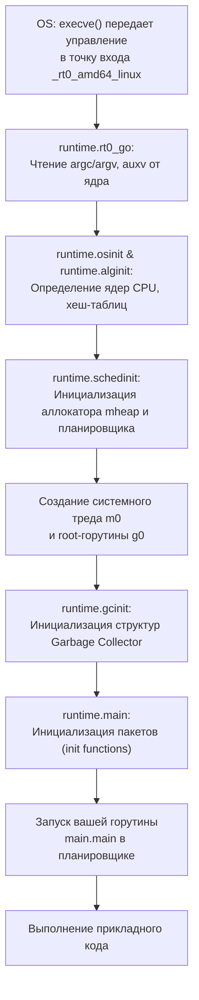

В 1970-х годах в Bell Labs, когда мы с Кеном Томпсоном и Деннисом Ритчи разрабатывали первые версии C и Unix на миникомпьютере PDP-11, у программиста не было иллюзий относительно того, как работает машина. Памяти было 64 килобайта, процессор совершал миллион операций в секунду, а каждый байт и машинный такт ощущались буквально кончиками пальцев.

Сегодня, когда вы открываете терминал и небрежно бросаете:
```bash
go run main.go
```
спустя какую-то долю секунды на экране возникает результат, веб-сервер открывает сетевой порт, а база данных принимает миллионы записей. Для стороннего наблюдателя это похоже на заклинание. Но для инженера магии не существует. За этой видимой простотой скрывается величественная вавилонская башня из дюжины слоев абстракций.

Чем глубже вы понимаете каждый этаж этой башни — от грамматики компилятора до движения свободных электронов в кремниевых p-n переходах — тем надежнее ваши архитектурные решения и тем быстрее вы локализуете баги, от которых у других разработчиков опускаются руки.

Эта вводная статья — наш высотный обзор (10,000-foot view) пути программы. В последующих 40 лекциях этого раздела мы разберем каждый винтик этого механизма под микроскопом.

---

## 1. Фронтенд компилятора: От текста к AST

Первая деталь, которую полезно прояснить: команда `go run` — композитная обертка. В отличие от интерпретируемых сред (CPython, Ruby или PHP), язык Go не интерпретирует синтаксическое дерево на лету. 

Под капотом `go run` создает изолированный каталог во временной файловой системе (`/tmp` или `$GOTMPDIR`), запускает полноценный компилятор `go build`, линкует статический бинарный файл, передает ему аргументы командной строки, дожидается завершения и аккуратно удаляет артефакты за собой.

Сам компилятор Go (`compile`) начинает работу с двух классических шагов:

1. **Лексический и синтаксический анализ (Lexing & Parsing):**  
   Исходный текст на Go — это просто последовательность UTF-8 байт. Лексер разбивает этот массив символов на поток неделимых токенов (`IDENT`, `INT`, `ASSIGN`, `FUNC`). Затем синтаксический парсер строит из них **AST (Abstract Syntax Tree)** — строгое древовидное представление синтаксиса программы. На этом шаге точка с запятой, табуляция и комментарии исчезают: компилятор начинает оперировать конструкциями языка.
2. **Проверка типов (Type Checking):**  
   Компилятор рекурсивно обходит узлы AST, выводя и сверяя типы. Go славится своей статической строгостью: попытка сложить строку со структурой или передать не тот тип в интерфейс пресекается здесь на корню. Ни один байт рантайм-памяти еще не выделен, но миллиарды потенциальных багов уже отсечены.

---

## 2. Бэкенд компилятора: SSA, оптимизации и регистровый ABI

После того как дерево AST признано грамматически безупречным, компилятор переводит его в промежуточное представление — **SSA (Static Single Assignment)**.

Главный закон SSA прост и изящен: *каждой переменной значение присваивается ровно один раз*. Любое последующее изменение переменной порождает новую ревизию (например, `x1`, `x2`, `x3`). Этот математический трюк развязывает компилятору руки для агрессивных оптимизаций:

> [!info] Под капотом: Оптимизации SSA-фазы
> На этапе SSA компилятор Go совершает то, за что мы ценим его скорость:
> - **Escape Analysis (Анализ побега):** Решает фундаментальную дилемму памяти — останется ли переменная на быстром стеке горутины (дешевое смещение указателя SP, 0 наносекунд на очистку) или «убежит» в общую кучу (heap), где за нее придется платить сборщику мусора (GC).
> - **Dead Code Elimination:** Беспощадно вырезает ветки условий и функции, недостижимые при текущих константах.
> - **Function Inlining:** Встраивает тела коротких функций прямо в место их вызова, экономя такты CPU на инструкции `CALL`/`RET` и подготовке стековых фреймов.
> - **Profile-Guided Optimization (PGO):** Начиная с Go 1.20/1.22 компилятор может использовать реальный производственный pprof-профиль вашего сервиса, чтобы расположить «горячие» блоки машинного кода последовательно в памяти для 100% попадания в кэш инструкций L1i.

Затем оптимизированная SSA-форма транслируется в ассемблер целевой архитектуры (amd64, arm64, riscv64). 

> [!tip] Собеседование: ABI и передача аргументов
> **Вопрос:** Как исторически изменилась передача аргументов в функциях Go и почему это важно?  
> **Ответ:** До версии Go 1.17 использовался консервативный стек-ориентированный **ABI0**: все аргументы функций и возвращаемые значения складывались в оперативную память на стек. Начиная с Go 1.17 внедрен регистровый **ABIInternal**: аргументы передаются непосредственно через 9 доступных регистров общего назначения CPU (`RAX`, `RBX`, `RCX` и т.д.). Это снизило нагрузку на память и ускорило вызовы функций на 5–12% без изменения единой строчки прикладного кода.

Линкер (`link`) берет сгенерированные объектные файлы, подмешивает код стандартной библиотеки и самого Go Runtime, после чего собирает монолитный исполняемый файл (ELF в Linux, Mach-O в macOS, PE в Windows).

---

## 3. Операционная система: Загрузка в память и иллюзия бесконечности

Когда бинарник готов, управление принимает ядро операционной системы (Linux kernel).

1. Процесс терминала (например, bash или zsh) вызывает системный вызов `fork()` (или `clone()`), порождая точную копию своего процесса.
2. Дочерний процесс тут же выполняет системный вызов `execve()`, передавая ядру путь к нашему скомпилированному бинарному файлу.
3. Ядро считывает ELF-заголовок файла, проверяет магические байты `\x7fELF`, выясняет архитектуру процессора и точку входа (`entry point`).
4. **Магия виртуальной памяти:** ОС *не загружает* весь многомегабайтный бинарник целиком в физическую RAM! Вместо этого ядро настраивает таблицы страниц (Page Tables) процесса и создает отображение виртуальных адресов на файл на диске через `mmap`.
5. Физические страницы памяти (размером 4 КБ) будут выделяться процессором **лениво (on-demand)** через механизм аппаратных прерываний **Page Fault**, когда instruction pointer впервые попытается прочитать соответствующий участок кода.

---

## 4. Бутстраппинг: Рождение государства Go Runtime

Существует популярное заблуждение среди новичков: якобы первой исполняемой строчкой программы является `func main()`. 

В действительности, до того как ваша первая строка кода получит хотя бы один такт процессора, рантайм Go разворачивает целое государство:



> [!warning] Ловушка / Gotcha: Тайна g0 и m0
> Ваша функция `main()` исполняется как обычная пользовательская горутина со скромным начальным стеком в 2 КБ. Но на чем работает сам планировщик?
> В момент старта рантайм создает **`m0`** (главный системный поток ОС) и жестко привязывает к нему **`g0`** — специальную системную горутину. Стек `g0` выделяется напрямую из памяти ОС (около 64 КБ) и никогда не растет динамически. Вся тяжелая внутренняя работа — переключение контекста горутин, запуск сборщика мусора, расширение стека через `morestack` — выполняется исключительно на стеке `g0`.

Рантайм создает контексты процессоров `P` (в количестве `GOMAXPROCS`), связывает их с системными потоками `M` и запускает цикл планировщика:
```go
// Упрощенная суть цикла планировщика runtime/proc.go
func schedule() {
    // 1. Найти готовую горутину G (локальная очередь, глобальная очередь, work stealing)
    // 2. Связать G с текущим M
    // 3. Выполнить gogo(&g.sched) — прыжок в контекст горутины
}
```

---

## 5. Исполнение на кремнии: Mechanical Sympathy

Наконец планировщик переключил регистры, и процессор начал выполнять инструкции вашей `main.main`. 

Однако на уровне кремниевого кристалла нет ни горутин, ни интерфейсов, ни слайсов. Процессор — это бескомпромиссный конечный автомат. Чтобы выполнить даже элементарный инкремент переменной `i++`, процессор непрерывно прокручивает цикл **Fetch — Decode — Execute**:

```
[Fetch: Выборка инструкции ADD] ──► [Decode: Декодирование в микрооперации] ──► [Execute: Исполнение в ALU] ──► [Writeback: Запись в регистр]
```

1. **Fetch (Выборка):** Процессор запрашивает байты инструкции `ADD` из памяти (кэш L1i).
2. **Decode (Декодирование):** Декодер выясняет, какие регистры задействованы и какая микрооперация требуется.
3. **Execute (Выполнение):** Арифметико-логическое устройство (ALU) выполняет сложение на транзисторах.
4. **Writeback (Обратная запись):** Результат фиксируется в целевом регистре.

Чтобы прочувствовать физическую цену операций, воспользуемся классической шкалой задержек Джима Грея, пересчитанной в человеческий масштаб времени:

| Операция с памятью | Реальное время | Масштаб (1 такт CPU = 1 секунда) | Аналогия из жизни |
|---|:---:|:---:|---|
| **1 такт CPU (3 ГГц)** | `0.3 нс` | **1 секунда** | Один спокойный удар сердца |
| **Регистр CPU** | `0.3 нс` | **1 секунда** | Предмет прямо у вас в руке |
| **Кэш L1 (L1d / L1i)** | `1 нс` | **3 секунды** | Протянуть руку за блокнотом на столе |
| **Кэш L2** | `3–4 нс` | **12 секунд** | Встать и взять книгу с полки рядом |
| **Кэш L3 (общий для ядер)**| `12–20 нс` | **1 минута** | Спуститься к почтовому ящику в подъезде |
| **Оперативная память (RAM)** | `60–100 нс` | **4–5 минут** | Прогуляться до ближайшей кофейни |
| **NVMe SSD (I/O)** | `20–50 мкс` | **1–2 дня** | Слетать на выходные в соседний город |
| **Сетевой пакет в ЦОД** | `500 мкс` | **2–3 недели** | Отправиться в морской круиз |
| **Пинг между континентами**| `150 мс` | **15 лет** | Вырастить ребенка до старших классов |

Пока процессор ждет данные из оперативной памяти из-за промаха мимо кэш-линии (Cache Miss), он успевает простаивать сотни тактов. Именно поэтому структуры данных в Go разрабатываются с учетом непрерывности в памяти (слайсы вместо связных списков, плоские структуры вместо указателей) — это и есть **Mechanical Sympathy** (механическое сочувствие к архитектуре машины).

На самом дне иерархии миллионы транзисторов управляют потоками электронов. При подаче напряжения на затвор полевого транзистора (MOSFET) создается проводящий канал, изменяя напряжение на выходе логического вентиля (NAND, NOR). Из этих вентилей собраны сумматоры, мультиплексоры и триггеры, формирующие АЛУ.

---

## Резюме: Карта уровней абстракции

Путь одной строки кода на Go выглядит так:

1. **Исходный код:** UTF-8 текст → Токены → Синтаксическое дерево (AST).
2. **Компилятор Go:** SSA-форма → Escape Analysis → Inlining → Машинный код (ABIInternal) → Статический ELF-бинарник.
3. **Операционная система:** `fork()` / `execve()` → Таблицы страниц виртуальной памяти → Ленивая подгрузка (Page Faults).
4. **Рантайм Go:** Инициализация `m0` и `g0` → Создание `mheap` → Старт GC и планировщика (G-M-P) → Запуск `main.main`.
5. **Процессор:** Кэш-линии L1/L2/L3 → Конвейер инструкций → Выполнение микроопераций в ALU.
6. **Кремний:** Электрический потенциал на затворах миллиардов транзисторов.

В следующей лекции мы спустимся на самый фундаментальный физический уровень и выясним, как элементарные полупроводниковые переключатели учатся представлять числа и логику: [[2. Транзисторы, биты и логические вентили]].