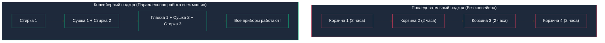
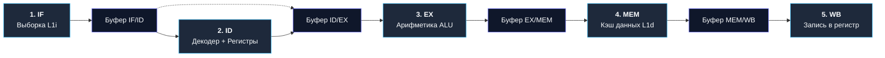
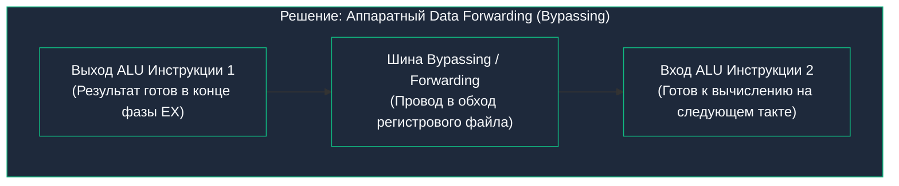

В предыдущей главе [[7. Цикл исполнения инструкции. Fetch, Decode, Execute]] мы описали работу процессорного ядра как строгую, последовательную цепочку шагов: взять команду из памяти, декодировать ее, выполнить в ALU, записать ответ и лишь затем браться за следующую.

Если бы современные компьютеры действительно работали так, они были бы чудовищно медленными.

Представим простой расчет: если каждая из фаз (Fetch, Decode, Execute, Memory, Writeback) занимает по одному такту генератора, то на выполнение одной машинной команды уходит 5 тактов. Это означает, что современный процессор с внушительной тактовой частотой 4 ГГц выполнял бы меньше 800 миллионов инструкций в секунду. Большая часть кристалла (кэши, декодеры, ALU) в каждый момент времени стояла бы обесточенной в ожидании своей очереди.

В 1913 году Генри Форд перевернул мировую промышленность, запустив движущийся сборочный конвейер на заводе в Хайленд-Парке. Вместо того чтобы одна бригада механиков собирала автомобиль от рамы до покраски за 12 часов, каждый рабочий выполнял одну специализированную операцию над непрерывно движущимся шасси. 

В 1960–70-х годах архитекторы компьютеров применили гениальную идею Форда к кремниевым кристаллам. Так родилась **Конвейеризация (Pipelining)** — фундаментальный механизм аппаратного параллелизма на уровне инструкций (**ILP — Instruction-Level Parallelism**).

---

## Аналогия: Завод и Прачечная

Конвейер проще всего прочувствовать на классическом житейском примере прачечной.

Представьте, что вам нужно постирать и привести в порядок четыре корзины грязного белья. Процесс состоит из четырех последовательных этапов:
1. Стирка в стиральной машине (30 минут);
2. Сушка в барабанной сушилке (30 минут);
3. Глажка утюгом (30 минут);
4. Складывание в шкаф (30 минут).



### Без конвейера (Последовательная обработка)
Вы загружаете первую корзину в стирку, ждете 30 минут, перекладываете в сушилку, гладите и убираете в шкаф. На первую корзину уходит 2 часа. Только после этого вы загружаете вторую корзину.  
На четыре корзины вы потратите **8 часов непрерывного ожидания**!  
При этом сушилка и утюг 75% времени стоят холодными и бесполезными.

### С конвейером (Параллельная обработка)
Вы загружаете корзину 1 в стиральную машину.  
Через 30 минут корзина 1 отправляется в сушилку, а в освободившуюся стиральную машину вы **мгновенно загружаете корзину 2**!  
Еще через 30 минут корзина 1 гладится утюгом, корзина 2 сушится, а корзина 3 стирается.  
Все приборы работают одновременно на полную мощность!

Все четыре корзины будут постираны, высушены и поглажены всего за **3.5 часа вместо 8**!

> [!important] Разделяйте Latency (Задержку) и Throughput (Пропускную способность)
> Конвейер **не ускоряет стирку одной конкретной корзины белья**! Каждая корзина по-прежнему проходит полный путь за 2 часа (время отклика, **Latency**, не изменилось).  
> Но конвейер радикально увеличивает **пропускную способность (Throughput)**: начиная со второго часа, чистая корзина белья выходит из процесса каждые 30 минут!

---

## Классический 5-стадийный конвейер RISC

Инженеры кремниевых чипов разделили монолитный такт исполнения инструкции на пять независимых аппаратных секций, разделив их буферными регистрами (Pipeline Registers):

1. **`IF` (Instruction Fetch — Выборка инструкции):** чтение байтов инструкции из кэша L1i по адресу из регистра `RIP`, инкремент счетчика команд;
2. **`ID` (Instruction Decode — Декодирование):** дешифрация опкода в Control Unit и одновременное чтение регистров-операндов из Register File;
3. **`EX` (Execute — Выполнение):** вычисления в ALU (сложение, логика, сдвиг) или расчет эффективного адреса памяти;
4. **`MEM` (Memory Access — Доступ к памяти):** чтение данных из кэша L1d или запись в кэш (только для инструкций `LOAD` и `STORE`);
5. **`WB` (Writeback — Обратная запись):** защелкивание вычисленного результата обратно в целевой регистр в Register File.



Посмотрим, как пять последовательных инструкций протекают через такой конвейер во времени:

| Инструкция | Такт 1 | Такт 2 | Такт 3 | Такт 4 | Такт 5 | Такт 6 | Такт 7 | Такт 8 | Такт 9 |
|:---|:---:|:---:|:---:|:---:|:---:|:---:|:---:|:---:|:---:|
| **Инструкция 1** | `IF` | `ID` | `EX` | `MEM` | `WB` | | | | |
| **Инструкция 2** | | `IF` | `ID` | `EX` | `MEM` | `WB` | | | |
| **Инструкция 3** | | | `IF` | `ID` | `EX` | `MEM` | `WB` | | |
| **Инструкция 4** | | | | `IF` | `ID` | `EX` | `MEM` | `WB` | |
| **Инструкция 5** | | | | | `IF` | `ID` | `EX` | `MEM` | `WB` |

---

> [!tip] Собеседование: Что такое метрика IPC (Instructions Per Cycle)?
> **Вопрос:** Сколько времени занимает выполнение одной инструкции в 5-стадийном конвейере и чему равен идеальный IPC?
> 
> **Ответ:** 
> - Полное время выполнения отдельной инструкции (Latency) составляет **5 тактов**. 
> - Но благодаря непрерывному конвейеру, начиная с 5-го такта, процессор завершает ровно **по одной инструкции за каждый такт**!
> - Показатель **IPC (Instructions Per Cycle — Число инструкций за такт)** в идеальном однопоточном скалярном конвейере равен **$1.0$**.
> - До конвейеризации показатель CPI (Cycles Per Instruction) составлял 5 (одна инструкция раз в 5 тактов, $IPC = 0.2$). Конвейер поднял пропускную способность процессора ровно в **5 раз** без увеличения физической частоты кристалла!

---

## Проблемы конвейера (Pipeline Hazards)

В идеальном математическом мире все команды программы независимы друг от друга. Но в реальном коде на Go инструкции непрерывно взаимодействуют: передают переменные, проверяют условия и ветвятся.

Когда гладкое движение команд по конвейеру нарушается, возникает аварийная ситуация — **Опасность конвейера (Pipeline Hazard)**.  
Чтобы предотвратить порчу данных, процессор вынужден искусственно придерживать конвейер, вставляя пустые такты простоя — **Пузыри конвейера (Pipeline Bubbles / Stalls)**.

Различают три типа опасностей:

---

### 1. Конфликты по данным (Data Hazards)

Возникают, когда следующая инструкция зависит от результата предыдущей, который еще не готов. Самый частый подтип — **RAW (Read-After-Write)**.

Взглянем на фрагмент кода на Go:
```go
a := 10       // Инструкция 1: записывает 'a'
b := a + 5    // Инструкция 2: читает 'a' и прибавляет 5
c := b * 2    // Инструкция 3: читает 'b'
```

Что произойдет в наивном 5-стадийном конвейере?
- Инструкция 1 (`a := 10`) запишет итоговое значение `10` в регистр только на фазе **`WB` (такт 5)**!
- Инструкция 2 (`b := a + 5`) требует значение `a` на входах ALU уже на фазе **`EX` (такт 3)**!

Если процессор не вмешается, Инструкция 2 прочитает из регистра старый мусор, исказив результат вычислений. Аппаратура вынуждена заморозить следующую инструкцию, вставив два пустых такта ожидания (пузыря):

| Такт | 1 | 2 | 3 | 4 | 5 | 6 | 7 |
|:---|:---:|:---:|:---:|:---:|:---:|:---:|:---:|
| `a := 10` | `IF` | `ID` | `EX` | `MEM` | **`WB`** *(запись 10)* | | |
| `b := a + 5` | | `IF` | `ID` | *Пузырь (Bubble)* | *Пузырь (Bubble)* | **`EX`** *(вычисление a + 5)* | `MEM` |

В эти два такта ядро процессора на частоте 4 ГГц не совершает никакой полезной работы, сжигая ватты энергии впустую.



> [!info] Под капотом: Аппаратный Data Forwarding (Bypassing)
> Инженеры процессоров придумали элегантное решение: **перенаправление данных (Data Forwarding или Bypassing)**.  
> Зачем ждать фазы `WB`, если сумма `10` физически уже посчитана на выходе ALU в конце фазы `EX`?  
> В процессор встраивают специальный обходной провод и мультиплексор, которые перехватывают значение прямо с выхода ALU и мгновенно подают его на вход ALU следующей команды на следующем такте! Это полностью ликвидирует пузыри конвейера для большинства арифметических операций.

---

### 2. Конфликты управления (Control Hazards)

Конфликты управления вызваны ветвлениями (`if / else`, циклы `for`, вызовы функций).

```go
if user.IsAdmin {
    grantAccess() // Инструкция А
} else {
    logDenied()   // Инструкция Б
}
```

Конвейер обязан забирать очередную инструкцию (`IF`) **каждый такт**. 
Но процессор сможет вычислить логическое условие `user.IsAdmin` (проверить поле структуры, флаг $ZF$) только на фазе **`EX`** текущей команды (через 2–3 такта)!

**Процессор не знает, какую команду загружать на этапе выборки — ветку А или ветку Б!**

Если конвейер остановится до выяснения условия, ядро потеряет 3–4 такта. А в современных глубоких конвейерах (Intel Core / AMD Zen), где длина конвейера составляет от **14 до 22 стадий**, такой простой означал бы катастрофическое падение производительности на 40–60%!

Поэтому современные процессоры не ждут: они используют аппаратный блок предсказания ветвлений (Branch Predictor) и начинают **спекулятивно выполнять** угаданную ветку кода. 

Если процессор ошибся в догадке, наступает расплата — **Сброс конвейера (Pipeline Flush)**: все частично выполненные спекулятивные инструкции аннулируются, результаты стираются, а конвейер загружается заново с правильного адреса. Штраф за промах ветвления составляет от **15 до 20 драгоценных тактов**! (Эту тему мы разберем в деталях в [[13. Предсказание ветвлений и Спекулятивное исполнение]]).

---

## Mechanical Sympathy: Пишем конвейерно-дружелюбный код

Как Go-инженер может помочь кремнию не создавать пузырей в конвейере и держать IPC на максимуме?  
Ключевой рецепт — **минимизировать цепочки зависимостей по данным**.

Сравним два варианта суммирования большого слайса чисел:

### Наивный подход: Жесткая цепочка зависимостей
```go
func sumSlow(nums []int) int {
	sum := 0
	for i := 0; i < len(nums); i++ {
		sum += nums[i] // Data Hazard: каждый шаг ждет результата предыдущего!
	}
	return sum
}
```
В цикле `sum += nums[i]` значение переменной `sum` зажато в тиски зависимости: чтобы посчитать итерацию $i+1$, процессор обязан дождаться завершения сложения итерации $i$. Конвейер работает с микро-задержками, а суперскалярные блоки не могут вычислить итерации параллельно.

---

### Конвейерно-оптимизированный подход: Независимые аккумуляторы
Развернем цикл (Loop Unrolling) и задействуем четыре независимых счетчика:

```go
func sumFast(nums []int) int {
	sum1, sum2, sum3, sum4 := 0, 0, 0, 0
	i := 0
	
	// Обрабатываем по 4 элемента за один шаг (разворачивание цикла)
	for ; i <= len(nums)-4; i += 4 {
		sum1 += nums[i]   // Независимая инструкция 1
		sum2 += nums[i+1] // Независимая инструкция 2
		sum3 += nums[i+2] // Независимая инструкция 3
		sum4 += nums[i+3] // Независимая инструкция 4
	}
	
	// Досчитываем оставшийся хвост элементов
	res := sum1 + sum2 + sum3 + sum4
	for ; i < len(nums); i++ {
		res += nums[i]
	}
	return res
}
```

Почему функция `sumFast` на больших объемах данных работает **в 2–3 раза быстрее**?
- Инструкции сложения для `sum1`, `sum2`, `sum3` и `sum4` **абсолютно независимы друг от друга**!
- Процессор заталкивает их в конвейер друг за другом без единого такта простоя. Пока сумматор ALU пересчитывает `sum1`, схема Data Forwarding уже передает данные для `sum2`, а в суперскалярных ядрах эти 4 операции и вовсе выполняются одновременно на разных портах ALU.
- Мы выжимаем абсолютный максимум пропускной способности ядра (IPC стремится к максимуму).

---

> [!warning] Ловушка / Gotcha: Когда стоит и не стоит разворачивать циклы вручную?
> Не нужно переписывать все циклы бизнес-логики в проекте на 4 аккумулятора! Компилятор Go на этапе SSA-оптимизаций умеет автоматически применять базовые разворачивания простых циклов.
> 
> Ручное разворачивание с независимыми аккумуляторами — это специализированный инструмент для **числодробилок (Data-Intensive computing)**: криптографических хешей, вычисления контрольных сумм CRC32/xxHash, сжатия данных и числовой обработки матриц, где вы гарантированно упираетесь в производительность ядра CPU.

---

## Итог

1. **Конвейеризация (Pipelining):** аппаратный принцип параллельной обработки, при котором разные стадии нескольких инструкций (`IF`, `ID`, `EX`, `MEM`, `WB`) выполняются одновременно на разных участках кристалла.
2. **Latency vs Throughput:** конвейер не сокращает время исполнения одной инструкции (она все так же требует 5 тактов), но кратно увеличивает общую пропускную способность, выдавая готовый результат каждый такт ($IPC = 1.0$).
3. **Data Hazards (Опасности по данным):** возникают при зависимостях RAW (Read-After-Write). Частично нейтрализуются механизмом аппаратного перенаправления данных (**Data Forwarding**), но при задержках памяти могут приводить к пузырям простоя (Bubbles).
4. **Control Hazards (Опасности управления):** вызваны ветвлениями (`if / else`, `for`). Ошибочное предсказание ветвления приводит к сбросу конвейера (**Pipeline Flush**) и потере 15–20 тактов.
5. **Mechanical Sympathy:** разбиение длинных цепочек зависимостей на несколько независимых аккумуляторов (`sum1`, `sum2`, `sum3`, `sum4`) позволяет конвейеру работать на 100% мощности без задержек.

Конвейер позволил нам завершать 1 инструкцию за такт ($IPC = 1$). Но что, если мы хотим большего? Можно ли сделать так, чтобы одно процессорное ядро завершало **4, 6 или даже 8 инструкций за один такт**?

В следующей лекции мы познакомимся с вершиной кремниевой инженерии — суперскалярной архитектурой и внеочередным исполнением: [[12. Суперскалярность, Out Of Order Execution и Register Renaming]].