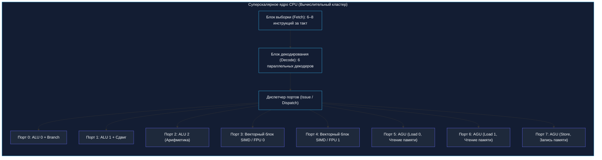
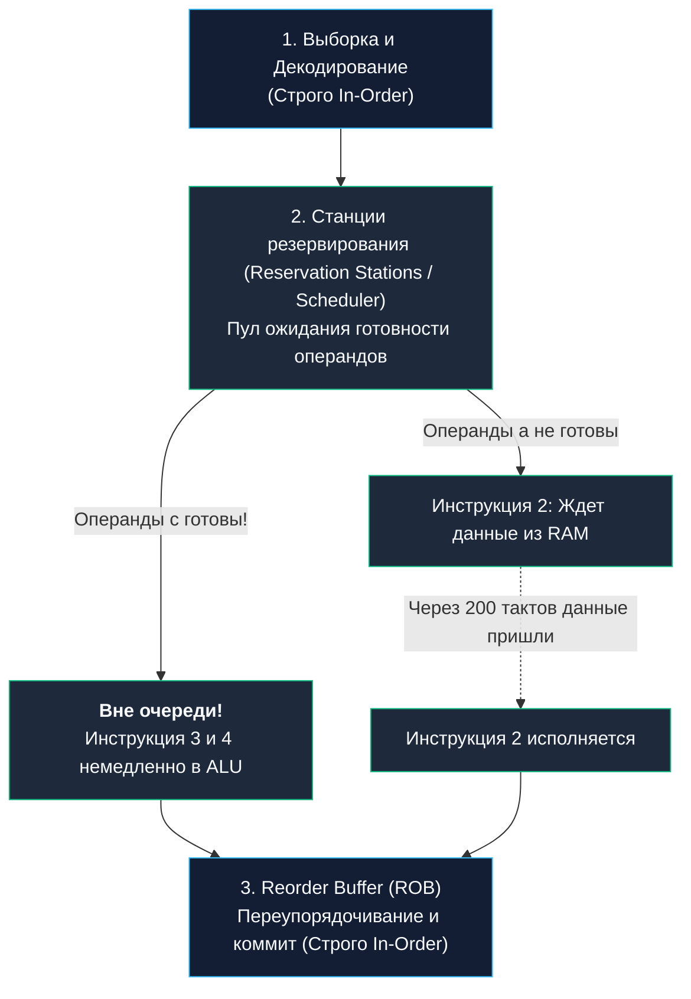
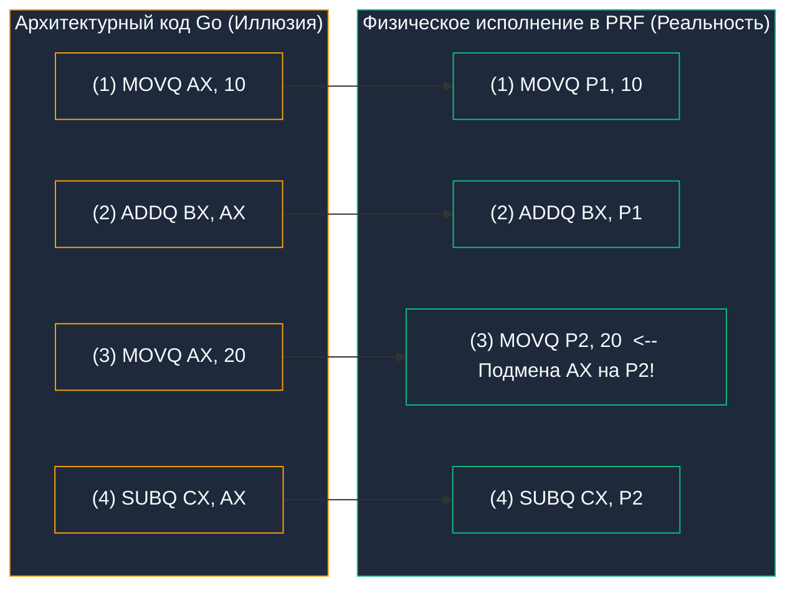

В предыдущей главе [[11. Конвейеризация. Почему CPU исполняет несколько инструкций одновременно]] мы совершили качественный рывок: превратили исполнение машинных инструкций в непрерывный промышленный конвейер. Это позволило ядру завершать по одной инструкции за каждый такт генератора, доведя показатель IPC (Instructions Per Cycle) до заветной единицы: $IPC = 1.0$.

Но если вы откроете спецификацию современных серверных и десктопных процессоров (Apple Silicon M-серии, Intel Core Ultra или AMD Zen 5), вы обнаружите невероятный факт: их пиковый показатель IPC достигает **6, 8 или даже 10 инструкций за один-единственный такт**!

Как процессорное ядро умудряется завершать шесть операций за те крошечные 250 пикосекунд, пока длится один такт на частоте 4 ГГц? Неужели законы физики перестали действовать?

Ответ кроется в трех сложнейших и самых красивых микроархитектурных концепциях в истории кремния:
1. **Суперскалярность (Superscalar Architecture):** превращение однополосной дороги в многополосный автобан;
2. **Внеочередное исполнение (Out-of-Order Execution, OoOE):** восстание против строгого порядка кода;
3. **Переименование регистров (Register Renaming):** разрушение ложных зависимостей с помощью иллюзии сотен невидимых регистров.

Благодаря этой тройке ваш код на Go работает в 3–5 раз быстрее, чем если бы процессор исполнял его строго по инструкциям из ассемблерного листинга. Давайте заглянем в эту кремниевую симфонию.

---

## 1. Суперскалярность: Расширение шоссе

Классический конвейер из предыдущей статьи можно сравнить с идеальной однополосной трассой. Даже если автомобили летят бампер к бамперу с нулевой дистанцией, через пункт оплаты физически не может проехать больше одной машины в секунду.

**Суперскалярный процессор (Superscalar CPU)** строит рядом 4, 6 или 8 параллельных полос и открывает 8 терминалов оплаты:



Инженеры многократно продублировали исполнительные блоки внутри каждого ядра:
- **3–5 целочисленных ALU:** для параллельного сложения, вычитания и битовых операций;
- **2–4 блока FPU / SIMD:** для параллельных векторных вычислений и операций с плавающей точкой;
- **2–3 блока генерации адресов (AGU — Address Generation Unit):** для одновременного чтения нескольких адресов памяти;
- **Выделенные порты записи (Store Data):** для выгрузки результатов в кэш.

На фазе выборки широкий декодер забирает из кэша инструкций L1i целую пачку команд (например, до 6 инструкций в x86-64 или до 8 в Apple M3). Если инструкции не зависят друг от друга, диспетчер отправляет их на разные порты: пока одно ALU складывает операнды `A` и `B`, второе ALU параллельно вычитает `C` и `D`, а блок AGU загружает данные из оперативной памяти.

Все эти операции завершаются **одновременно за один такт CPU**!

---

> [!info] Под капотом: Крах архитектуры VLIW (Intel Itanium)
> В конце 1990-х годов Intel и HP попытались переложить задачу поиска независимых инструкций на плечи компилятора, создав архитектуру **VLIW (Very Long Instruction Word)** в процессорах Itanium (IA-64). Идея звучала заманчиво: пусть компилятор на этапе сборки сам компонует независимые команды в длинные пакеты, а процессор сделаем простым и дешевым.
> 
> Идея потерпела сокрушительный провал (в индустрии чип окрестили «Itanic»).  
> Компилятор статичен: на этапе компиляции он **не может знать**, лежит ли переменная прямо сейчас в кэше L1 или обращение к ней вызовет Cache Miss на 200 тактов. Только умная аппаратура самого процессора в реальном времени видит состояние кэшей и физических шин. Именно поэтому динамическая суперскалярность победила статический VLIW.

---

## 2. Out of Order Execution: Бунт против порядка

Суперскалярность работает великолепно, пока инструкции в коде независимы. Но в реальных программах на Go данные жестко переплетены:

```go
a := readFromMemory(ptr) // Инструкция 1: долгое чтение из памяти RAM (~60 нс / 200 тактов)
b := a + 10              // Инструкция 2: жестко ждет 'a'
c := 100 * 5             // Инструкция 3: операнды константны, полностью независима!
d := c - 2               // Инструкция 4: ждет только 'c'
```

Что произошло бы в строгом конвейере (In-Order), где инструкции обязаны выполняться в порядке их следования в бинарнике?
1. Инструкция 1 промахивается мимо кэша и зависает на 200 тактов в ожидании ответа от планки DDR5.
2. Инструкция 2 заблокирована, так как ждет `a`.
3. Все ядро процессора с его четырьмя мощными ALU замирает в ступоре на 200 тактов!
4. Инструкции 3 и 4, которым до переменной `a` нет никакого дела и которые можно посчитать за полтакта, безропотно стоят в очереди и ждут!

Чтобы победить это безумие, архитекторы внедрили **Внеочередное исполнение (Out-of-Order Execution, OoOE)**.

### Метафора кухни ресторана
Представьте шеф-повара на кухне:
- Заказ №1: Сварить сложный французский луковый суп (требует 40 минут тушения).
- Заказ №2: Нарезать салат (требует 2 минуты).
- Заказ №3: Разлить по бокалам сок (требует 10 секунд).

Шеф-повар не стоит 40 минут над кастрюлей супа, сложа руки! Он ставит бульон на медленный огонь (отправляет асинхронный запрос в контроллер памяти) и немедленно берется за нарезку салата и розлив напитков. 

### Как работает OoOE в кремнии
Современный процессор ведет себя как распределенная вычислительная сеть:



1. **In-Order Front-End:** Команды загружаются из памяти и декодируются строго по порядку.
2. **Reservation Stations (Станции резервирования):** Декодированные команды попадают в единый пул ожидания. Здесь они сидят до тех пор, пока на их входах не появятся физические данные.
3. **Out-of-Order Dispatch:** Как только операнды команды готовы (например, для `c := 100 * 5` числа `100` и `5` уже на месте), планировщик мгновенно выстреливает ее на свободный порт ALU!
4. Пока медленная Инструкция 1 ждет RAM, ядро успевает вычислить десятки независимых последующих команд. Процессор превращается в **машину потока данных (Dataflow Engine)**.

---

## 3. Register Renaming: Иллюзия аппаратных регистров

Когда процессор начинает выполнять команды вне очереди, он сталкивается с фундаментальным тупиком — **Ложными зависимостями по именам (Name Dependencies)**.

Вспомним [[8. ISA. Интерфейс между железом и софтом]]: в архитектуре x86-64 программисту и компилятору доступно всего **16 архитектурных регистров**. Компилятор Go вынужден непрерывно переиспользовать одни и те же регистры (`AX`, `BX`) для совершенно не связанных между собой вычислений.

Взглянем на этот ассемблерный фрагмент:
```asm
MOVQ AX, 10      // (1) AX = 10
ADDQ BX, AX      // (2) BX = BX + AX (Ждет инструкцию 1: истинная зависимость RAW)
MOVQ AX, 20      // (3) AX = 20      (Перезапись AX новым значением!)
SUBQ CX, AX      // (4) CX = CX - AX (Ждет инструкцию 3)
```

Логически блок (1–2) и блок (3–4) **абсолютно независимы**! Блок (3–4) использует имя `AX` лишь потому, что у компилятора кончились свободные регистры.

Но процессор видит конфликт:
- **WAW (Write-After-Write):** Инструкция 3 не может записать `20` в `AX` раньше, чем Инструкция 1 запишет `10`.
- **WAR (Write-After-Read):** Инструкция 3 не может перезаписать `AX`, пока Инструкция 2 не прочитает старое значение `10`!

Внеочередное выполнение должно было бы остановиться. Но инженеры совершили фокус: **Переименование регистров (Register Renaming)**.

### Физический регистровый файл (PRF)
16 регистров (`AX`, `BX`...), которые мы видим в ассемблере — это **архитектурная иллюзия**.  
Физически на кремниевом кристалле распаян гигантский массив из сотен реальных регистров — **Physical Register File (PRF)** (например, 224 регистра в AMD Zen 4 или более 300 в Apple M3).

Специальная аппаратная таблица маппинга (**RAT — Register Alias Table**) на этапе декодирования на лету подменяет имена регистров:



Для первой команды архитектурный `AX` связывается с физической ячейкой `P1`.  
Для третьей команды тот же архитектурный `AX` связывается с совершенно другой физической ячейкой `P2`!

Ложные конфликты WAW и WAR мгновенно испаряются:
- Цепочка (1) `MOVQ P1, 10` $\to$ (2) `ADDQ BX, P1` выполняется на ALU 0;
- Цепочка (3) `MOVQ P2, 20` $\to$ (4) `SUBQ CX, P2` **одновременно и параллельно** выполняется на ALU 1!

---

## 4. Reorder Buffer (ROB): Восстановление порядка

Если ядро процессора перемалывает команды в хаотичном внеочередном порядке, возникает тревожный инженерный вопрос:

*Что произойдет, если Инструкция 1 вызовет ошибку сегментации или в Go сработает паника `panic()`? А если прилетит аппаратное прерывание от сетевой карты?*

Если бы процессор сохранял результаты в память хаотично, операционная система обнаружила бы кошмар: Инструкция 3 и 4 уже записали свои результаты в память, а упавшая Инструкция 1 всё еще висит! Программа оказалась бы в разорванном, неконсистентном состоянии.

Поэтому процессор обязан соблюдать железное правило:  
**Исполняться команды могут вне очереди (Out-of-Order Execution), но фиксироваться результаты ОБЯЗАНЫ строго по порядку (In-Order Retirement / Commit)!**

Для этого служит **Буфер переупорядочивания (Reorder Buffer — ROB)**:
1. Каждая декодированная команда встает в кольцевой буфер ROB в строгом исходном порядке программы.
2. Команды вычисляются на свободных ALU вне очереди и складывают свои временные ответы в слоты ROB.
3. Инструкция покидает голову буфера ROB (Retirement) и переносит свои данные в видимые архитектурные регистры **только тогда, когда все предыдущие команды успешно завершились без ошибок**!
4. Если при вычислении произошла паника `panic()` или прерывание, процессор просто мгновенно сбрасывает хвост буфера ROB: все результаты внеочередных вычислений бесследно испаряются, состояние машины остается безупречно чистым.

---

> [!tip] Собеседование: Окно внеочередного выполнения (OoO Window)
> **Вопрос:** Что ограничивает способность процессора находить параллелизм в коде? Почему инженеры не сделают буфер ROB размером в 100 000 инструкций, чтобы процессор заглядывал на минуты вперед?
> 
> **Ответ:** 
> 1. **Энергопотребление и площадь кристалла:** Буфер ROB — это ассоциативная матричная память (CAM — Content-Addressable Memory). Каждый такт процессор обязан сравнивать теги готовности сотен инструкций между собой. Сложность и энергопотребление таких схем растут квадратично ($O(N^2)$)!
> 2. **Задержка проводников:** Чем больше физический массив регистров, тем длиннее металлические дорожки и выше паразитная емкость, что вынуждает снижать общую тактовую частоту кристалла.
> 
> В современных чипах размер ROB составляет инженерный оптимум:
> - AMD Zen 4/Zen 5: **320–448 инструкций**;
> - Intel Golden Cove (Core i9-13900K): **512 инструкций**;
> - Apple M3/M4: рекордные **~600+ инструкций** (огромное окно, обеспечивающее безумный IPC архитектуры Apple).

---

## Mechanical Sympathy: Data-Oriented Design в Go

Какое практическое значение эти сложнейшие кремниевые механизмы имеют для нас — инженеров, пишущих на Go?

Они дают железобетонный ответ на извечный холивар: **почему связные списки и разветвленные деревья в реальных продакшн-системах почти всегда драматически проигрывают плоским слайсам (`[]T`), даже если алгоритмическая оценка по $O(N)$ у них одинакова?**

### Связный список: Убийца внеочередного окна
Посмотрим на классический обход связного списка:
```go
type Node struct {
	Val  int
	Next *Node
}

func sumList(head *Node) int {
	sum := 0
	for curr := head; curr != nil; curr = curr.Next {
		sum += curr.Val
	}
	return sum
}
```

Связный список создает **Pointer Chasing (погоню за указателями)** — идеальную, неразрывную цепь зависимостей:
- Процессор не может узнать адрес узла $N+1$, пока не прочитает поле `Next` из памяти узла $N$.
- Окно внеочередного выполнения (ROB на 512 инструкций) оказывается абсолютно бесполезным: в него нельзя загрузить будущие итерации цикла!
- Мощнейший суперскалярный процессор с 6 портами ALU деградирует до уровня простейшего калькулятора 1970-х годов: он ждет ответа от оперативной памяти на каждом шаге, а его реальный $IPC$ падает с потенциальных 4.0 до позорных **$0.05\dots 0.1$**!

---

### Непрерывный слайс: Рай для суперскалярности
А теперь взглянем на суммирование плоского слайса:
```go
func sumSlice(nums []int) int {
	sum := 0
	for i := 0; i < len(nums); i++ {
		sum += nums[i]
	}
	return sum
}
```

В слайсе адрес следующего элемента вычисляется по элементарной арифметической формуле `ptr + i*8` ($\text{Address}(i) = \text{ptr} + i \times 8$):

Процессор видит эту регулярность:
1. Он моментально разворачивает цикл на 100 итераций вперед в буфере ROB;
2. Блоки AGU параллельно посылают десятки запросов в память — это называется **Memory-Level Parallelism (MLP)**;
3. Контроллер памяти загружает целые строки кэша (Cache Lines по 64 байта) за один присест;
4. Все параллельные порты ALU загружены работой на 100%, и процессор выдает $IPC > 3.0$.

Слайс работает быстрее связного списка не просто потому, что он «компактнее лежит в памяти». Он быстрее потому, что позволяет суперскалярному Out-of-Order ядру раскрыть свою истинную природу параллельных вычислений.

---

## Итог

1. **Суперскалярность (Superscalar):** наличие нескольких независимых вычислительных портов (ALU, FPU, AGU) внутри одного ядра, позволяющее декодировать и завершать несколько инструкций за такт ($IPC > 1.0$).
2. **Out-of-Order Execution (OoOE):** разрыв строгого порядка программы. Инструкции ждут готовности операндов в Станциях резервирования и исполняются сразу, как только освободился подходящий вычислительный блок.
3. **Register Renaming:** аппаратная подмена 16 архитектурных регистров ассемблера на сотни скрытых физических регистров (PRF), полностью устраняющая ложные зависимости WAW и WAR.
4. **Reorder Buffer (ROB):** гарантирует консистентность состояния системы. Команды вычисляются вне очереди, но фиксируют результаты в памяти строго последовательно (In-Order Retirement).
5. **Mechanical Sympathy:** структуры данных на базе указателей (списки, деревья) парализуют Out-of-Order окно процессора из-за цепочек зависимостей. Плоские структуры на базе слайсов активируют Memory-Level Parallelism (MLP) и нагружают все аппаратные порты ядра на максимум.

Мы научили процессор заглядывать вперед на сотни инструкций в буфере ROB. Но что происходит, если на этом пути ядро натыкается на условный оператор `if`? Как процессор может заглядывать вперед, если он еще не знает, выполнится ли условие?

В следующей лекции мы познакомимся с самым дерзким и опасным механизмом современного процессора — спекулятивным исполнением и предсказанием будущего: [[13. Предсказание ветвлений и Спекулятивное исполнение]].