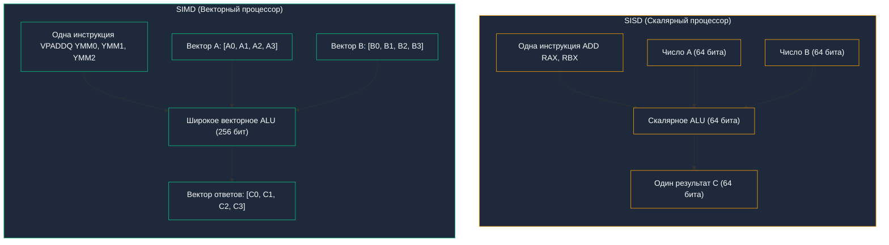
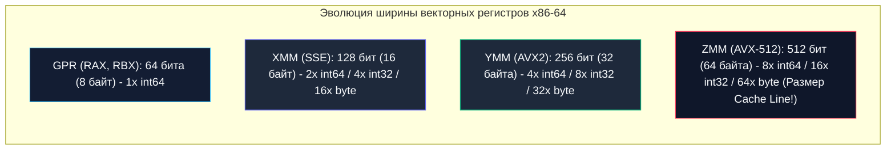

В предыдущих лекциях, посвященных конвейеризации, внеочередному исполнению и [[13. Предсказание ветвлений и Спекулятивное исполнение]], мы наблюдали, как кремниевые инженеры выжимают последние капли производительности из классического последовательного кода. Этот подход называется **ILP (Instruction-Level Parallelism)** — параллелизм на уровне инструкций.

Однако у ILP есть непреодолимый физический предел: **декодер команд**.  
Дешифратор x86 — это сложнейший, горячий и прожорливый узел процессора. 

Представьте типичную задачу бэкенда: парсинг входящего JSON-пакета, фильтрацию массива или сложение двух числовых срезов:
```go
for i := 0; i < 1000; i++ {
    c[i] = a[i] + b[i]
}
```

Для процессора этот невинный цикл означает необходимость выбрать из памяти, декодировать, переименовать регистры и прогнать через конвейер минимум **3 000 – 4 000 инструкций**:
- прочитать `a[i]`;
- прочитать `b[i]`;
- выполнить сложение `a + b`;
- записать результат в `c[i]`;
- инкрементировать счетчик `i++`;
- сравнить с границей `i < 1000`;
- выполнить условный переход `JNE`.

Повторять один и тот же бюрократический ритуал декодирования тысячу раз ради примитивного сложения — чудовищное расточительство кремниевых ресурсов.

Что, если сказать процессору:  
*«Вот тебе одна-единственная инструкция сложения. Но на входы подаются не два одиноких числа, а сразу два непрерывных массива по 16 чисел в каждом. Сложи их все параллельно за один электрический такт!»*

Эта парадигма называется **DLP (Data-Level Parallelism — Параллелизм на уровне данных)**.  
А ее аппаратное воплощение в современных процессорах носит имя **SIMD**.

---

## Что такое SIMD?

В 1966 году профессор Стэнфорда Майкл Флинн предложил фундаментальную классификацию компьютерных архитектур (таксономия Флинна).  
По способу взаимодействия потока команд и потока данных компьютеры делятся на четыре класса:



1. **SISD (Single Instruction, Single Data):**  
   Классический скалярный процессор. Обычная инструкция `ADD RAX, RBX` берет одно 64-битное число, складывает его с другим 64-битным числом и выдает ровно один результат.
2. **SIMD (Single Instruction, Multiple Data):**  
   Векторный процессор. Одна векторная микрокоманда (например, `VPADDQ`) за один такт складывает целые массивы чисел, задействуя широкие параллельные сумматоры на кристалле.
3. **MISD (Multiple Instruction, Single Data):**  
   Редкая архитектура высокой надежности (космические аппараты, шаттлы NASA), где несколько независимых процессоров выполняют разные инструкции над одним потоком данных для перекрестной проверки сбоев.
4. **MIMD (Multiple Instruction, Multiple Data):**  
   Многоядерные процессоры и распределенные кластеры, где каждое ядро выполняет свою независимую программу над своими данными.

---

## Под капотом: Векторные регистры

Как процессору удается удерживать и складывать столько чисел одновременно?

В статье [[6. Анатомия CPU. Datapath, Control Unit и Register File]] мы изучили регистры общего назначения (GPR), такие как `RAX` или `RSP`. Их физическая ширина в архитектуре x86-64 строго ограничена 64 битами (8 байт).

Чтобы не ломать старый софт, инженеры добавили в ядро процессора **параллельный векторный регистровый файл (Vector Register File)** и независимые сверхширокие векторные ALU:



1. **`XMM` регистры (SSE — Streaming SIMD Extensions):**  
   Ширина **128 бит (16 байт)**. В процессоре их 16 штук: от `X0` до `X15`. В один регистр XMM помещается:
   - два числа `int64` или `float64`;
   - четыре числа `int32` или `float32`;
   - шестнадцать символов типа `byte`!
2. **`YMM` регистры (AVX / AVX2):**  
   Ширина **256 бит (32 байта)**. Нижняя половина каждого YMM-регистра прозрачно совпадает с соответствующим регистром XMM.
3. **`ZMM` регистры (AVX-512):**  
   Ширина **512 бит (64 байта)**. В один такой регистр за раз помещается ровно 64 байта — это размер стандартной строки кэша процессора (**Cache Line**)!

---

## SIMD в Go: Механическая симпатия

В языках C, C++ и Rust компиляторы (Clang, GCC) оснащены агрессивными оптимизаторами-автовекторизаторами. Вы пишете обычный цикл `for`, включаете флаг `-O3`, и компилятор сам превращает его в SIMD-инструкции.

> [!warning] Ловушка / Gotcha: Отсутствие автовекторизации в компиляторе Go
> Если вы рассчитываете, что компилятор Go (`cmd/compile`) автоматически превратит ваши математические циклы в SIMD-векторы — вас ждет разочарование!
> 
> **Компилятор Go исторически практически не имеет автовекторизатора.**  
> Создатели языка осознанно пожертвовали автовекторизацией ради двух ключевых ценностей:
> 1. **Молниеносная скорость компиляции:** автовекторизация требует сложнейшего полиэдрального анализа зависимостей, что замедлило бы `go build` в 10–20 раз;
> 2. **Простота и надежность SSA-бэкенда.**
> 
> За редчайшим исключением (зануление памяти через `DUFFZERO` или базовое копирование слайсов), циклы в Go компилируются в обычный поштучный скалярный код (SISD). (Подробные архитектурные причины мы разберем в [[16. Почему Go почти не использует SIMD автоматически]]).

Но значит ли это, что Go работает медленно? Вовсе нет!  
Вся стандартная библиотека Go пропитана SIMD-оптимизациями. Но написаны они **вручную на ассемблере Plan 9** лучшими инженерами ядра Go.

Пакеты **`bytes`** (`bytes.Equal`, `bytes.Index`), **`strings`**, **`crypto`** (аппаратное шифрование AES-NI, SHA-extensions), хэш-таблицы (Swiss Tables в Go 1.24) работают с запредельной скоростью именно благодаря SIMD.

### Как устроена функция `bytes.Equal` на уровне железа
Взглянем на фрагмент исходного кода стандартной библиотеки Go (`src/internal/bytealg/compare_amd64.s`), сравнивающий два слайса байт:

```asm
// AX указывает на слайс A, BX указывает на слайс B
MOVOU (AX), X0    // Загружаем 16 байт (128 бит) из слайса A в векторный регистр X0
MOVOU (BX), X1    // Загружаем 16 байт из слайса B в векторный регистр X1
PCMPEQB X1, X0    // Векторное сравнение (Packed Compare Equal Bytes)
PMOVMSKB X0, DX   // Извлекаем маску знаков: если все 16 байт совпали, DX = 0xFFFF
CMPL DX, $0xffff  // Сравниваем маску за один такт!
```

Обратите внимание на красоту решения:
- **Нет цикла `for`:** процессор не крутит счетчики и не делает переходы;
- **Нет инструкций ветвления `JMP` и `CMP` на каждый байт:** риск сбоя Branch Predictor сведен к нулю;
- **Все 16 байт сравниваются строго одновременно за 1–2 такта CPU!**

---

## Использование SIMD в высоконагруженном бэкенде

Если ваш сервис занимается обработкой огромных массивов информации (In-Memory базы данных, парсинг логов, фильтрация сетевого трафика, поиск похожих векторов для AI-эмбеддингов), обычного скалярного Go будет недостаточно.

В экосистеме Go существуют признанные высокопроизводительные решения, выжимающие SIMD до предела:
1. **`simdjson-go`:**  
   Порт знаменитой библиотеки `simdjson` Даниэля Лемира. Она парсит гигабайты JSON в секунду! Алгоритм загружает в регистры 64 байта текста за раз и с помощью векторных масок мгновенно находит все спецсимволы: кавычки `"`, двоеточия, открывающие скобки `{`.
2. **Аналитические СУБД (VictoriaMetrics, ClickHouse):**  
   VictoriaMetrics использует специализированные ассемблерные вставки для векторного сжатия временных рядов (Gorilla XOR-компрессия) и фильтрации метрик со скоростью десятки миллионов записей в секунду на ядро.
3. **Векторный поиск (Vector Similarity / Embeddings):**  
   Вычисление косинусного расстояния (Cosine Similarity) между 1536-мерными векторами OpenAI на чистом Go работает в 8–12 раз медленнее, чем на ассемблере с использованием векторных инструкций FMA (Fused Multiply-Add).

---

> [!tip] Собеседование: Накладные расходы на переключение контекста (XSAVE / XRSTOR)
> **Вопрос:** Инженер оптимизировал горячий обработчик в Go с помощью ассемблерной вставки и сверхшироких инструкций AVX-512 (регистры ZMM на 512 бит). Функция стала работать в 8 раз быстрее. Однако после деплоя в продакшн latency сервиса (особенно p99) возросла, а процессор стал тратить больше времени в ядре Linux. В чем причина?
> 
> **Ответ:** Причина кроется в стоимости сохранения контекста потока (**Context Switch Penalty**):
> - При переключении потока ОС (или переключении горутин в системных вызовах) ядро обязано сохранить состояние всех регистров в память, чтобы потом возобновить поток.
> - Обычные 16 регистров x86-64 (GPR) занимают всего **128 байт**. Их сохранение занимает единицы тактов.
> - Но если поток использует 32 регистра ZMM по 512 бит каждый плюс регистры масок, размер сохраняемого контекста процессора раздувается до **более чем 2.5 Килобайт**!
> - Процессор вынужден исполнять тяжелые инструкции `XSAVE` и `XRSTOR`, копируя килобайты данных в память при каждом переключении задач, что забивает шины кэша L1d и вызывает рост хвостовой задержки (p99).

---

## Итог

1. **DLP (Data-Level Parallelism):** альтернатива усложнению конвейера. Одна векторная инструкция управляет массивом параллельных сумматоров, применяя операцию к сотням бит данных одновременно.
2. **Таксономия Флинна:** разделяет скалярные процессоры (**SISD**) и векторные вычислители (**SIMD**).
3. **Векторные регистры:** специализированные широкие хранилища процессора — `XMM` (128 бит / 16 байт), `YMM` (256 бит / 32 байта) и `ZMM` (512 бит / 64 байта, точно под размер Cache Line).
4. **Реальность Go:** компилятор Go не умеет автоматически векторизовать код при сборке (`cmd/compile` не имеет автовекторизатора). Векторная мощь стандартных пакетов (`bytes`, `strings`, `crypto`) реализована через рукописный ассемблер Plan 9 (`PCMPEQB`, `MOVOU`).
5. **Цена широкого SIMD:** использование 512-битных регистров раздувает контекст переключения потоков до 2.5 КБ (`XSAVE`), что в высококонкурентных бэкендах может приводить к росту p99-латентности.

Широкие 512-битные регистры звучат потрясающе. Возникает логичный вопрос: почему инженеры не сделают регистры шириной 2048 или 4096 бит, чтобы обрабатывать целые мегабайты за такт?

Оказывается, законы термодинамики кремния суровы: широкие векторные вычисления потребляют столько энергии, что заставляют процессоры буквально плавиться и сбрасывать тактовую частоту.

В следующей лекции мы детально разберем эволюцию AVX и скрытые физические ловушки векторных вычислений: [[15. AVX, AVX2, AVX-512 и ограничения SIMD]].