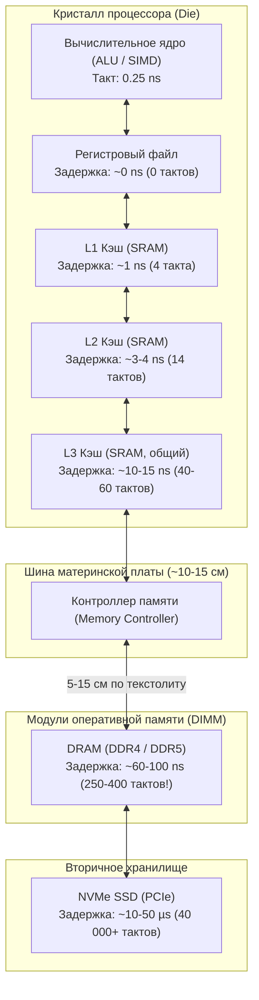
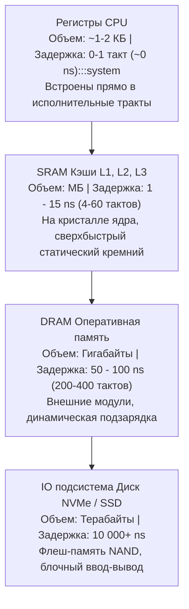

В предыдущих главах мы искренне восхищались инженерным триумфом процессоростроения. Конвейеры, суперскалярное исполнение, Out-of-Order движки и векторные SIMD-инструкции превратили современное вычислительное ядро в невероятно прожорливую машину: на тактовой частоте 4 ГГц оно способно перемалывать десятки операций за один такт, тратя на вычисления доли наносекунды.

Но здесь инженеров подстерегает жестокая ирония, известная как **Стена памяти (Memory Wall)**. 

Процессор научился считать в сотни раз быстрее, чем оперативная память успевает подавать ему данные. Если нужных байтов нет под рукой, многомиллионные суперскалярные конвейеры беспомощно замирают (Memory Stall). Профилирование реальных высоконагруженных Go-сервисов показывает отрезвляющую картину: до 70–80% всего процессорного времени при парсинге JSON, сериализации protobuf или обходе хэш-таблиц ядро CPU не производит полезных вычислений — оно просто ждет, пока нули и единицы приползут по медленным медным дорожкам материнской платы.

Возникает естественный вопрос: почему бы не оснастить компьютер сотней гигабайт сверхбыстрой памяти, работающей на той же частоте, что и процессор? Ответ упирается в фундаментальные законы физики и безжалостную экономику кремния.

---

## Ограничения физики: Скорость света и размер

Главный враг быстродействия в физическом мире — предельная скорость распространения информации. Электрический сигнал в медном проводнике на текстолите материнской платы распространяется со скоростью приблизительно **20 сантиметров за одну наносекунду** (около двух третей скорости света в вакууме).

Давайте сопоставим это с тактовой частотой современного процессора:
- При частоте ядра **4 ГГц** продолжительность одного такта составляет всего **0.25 наносекунды** ($T = 1 / f$).
- За это крошечное мгновение электрический импульс успевает пролететь в проводнике лишь:
$$20\text{ см/нс} \times 0.25\text{ нс} = 5\text{ сантиметров}$$

Если планка вашей оперативной памяти (DRAM) установлена в слоте на материнской плате в 10–15 сантиметрах от процессорного сокета, то только на преодоление пути «туда и обратно» сигналу потребуется от 4 до 6 тактов CPU. И это без учета задержек в контроллере памяти, коммутаторах шины и времени срабатывания самих ячеек памяти!



**Фундаментальное правило аппаратной архитектуры:**  
> Чем быстрее должна быть память, тем физически ближе она обязана располагаться к транзисторам вычислительного ядра ALU. 

Но площадь полупроводникового кристалла строго ограничена экономикой и тепловыделением: вы не можете вырастить кремниевую пластину размером со сковороду и разместить 64 Гигабайта рядом с ALU. Поэтому инженеры разделили память на ярусы, сформировав классическую **Пирамиду памяти (Memory Hierarchy)**.



---

## SRAM против DRAM: Два архитектурных полюса

Чтобы построить устойчивую иерархию памяти, инженерам пришлось опереться на две принципиально разные физические технологии (корни которых уходят в триггеры из [[4. Последовательностная логика. Учим кремний помнить]]).

### 1. SRAM (Static RAM) — Статическая память

В основе SRAM лежит балансирующий триггер из встречно включенных логических инверторов. Чтобы надежно хранить всего **один бит** информации, схеме требуется от **4 до 6 транзисторов (классическая 6T-ячейка)**.

```
       VDD            VDD
        │              │
      ┌─┴─┐          ┌─┴─┐
   T2 │   │       T4 │   │
      └─┬─┘          └─┬─┘
        ├──────o───────┤
        │      │       │
      ┌─┴─┐    │     ┌─┴─┐
   T1 │   │    └─────┤   │ T3
      └─┬─┘          └─┬─┘
        │              │
       GND            GND
        │              │
  Bit ──┤ T5        T6 ├── Bit_Not
        │              │
   Wordline        Wordline
```

* **Плюсы:**
  - **Колоссальная скорость:** состояние триггера переключается за доли наносекунды. Память работает синхронно с тактовой частотой CPU.
  - **Стабильность:** пока подается питание, бит хранится вечно. Никаких циклов восстановления и обновления не требуется.
* **Минусы:**
  - **Низкая плотность:** 6 транзисторов на один бит требуют огромной площади кристалла.
  - **Астрономическая стоимость и энергопотребление:** оснастить сервер 128 Гигабайтами чистой SRAM стоило бы миллионы долларов, а кристалл расплавился бы от тепловыделения.
* **Где используется:**
  - Регистровый файл CPU.
  - Встроенные кэши **L1, L2 и L3**. В современных десктопных и серверных процессорах их суммарный объем составляет от десятков мегабайт до сотен мегабайт (например, серверные AMD EPYC с 3D V-Cache, где пластина SRAM наваривается поверх ядер).

### 2. DRAM (Dynamic RAM) — Динамическая память

Инженер Роберт Деннард в 1968 году предложил элегантный компромисс: свести ячейку памяти всего к **одному транзистору и одному микроскопическому конденсатору (1T-1C)**. Конденсатор хранит электрический заряд (есть заряд = 1, нет заряда = 0), а транзистор выступает электронным ключом для чтения и записи.

```
  Wordline (Строка)
        │
      ┌─┴─┐
      │ T │ (Транзистор-ключ)
      └─┬─┘
        ├───┤├─── GND (Конденсатор C ~ 30 фФ)
        │
   Bitline (Столбец)
```

* **Плюсы:**
  - **Фантастическая плотность компоновки и дешевизна:** ячейка 1T-1C занимает в десятки раз меньше площади, чем 6T SRAM. Это позволяет на крошечной микросхеме упаковать миллиарды ячеек и продавать планки на 32–128 Гигабайт по доступной цене.
* **Минусы:**
  - **Утечка заряда:** тончайший диэлектрик конденсатора емкостью в десятки фемтофарад неизбежно разряжается за миллисекунды.
  - **Необходимость постоянной регенерации (DRAM Refresh):** контроллер памяти вынужден циклически каждые 32–64 мс считывать и заново перезаписывать (refresh) все строки памяти. Во время волны регенерации модуль заблокирован для полезных операций чтения/записи.
  - **Деструктивное чтение:** при чтении конденсатор сбрасывает заряд на сигнальную линию bitline. Контроллер должен потратить драгоценное время на перезарядку (Precharge).
* **Где используется:**
  - Ваша основная **Оперативная память (RAM)** стандартов DDR4, DDR5, LPDDR5.

---

## Цена доступа (Latency)

Чтобы инженер-программист прочувствовал физическую пропасть между ярусами памяти, переведем абстрактные наносекунды в масштабы повседневного человеческого времени. 

Представим мысленный эксперимент: **1 такт процессора (0.25 нс при частоте 4 ГГц) приравнен к 1 секунде нашей жизни**.

| Уровень памяти | Реальная задержка (нс) | Такты процессора | «Человеческое» время (1 такт = 1 сек) | Бытовая аналогия |
|---|:---:|:---:|:---:|---|
| **Регистры CPU** | ~0.25–0.5 нс | 1–2 такта | **1–2 секунды** | Мысль в голове или карандаш в руке. Вы сразу пишете. |
| **Кэш L1 (SRAM)** | ~1–1.5 нс | 4–5 тактов | **4–5 секунд** | Блокнот лежит прямо перед вами на рабочем столе. |
| **Кэш L2 (SRAM)** | ~3–4 нс | 12–16 тактов | **15 секунд** | Встать и взять книгу с полки в этой же комнате. |
| **Кэш L3 (SRAM)** | ~10–15 нс | 40–60 тактов | **1 минута** | Прогуляться в архивную комнату в конце коридора. |
| **Оперативная память (DRAM)** | ~60–100 нс | 250–400 тактов | **5–7 минут!** | Выйти из офиса, спуститься на лифте в подземное хранилище и найти папку. |
| **Твердотельный диск (NVMe SSD)** | ~10–50 µs | 40 000–200 000 тактов | **1.5–2 дня** | Заказать книгу на складе и ждать курьера. |
| **Сетевой запрос (Cross-DC / Ping)** | ~20–50 ms | 80 000 000+ тактов | **2–3 года!** | Поступить в университет, отучиться и получить диплом. |

Пока данные медленно ползут из оперативной памяти (DRAM), процессор, способный выполнять по 4–8 инструкций за секунду нашего масштаба, сидит без дела 5–7 минут. Именно поэтому борьба за то, чтобы данные оседали в кэшах L1/L2, определяет производительность современных сервисов.

> [!info] Под капотом: Аппаратная предвыборка (Prefetching)
> Процессоры не могут позволить себе слепо ждать. В кремнии кэш-контроллеров дежурят специализированные аппаратные предсказатели — **Prefetchers** (Stream Prefetcher, Stride Prefetcher). 
> Они анализируют историю обращений к памяти: если ваш код последовательно запрашивает адрес 100, затем 104, затем 108 — блок предвыборки распознает линейный шаблон (шаг 4 байта) и отправляет упреждающие запросы в медленную DRAM заранее. Фоном адреса 112, 116 и далее подтягиваются прямо в L1/L2. Когда ваш цикл доберется до них, они уже будут лежать «на столе» с задержкой в 1 нс.

---

## Mechanical Sympathy: Как Пирамида управляет Go-кодом

Для Go-разработчика понимание пирамиды памяти — это ключ к идиоматичному коду, эффективному использованию ресурсов и пониманию магии компилятора Go.

### Стек против Кучи (Stack vs Heap)

У каждой горутины в Go есть собственный **Стек (Stack)**. Он выделяется как непрерывный компактный фрагмент памяти (в Go по умолчанию размером 2 КБ) и растет/уменьшается по мере вызовов функций.
Для долгоживущих объектов и данных общего доступа существует **Куча (Heap)** — глобальная область памяти, очищаемая сборщиком мусора (Garbage Collector).

Спросите любого опытного инженера: *«Почему мы стремимся избегать лишних аллокаций в куче?»* 
Большинство ответит: *«Чтобы не нагружать GC»*. Это правда, но лишь половина правды! Вторая, не менее важная причина — **кэш-локальность**.

Стек горутины — это крошечный, непрерывный и постоянно используемый участок памяти. Поскольку процессор без конца модифицирует данные на вершине стека (адреса вокруг регистра `RSP`), эти 2–4 килобайта **почти гарантированно на 100% постоянно прогреты в сверхбыстром кэше L1 или L2 (SRAM)**! Доступ к локальным переменным на стеке занимает всего 1 наносекунду.

Когда объект совершает побег в кучу (Escape Analysis перемещает его туда), аллокатор Go (`runtime.mallocgc`) выделяет под него место в одном из блоков памяти (mspan/mcache). При первом обращении к такому объекту он практически гарантированно отсутствует в L1-кэше. Процессор ловит **Cache Miss**, конвейер встает на паузу, и поток отправляется в долгое путешествие в медленную DRAM на 100 наносекунд.

Разница в скорости обращения к данным на стеке и в куче физически может достигать 50–100 крат!

### Указатели — враги производительности

Из принципа пирамиды памяти вытекает парадокс, часто шокирующий программистов, пришедших из языков с повсеместной ссылочной семантикой: **злоупотребление указателями замедляет программу**.

Это явление известно как **Погоня за указателями (Pointer Chasing)**.

> [!tip] Собеседование
> **Вопрос:** Вы передаете структуру `User` размером 128 байт в функцию. Что отработает быстрее: передача по значению `func Process(u User)` или по указателю `func Process(u *User)`?
> 
> **Ответ:** Зависит от контекста, но очень часто **передача по значению оказывается быстрее**.
> 
> Разберем физику происходящего:
> 1. Если вы передаете структуру по указателю `*User`, вы копируете всего 8 байт (адрес). Благодаря соглашению о вызовах `ABIInternal` (Go 1.17+, см. [[10. ABI, Calling Convention и стек вызовов]]), эти 8 байт мгновенно кладутся в регистр CPU. 
>    Но когда функция попытается прочитать поле `u.Age`, процессор возьмет этот адрес и отправится за данными в медленную DRAM (штраф до 100 нс). Кроме того, взятие адреса `&u` часто заставляет компилятор отправить структуру `User` в кучу.
> 2. Если вы передаете структуру по значению `User`, она копируется целиком. Компилятор Go копирует 128 байт быстрыми векторными регистрами на стек вызываемой функции. Стек **уже находится в L1-кэше**, и все последующие обращения к полям `u.Age`, `u.Name` происходят со скоростью 1 нс без единого промаха в память!

Еще ярче этот эффект проявляется при выборе между слайсом структур и слайсом указателей на структуры.

```go
package main

type Item struct {
	val int
}

// processValues идеально согласуется с архитектурой процессора.
// Данные лежат единым монолитным куском в памяти.
// Аппаратный Prefetcher заранее затягивает строки в SRAM L1/L2.
func processValues(items []Item) {
	for _, item := range items {
		_ = item.val // Скорость доступа ~1 ns
	}
}

// processPointers — кошмар для подсистемы памяти (Pointer Chasing).
// В слайсе лежат только 64-битные указатели.
// Сами структуры Item разбросаны по разным аренам кучи.
func processPointers(items []*Item) {
	for _, item := range items {
		// item указывает на непредсказуемый адрес в куче.
		// Аппаратный Prefetcher бессилен.
		// CPU простаивает сотни тактов, ожидая данные из DRAM.
		_ = item.val // Скорость доступа ~50-100 ns
	}
}
```

* Слайс значений `[]User` (или `[]Item`) представляет собой непрерывный линейный массив байт в памяти. Аппаратный предвыборщик процессора видит последовательное чтение и заблаговременно подгружает строки из DRAM в кэши L1/L2. Цикл летит на пределе возможностей кремния.
* Слайс указателей `[]*User` (или `[]*Item`) превращает обход в лотерею: в самом слайсе лежат лишь 64-битные адреса, а целевые объекты разбросаны сборщиком мусора по разным несмежным страницам оперативной памяти. На каждой итерации процессор вынужден делать косвенное разыменование, сталкиваясь с промахом кэша и ожиданием в 60–100 нс.

---

## Итог

1. **Стена памяти (Memory Wall)** — физическая реальность компьютерных систем: ядра процессора стали быстрее оперативной памяти на два порядка.
2. Для маскировки задержек архитекторы используют **Пирамиду памяти**: от сверхбыстрой, но компактной и дорогой **SRAM (Кэши L1/L2/L3)** до емкой и доступной, но медленной **DRAM (ОЗУ)**.
3. Доступ к оперативной памяти DRAM в 50–100 раз дороже (до 100 нс), чем обращение к кэшу L1 (1 нс). В масштабах человеческого времени это разница между 4 секундами и 6 минутами ожидания.
4. Локальные переменные на **стеке** работают с максимальной скоростью, поскольку активная вершина стека почти всегда прогрета в кэшах L1/L2. Убегание в кучу (**Heap**) ведет к потере кэш-локальности и штрафам DRAM.
5. Идиоматичный высокопроизводительный Go опирается на принцип **Data Locality** — компактные структуры и слайсы значений (`[]Item` вместо `[]*Item`). Это дает аппаратному блоку предвыборки (**Prefetcher**) возможность заранее подавать данные на конвейер.

Мы выяснили, что кэш процессора — это главный спасительный мост между молниеносными регистрами и неторопливой оперативной памятью. Но какими квантами кэш обменивается данными с памятью? Почему изменение одной 8-байтной переменной в Go может затормозить параллельную работу соседнего ядра на другом конце сокета? 

Ответы ждут нас в следующей статье: [[18. Кэши CPU. L1, L2, L3 и Cache Line]].