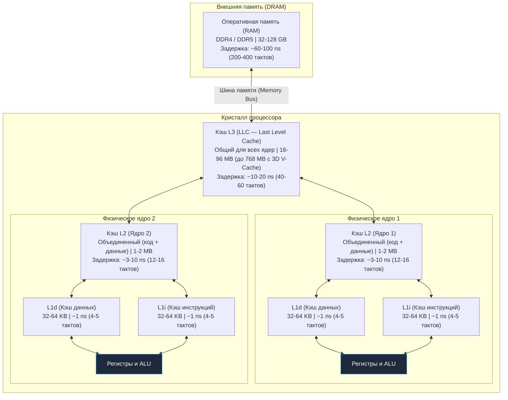

В предыдущей главе ([[17. Пирамида памяти. Регистры, SRAM, DRAM и цена доступа]]) мы установили фундаментальный факт: современный процессор не может позволить себе напрямую работать с гигантской оперативной памятью DRAM. Если бы каждый запрос числа или адреса шел через материнскую плату, наши мощные многоядерные чипы 99% времени дремали бы в ожидании ответов.

Чтобы спасти процессор от информационного голода, архитекторы расположили между исполнительными конвейерами и системной шиной каскад скоростных буферов — **кэши процессора**, выполненные на сверхбыстрой статической памяти SRAM.

Для инженера бэкенда понимание механики кэшей — это водораздел. Именно здесь проходит граница между кодом, который «просто компилируется и работает», и кодом, способным без натуги перемалывать миллионы сетевых запросов в секунду.

---

## Анатомия кэш-иерархии

Современный процессор (будь то x86-64 Intel Core / AMD Ryzen или ARM64 Apple M-серии / AWS Graviton) организует свою быструю память в виде трехслойного пирога. Правило простое: чем ближе к вычислительному ядру (ALU), тем кэш меньше по объему, но тем выше его пропускная способность и ниже задержка.



### Уровни кэша в разрезе:

1. **L1 (Level 1):** Личный карман конвейера.
   - Располагается прямо внутри кристалла исполнительного ядра.
   - Исторически разделен на две независимые половины по гарвардской архитектуре:
     - **L1i (Instruction Cache):** хранит декодируемый машинный код.
     - **L1d (Data Cache):** хранит операнды и переменные.
   - Такое разделение жизненно необходимо: стадия выборки инструкций (Fetch) и стадия работы с памятью (Execute/Memory) могут одновременно опрашивать L1 без конкуренции за физическую шину.
   - **Размер:** обычно 32–64 КБ на каждую часть (L1i / L1d).
   - **Задержка (Latency):** ~1 наносекунда (всего 3–4 такта процессора).
2. **L2 (Level 2):** Персональный рабочий стол ядра.
   - Универсальный буфер: данные и инструкции хранятся совместно.
   - В абсолютном большинстве современных архитектур L2 является строго **локальным** для конкретного физического ядра.
   - **Размер:** от 512 КБ до 1–2 МБ на ядро.
   - **Задержка:** ~3–10 наносекунд (10–15 тактов).
3. **L3 (Level 3 / Last Level Cache, LLC):** Общественный архив кристалла.
   - Является общим разделяемым ресурсом для всех вычислительных ядер на кристалле (или внутри одного CCX/чиплета в архитектурах AMD Zen).
   - Если горутина в Go выполнялась на ядре №1, записала структуру в память, а затем планировщик перебросил её на ядро №2 — ядро №2 моментально найдет обновленные данные в разделяемом кэше L3 без долгого похода в оперативную память.
   - **Размер:** от 16–32 МБ в потребительских чипах до 768 МБ в серверных монстрах (например, AMD EPYC с технологией 3D V-Cache, где пластины SRAM наращиваются прямо поверх кремния процессора).
   - **Задержка:** ~10–20 наносекунд (40–60 тактов).

---

## Кэш-линия (Cache Line): Атомарная единица памяти

Вот здесь кроется самая главная тайна, определяющая производительность высоконагруженного кода на Go.

Когда программист пишет тривиальное выражение:
```go
b := a[0] // где a — срез или массив типа byte
```
процессор **не идет** в оперативную память DRAM за одним несчастным байтом. Процессоры вообще аппаратно не способны читать или писать данные из основной памяти побайтово! Контроллеру шины и подсистеме адресации это было бы совершенно невыгодно.

Вместо этого процессор всегда запрашивает и перемещает данные фиксированными порциями одинакового размера. Эта квантовая единица кэш-памяти называется **Кэш-линией (Cache Line)**.

> **Стандарт индустрии:**  
> Практически во всех современных процессорах общего назначения архитектур x86-64 и ARM64 размер кэш-линии строго равен **64 байтам** (512 бит).

```
┌──────────────────────────────── 64 байта ───────────────────────────────┐
│ int64 #0 │ int64 #1 │ int64 #2 │ int64 #3 │ int64 #4 │ int64 #5 │ int64 #6 │ int64 #7 │
│  (8 байт)│  (8 байт)│  (8 байт)│  (8 байт)│  (8 байт)│  (8 байт)│  (8 байт)│  (8 байт)│
└─────────────────────────────────────────────────────────────────────────┘
 ▲                                                                       ▲
 0x00                                                                   0x3F
```

Если вашему алгоритму понадобился всего 1 байт (например, булев флаг или символ `byte`), процессор загружает этот байт и **еще 63 соседних байта** из памяти в кэш L1 одной монолитной транзакцией.

Представьте, что вы пришли в супермаркет купить одно куриное яйцо для утренней глазуньи. Однако продавец не продает яйца поштучно: яйца упакованы в лотки по 10 штук. Вы вынуждены купить всю упаковку целиком и принести её на кухню (в кэш). Если через минуту вам потребуется второе яйцо — бежать в магазин уже не нужно, оно лежит прямо перед вами. Но если вы выбросите остальные 9 яиц, вы потратите силы и деньги впустую.

> [!info] Под капотом
> Кэш-линии всегда выровнены в памяти аппаратно. Оперативная память разбита на блоки по 64 байта: адреса `0x00` - `0x3F`, затем `0x40` - `0x7F` и так далее. Вы не можете загрузить кэш-линию, которая начинается, например, с адреса `0x08` и заканчивается на `0x47`. Процессор всегда загружает весь выровненный блок целиком.

### Два закона локальности

Работа кэш-памяти опирается на два эмпирических закона:

1. **Временная локальность (Temporal Locality):** если память по адресу $X$ была запрошена прямо сейчас, с высокой вероятностью этот же адрес понадобится процессору снова в ближайшие миллисекунды (например, счетчик цикла `i++` или локальная переменная на вершине стека).
2. **Пространственная локальность (Spatial Locality):** если процессор прочитал байт по адресу $X$, с вероятностью более 90% следующей операцией он захочет прочитать адрес $X+1$, $X+2$ и так далее. Именно под эту гипотезу и спроектирована 64-байтная кэш-линия.

---

## Mechanical Sympathy: Пишем код с уважением к Cache Line

Размер кэш-линии в 64 байта означает, что в нее ровно помещается:
- **64** значения типа `byte` / `bool` / `int8`
- **16** значений типа `int32` / `float32`
- **8** значений типа `int64` или `float64`
- **8** указателей в 64-битной системе (типа `*User` или `uintptr`)

Посмотрим, к каким драматическим последствиям приводит игнорирование этого факта. Классическая лабораторная задача, встречающаяся на углубленных архитектурных собеседованиях: обход двумерной матрицы размером $4096 \times 4096$.

Чтобы исключить накладные расходы на косвенную адресацию вложенных слайсов (`[][]int`), в продакшн-коде двумерные массивы всегда «расплющивают» в непрерывный одномерный срез:

```go
package main

import (
	"testing"
)

const size = 4096

// Инициализируем плоскую матрицу из 16 777 216 элементов
var matrix = make([]int64, size*size)

// Пример 1: Идиоматичный обход (по строкам)
func BenchmarkMatrixRow(b *testing.B) {
	for i := 0; i < b.N; i++ {
		var sum int64
		for y := 0; y < size; y++ {
			for x := 0; x < size; x++ {
				// Читаем элементы последовательно в памяти
				sum += matrix[y*size+x]
			}
		}
	}
}

// Пример 2: Катастрофический обход (по столбцам)
func BenchmarkMatrixColumn(b *testing.B) {
	for i := 0; i < b.N; i++ {
		var sum int64
		for x := 0; x < size; x++ {
			for y := 0; y < size; y++ {
				// Скачем через гигантские интервалы памяти!
				sum += matrix[y*size+x]
			}
		}
	}
}
```

Если скомпилировать этот код и запустить бенчмарк на любом современном CPU, разница потрясает: **`BenchmarkMatrixRow` работает в 6–10 раз быстрее, чем `BenchmarkMatrixColumn`!**

Хотя математическая сложность обоих алгоритмов строго одинакова — $\mathcal{O}(N^2)$ операций сложения, а в ассемблере генерируются идентичные инструкции `ADDQ`. В чем же разгадка?

### Анатомия катастрофы: почему обход по столбцам проигрывает

**Что происходит в `BenchmarkMatrixRow` (последовательный ход по строкам):**
1. На первой итерации процессор запрашивает `matrix[0]`. Данных в кэше нет — происходит **Cache Miss**.
2. Контроллер обращается к оперативной памяти и загружает в кэш L1 полную 64-байтную кэш-линию. Задержка: ~60–80 нс.
3. В этой кэш-линии уже лежат следующие 8 чисел: от `matrix[0]` до `matrix[7]`.
4. Следующие 7 итераций внутреннего цикла (`matrix[1]`, `matrix[2]` ... `matrix[7]`) исполняются со скоростью света — ~1 нс из кэша L1.
5. Аппаратный блок предвыборки (Prefetcher) быстро распознает строго последовательный шаг чтения ($+8$ байт) и начинает фоном затягивать следующие кэш-линии из DRAM еще до того, как цикл до них доберется!
6. **КПД использования шины памяти: 100%.** Мы запросили 64 байта и полностью их потребили.

**Что происходит в `BenchmarkMatrixColumn` (скачкообразный ход по столбцам):**
1. Процессор читает элемент `matrix[0]` (индекс 0). Cache Miss — загружается кэш-линия с элементами `[0..7]`.
2. На следующей итерации переменная `y` увеличивается на 1. Мы запрашиваем элемент:
$$\text{index} = 1 \times 4096 + 0 = 4096$$
3. В байтах это шаг на $4096 \times 8 = 32768$ байт (32 КБ) вперед: мы запрашиваем элемент `matrix[1 * 4096 + 0]` (индекс 4096). Этот адрес заведомо лежит в совершенно другой кэш-линии.
4. Процессор снова получает **Cache Miss** и конвейер замирает еще на 80 наносекунд.
5. А что происходит с кэш-линией `[0..7]`, которую мы только что привезли из памяти? Мы взяли из нее всего одно число (8 байт), а остальные 7 чисел (56 байт) просто выбросили, потому что к моменту, когда цикл до них дойдет, кэш L1 уже вытеснит эту линию!
6. **КПД полезной нагрузки шины: всего 12.5%.** Пропускная способность шины памяти забита бесполезным мусором, а конвейеры простаивают.

---

## Паттерны организации данных: AoS против SoA

Из понимания природы кэш-линий рождается один из главных архитектурных приемов оптимизации структур данных: переход от **Array of Structures (AoS)** к **Structure of Arrays (SoA)**.

> [!tip] Собеседование
> **Вопрос:** У нас есть слайс структур `[]User{ID int64, Age int64}` и мы хотим найти средний возраст всех пользователей. Будет ли этот код оптимально использовать кэш процессора?
> 
> **Ответ:** Такой код утилизирует кэш-линии лишь наполовину (50% полезной нагрузки).
> Каждая структура `User` занимает 16 байт ($8 + 8$). В 64-байтную кэш-линию помещается ровно 4 объекта `User`:
> `[ID0, Age0, ID1, Age1, ID2, Age2, ID3, Age3]`
> 
> Когда цикл вычисляет средний возраст, он читает только поле `Age`. Однако аппаратная кэш-линия тащит за собой и поле `ID`, которое в данном расчете вообще не нужно! Ровно 50% пропускной способности памяти тратится впустую на перекачку неиспользуемых идентификаторов.
> 
> В высоконагруженных системах (в СУБД вроде ClickHouse или игровых движках ECS) применяют паттерн **SoA (Structure of Arrays)**:
> Вместо `[]User` создается структура:
> ```go
> type Users struct {
>     IDs  []int64
>     Ages []int64
> }
> ```
> В этом случае срез `Ages` представляет собой монолитный блок памяти. При его обходе в каждую 64-байтную кэш-линию загружается ровно 8 полезных возрастов подряд. Коэффициент полезного действия возрастает до 100%, а компилятор может легко векторизовать цикл с помощью SIMD.

---

## Ловушки выравнивания (Alignment)

Размер кэш-линии диктует жесткие требования к расположению данных в оперативной памяти.

Если критически важная переменная или структура примитивов не выровнена кратно размеру кэш-линии, она может случайно оказаться на границе двух соседних линий. В этом случае процессору для чтения одного-единственного поля придется делать два раздельных обращения к кэшу и аппаратно «сшивать» половинки байт.

Еще более коварная проблема возникает в многопоточных Go-программах. Представьте структуру с полем `sync.Mutex`, защищающим общие данные. Внутреннее состояние мьютекса занимает 8 байт. Если рядом с мьютексом в пределах тех же 64 байт лежит часто изменяемый счетчик другого ядра, они окажутся заперты в одной кэш-линии. Это порождает разрушительный феномен взаимного вытеснения кэшей — **False Sharing** (которому мы посвятим отдельную главу [[21. False Sharing и Cache Line Contention]]).

> [!warning] Ловушка / Gotcha: Интерфейсы и Cache Lines
> В Go для создания универсальных коллекций нередко используют срез пустых интерфейсов `[]any`.
> На уровне рантайма интерфейс представляет собой пару указателей: тип (`_type`) и указатель на данные (`data`), занимая суммарно 16 байт. В одну 64-байтную кэш-линию укладывается 4 интерфейсных заголовка.
> 
> Однако, когда ваш цикл начинает читать фактическое *значение*, скрывающееся за интерфейсом, процессор вынужден брать указатель `data` и совершать переход по произвольному адресу в кучу (Heap). Фактические объекты раскиданы по памяти хаотично.
> В итоге, несмотря на то что сами заголовки интерфейсов считываются из L1 за 1 нс, каждое последующее разыменование приводит к тяжелому промаху L3/DRAM Cache Miss. Использование срезов `[]any` в вычислительно-плотных циклах полностью уничтожает пространственную локальность.

---

## Итог

1. **Кэш-иерархия** состоит из трех уровней: **L1** (локальный для ядра, разделен на L1i для инструкций и L1d для данных, 1 нс), **L2** (локальный рабочий буфер ядра, 3–10 нс) и **L3** (общий большой пул для всех ядер на кристалле, 10–20 нс).
2. Процессор физически оперирует памятью порциями по **64 байта** — **Кэш-линиями (Cache Lines)**. Побайтового обмена с DRAM не существует.
3. **Пространственная локальность:** прочитав один байт по адресу $X$, вы бесплатно получаете остальные 63 байта этой же линии в кэше L1.
4. Прыжки по памяти (например, обход матриц по столбцам или хаотичные переходы по указателям) приводят к катастрофическому падению скорости: шина забивается бесполезными байтами, а конвейер процессора простаивает в ожидании ответов DRAM.
5. Для предельной производительности организуйте данные непрерывными монолитными массивами, отдавая предпочтение паттерну **SoA** вместо **AoS** при обработке отдельных полей больших коллекций.

Мы разобрались, почему процессор перемещает данные 64-байтными строками. Но как аппаратная логика кэша мгновенно понимает, где именно среди миллионов адресов DRAM находится нужная линия? Что такое ассоциативность кэша и почему одинаковый остаток от деления адресов может вызвать аппаратный конфликт?

Ответы на эти вопросы мы найдем в следующей главе: [[19. Ассоциативность кэша, Prefetching и Cache Miss]].