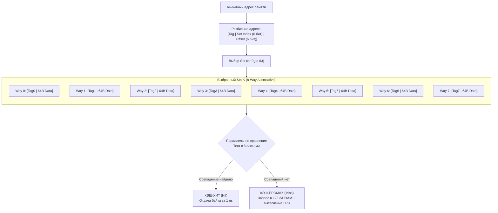

В предыдущей главе ([[18. Кэши CPU. L1, L2, L3 и Cache Line]]) мы выяснили, что оперативная память и процессор общаются строго 64-байтными порциями — кэш-линиями. Но мы намеренно оставили за скобками главный архитектурный ребус.

Взгляните на цифры: объем кэша первого уровня L1 составляет скромные 32 КБ. Объем оперативной памяти на сервере — 64 Гигабайта (а то и терабайт).
Разделив 32 КБ на 64 байта, мы получим ровно **512 слотов для кэш-линий**.

Когда ядро запрашивает блок памяти по произвольному 64-битному адресу из бескрайней RAM, по какому правилу контроллер определяет, в какой именно из 512 слотов положить приехавшие байты? И что еще важнее: когда эти данные понадобятся снова, как процессор за долю наносекунды находит нужную кэш-линию среди остальных 511, не перебирая их по очереди?

Эта фундаментальная задача называется **Архитектурой маппинга (отображения) кэша**.

---

## Ассоциативность кэша: Проблема парковки

Чтобы понять физику процесса, представим наглядную жизненную аналогию.
Кэш L1 — это **парковка на 512 мест**, обслуживающая огромный мегаполис (оперативную память RAM) с миллионами автомобилей (кэш-линий). 

Как организовать правила въезда и размещения машин? В истории вычислительной техники было опробовано три подхода.

```
Анатомия 64-битного адреса памяти при поиске в кэше:
┌───────────────────────────────┬──────────────┬───────────────┐
│           Tag (Тег)           │  Set (Индекс)│ Offset (Смещение)
│            52 бита            │    6 бит     │     6 бит     │
└───────────────────────────────┴──────────────┴───────────────┘
                                 (выбирает 1    (выбирает байт
                                  из 64 сетов)   внутри 64B линии)
```

### 1. Direct-Mapped (Кэш прямого отображения)

Самое прямолинейное решение: жесткая привязка. Номер парковочного места однозначно вычисляется из адреса автомобиля по формуле деления с остатком: `Место = Адрес % 512`.
$$\text{Место} = \text{Адрес} \pmod{512}$$

* **Плюсы:** Невероятная аппаратная простота и дешевизна. Время поиска — строго $\mathcal{O}(1)$: берем биты адреса и сразу смотрим в нужную ячейку.
* **Минусы:** Чудовищные коллизии. Представьте, что в вашей Go-программе два активных массива лежат по адресам `0` и `32768`. Оба этих адреса при делении на 512 дают один и тот же остаток — 0! Они претендуют на одно-единственное Место №0. 
Процессор будет циклически вытеснять одну кэш-линию другой на каждой итерации цикла. Это явление называется **Thrashing (кэш-буксование)**. Скорость работы падает до уровня медленной DRAM, несмотря на то что остальные 511 мест на парковке стоят абсолютно пустыми!

### 2. Fully Associative (Полностью ассоциативный кэш)

Противоположная крайность: полная свобода. Любая кэш-линия может занять вообще любое свободное место из 512.

* **Плюсы:** Коллизий мест нет в принципе. Кэш заполняется со 100% эффективностью.
* **Минусы:** Катастрофа при поиске. Чтобы узнать, есть ли нужный адрес в кэше, контроллер обязан параллельно сравнить теги всех 512 ячеек за один такт! Для этого требуется разместить 512 аппаратных компараторов на кристалле. Это приводит к дикому расходу транзисторов, высокому энергопотреблению и перегреву. В кэшах данных L1/L2 такой подход физически не реализуем (он применяется лишь в крошечных специализированных буферах на 32–64 записи, например, в TLB).

### 3. N-Way Set Associative (N-канальный множественно-ассоциативный)

Гениальный инженерный компромисс, на котором сегодня построены 99.9% процессоров в мире.

Парковка делится на несколько отдельных «секторов» или «наборов» (**Sets**). Внутри каждого сета выделяется строго фиксированное число парковочных мест (**Ways**, каналы ассоциативности).

Например, классический **8-Way кэш объемом 32 КБ**:
- Всего слотов: 512 линий.
- В каждом сете: 8 мест (Ways).
- Всего сетов: $512 / 8 = 64$ сета.

Машина направляется в свой сет по формуле: `Зона = Адрес % 64` (где номер кэш-линии делится по модулю числа сетов).
$$\text{Зона (Set)} = (\text{Адрес} / 64) \pmod{64}$$
А вот внутри выделенного сета она может занять **любое из 8 свободных мест**! 

Когда процессору нужно проверить наличие адреса, он активирует всего 8 компараторов одновременно (вместо 512). Это работает молниеносно, потребляет минимум энергии и защищает от коллизий. Если все 8 мест в сете заняты, специальный алгоритм вытеснения (обычно LRU — Least Recently Used или его аппаратное приближение Tree-PLRU) выбрасывает кэш-линию, к которой дольше всего не обращались.



В современных процессорах кэш L1d почти всегда является **8-way**, кэш L2 — **8-way** или **16-way**, а огромный L3 — **12-way**, **16-way** или даже **24-way**.

---

## Правило Трех C: Анатомия Cache Miss

Когда процессор пытается прочитать данные и не находит нужный тег в выбранном сете, происходит **Cache Miss (промах кэша)**. 

Классическая теория архитектуры ЭВМ (сформулированная Марком Хиллом и популяризированная Джоном Хеннесси и Дэвидом Паттерсоном) делит промахи на три фундаментальные категории — **«Три C» (The 3 C's)**:

1. **Compulsory Miss (Обязательный, или «холодный» промах):**  
   Самое первое обращение программы к данной области памяти. Данных физически еще никогда не было в кэше. Этот промах неизбежен при холодном старте сервиса.
2. **Capacity Miss (Промах по вместимости):**  
   Рабочий набор данных вашей программы (Working Set) превышает физический объем кэша (например, хэш-таблица на миллион ключей занимает 100 МБ, а весь кэш L3 — 32 МБ). Данные постоянно сменяют друг друга, потому что кэш банально мал.
3. **Conflict Miss (Конфликтный промах):**  
   Самый обидный и коварный промах. Суммарный объем данных невелик и легко поместился бы в кэш (кэш занят всего на 15%), но структура адресов такова, что все обращения конкурируют за один и тот же Set, переполняя его 8 каналов.
   
*(В многоядерных системах к ним добавляется четвертое «C» — **Coherence Miss**, вызванный аннулированием строк из-за записи на соседнем ядре. Мы разберем его в следующей главе).*

> [!warning] Ловушка / Gotcha: Проклятие степеней двойки
> Конфликтные промахи породили одну из самых печально известных аппаратных ловушек в инженерной практике.
> 
> Если вы выделите в Go двумерную матрицу, размерность которой является точной степенью двойки — например, `[4096][4096]byte`, — и начнете наивно обходить её по столбцам, вы рискуете обрушить производительность в 10–20 раз даже по сравнению с обычным промахом.
> 
> Почему это происходит?  
> Элементы первого столбца `matrix[0][0]`, `matrix[1][0]` и `matrix[2][0]` отстоят друг от друга в памяти с шагом ровно 4096 байт ($2^{12}$).
> Для 8-канального кэша L1 размером 32 КБ с 64 сетами размер одного периода повторения сетов составляет:
> $$64\text{ сета} \times 64\text{ байта} = 4096\text{ байт}$$
> 
> Это означает, что **все элементы столбца имеют одинаковый Set Index и попадают в один и тот же Set кэша**! Емкость сета исчерпывается на 8-м элементе. С девятой строки процессор начинает непрерывно выбивать свои же свежие кэш-линии из этого злополучного сета, в то время как остальные 63 сета кэша остаются кристально чистыми!
> 
> **Лекарство (Padding):**  
> Добавьте к размеру строки фиктивное смещение, нарушающее кратность степени двойки: например, выделите `[4096][4160]byte`. Сдвиг адресов рассеет обращения по разным сетам кэша, коллизии исчезнут, и пропускная способность восстановится. (Подробнее эту технику мы разберем в [[25. Выравнивание данных, Padding и Struct Layout]]).

---

## Prefetching: Железо предсказывает будущее

Казалось бы, если Compulsory Miss (первое чтение) неизбежен, то при последовательном обходе массива мы обречены получать штраф памяти на каждой новой кэш-линии. 

Но создатели процессоров научили кремний предугадывать намерения программиста. За это отвечает **Hardware Prefetcher (Аппаратный блок предвыборки)**.

Prefetcher работает как скрытый аналитический радар в составе кэш-контроллера. Он непрерывно отслеживает последовательность адресов, которые запрашивают инструкции `MOVQ`.

```
Ваш код запрашивает:
Линия 1: 0x1000  (Miss, чтение из DRAM)
Линия 2: 0x1040  (+64 байта)  ──► Prefetcher фиксирует: Stride = +64
Линия 3: 0x1080  (+64 байта)  ──► Шаблон подтвержден!

Prefetcher самостоятельно (на опережение) отправляет запрос:
        0x10C0  (затягивается в L1/L2 фоном, пока вы считаете 0x1080!)
```

Если контроллер замечает устойчивый шаг:
* Кэш-линия `0x1000`
* Затем кэш-линия `0x1040` (+64 байта)
* Затем кэш-линия `0x1080` (+64 байта)

Prefetcher делает вывод: код выполняет последовательный обход непрерывного массива с шагом в одну кэш-линию (Stride = 1).
Не дожидаясь, пока процессор завершит работу с текущими байтами и запросит адрес `0x10C0`, Prefetcher **в фоновом режиме отправляет упреждающий запрос по шине памяти в DRAM**. 

К тому моменту, когда счетчик цикла доберется до адреса `0x10C0`, данные уже будут заботливо лежать в кэше L1 или L2! Задержка доступа в 80–100 нс оказывается полностью замаскирована, превращаясь в 1 наносекунду.

> [!info] Под капотом: Границы страниц и Prefetcher
> Аппаратный предвыборщик спроектирован предельно осторожным: он **никогда не переступает границу физической страницы памяти** (размером 4 КБ). 
> Если массив подходит к концу страницы (например, к адресу `0x1FFF`), предвыборщик немедленно останавливается. Если бы он самовольно шагнул через границу на адрес `0x2000`, а следующая страница не была бы выделена процессу операционной системой, процессор спровоцировал бы аппаратное прерывание `Page Fault`, и невинная программа аварийно завершилась бы с ошибкой сегментации. О том, как устроены эти страницы, мы поговорим в [[27. Виртуальная память. Взгляд со стороны железа]].

---

## Mechanical Sympathy: Помогаем Prefetcher'у на Go

С точки зрения кремния, идеальный высокопроизводительный код на Go — это код, в котором Prefetcher угадывает 100% обращений к памяти.

Чтобы достичь этой гармонии, разработчик должен знать, какие паттерны помогают блоку предвыборки, а какие сбивают его с толку.

### 1. Pointer Chasing (Погоня за указателями)

Слайс указателей `[]*User` или узлы связного списка `container/list` — злейшие враги предвыборщика.

Когда вы обходите слайс указателей:
1. Вы последовательно читаете адрес `0x9000` из самого слайса.
2. Процессор совершает переход и читает данные структуры в куче по адресу `0x9000`.
3. На следующем шаге из слайса читается адрес `0x7500`.
4. Процессор вынужден прыгать по адресу `0x7500`.

Для кремниевого контроллера цепочка `0x9000 -> 0x7500` выглядит как абсолютно хаотичный белый шум. Аппаратный Prefetcher не видит никакой закономерности и отключается. В итоге программа собирает полный штраф DRAM на каждом элементе! Классические структуры данных вроде связных списков, бинарных деревьев поиска и графов на указателях аппаратно работают в десятки раз медленнее массивов именно по этой причине.

### 2. Шаг итерации больше размера кэш-линии

Даже если данные лежат в едином непрерывном куске памяти, неоптимальный размер структуры может дезориентировать контроллер:

```go
package main

type BigStruct struct {
	UsefulData int64     // 8 байт полезной нагрузки
	Padding    [248]byte // Мусор для раздутия размера (структура ровно 256 байт)
}

func sumUsefulData(items []BigStruct) int64 {
	var sum int64
	for i := range items {
		sum += items[i].UsefulData
	}
	return sum
}
```

В данном примере срез `items` монолитен. Однако полезное поле `UsefulData` запрашивается с огромным шагом в **256 байт** (прыжок через 4 кэш-линии за одну итерацию!). 
Многие процессоры умеют отслеживать только короткие шаги (Stride $\le 128$ байт). Широкие прыжки сбивают детектор шага, а шина памяти перегружается: на каждые 8 прочитанных байт контроллер вынужден перекачивать 256 байт данных из DRAM.

> [!tip] Собеседование
> **Вопрос:** Если мы знаем, что указатели и связные списки парализуют работу Prefetcher'а, но архитектура системы требует дерева или графа с миллионами динамических узлов, как выжать максимум производительности в Go?
> 
> **Ответ:** Использовать паттерн **Arena Allocation** (или пул на основе монолитного слайса).
> 
> Вместо того чтобы создавать каждый узел через индивидуальный вызов `new(Node)` (который раскидывает объекты по разным страницам кучи), мы заранее аллоцируем непрерывный буфер:
> ```go
> arena := make([]Node, 10000)
> ```
> Новые элементы графа берутся из этой арены последовательно. Теперь указатели `*Node` внутри структуры ссылаются на соседние ячейки памяти внутри непрерывного массива. При обходе графа смежные вершины с высокой вероятностью окажутся в одной и той же кэш-линии или будут своевременно захвачены аппаратным Prefetcher'ом!

---

## Итог

1. Чтобы связать гигантскую память и компактный кэш без взрывного роста числа транзисторов, применяется **N-Way Set Associative архитектура**. Кэш делится на наборы (Sets), каждый из которых содержит $N$ параллельных линий (Ways).
2. Промахи кэша подчиняются **Правилу Трех C**: Compulsory (первое обращение), Capacity (нехватка объема) и Conflict (конфликт за слоты одного сета).
3. Многомерные массивы с размерностями степени двойки чреваты **Conflict Miss**: данные многократно выбивают друг друга из одного сета кэша при пустующих соседних. Лекарство — добавление искусственного отступа (**Padding**).
4. Аппаратный **Prefetcher** распознает линейные шаблоны чтения памяти и фоном затягивает кэш-линии из медленной DRAM в быстрый кэш L1, нивелируя задержки.
5. Для максимальной дружбы с «железом» предпочитайте плоские слайсы значений `[]struct`. Избегайте развесистых графов на неструктурированных указателях или собирайте их узлы внутри монолитных арен памяти.

Мы детально изучили, как работает подсистема памяти в пределах одного процессорного ядра. Но в наших серверах трудятся десятки ядер! 
Что произойдет, если горутина на Ядре №1 обновит переменную в своем локальном кэше L1, а горутина на Ядре №2 в ту же наносекунду попытается её прочитать? Как процессоры синхронизируют локальные кэши без хаоса и гонок данных?

Об этом мы поговорим в следующей фундаментальной главе: [[20. Многоядерные процессоры и Cache Coherence]].