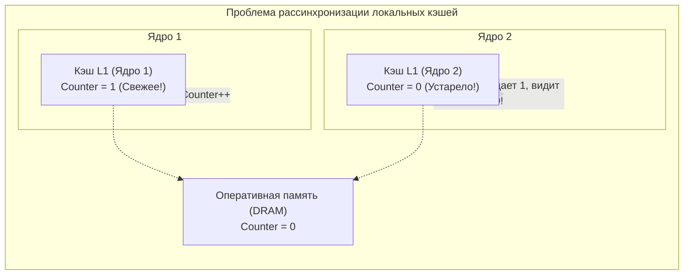
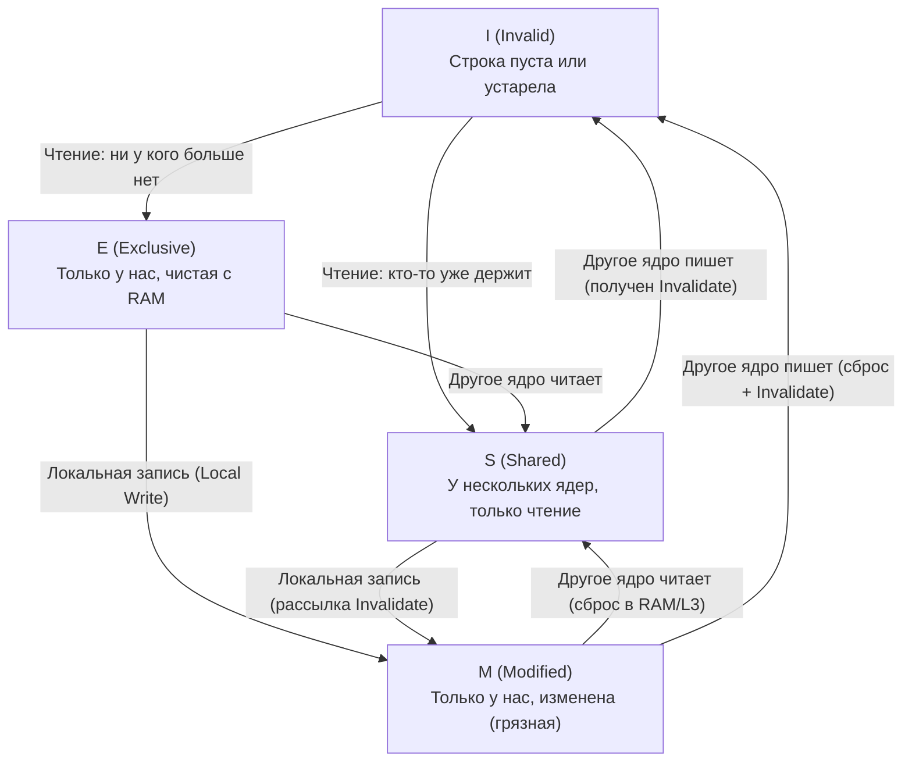

В предыдущих главах ([[18. Кэши CPU. L1, L2, L3 и Cache Line]] и [[19. Ассоциативность кэша, Prefetching и Cache Miss]]) мы подробно изучили, как вычислительное ядро ускоряет свою работу с помощью локального кэша L1. Если бы наш компьютер состоял всего из одного ядра, на этом повествование о кэшах можно было бы триумфально завершить.

Однако эра одноядерных процессоров закончилась еще в середине 2000-х годов, когда инженеры уперлись в так называемую «тепловую стену» (Power Wall). Современные серверы, на которых развернуты наши Go-микросервисы, несут на борту 16, 32, 64, а нередко и 128 физических ядер. Планировщик Go (модель GMP: `G`, `M`, `P`) непрерывно жонглирует тысячами горутин, распределяя их по всем доступным ядрам операционной системы.

И здесь мы сталкиваемся с фундаментальной угрозой для здравого смысла программиста.

Представим элементарный сценарий:
1. Горутина `A` исполняется на Ядре 1. Она читает глобальную переменную `Counter` (изначально равную 0) из оперативной памяти в свой персональный кэш L1.
2. Горутина `B` исполняется на Ядре 2. Она делает то же самое — читает `Counter` в свой локальный кэш L1.
3. Горутина `A` выполняет операцию `Counter++`. Новое значение `1` записывается в кэш L1 Ядра 1.

Что теперь лежит в кэше L1 Ядра 2? Там по-прежнему покоится старое значение `0`! 
Данные в системе рассинхронизировались. Если Ядро 2 прямо сейчас прочитает переменную `Counter`, оно получит устаревший мусор и примет неверное бизнес-решение.

Чтобы этот кошмар не сломал многопоточное программирование, создатели процессоров разработали аппаратный протокол синхронизации, который делает работу распределенных кэшей абсолютно прозрачной для разработчика. Этот фундамент называется **Когерентностью кэшей (Cache Coherence)**.

---

## Аппаратная магия: Протокол MESI

Процессор не позволяет локальным кэшам жить изолированной жизнью. Все кэши L1 и L2 непрерывно связаны высокоскоростными коммуникационными каналами (кольцевой шиной Ring Bus или двумерной сеткой Mesh Interconnect).

Они непрерывно обмениваются служебными сообщениями по протоколам когерентности. Золотым мировым стандартом в процессоростроении стал протокол **MESI** (также известный как протокол Иллинойса).

Название протокола представляет собой акроним четырех дискретных состояний, в которых может находиться каждая 64-байтная кэш-линия:

* **M (Modified — Изменена):**  
  Данная кэш-линия присутствует **только в этом** локальном кэше L1/L2. Текущее ядро изменило её содержимое. Данные в кэше новее, чем в медленной оперативной памяти DRAM. Ядро является единоличным «грязным» владельцем строки (Dirty Owner).
* **E (Exclusive — Эксклюзивна):**  
  Кэш-линия присутствует **только в этом** локальном кэше, но она «чистая» (ее байты на 100% совпадают с данными в оперативной памяти). Ядро может в любой момент записать в неё данные, мгновенно переведя в статус **M**, никого не предупреждая по шине.
* **S (Shared — Общая, разделяемая):**  
  Кэш-линия загружена в локальные кэши сразу нескольких ядер. Данные везде чистые и идентичны оперативной памяти. Любое ядро имеет право молниеносно читать эти байты из своего кэша, но **ни одно ядро не имеет права изменять эту строку без предварительного оповещения остальных**!
* **I (Invalid — Недействительна):**  
  Кэш-линия считается пустой или аннулированной. Данные в ней устарели, так как другое ядро перетерло эту память. Если процессору понадобится этот адрес, он обязан проигнорировать эту строку и запросить ее заново по шине.

### Как это работает в динамике

Вернемся к нашему примеру с горутинами и переменной `Counter`:

1. **Чтение Ядром 1:** Ядро 1 запрашивает строку с адресом `Counter`. Ни в одном другом кэше этой строки нет. Ядро загружает данные, линия помечается как **E (Exclusive)**.
2. **Чтение Ядром 2:** Ядро 2 отправляет в шину запрос на чтение `Counter`. Ядро 1 отслеживает трафик шины (аппаратный механизм *Snooping*). Оно сообщает: «Эта строка есть у меня». Контроллеры обоих ядер переводят свои локальные кэш-линии в статус **S (Shared)**.
3. **Запись Ядром 1 (`Counter++`):** Ядро 1 хочет модифицировать значение. Оно видит, что строка находится в статусе **S**. Процессор аппаратно блокирует запись! 
   - Ядро 1 выставляет на шину широковещательный сигнал: **Invalidate Counter**.
   - Ядро 2 ловит этот сигнал и принудительно переводит статус своей копии в **I (Invalid)**.
   - Ядро 2 возвращает сигнал подтверждения: *Invalidation Acknowledge (ACK)*.
   - Получив ACK, Ядро 1 переводит свою линию в статус **M (Modified)** и перезаписывает байт на значение `1`.

Теперь Ядро 1 владеет самой свежей версией данных. Если Ядро 2 захочет снова прочитать `Counter`, оно обнаружит статус **I (Invalid)**, получит кэш-промах (*Coherence Miss*) и запросит актуальную строку прямо у Ядра 1.

> [!info] Под капотом: Snooping vs Directory
> В потребительских процессорах с числом ядер до 8–10 (например, Intel Core ранних поколений) все ядра объединены единой кольцевой шиной (Ring Bus). Применяется протокол **Snooping (Прослушивание)**: каждый кэш буквально «подслушивает» все широковещательные запросы на шине. 
> 
> Однако в современных серверных процессорах (AMD EPYC, Intel Xeon Scalable), несущих от 64 до 128 ядер, широковещательный шум парализовал бы чип. Там используется **Directory-based Coherence (Каталожная когерентность)**. В кристалле выделяется распределенный аппаратный каталог (Directory), привязанный к кэшу L3. Каталог хранит битовую маску: у каких именно ядер данная строка находится в статусе S или E. Сигнал Invalidate отправляется не всем ядрам подряд, а строго адресно тем узлам, у которых есть эта строка.

---

## Mechanical Sympathy: Цена Invalidate-шторма

Создатели процессоров сотворили чудо: программист на Go может быть уверен, что многоядерный процессор никогда не отдаст устаревшее значение по валидному адресу. Но законы физики обойти нельзя. За эту гарантию приходится платить производительностью.

Сравним стоимость операций:
- **Чтение общих данных (Shared) абсолютно бесплатно:** Если 100 горутин на разных ядрах одновременно читают неизменяемый глобальный конфиг, все их кэши L1 находятся в статусе **S**. Никакого трафика по шине нет, доступ занимает 1 наносекунду.
- **Запись в общую память — колоссальный аппаратный тормоз:**  
  Когда вы вызываете в Go атомарную операцию `atomic.AddInt64(&counter, 1)` или захватываете мьютекс `sync.Mutex`, ядро генерирует инструкцию с префиксом блокировки шины (например, `LOCK XADDQ`). 
  
Ядро обязано разослать Invalidate-сигналы по межъядерной сети, дождаться ответов ACK от всех остальных ядер и только после этого применить запись. Эта процедура занимает от **40 до 80 наносекунд** — за это время конвейер мог бы выполнить сотни полезных инструкций!

### Cache Line Ping-Pong (Пинг-понг кэш-линий)

Если несколько горутин на разных физических ядрах в цикле инкрементируют одну и ту же переменную `counter`, возникает катастрофический сценарий:
1. Ядро 1 объявляет строку `M`, Ядро 2 получает `I`.
2. Через долю наносекунды Ядро 2 хочет записать свое значение: оно шлет Invalidate Ядру 1, заставляя его сбросить статус в `I`, и забирает строку себе в `M`.
3. Ядро 1 тут же делает то же самое в ответ.

Кэш-линия с дикой скоростью мечется между ядрами процессора по межъядерной шине. Процессор тратит 99% тактов не на сложение чисел, а на разрешение конфликтов протокола MESI и ожидание подтверждений ACK. Пропускная способность падает в десятки раз.

> [!tip] Собеседование
> **Вопрос:** В нашей Go-системе используется структура `sync.RWMutex`. У нас запущено 100 горутин, которые исключительно читают данные через `mu.RLock()`, а затем делают `mu.RUnlock()`. Писателей в системе нет вообще. Будет ли пропускная способность линейно расти при увеличении числа процессорных ядер?
> 
> **Ответ:** Нет, при большом количестве ядер система начнет резко деградировать!
> 
> Разберем, что происходит под капотом Go runtime:
> Метод `RLock()` — это не пассивное чтение памяти. Чтобы зарегистрировать нового читателя, рантайм Go выполняет атомарный инкремент внутреннего поля структуры: `atomic.AddInt32(&rw.readerCount, 1)`.
> 
> Атомарный инкремент — это **операция записи**! 
> Все 100 читателей на разных ядрах пытаются непрерывно модифицировать одно и то же 4-байтное поле в памяти. Протокол MESI сходит с ума, генерируя непрерывный Invalidate-шторм для кэш-линии, содержащей `RWMutex`. Кэш-линия начинает неистово метаться между ядрами (Cache Line Ping-Pong).
> 
> Для сверхнагруженных read-only путей классический `sync.RWMutex` является архитектурным антипаттерном. В таких сценариях высококлассные инженеры используют шардированные мьютексы, шардированные счетчики, Copy-On-Write структуры или атомарную подмену указателей через `atomic.Pointer`.

---

## Когерентность vs Консистентность (Память не багует)

Начинающие инженеры часто путают два фундаментальных термина, считая их синонимами. Давайте раз и навсегда разделим их:

| Концепция | За что отвечает | Аппаратный уровень |
|---|---|---|
| **Когерентность (Cache Coherence)** | Поведение **одной ячейки** памяти. Гарантирует, что все ядра видят единую историю изменений по конкретному адресу. Протокол MESI исключает чтение устаревших данных. | 100% реализуется транзисторами кэш-контроллеров процессора. |
| **Консистентность / Модель памяти (Memory Consistency)** | Взаимный порядок операций над **разными переменными** (например, порядок записи во флаг готовности и данные). | Определяется архитектурой процессора (x86 TSO против ARM Weak Ordering) и моделью памяти языка Go. |

Протокол MESI гарантирует: память никогда не «врёт» об одной конкретной переменной. Если Ядро 1 записало число в `counter`, Ядро 2 физически не сможет прочитать старое значение из своего L1.

---

## Итог

1. **Когерентность кэшей (Cache Coherence)** — аппаратная система поддержания синхронности локальных кэшей всех ядер процессора.
2. **Протокол MESI** управляет состояниями 64-байтных строк: **M** (Modified — изменена локально), **E** (Exclusive — только у нас, чистая), **S** (Shared — разделяется, только чтение), **I** (Invalid — аннулирована).
3. **Чтение общих данных** масштабируется великолепно: сотни ядер могут одновременно опрашивать свои L1 со скоростью 1 нс.
4. **Запись в общие данные** порождает межъядерный Invalidate-шторм. Ядро замирает на десятки наносекунд в ожидании подтверждений ACK от остальных ядер.
5. Примитивы синхронизации Go (`sync.Mutex`, `atomic.AddInt64`, счетчик в `sync.RWMutex`) внутри выполняют запись, провоцируя переход линий в статус Modified и вызывая эффект **Cache Line Ping-Pong**.

Но протокол MESI скрывает еще более опасную ловушку. Он оперирует не отдельными переменными вроде `int32` или `bool`, а **целыми 64-байтными кэш-линиями**. 

Что произойдет, если Ядро 1 пишет в переменную `A`, а Ядро 2 пишет в совершенно не связанную переменную `B`, но компилятор разместил их в памяти бок о бок в пределах одних и тех же 64 байт? Процессор посчитает, что ядра конфликтуют за один ресурс, и уничтожит производительность вашего параллельного кода!

С этим коварнейшим эффектом мы встретимся лицом к лицу в следующей главе: [[21. False Sharing и Cache Line Contention]].