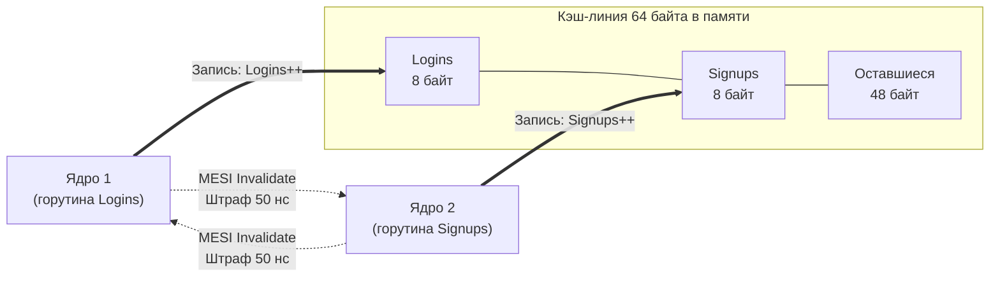

В предыдущей главе ([[20. Многоядерные процессоры и Cache Coherence]]) мы восхищались работой протокола MESI: аппаратная логика процессора берет на себя заботу о синхронизации локальных кэшей всех ядер, исключая чтение устаревших данных. Стоит одному ядру обновить переменную, как контроллер рассылает сигнал Invalidate, сбрасывая копии в остальных кэшах L1/L2.

Но именно здесь инженеров подстерегает одна из самых коварных аппаратных ловушек в мире параллельных вычислений.

Протокол MESI ничего не знает о типах данных языка Go. Он не оперирует переменными `int32`, `uint64` или отдельными полями структур. Аппаратный квант работы кэш-памяти — это монолитная **кэш-линия размером 64 байта**.

Если два независимых ядра одновременно модифицируют разные переменные, которые случайно оказались соседями в пределах одних и тех же 64 байт, железо считает, что они непрерывно отбирают друг у друга всю строку целиком. Это явление называется **Ложным разделением (False Sharing)** или **конфликтом за кэш-линию (Cache Line Contention)**.

---

## Что такое False Sharing?

Представьте классическую структуру в Go, собирающую ключевые бизнес-метрики вашего бэкенда:

```go
package main

type Metrics struct {
	Logins  uint64 // 8 байт
	Signups uint64 // 8 байт
}
```

Суммарный размер структуры `Metrics` составляет всего 16 байт. Она с запасом укладывается в одну 64-байтную кэш-линию (остальные 48 байт остаются свободными).

Представим систему с несколькими физическими ядрами:
* Горутина на **Ядре 1** непрерывно инкрементирует `Logins` (обрабатывая входящий поток авторизаций).
* Горутина на **Ядре 2** непрерывно инкрементирует `Signups` (обрабатывая поток новых регистраций).

С точки зрения логики Go-программы (софта), эти две горутины **абсолютно независимы**. Они не трогают общие переменные. Им не нужны мьютексы `sync.Mutex`. Детектор гонок Go (`go test -race`) благосклонно промолчит и подтвердит: гонок данных нет! Разработчик уверен, что написал идеальный масштабируемый конкурентный код.

Но на уровне физического кремния разворачивается настоящая драма:



1. Ядро 1 читает поле `Logins` и затягивает **всю 64-байтную кэш-линию** в свой кэш L1 в статусе Exclusive (E).
2. Ядро 2 хочет инкрементировать `Signups`. Оно запрашивает ту же самую кэш-линию по шине. Линия переходит в статус Shared (S) в кэшах обоих ядер.
3. Ядро 1 выполняет операцию `Logins++`. Поскольку строка находится в статусе Shared, писать напрямую нельзя! Ядро 1 рассылает широковещательный сигнал Invalidate Ядру 2, переводя свою строку в Modified (M) и затирая локальную копию Ядра 2 в Invalid (I).
4. В следующую же наносекунду Ядро 2 пытается выполнить `Signups++`. Но его локальная строка аннулирована! Ядро 2 ловит кэш-промах (*Coherence Miss*), блокирует конвейер на 50 наносекунд, вытягивает актуальную строку у Ядра 1 и в ответ шлет Invalidate Ядру 1, сбрасывая его кэш!

Этот бесконечный замкнутый круг называется **Cache Line Ping-Pong (Пинг-понг кэш-линии)**.
Горутины логически не имеют ничего общего, но процессор вынужден сериализовать их работу через медленную межъядерную шину. Ядра процессора загружены на 100%, но тратят 99% тактов на пересылку служебных сигналов протокола MESI, а не на сложение чисел. Производительность многопоточного сервиса катастрофически падает.

---

## Разрушители кэша: Слайсы метрик

Вторая классическая ошибка, на которую регулярно попадаются инженеры при попытке устранить блокировки в многопоточном коде, — создание локальных счетчиков для каждого воркера:

```go
package main

// Массив счетчиков, по одному на каждого воркера
// Предполагаем, что GOMAXPROCS = 8
counters := make([]int64, 8) 

for i := 0; i < 8; i++ {
	go func(workerID int) {
		for {
			// Воркер пишет ТОЛЬКО в свой личный индекс.
			// Никаких мьютексов!
			counters[workerID]++ 
		}
	}(i)
}
```

Разработчик рассуждает: *«Я полностью исключил contention! Каждый воркер пишет строго в свою ячейку `counters[workerID]`, они никак не пересекаются!»*

А теперь посмотрим на память глазами контроллера кэша:
- Тип `int64` занимает ровно 8 байт.
- Срез из восьми элементов `int64` занимает: $8 \times 8 = \mathbf{64\text{ байта}}$.
- **Все 8 независимых счетчиков лежат в одной-единственной кэш-линии!**

Когда 8 потоков на 8 разных физических ядрах начинают в плотном цикле инкрементировать свои персональные счетчики, шина процессора захлебывается в непрерывном шторме Invalidate-сообщений (Cache Line Contention). Парадокс в том, что этот «параллельный» код на 8 ядрах будет работать **в несколько раз медленнее**, чем если бы все вычисления выполнялись в одном потоке на одном-единственном ядре!

> [!info] Под капотом
> Аппаратные профилировщики в Linux (в частности, утилита `perf c2c` — Cache-to-Cache) специально созданы для обнаружения False Sharing. 
> Они анализируют счетчики производительности CPU (PMU) на события **HITM (Hit Modified)**. Событие HITM фиксируется, когда ядро запрашивает данные, а они находятся в состоянии Modified (M) в кэше L1/L2 соседнего ядра, требуя дорогостоящей пересылки по шине. Если отчет `perf c2c` показывает высокий процент HITM на адресах структуры, которая не защищена мьютексом и логически независима — перед вами классический False Sharing.

---

## Mechanical Sympathy: Решение через Padding

Чтобы раз и навсегда устранить Ложное разделение, нужно физически растащить независимые переменные по разным кэш-линиям.
Для этого между переменными в структуру искусственно внедряют пустые байты — эта фундаментальная техника называется **Padding (Выравнивающее дополнение)**.

### Способ 1: Ручной паддинг

Мы можем вручную вставить массив пустых байт, чтобы следующая переменная перешагнула 64-байтную границу:

```go
package main

type PaddedMetrics struct {
	Logins  uint64
	// Вставляем 56 пустых байт (64 - 8). 
	// Теперь следующая переменная гарантированно начнется в новой кэш-линии.
	_       [56]byte 
	Signups uint64
}
```

### Способ 2: Идиоматичный Go (sys/cpu)

В репозитории расширений стандартной библиотеки Go есть пакет `golang.org/x/sys/cpu`, в котором объявлен специальный платформенно-независимый тип `cpu.CacheLinePad`.
Под капотом это простая структура с массивом: `struct{ _ [64]byte }` (или размер, соответствующий целевой архитектуре).

```go
package main

import "golang.org/x/sys/cpu"

type Metrics struct {
	Logins  uint64
	_       cpu.CacheLinePad // Жесткий барьер между кэш-линиями
	Signups uint64
}
```

Теперь переменная `Logins` занимает первые 8 байт кэш-линии №1. Поле `_ cpu.CacheLinePad` занимает полные 64 байта, создавая буферную зону. Переменная `Signups` гарантированно начинается в следующей кэш-линии.

Ядро 1 и Ядро 2 больше не конфликтуют на уровне кремния: их локальные кэши находятся в состоянии Modified независимо друг от друга, MESI-шторм затихает, а скорость работы параллельного кода возрастает в разы!

> [!tip] Собеседование
> **Вопрос:** Если паддинг так радикально ускоряет работу независимых переменных, почему компилятор Go не вставляет `[64]byte` между всеми полями структур автоматически?
> 
> **Ответ:** Автоматический паддинг уничтожил бы пространственную локальность (Spatial Locality) и привел бы к катастрофической фрагментации памяти!
> 
> Как мы выяснили в [[18. Кэши CPU. L1, L2, L3 и Cache Line]], в 99% случаев мы стремимся упаковать данные как можно плотнее. Если горутина читает структуру пользователя `User`, мы хотим, чтобы поля `User.Name` и `User.Age` лежали рядом и загрузились в L1-кэш за один-единственный Cache Miss. 
> Паддинг необходим **только и исключительно для разделения горячих изменяемых переменных (Hot Variables)**, которые постоянно и конкурентно перезаписываются разными физическими ядрами. Бездумное использование паддинга раздует структуры, вымоет полезные данные из L1-кэша и перегрузит контроллер памяти.

---

## Как False Sharing решен в исходниках Go

Создатели рантайма Go досконально понимают архитектуру кэшей. Внутренности стандартной библиотеки Go представляют собой энциклопедию применения принципа Mechanical Sympathy.

### 1. Архитектура sync.Pool

Популярный тип `sync.Pool` проектировался для минимизации конкуренции между горутинами. Рантайм создает персональный локальный пул для каждого логического процессора `P` (из модели GMP).

Взглянем на реальный исходный код рантайма:

```go
// Упрощенный код из src/sync/pool.go
type poolLocal struct {
	poolLocalInternal

	// Дополняем до 128 байт, чтобы предотвратить False Sharing.
	// Используем 128 байт, потому что аппаратные предвыборщики (Prefetchers)
	// часто тянут по две кэш-линии (64 + 64) за раз!
	pad [128 - unsafe.Sizeof(poolLocalInternal{})%128]byte
}
```

Обратите внимание на магическую константу **128 байт**! Казалось бы, размер кэш-линии равен 64 байтам — зачем раздувать паддинг в два раза сильнее?

Ответ кроется в работе аппаратного предвыборщика (**Prefetcher**), о котором мы говорили в [[19. Ассоциативность кэша, Prefetching и Cache Miss]]. Современные процессоры Intel Core и AMD Ryzen оснащены агрессивными блоками Spatial Prefetcher, которые при обращении к четной кэш-линии автоматически тянут из памяти соседнюю нечетную кэш-линию парами (по 128 байт суммарно). Если бы паддинг составлял ровно 64 байта, предвыборщик захватил бы соседний локальный пул другого ядра и все равно спровоцировал бы False Sharing! Двойной паддинг в 128 байт гарантирует абсолютную изоляцию.

### 2. Пакет math/rand/v2

Долгое время глобальный генератор случайных чисел в пакете `math/rand` был узким местом высоконагруженных бэкендов: вызов `rand.Int()` захватывал глобальный мьютекс, вызывая чудовищную конкуренцию за память.

В современном Go 1.22+ в пакете `math/rand/v2` архитектуру переработали: теперь каждый логический процессор `P` имеет собственное локальное состояние псевдослучайного генератора. Данные разнесены с учетом размера кэш-линий и паддингов, благодаря чему конкурентные вызовы `rand.Int()` на десятках ядер масштабируются линейно без единой взаимной блокировки.

---

## Итог

1. **False Sharing (Ложное разделение)** возникает тогда, когда разные ядра процессора конкурентно модифицируют независимые переменные, случайно оказавшиеся в пределах одной 64-байтной кэш-линии.
2. Протокол MESI работает на уровне строк кэша, поэтому любое обновление приводит к аннулированию всей линии у соседних ядер, порождая эффект **Cache Line Ping-Pong**.
3. Массивы счетчиков (например, слайс `counters := make([]int64, 8)`) без разделения — хрестоматийный пример антипаттерна, замедляющего параллельный код.
4. **Лекарство от False Sharing — Padding:** физическое разнесение горячих полей структур с помощью фиктивных байтов `_ [56]byte` или стандартного разделителя `cpu.CacheLinePad`.
5. В критических компонентах рантайма (как в `sync.Pool`) размер паддинга увеличивают до **128 байт**, чтобы нейтрализовать спаренные запросы аппаратных предвыборщиков (Prefetchers).

Мы увидели, насколько тонко переплетены протоколы когерентности и раскладка байт в памяти. Протокол MESI гарантирует актуальность значений.
Однако он **не дает никаких гарантий относительно порядка**, в котором соседние ядра увидят последовательность независимых записей! 

Почему процессор имеет право переставить инструкции `Write A` и `Write B` местами, как спекулятивное исполнение разрушает наивную синхронизацию флагов, и что такое Модель Памяти?

Ответы ждут нас в следующей фундаментальной главе: [[22. Memory Ordering и CPU Memory Model]].