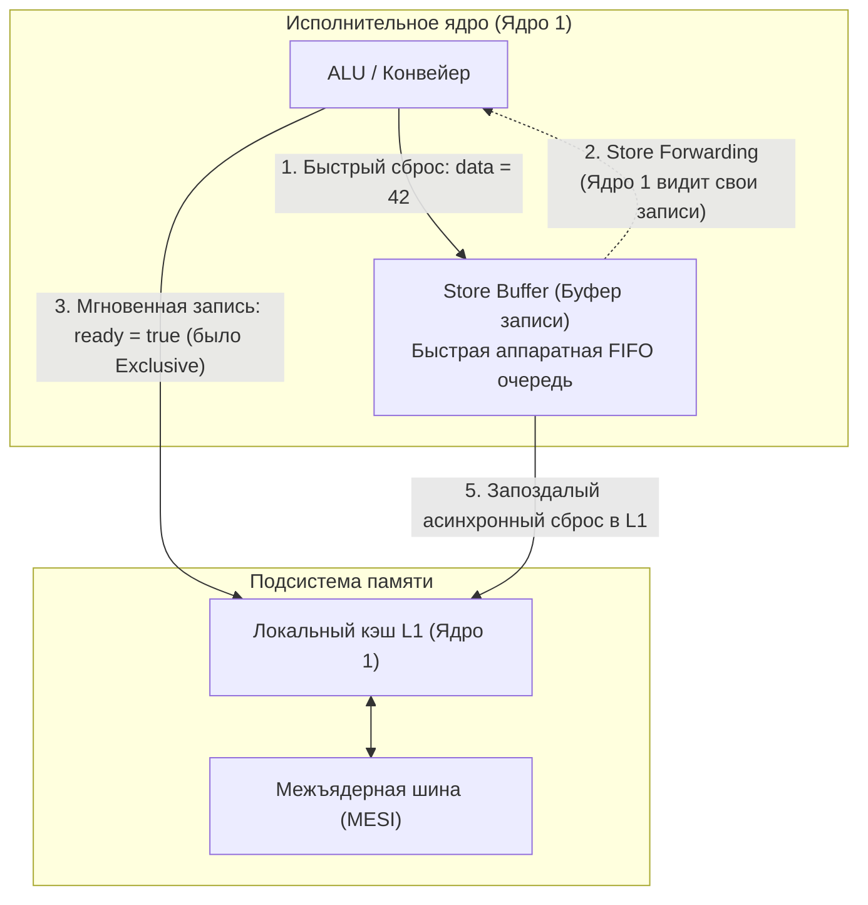

В предыдущей главе ([[21. False Sharing и Cache Line Contention]]) мы познакомились с аппаратным протоколом MESI, обеспечивающим когерентность кэшей. Если Ядро 1 изменило значение по некоторому адресу в памяти, протокол гарантирует, что Ядро 2 рано или поздно обязательно увидит именно это новое значение, а не устаревший мусор.

Но здесь инженеров подстерегает грандиозная иллюзия, на которой спотыкаются многие разработчики при переходе от классических мьютексов к конкурентному lock-free программированию.

Протокол когерентности кэшей гарантирует актуальность значения *одной конкретной ячейки*. **Однако он ничего не говорит о том, в каком ПОРЯДКЕ другие ядра увидят последовательность изменений нескольких независимых переменных!**

И компилятор Go при оптимизации машинного кода, и сам процессор в процессе исполнения имеют законное право переставлять инструкции записи и чтения местами. Это явление регулируется фундаментальной концепцией — **Memory Ordering (Порядок доступа к памяти)** и **Моделью памяти процессора (CPU Memory Model)**.

---

## Иллюзия последовательного исполнения

Когда мы пишем программу на экране редактора или читаем чужой код сверху вниз, наш разум находится в плену естественной интуиции: строка 2 обязана выполниться строго после завершения строки 1. Эта идеализированная картина мира в науке называется **Последовательной согласованностью (Sequential Consistency)**, описанной Лесли Лампортом еще в 1979 году.

Взглянем на классический паттерн передачи сообщений между двумя параллельными горутинами без использования мьютексов (Message Passing):

```go
package main

import "fmt"

var data int
var ready bool

// Горутина 1 (Писатель - Ядро 1)
func producer() {
	data = 42    // Операция A: подготовили полезные данные
	ready = true // Операция B: подняли флаг готовности
}

// Горутина 2 (Читатель - Ядро 2)
func consumer() {
	for !ready { // Операция C: крутимся (spin-wait), пока ready != true
		// ждем
	}
	fmt.Println(data) // Операция D: читаем data
}
```

С точки зрения человеческой логики сценарий безупречен:
1. Писатель записывает число `42` в переменную `data`.
2. Писатель выставляет флаг `ready = true`.
3. Читатель дожидается появления флага `ready` и радостно считывает `data`.

Кажется очевидным, что читатель обязан напечатать `42`.
**Может ли этот код вывести 0?**

Ответ поражает: **Да, этот код может вывести 0.** И это не дефект микросхемы и не случайная ошибка транслятора. Это строгое следствие архитектурных оптимизаций компилятора и кремния.

---

## Почему происходит Reordering (Переупорядочивание)?

Перестановка операций чтения и записи (Memory Reordering) происходит на двух совершенно независимых уровнях архитектуры.

### 1. Оптимизация компилятора

Компилятор Go при генерации промежуточного SSA-представления анализирует функцию `producer()`. 
Переменная `data` и переменная `ready` расположены по разным адресам в памяти и логически никак не связаны между собой по данным (здесь нет зависимости вида `data = 42; data = data + 1`). 

Ради экономии регистров процессора или уменьшения размера генерируемого кода компилятор имеет полное право поменять инструкции местами и сгенерировать ассемблер, где флаг `ready = true` поднимается **до** того, как число `42` запишется в `data`!

### 2. Аппаратная перестановка (Hardware Reordering) и Store Buffer

Но предположим, что мы отключили все оптимизации компилятора или написали функцию на строгом ассемблере, сохранив порядок инструкций. Код все равно разрушится на уровне физического кремния!

Вспомним физику записи из статьи [[20. Многоядерные процессоры и Cache Coherence]]. Чтобы записать `data = 42`, ядру процессора требуется получить эксклюзивный доступ к кэш-линии (состояние M протокола MESI). Если эта линия находится в состоянии Shared или вовсе отсутствует в кэше ядра, процессор обязан отправить сигнал Invalidate и замереть на 40–80 наносекунд в ожидании ответов по шине.

Современный процессор, работающий на частоте 4 ГГц, физически не может позволить себе стоять без дела. 
Поэтому инженеры встроили между исполнительным ядром и кэшем L1 специальную аппаратную очередь — **Store Buffer (Буфер записи)**.



**Анатомия скрытой катастрофы:**
1. Ядро 1 исполняет `data = 42`. Кэш-линия с переменной `data` отсутствует в кэше L1. Процессор не ждет! Он сбрасывает пару «адрес-значение» в **Store Buffer** и мгновенно переходит к следующей инструкции.
2. Ядро 1 исполняет `ready = true`. Кэш-линия с переменной `ready` случайно уже находится в его локальном кэше L1 в состоянии Exclusive (E). Процессор мгновенно пишет `true` прямо в кэш L1!
3. Ядро 2 на соседнем кристалле опрашивает переменную `ready`. По шине MESI оно немедленно получает актуальное значение `true` из кэша Ядра 1.
4. Горутина на Ядре 2 выходит из цикла ожидания `for !ready` и читает переменную `data`.
5. Но значение `42` всё еще томится в очереди **Store Buffer** Ядра 1 — оно еще физически не сброшено в кэш L1!
6. Ядро 2 загружает старую кэш-линию `data` из памяти, видит начальный **0** и выводит его в терминал!

С точки зрения внешнего наблюдателя Ядро 1 выполнило инструкции задом наперед. При этом само Ядро 1 не видит никакой проблемы, так как механизм **Store Forwarding** позволяет ему локально читать значения из собственного Store Buffer еще до их попадания в кэш.

---

## Memory Models: x86-64 против ARM64

Правила, разрешающие процессору выполнять перестановки, строго специфицированы в его **Аппаратной модели памяти (CPU Memory Model)**. Разные микроархитектуры предлагают разную степень свободы для Out-of-Order оптимизаций.

> [!tip] Собеседование
> **Вопрос:** Компания перенесла критический Go-сервис с x86-серверов Intel на ARM64-инстансы AWS Graviton (или локальные ноутбуки Apple Silicon с чипами M-серии, например Apple M3). Код компилируется без замечаний, но в продакшене начали эпизодически возникать необъяснимые плавающие сбои данных, которых никогда не было на Intel. В чем первопричина?
> 
> **Ответ:** Причина кроется в смене аппаратной модели памяти с «Сильной» на «Слабую». В коде изначально присутствовали гонки данных (Data Races), но архитектура x86 аппаратно скрывала эту ошибку за счет строгих гарантий порядка, в то время как процессор ARM64 безжалостно обнажил некорректную синхронизацию.

### 1. Сильная модель (Strong Memory Model) — x86-64 (Intel / AMD)

Архитектура x86-64 придерживается модели **TSO (Total Store Order)**. 
Это крайне консервативная, строгая модель:
* **ЗАПРЕЩЕНЫ** перестановки между двумя чтениями (**Load-Load**).
* **ЗАПРЕЩЕНЫ** перестановки между двумя записями (**Store-Store**).
* **ЗАПРЕЩЕНЫ** перестановки чтения перед предшествующей записью (**Load-Store**).

Единственная аппаратная вольность, разрешенная в x86 TSO — это задержка записи в Store Buffer относительно последующего чтения (**Store-Load**). 

Именно поэтому наивный код `producer / consumer` на процессорах Intel x86 часто чудом работает правильно (если компилятор не переставил инструкции), маскируя грубейшую ошибку проектирования.

### 2. Слабая модель (Weak Memory Model) — ARM64 (Apple Silicon, Graviton)

Архитектура ARM64 проектировалась с прицелом на предельную энергоэффективность и максимальный параллелизм.
Здесь царствует **Weak Memory Ordering**:
* Разрешены **ЛЮБЫЕ** перестановки независимых инструкций: **Load-Load**, **Store-Store**, **Load-Store** и **Store-Load**!

Процессор ARM64 отправляет независимые чтения и записи в память в том порядке, который наиболее выгоден его конвейеру и контроллеру кэша в текущую наносекунду. На машинах с Apple M3 или серверах AWS Graviton наивный код `producer / consumer` будет выдавать нули регулярно.

---

## Go Memory Model (Модель памяти Go)

Неужели программист на Go обязан держать в голове нюансы поведения микроархитектур x86, ARM, RISC-V и MIPS?

К счастью, нет! Создатели Go избавили нас от этого кошмара, разработав формальную **Модель памяти языка Go (The Go Memory Model)** (существенно уточненную Рассом Коксом в версиях Go 1.19+).

Вы пишете код для абстрактной виртуальной машины Go. А компилятор берет на себя рутину: на процессорах x86 он опустит лишние инструкции, а на ARM64 автоматически встроит специальные инструкции аппаратных барьеров (Memory Barriers / Fences), связывающие руки ретивому кремнию.

Фундаментом модели памяти Go является строгое математическое отношение частичного порядка: **Happens-Before (Происходит-До)**.

> **Священное правило Модели Памяти Go:**  
> Если операция записи $A$ гарантированно *Happens-Before* операции чтения $B$, то операция $B$ обязана увидеть результат операции $A$ (или результат более поздней записи).
> Если между операцией записи и операцией чтения нет связи *Happens-Before*, они выполняются **конкурентно**, и результат чтения не определен (это классический **Data Race**).

### Как создать связь Happens-Before в Go?

Язык Go предоставляет исчерпывающий набор высокоуровневых гарантий:

1. **Последовательный код:** В рамках одной горутины инструкции логически выполняются строго в порядке их написания (хотя компилятор может их переставлять, наблюдаемый эффект внутри горутины всегда эквивалентен последовательному).
2. **Инициализация:** Функция `init()` импортируемого пакета *Happens-Before* начала выполнения функции `main.main()`.
3. **Запуск горутины:** Вызов `go f()` *Happens-Before* начала выполнения тела функции `f()`.
4. **Синхронизация через каналы (Channels):**
   - Отправка элемента в канал *Happens-Before* завершения приема этого элемента из канала.
   - Закрытие канала *Happens-Before* возврата нулевого значения читателю.
5. **Мьютексы (`sync.Mutex`):** Вызов `Unlock()` на мьютексе *Happens-Before* завершения любого последующего вызова `Lock()` на том же мьютексе.
6. **Атомики (`sync/atomic`):** Начиная с Go 1.19, операции пакета `sync/atomic` обладают семантикой последовательной согласованности (Sequential Consistency) и создают строгие ребра в графе *Happens-Before*.

Перепишем наш алгоритм корректно, используя идиоматичный канал:

```go
package main

import "fmt"

var data int
var ready = make(chan struct{}) // Канал выступает барьером синхронизации

func producer() {
	data = 42           // Операция A
	ready <- struct{}{} // Операция B (отправка в канал)
}

func consumer() {
	<-ready           // Операция C (чтение из канала)
	fmt.Println(data) // Операция D (чтение data)
}
```

Разберем цепь причинно-следственных связей:
* Операция A *Happens-Before* операции B (порядок внутри горутины писателя).
* Операция B *Happens-Before* операции C (правило отправки и приема из канала).
* Операция C *Happens-Before* операции D (порядок внутри горутины читателя).
* **Транзитивность:** Операция A гарантированно *Happens-Before* операции D!

Компилятор Go видит использование канала и на процессоре ARM64 генерирует нужные аппаратные инструкции барьеров памяти. Программа со 100% гарантией выведет число `42` на любом железе в мире.

> [!warning] Ловушка / Gotcha: Ложное чувство безопасности
> Многие начинающие разработчики считают: «Если я запускаю код и тесты с флагами `go test -race` или `go run -race` и детектор молчит — мой самописный lock-free алгоритм идеален».
> Это опаснейшее заблуждение! Race Detector отслеживает нарушения отношений *Happens-Before* в рантайме Go. Но он не может моделировать все тонкости спекулятивного исполнения и задержек в аппаратном **Store Buffer** конкретного процессора при нетривиальном планировании горутин. Пытаясь писать самодельные неблокирующие структуры без глубокого понимания модели памяти, вы вступаете в зыбкую трясину трудноуловимых гейзенбагов.

---

## Итог

1. **Memory Ordering** регулирует допустимые перестановки операций чтения и записи компилятором и процессором ради достижения максимальной скорости.
2. **Store Buffer** — скоростной FIFO-буфер процессора, позволяющий ядру не ждать сброса записей в кэш. Именно он приводит к тому, что соседние ядра видят результаты записей с непредсказуемой задержкой.
3. Процессоры различаются моделями памяти: **x86-64** использует строгую модель **TSO** (запрещая почти все перестановки кроме Store-Load), а **ARM64** реализует слабую модель (**Weak Ordering**), переставляя инструкции с максимальной свободой.
4. В коде на Go правилом синхронизации является **Go Memory Model** и отношение **Happens-Before**.
5. Использование каналов, мьютексов (`sync.Mutex`), групп ожидания (`sync.WaitGroup`) и атомиков (`sync/atomic`) инструктирует компилятор генерировать правильные платформенные барьеры, принуждающие процессор соблюдать порядок.

Но какие именно машинные инструкции заставляют своенравный ARM или x86 зафиксировать порядок памяти? Что такое атомарные операции на уровне кремния и как инструкция Compare-And-Swap (CAS) позволяет обновлять данные без тяжелых мьютексов операционной системы?

Об этом читайте в следующей главе: [[23. Атомарные операции. CAS, Compare And Swap, Fetch And Add]].