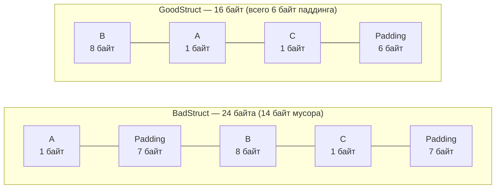

В предыдущих главах (в частности, в [[24. Барьеры памяти. Memory Fence, Acquire, Release]]) мы оперировали абстрактными одиночными переменными, наблюдая за тем, как их поведение дисциплинируют компилятор и аппаратные барьеры. 

Однако в реальном коде на Go переменные редко живут поодиночке. Мы группируем их в структуры данных — `struct`.

На первый взгляд кажется, что структура — это элементарный контейнер: сложили три переменной, сложили размеры их типов и получили итоговый размер объекта в памяти. 
Но попробуйте объявить в Go структуру `struct { a bool; b int64; c bool }`:
```go
type Sample struct {
    a bool  // 1 байт
    b int64 // 8 байт
    c bool  // 1 байт
}
```
Арифметика начальной школы подсказывает ответ: $1 + 8 + 1 = 10\text{ байт}$.
Однако функция `unsafe.Sizeof(Sample{})` ошарашит вас вердиктом: **24 байта**!

Куда делись еще 14 байт? Компилятор Go намеренно раздул вашу структуру мусорными байтами. 

Чтобы понять, почему он это сделал, и почему небрежное проектирование структур способно в два раза увеличить расходы на серверную оперативную память и вдвое снизить пропускную способность кэша L1, нам нужно исследовать феномен **Аппаратного выравнивания данных (Data Alignment)**.

---

## Механика железа: Почему процессоры ненавидят невыровненные данные

В учебниках по программированию оперативную память часто изображают в виде длинной ленты из отдельных байтов, где каждый байт имеет свой порядковый номер: 0, 1, 2, 3, 4...

Но с точки зрения контроллера памяти и кремниевой шины процессора память устроена иначе. Физическая шина данных современного 64-битного процессора имеет ширину в **8 байт (64 бита)**. Процессор забирает данные из кэша и памяти не побайтово, а целыми «машинными словами», адреса которых строго кратны 8: `0x00`, `0x08`, `0x10`, `0x18` и так далее.

```
Выровненная память (машинные слова по 8 байт):
Слово 0: [0x00] [0x01] [0x02] [0x03] [0x04] [0x05] [0x06] [0x07]  <── 1 чтение
Слово 1: [0x08] [0x09] [0x0A] [0x0B] [0x0C] [0x0D] [0x0E] [0x0F]  <── 1 чтение

Невыровненный int64 (начиная с адреса 0x03):
Слово 0: [ .  ] [ .  ] [ .  ] [ D0 ] [ D1 ] [ D2 ] [ D3 ] [ D4 ]  <── Первое чтение + сдвиг
Слово 1: [ D5 ] [ D6 ] [ D7 ] [ .  ] [ .  ] [ .  ] [ .  ] [ .  ]  <── Второе чтение + маска + склейка!
```

Представьте, что 8-байтное число типа `int64` расположилось в памяти по невыровненному адресу — например, начиная с адреса `0x03`.

В этом случае число оказывается разорванным пополам: 5 его байтов попадают в машинное слово `0x00`, а оставшиеся 3 байта — в машинное слово `0x08`. А если адрес пришелся на границу 64-байтной кэш-линии (о которых мы говорили в [[18. Кэши CPU. L1, L2, L3 и Cache Line]]), то половинки числа окажутся в двух разных кэш-линиях!

Чтобы прочитать такое невыровненное значение, процессор вынужден проделать тяжелую работу:
1. Запросить из кэша первое машинное слово по адресу `0x00`.
2. Запросить второе машинное слово по адресу `0x08`.
3. Применить побитовые маски и сдвиги, чтобы отсечь лишние байты.
4. Склеить две половины в один 64-битный регистр.

На процессорах архитектуры x86-64 контроллер выполняет эту операцию аппаратно, но вы платите за это штрафом производительности (**Unaligned Access Penalty**). На многих процессорах ARM или RISC-V невыровненный доступ к памяти аппаратно запрещен: процессор мгновенно вызовет аппаратное прерывание шины (*Bus Error* / `SIGBUS`), и программа с позором аварийно завершится.

---

## Padding (Заполнение): Компромисс компилятора

Чтобы процессор всегда работал на пике скорости и никогда не спотыкался о разорванные слова, компилятор Go неукоснительно соблюдает **Правила аппаратного выравнивания (Alignment Rules)**:

- Значение размером 1 байт (`byte`, `bool`, `int8`) может лежать по **любому** адресу (кратно 1).
- Значение размером 2 байта (`int16`, `uint16`) обязано лежать по адресам, **кратным 2**.
- Значение размером 4 байта (`int32`, `float32`) обязано лежать по адресам, **кратным 4**.
- Значение размером 8 байт (`int64`, `float64`, указатель в 64-битной системе) обязано лежать по адресам, **кратным 8**.

Когда компилятор конструирует структуру, он размещает её поля строго в том порядке, в котором их объявил программист. Если очередное поле не попадает на адрес, кратный его размеру, компилятор молча заполняет пустоту фиктивными байтами — этот механизм называется **Padding (Выравнивающее заполнение)**.

```go
package main

import (
	"fmt"
	"unsafe"
)

type BadStruct struct {
	A bool  // 1 байт.  Смещение в структуре: 0.
	        // Следующее поле int64 требует адреса, кратного 8!
	        // Компилятор вставляет 7 байт мусора (Padding)!
	B int64 // 8 байт.  Смещение в структуре: 8. Занимает байты 8..15.
	C bool  // 1 байт.  Смещение в структуре: 16.
	        // Хвостовой паддинг: 7 байт! Занимает байты 17..23.
}

func main() {
	fmt.Printf("Размер BadStruct: %d байт\n", unsafe.Sizeof(BadStruct{}))
	// Напечатает: 24 байта!
}
```

> [!tip] Собеседование
> **Вопрос:** В структуре `BadStruct` последнее поле `C` занимает 1 байт. Суммарно данные занимают 17 байт (с 0 по 16). Зачем компилятор добавляет еще 7 байт мусора в самом конце структуры, доводя размер до 24 байт? Ведь после `C` никаких полей больше нет!
> 
> **Ответ:** Это фундаментальное требование для корректной работы массивов и слайсов. 
> Размер любого типа в Go (Size) обязан быть строго кратен его **максимальному выравниванию** (Alignment). В нашей структуре максимальное выравнивание задается полем `B` (`int64`, выравнивание 8 байт). 
> Представьте, что мы создали срез `[]BadStruct`. Первый элемент начинается с адреса 0. Если бы структура занимала 17 байт, то второй элемент массива начался бы с адреса 17! В этом случае поле `B` второго элемента попало бы на адрес $17 + 8 = 25$ — некратный 8. Все элементы массива, кроме первого, оказались бы невыровненными! Поэтому компилятор всегда добивает хвост структуры паддингом до кратности максимальному полю.

---

## Struct Layout: Как писать правильно

Зная законы выравнивания, инженер может существенно сэкономить память без изменения бизнес-логики программы. Для этого достаточно оптимизировать порядок объявления полей.

Золотое правило раскладки структур (Struct Layout):  
> **Сортируйте поля структуры по убыванию их размера:**  
> сначала 8-байтные поля (указатели, `int64`, `float64`), затем 4-байтные (`int32`), затем 2-байтные (`int16`) и в самом конце — 1-байтные (`bool`, `byte`).

Перепишем нашу структуру:

```go
package main

import (
	"fmt"
	"unsafe"
)

type GoodStruct struct {
	B int64 // 8 байт. Смещение: 0..7
	A bool  // 1 байт. Смещение: 8
	C bool  // 1 байт. Смещение: 9
	        // 6 байт хвостового паддинга для массива.
}

func main() {
	fmt.Printf("Размер GoodStruct: %d байт\n", unsafe.Sizeof(GoodStruct{}))
	// Напечатает: 16 байт вместо 24!
}
```



### Mechanical Sympathy: Плотность кэша L1

Экономия 8 байт на одной структуре может показаться незначительной мелочью. Но в высоконагруженных бэкендах данные обрабатываются коллекциями.

Если ваш сервис загружает из PostgreSQL или генерирует в памяти слайс на 10 миллионов записей `[]User`, плохой порядок полей приведет к перерасходу:
$$10\,000\,000 \times 8\text{ байт} = 80\text{ Мегабайт памяти впустую!}$$

Но финансовые затраты на RAM — лишь верхушка айсберга. Главный урон наносится кэш-памяти процессора:
- Размер аппаратной кэш-линии равен **64 байтам**.
- В одну кэш-линию помещается ровно **4** объекта `GoodStruct` ($4 \times 16 = 64$).
- Но в ту же самую кэш-линию поместится только **2** объекта `BadStruct` ($24 + 24 = 48$, оставшиеся 16 байт линии пропадают зря).

**Итог:** при обходе среза с плохой раскладкой полей процессор будет генерировать **в 2 раза больше Cache Misses**, заставляя вычислительные ядра простаивать в ожидании медленной памяти DRAM в два раза дольше!

---

## Ловушки и корнер-кейсы в Go

Язык Go таит несколько любопытных архитектурных особенностей, связанных с выравниванием, о которых обязан помнить проектировщик систем.

### 1. Пустая структура (Empty Struct) в конце

Пустая структура `struct{}` имеет размер строго 0 байт. Это излюбленный инструмент разработчиков на Go для создания множеств (`map[string]struct{}`) и каналов уведомлений (`chan struct{}`).

Но если поле типа `struct{}` оказывается **самым последним полем** в структуре, происходит нечто неожиданное: оно раздувает структуру!

```go
package main

import (
	"fmt"
	"unsafe"
)

type User struct {
	Age int64
	Set struct{} // Если поле последнее, структура займет 16 байт!
}

func main() {
	fmt.Println(unsafe.Sizeof(User{})) // Выведет: 16 байт!
}
```

> [!warning] Ловушка / Gotcha: Спасение Garbage Collector'а
> Почему поле с нулевым размером увеличивает размер структуры на 8 байт (1 байт фиктивного размера + 7 байт хвостового паддинга)?
> 
> Ответ кроется в архитектуре сборщика мусора Go (Garbage Collector).
> Если бы поле `struct{}` в конце `User` имело размер 0 байт, то указатель на него (например, выражение `&user.Set`) указывал бы на адрес памяти, находящийся *сразу за пределами* структуры `User`.
> 
> А что если в куче вплотную к объекту `user` аллоцирован совершенно другой объект? 
> Получится, что указатель `&user.Set` формально указывает на чужой объект. Сборщик мусора, сканируя корни, посчитает, что соседний объект все еще жив, и никогда не сможет освободить его память! 
> Чтобы исключить утечки памяти из-за указателей, выходящих за границы структур, компилятор Go гарантирует: любое поле структуры всегда имеет адрес строго *внутри* её выделенного блока. Поэтому в хвост добавляется байт паддинга. (Если поле `struct{}` стоит первым или в середине — паддинг не добавляется).

### 2. Выравнивание 64-битных атомиков на 32-битных системах

До эпохи Go 1.19 использование 64-битных счетчиков пакета `sync/atomic` на 32-битных архитектурах (ARMv7 в микроконтроллерах, 32-битный x86 или MIPS в роутерах) было источником внезапных аварийных падений:
```
panic: unaligned 64-bit atomic operation
```

Причина была чисто аппаратной: на 32-битной платформе ширина машинного слова составляет 4 байта. Выравнивание для обычного поля `int64` по умолчанию равнялось 4 байтам. 
Обычный код работал корректно (процессор читал 8 байт за два такта). Однако процессорные инструкции атомарного обмена (например, `LOCK CMPXCHG8B` на x86) аппаратно требовали **строгого 8-байтного выравнивания**! Стоило переменной оказаться по адресу, кратному 4, но не кратному 8 — происходил аппаратный сбой.

Чтобы обойти это, в старых версиях Go приходилось вручную выравнивать структуры или внедрять буферные массивы `[15]byte`.

**Современное решение:**  
Начиная с Go 1.19, всегда используйте тип `atomic.Int64`. Создатели рантайма используют внутренние директивы компилятора (`unsafe.Alignof`) и гарантируют, что переменная `atomic.Int64` будет аппаратно выровнена по 8-байтной границе на абсолютно любой архитектуре.

---

## Автоматизация проверки (fieldalignment)

Вам вовсе не нужно сидеть с блокнотом и высчитывать смещения каждого байта вручную. Сообщество Go создало великолепный официальный анализатор — **`fieldalignment`**.

Он входит в пакет инструментов анализа Go и интегрирован в популярный линтер `golangci-lint` (ранее линтер `maligned`, ныне часть анализатора `govet`).

Установить и запустить его можно одной командой:
```bash
go install golang.org/x/tools/go/analysis/passes/fieldalignment/cmd/fieldalignment@latest
fieldalignment -fix ./...
```

Анализатор просканирует все структуры в вашем проекте, подсветит неэффективный расход памяти и при указании флага `-fix` **самостоятельно переставит поля в ваших `.go` файлах**, сэкономив вам мегабайты памяти на проде!

---

## Итог

1. **Аппаратное выравнивание (Alignment)** обусловлено шириной шины процессора: ядро запрашивает память выровненными машинными словами. Чтение невыровненных данных ведет к штрафам задержки или аварийному падению программы.
2. Компилятор Go автоматически внедряет пустые байты (**Padding**), чтобы каждое поле структуры начиналось с адреса, кратного его размеру, а размер структуры был кратен её максимальному полю.
3. Неаккуратный порядок полей (чередование `bool` и `int64`) раздувает структуры мусором, увеличивает потребление RAM и **снижает производительность L1-кэша в 2 раза**.
4. Золотое правило: **сортируйте поля от больших к меньшим** (8 байт $\rightarrow$ 4 байта $\rightarrow$ 2 байта $\rightarrow$ 1 байт).
5. Помните про корнер-кейсы: `struct{}` в самом конце структуры увеличивает её размер ради безопасности сборщика мусора, а для атомиков используйте тип `atomic.Int64`.

Мы разобрались, как данные размещаются и упаковываются в памяти. Но есть еще один фундаментальный вопрос, касающийся машинного слова. 
Когда процессор записывает в память 4-байтное число `0x11223344`, какой байт ляжет по первому, младшему адресу: старший байт `0x11` или младший байт `0x44`? 

Этому историческому спору «тупоконечников и остроконечников» посвящена завершающая глава нашего блока о памяти: [[26. Endianness. Little Endian vs Big Endian]].