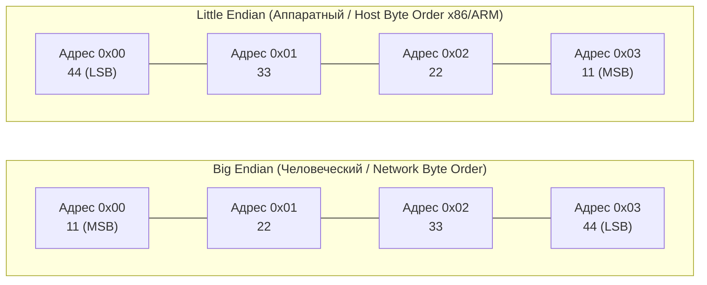

В предыдущей главе ([[25. Выравнивание данных, Padding и Struct Layout]]) мы выяснили, по каким законам компилятор распределяет адреса для полей структур. Мы воспринимали многобайтовые числа (`int32`, `int64`) как монолитные блоки.

Теперь пришло время заглянуть внутрь самого машинного слова и исследовать его байтовую начинку.

Оперативная память любого современного компьютера адресуется строго побайтово: у каждого 8-битного байта есть свой уникальный числовой индекс. Если переменная в Go имеет тип `uint32`, она занимает ровно 4 последовательных байта в памяти — например, по адресам от `0x00` до `0x03`.

Представим 32-битное шестнадцатеричное число:
```
0x11223344
```
В нем четко различимы разряды:
- `11` — это самый **старший байт (Most Significant Byte, MSB)**, несущий наибольший вес ($11 \times 16^6$).
- `44` — это самый **младший байт (Least Significant Byte, LSB)**, несущий наименьший вес ($44 \times 16^0$).

И тут перед создателями компьютеров встал сакраментальный вопрос: какой из этих байтов должен быть записан по первому, наименьшему адресу `0x00`?

Этот выбор разделил вычислительную индустрию на два непримиримых лагеря: **Big Endian** и **Little Endian**.

> Сам термин *Endianness* пришел в компьютерные науки из бессмертной сатиры Джонатана Свифта «Путешествия Гулливера». Государства Лилипутия и Блефуску вели многолетнюю войну из-за религиозного спора: с какого конца правильно разбивать вареное яйцо — с тупого («тупоконечники», Big-Endians) или с острого («остроконечники», Little-Endians)?  
> В 1980 году легендарный ученый Дэнни Коэн в своей знаменитой статье *«On Holy Wars and a Plea for Peace» (О священных войнах и призыве к миру)* остроумно применил эту аллегорию к порядку байт в памяти.

---

## Big Endian: Человеческий подход

**Big Endian (От старшего к младшему / «Тупоконечный» порядок)** — это порядок, при котором самый старший байт (MSB) записывается по самому младшему (первому) физическому адресу памяти.

Мы привыкли писать и читать числа на бумаге слева направо: сначала тысячи, затем сотни, затем десятки и единицы. Точно так же число укладывается и в память:
* Адрес `0x00`: `11` (MSB — старший байт)
* Адрес `0x01`: `22`
* Адрес `0x02`: `33`
* Адрес `0x03`: `44` (LSB — младший байт)

Если вы сделаете дамп памяти, вы легко прочитаете шестнадцатеричное число глазами, как привычный текст.

> [!info] Под капотом
> Исторически формат Big Endian был стандартом для суперкомпьютеров IBM System/360, мэйнфреймов, архитектур Motorola 68000 и SPARC. 
> Но для современного бэкенд-инженера ключевое значение имеет другой факт:  
> **Big Endian — это абсолютный, незыблемый стандарт сетевых протоколов (Network Byte Order)**!  
> Абсолютно все стандарты интернета (длина IP-пакета, порты в заголовках TCP и UDP, длины фреймов в HTTP/2 и HTTP/3, протоколы Kafka и gRPC) обязаны сериализоваться и передаваться по проводам строго в формате Big Endian.

---

## Little Endian: Подход для железа

**Little Endian (От младшего к старшему / «Остроконечный» порядок)** — это порядок, при котором самый младший байт (LSB) записывается по самому первому физическому адресу.

В оперативной памяти наше число `0x11223344` раскладывается буквально «задом наперед»:
* Адрес `0x00`: `44` (LSB — младший байт)
* Адрес `0x01`: `33`
* Адрес `0x02`: `22`
* Адрес `0x03`: `11` (MSB — старший байт)

Формат Little Endian стал мировым стандартом для персональных компьютеров и серверов благодаря процессорам **x86-64 (Intel / AMD)**. Архитектура ARM64 (Apple Silicon, AWS Graviton) аппаратно является двуликой (**Bi-Endian**) — ядро способно переключаться между режимами, но все основные серверные и клиентские ОС (Linux, macOS, Android, Windows) настраивают ARM исключительно на работу в режиме Little Endian. 

Поэтому для целевых платформ `GOARCH=amd64` и `GOARCH=arm64` компилятор Go генерирует код, нативно живущий в мире Little Endian.



### Mechanical Sympathy: Почему Intel выбрала "неудобный" формат?

Зачем инженерам Intel понадобилось выворачивать числа наизнанку, создавая неудобства программистам при чтении дампов памяти? 

Ответ кроется в физике кремния и оптимизации микросхем арифметико-логического устройства (ALU):

1. **Естественность арифметики сложения:**  
   Вспомните, как мы складывали многозначные числа в столбик в школе (и как проектировали сумматор в [[3. Комбинационная логика. Учим кремний считать]]). Сложение всегда начинается с *младших разрядов* (единиц), а перенос бита (Carry) распространяется в старшие разряды. В архитектуре Little Endian младший байт лежит по базовому адресу: процессор может начать выполнение операции сложения сразу же, как только первый байт считан из кэша, не дожидаясь загрузки старших байтов!
2. **Бесплатное усечение типов (Type Narrowing / Casting):**  
   Представьте, что у вас есть переменная `int64` (8 байт), содержащая маленькое число `5`, и вы хотите привести её к `int32` (4 байта).  
   - В архитектуре **Little Endian** адрес 4-байтного значения совпадает с адресом исходного 8-байтного числа! Процессору вообще не нужно двигать указатель: он берет тот же самый адрес памяти и считывает оттуда 4 байта. Младшие разряды на месте, число равно 5.  
   - В архитектуре **Big Endian** процессору пришлось бы вычислять смещение `+4` байта к указателю, чтобы добраться до значащей младшей половины числа!

---

## Работа с Endianness в Go

Инженеры серверного бэкенда ежедневно балансируют между двумя мирами: сетевая карта поставляет нам байты в формате Big Endian (сеть), а наш процессор x86-64 или ARM64 ждет данные в формате Little Endian (хост).

В стандартной библиотеке Go за преобразования отвечает пакет **`encoding/binary`**:

```go
package main

import (
	"encoding/binary"
	"fmt"
)

func main() {
	// 4 байта длины сообщения, принятые из сокета TCP (Big Endian)
	networkData := []byte{0x00, 0x00, 0x00, 0x05} // Длина = 5

	// Конвертируем сетевые байты в машинный uint32
	length := binary.BigEndian.Uint32(networkData)
	fmt.Printf("Длина сообщения: %d\n", length) // Напечатает: 5

	// Подготавливаем ответ для отправки в сеть
	responseBuf := make([]byte, 4)
	binary.BigEndian.PutUint32(responseBuf, 1024)
}
```

### Магия компилятора и BSWAP

Если заглянуть в реализацию функции `binary.BigEndian.Uint32` в стандартной библиотеке:

```go
func (bigEndian) Uint32(b []byte) uint32 {
	_ = b[3] // Bounds check elimination
	return uint32(b[3]) | uint32(b[2])<<8 | uint32(b[1])<<16 | uint32(b[0])<<24
}
```

Неискушенный программист ужаснется: 4 чтения из массива, 3 побитовых сдвига (`<<`) и 3 операции логического ИЛИ (`|`). Неужели парсинг сетевого заголовка отнимает десяток инструкций процессора?

К счастью, компилятор Go обладает глубоким пониманием архитектуры (Mechanical Sympathy). Оптимизатор Go SSA распознает этот канонический шаблон и **полностью вырезает все сдвиги и побайтовые чтения**!

Вместо них компилятор генерирует ровно **одну аппаратную инструкцию процессора**:
- На архитектуре **x86-64** — инструкцию **`BSWAP`** (Byte Swap), разворачивающую порядок байт в регистре за один такт.
- На архитектуре **ARM64** — инструкцию **`REV`** (Reverse Bytes), также исполняемую за один такт.

Использование пакета `encoding/binary` в Go является не просто идиоматичным, но и абсолютно бесплатным (Zero-Cost Abstraction).

> [!warning] Ловушка / Gotcha: Проклятие пакета unsafe
> Программисты, переходящие в Go из языка C, часто пытаются «срезать углы» ради мнимой производительности и парсят бинарные протоколы через приведение типов указателей:
> ```go
> // КАТАСТРОФИЧЕСКИ ПЛОХОЙ КОД:
> header := *(*uint32)(unsafe.Pointer(&networkBuffer[0]))
> ```
> Разработчик берет байты прямо из сетевого буфера (Network Byte Order = Big Endian) и заставляет процессор интерпретировать их как `uint32`.
> 
> Процессор x86-64 добросовестно читает эти 4 байта в своем нативном формате — Little Endian.  
> Если по сети пришла длина пакета `0x00000005` (5 байт), процессор x86 перевернет байты и запишет в регистр число `0x05000000`. Ваша программа решит, что длина пакета составляет **83 886 080 байт** (83 Мегабайта), немедленно выделит гигантский буфер в куче и аварийно упадет с паникой Out Of Memory (OOM)!
> 
> **Железное правило:** Никогда не кастуйте сырые сетевые или дисковые байты через `unsafe.Pointer`. Всегда используйте `encoding/binary`.

---

## Маркер порядка байт (BOM) в файлах

В сетевых сокетах все прозрачно: стандарт RFC строго предписывает Big Endian. Но как быть с бинарными файлами на диске или текстовыми документами в кодировке UTF-16?

Для устранения неопределенности в самое начало файла помещают специальный маркер — **BOM (Byte Order Mark)**. Это двухбайтная сигнатура со значением `0xFEFF`.

* Если программа считывает первые два байта файла и видит последовательность `FE FF` — файл записан в порядке **Big Endian**.
* Если программа видит байты `FF FE` (число перевернуто) — файл записан в порядке **Little Endian**, и текстовый процессор обязан программно переворачивать байты при чтении каждого символа.

Многие промышленные форматы данных (например, заголовки файлов TIFF, WAV или протокол JVM) содержат в заголовке специальные маркерные поля, определяющие, в каком порядке байт записаны структуры данных.

---

## Итог

1. **Big Endian (Сетевой порядок / Network Byte Order)** хранит старшие разряды числа по меньшим адресам памяти. Это глобальный стандарт для всех сетевых протоколов интернета (TCP/IP, HTTP/2, Protobuf, Kafka).
2. **Little Endian (Хостовый порядок / Host Byte Order)** хранит младшие разряды числа по меньшим адресам. Это стандарт архитектур x86-64 и современных реализаций ARM64, созданный для оптимизации работы кремниевых сумматоров ALU и бесплатного приведения типов.
3. В Go канонический способ конвертации — стандартный пакет **`encoding/binary`** (`binary.BigEndian` и `binary.LittleEndian`).
4. Компилятор Go преобразует функции пакета `encoding/binary` в специализированные 1-тактовые инструкции процессора (**`BSWAP`** на x86-64 и **`REV`** на ARM64).
5. Использование `unsafe` для прямого чтения сетевых структур ведет к катастрофическим ошибкам из-за несовпадения Network и Host byte order.

---

### Финал Блока 2: Мы покорили подсистему памяти!

Позади колоссальный путь. Мы разобрались, как кремний запрашивает данные (пирамида памяти, SRAM и DRAM), какими квантами он оперирует (кэш-линии по 64 байта), как находит адреса (ассоциативность сетов), как согласует данные между ядрами (протокол MESI), избегает ложного разделения (Padding), дисциплинирует конвейер (барьеры памяти Acquire/Release, CAS) и упаковывает байты в структурах (Alignment и Endianness).

Но всё это время мы говорили об адресах памяти так, словно программа работает напрямую с физическими микросхемами RAM на материнской плате.

В реальности ни одна современная Go-программа никогда в жизни не видела физических адресов оперативной памяти! 
Каждая горутина живет в грандиозном виртуальном иллюзионе, заботливо выстроенном ядром операционной системы и аппаратным блоком MMU. 

Как операционная система выделяет нашему процессу терабайты памяти, имея всего 8 гигабайт планки RAM? Что такое таблицы страниц, почему промах мимо буфера TLB может стоить сотни тактов, и как Huge Pages спасают высоконагруженные базы данных?

Добро пожаловать в мир виртуальной адресации и операционных систем!  
Наш следующий шаг — **Блок 3: Виртуальная память и адресация**, который открывает фундаментальная глава: [[27. Виртуальная память. Взгляд со стороны железа]].