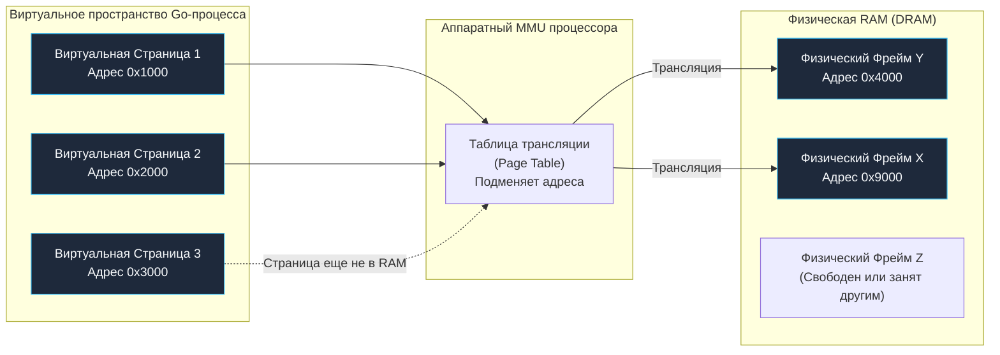

В предыдущих главах (вплоть до [[26. Endianness. Little Endian vs Big Endian]]) мы досконально изучили, как процессор читает, модифицирует и кэширует данные по конкретным числовым адресам оперативной памяти.

Но задавались ли вы когда-нибудь простым вопросом: когда в вашей Go-программе вы выводите в терминал адрес переменной через выражение:
```go
fmt.Printf("%p\n", &variable)
```
и получаете значение вроде `0xc0000a4000` — что это за адрес? Указывает ли этот шестнадцатеричный указатель на конкретную ячейку памяти или транзистор на планке DRAM, вставленной в слот материнской платы?

Ответ категоричен: **Нет, ни в коем случае.** 

Этот адрес — блестящая математическая и аппаратная иллюзия. Настоящая «Матрица», заботливо выстроенная ядром операционной системы и кремнием процессора. Ни одна современная прикладная программа на Go никогда в своей жизни не видит и не знает физических адресов оперативной памяти. Ваш процесс живет в изолированной персональной вселенной — **Виртуальной памяти (Virtual Memory)**.

---

## Кризис физической памяти

На заре компьютерной эры (во времена MS-DOS и ранних мэйнфреймов) программы действительно работали с физической памятью напрямую. Если инструкция ассемблера приказывала процессору записать число по адресу `0x1000`, электрический сигнал буквально активировал строку номер `0x1000` в микросхеме оперативной памяти.

По мере усложнения систем этот прямолинейный подход привел к трем фатальным кризисам:

1. **Полное отсутствие изоляции и безопасности:**  
   Любая программа могла случайно (из-за ошибки в указателе) или намеренно (если это вредоносный код) прочитать или перезаписать память соседнего процесса или даже самого ядра операционной системы. Ошибка в текстовом редакторе приводила к мгновенному краху всей операционной системы (знаменитый «Синий экран смерти»).
2. **Внешняя фрагментация памяти:**  
   Процессы запускались, требовали память, завершались и освобождали ее, оставляя после себя дыры произвольного размера. Представьте, что новому процессу требуется непрерывный массив размером 10 МБ. В физической памяти есть 10 свободных разрозненных кусочков по 1 МБ, суммарно 10 МБ свободны! Но запустить программу невозможно: она требует *непрерывного* диапазона адресов, и ОС возвращала ошибку `Out of Memory` при полупустой RAM.
3. **Коллизии адресов и проблема релокации:**  
   Компилятор при сборке программы был обязан жестко знать, по какому физическому адресу она будет загружена в память. Если две программы были скомпилированы под один и тот же адрес `0x1000`, их невозможно было запустить параллельно: они неизбежно перетерли бы код друг друга.

---

## Иллюзия: Каждому процессу по вселенной

Для радикального решения этих проблем архитекторы вычислительных систем разделили память на два совершенно разных мира: **виртуальный** и **физический**.

> **Фундаментальный принцип:**  
> Процессор больше никогда не отправляет адреса из инструкций программы напрямую на шину оперативной памяти.

Когда операционная система запускает скомпилированный бинарник Go, она создает для него изолированное **Виртуальное адресное пространство (Virtual Address Space)**. 

В современной 64-битной архитектуре (x86-64/ARM64) операционная система внушает каждому процессу грандиозную иллюзию: программа уверена, что она — единственный хозяин компьютера, а в её монопольном распоряжении находится непрерывный океан памяти объемом **256 Терабайт** (пользовательское адресное пространство от `0x0000000000000000` до `0x00007FFFFFFFFFFF`)!

```
Каноническое 64-битное виртуальное пространство (48-битная адресация):
┌────────────────────────────────────────────────────────┐
│ Пользовательское пространство процесса (User Space)    │
│ 0x0000000000000000 — 0x00007FFFFFFFFFFF (256 ТБ)       │
├────────────────────────────────────────────────────────┤
│ Неканоническая "дыра" (Запрещенная зона)               │
│ 0x0000800000000000 — 0xFFFF7FFFFFFFFFFF (16 Эксабайт) │
├────────────────────────────────────────────────────────┤
│ Пространство ядра ОС (Kernel Space)                    │
│ 0xFFFF800000000000 — 0xFFFFFFFFFFFFFFFF (256 ТБ)       │
└────────────────────────────────────────────────────────┘
```

Процесс может свободно обращаться к адресам внутри своих 256 ТБ, будучи уверенным, что память монолитна и бесконечна.

А на страже физической реальности стоит специальный сверхбыстрый аппаратный блок, интегрированный прямо в кристалл процессора — **MMU (Memory Management Unit, Блок управления памятью)**. Задача MMU — прозрачно для софта, «на лету» переводить вымышленные виртуальные адреса в реальные физические адреса оперативной памяти DRAM.

---

## Страницы памяти (Pages)

Транслировать виртуальные адреса в физические побайтово технически невозможно: для отслеживания каждого байта из 256 Терабайт потребовалась бы таблица адресов астрономических размеров, превышающая объем всей оперативной памяти на Земле.

Поэтому инженеры разбили и виртуальное, и физическое пространство на стандартные фиксированные блоки — **Страницы памяти (Pages)**.

> **Стандарт индустрии:**  
> В современных операционных системах общего назначения (Linux, Windows, macOS) базовый размер страницы памяти составляет **4 Килобайта (4096 байт)**.

Терминология архитектуры:
- Блок размером 4 КБ в *виртуальном* пространстве называется **Виртуальной страницей (Virtual Page, VP)**.
- Блок размером 4 КБ в *физической* оперативной памяти называется **Физическим фреймом, или кадром (Physical Frame / Page Frame, PF)**.



Взгляните на эту схему — в ней заключена главная магия виртуальной памяти:
1. В виртуальном пространстве вашего процесса страницы `VP1` и `VP2` лежат **строго непрерывно** (адреса `0x1000` и `0x2000`). Для вашего Go-кода слайс, расположенный на этих страницах — это идеально плоский монолитный кусок памяти.
2. Но в физической микросхеме RAM эти страницы привязаны к совершенно случайным, разрозненным фреймам `0x4000` и `0x9000`!
3. **Проблема внешней фрагментации оперативной памяти решена навсегда:** операционная система может собрать непрерывный виртуальный буфер любого размера из случайных свободных 4-килобайтных «осколков» физической RAM.

> [!info] Под капотом: Общая память (Shared Memory)
> Виртуальная память делает возможным изящный трюк: две разные виртуальные страницы двух совершенно независимых процессов могут указывать на **один и тот же физический фрейм** в оперативной памяти!
> 
> Именно так работают разделяемые динамические библиотеки (`.so` в Linux или `.dll` в Windows). Машинный код стандартной библиотеки Си `libc` загружается в физическую RAM ровно один раз в единственном экземпляре, но проецируется в виртуальное пространство тысяч запущенных процессов одновременно. 
> В мире Go, где бинарники компилируются преимущественно статически, разделяемая память используется при загрузке динамических плагинов через пакет `plugin`, а также при разделении памяти между процессами через системный вызов `mmap`.

---

## Mechanical Sympathy: Виртуальная память и Go

Понимание механики виртуальных страниц снимает покров тайны с того, как рантайм языка Go управляет ресурсами операционной системы.

### 1. Как работает выделение памяти (Memory Arena)

В классических программах на языке Си вызов `malloc()` регулярно приводит к системным вызовам `brk` или `mmap`, заставляя ядро ОС переключать контекст, что отнимает драгоценное процессорное время.

Аллокатор рантайма Go спроектирован по принципу Mechanical Sympathy:
При старте вашего Go-приложения рантайм обращается к операционной системе через вызов `mmap` и сразу резервирует для себя грандиозный кусок виртуального адресного пространства — **Арену памяти (Memory Arena)**, размер которой на 64-битных системах может составлять сотни гигабайт!

Операционная система удовлетворяет этот аппетит мгновенно и абсолютно бесплатно. Почему? Потому что выделение виртуального адресного пространства **не стоит ядру ОС ни единого байта физической памяти RAM**! 
В дальнейшем, когда ваш код создает структуры или срезы, аллокатор Go мгновенно «нарезает» память внутри своей заготовленной виртуальной арены в пользовательском пространстве без единого медленного системного вызова в ядро Linux.

> [!tip] Собеседование
> **Вопрос:** Что произойдет при выполнении следующего кода на сервере, где установлено всего 2 ГБ оперативной памяти? Упадет ли программа с ошибкой `Out Of Memory`?
> ```go
> package main
> 
> import (
> 	"fmt"
> 	"time"
> )
> 
> func main() {
> 	// Выделяем слайс размером в 1 Терабайт (1 << 40 байт)!
> 	s := make([]byte, 1 << 40)
> 	fmt.Println("Слайс создан!", len(s))
> 	time.Sleep(time.Hour)
> }
> ```
> 
> **Ответ:** Программа мгновенно напечатает *«Слайс создан! 1099511627776»*, спокойно уснет на час и **не упадет с OOM**!
> 
> Физика процесса:
> Вызов `make` запрашивает у операционной системы резервирование 1 Терабайта *виртуального* адресного пространства. Ядро Linux использует оптимистичную стратегию выделения — **Overcommit** (переподписка). Физические фреймы оперативной памяти при этом не выделяются вообще! 
> 
> Реальное выделение физической памяти начнется только тогда, когда программа попытается совершить фактическую **запись** по адресу: например, `s[0] = 1`. 
> В этот момент процессор обнаружит, что страница виртуальной памяти еще не связана с физическим фреймом RAM, и сгенерирует аппаратное прерывание — **Page Fault (Отказ страницы)**. Ядро Linux перехватит его, найдет в оперативной памяти свободные 4 Килобайта, привяжет их к виртуальному адресу `s[0]` и вернет управление процессору. Этот механизм называется **Demand Paging (Выделение по требованию)** или **Lazy Allocation (Ленивое выделение)**.

### 2. Почему возникает Panic: nil pointer dereference?

Что такое `nil` на уровне микроархитектуры? В Go нулевой указатель `nil` равен абсолютному числовому адресу `0x0`.

Операционная система сознательно оставляет самую первую страницу виртуальной памяти (диапазон адресов от `0x0000` до `0x0FFF`, то есть первые 4 КБ) **непривязанной ни к какому физическому фрейму**. Эта зона помечается специальным флагом отсутствия прав доступа (Guard Page).

Когда ваш код по неосторожности пытается разыменовать нулевой указатель:
```go
*ptr = 5 // где ptr == nil (адрес 0x0)
```
процессор отправляет виртуальный адрес `0x0` в блок MMU. 
MMU видит, что данной виртуальной страницы нет в таблице отображения, и немедленно возбуждает аппаратное исключение процессора — **Page Fault (Access Violation)**.

Ядро операционной системы ловит это прерывание, идентифицирует некорректный адрес и шлет провинившемуся процессу сигнал **`SIGSEGV` (Segmentation Fault)**. Рантайм Go перехватывает `SIGSEGV` своим встроенным обработчиком сигналов и преобразует сухой аппаратный сбой в понятную панику с информативным стек-трейсом:
```
panic: runtime error: invalid memory address or nil pointer dereference
```

### 3. Механизм горутин и стеки

В традиционных языках (Java, C++) каждому потоку операционной системы (Thread) при создании выделяется монолитный стек фиксированного размера (обычно от 1 до 8 Мегабайт). Попытка запустить 100 000 таких потоков моментально исчерпает всю память сервера.

В Go горутины стартуют с микроскопическим стеком размером всего **2 Килобайта**.
Но что происходит, если глубокая рекурсия требует больше места?

Рантайм Go использует концепцию **Непрерывных стеков (Contiguous Stacks)**: он аллоцирует новый блок памяти в два раза большего размера (4 КБ, затем 8 КБ...), копирует туда старый стек и обновляет указатели (`copystack`). 
Благодаря виртуальной памяти операционная система с легкостью предоставляет рантайму непрерывные виртуальные адреса для растущих стеков, даже если в физической DRAM эти блоки собраны из несмежных фрагментов.

---

## Итог

1. **Виртуальная память** — фундаментальная аппаратная абстракция: каждый процесс изолирован и считает, что монопольно владеет терабайтами непрерывной памяти.
2. И виртуальное, и физическое пространство памяти нарезано на элементарные блоки фиксированного размера — **Страницы (Pages)** и **Кадры (Frames)** по 4 Килобайта.
3. Блок **MMU (Memory Management Unit)** процессора осуществляет мгновенную аппаратную трансляцию виртуальных адресов в физические при каждом чтении и записи.
4. **Ленивое выделение (Demand Paging):** аллокация памяти в Go резервирует виртуальное пространство. Реальные 4-килобайтные физические фреймы выделяются операционной системой через прерывания **Page Fault** строго в момент первой записи данных.
5. Нулевой указатель `nil` (адрес `0x0`) защищен на уровне страниц MMU: попытка доступа к нему вызывает аппаратный Page Fault, который рантайм Go элегантно перехватывает и превращает в `panic: nil pointer dereference`.

Мы выяснили, что MMU транслирует адреса страницами по 4 Килобайта. Но как именно устроен этот процесс внутри кремния? 
Если в виртуальном пространстве процесса миллиарды страниц, где хранится карта их соответствия физическим фреймам? Почему наивная таблица адресов съела бы гигабайты памяти, и как многоуровневые деревья страниц спасают архитектуру?

Об этом читайте в следующей главе: [[28. Page Table, MMU и трансляция адресов]].