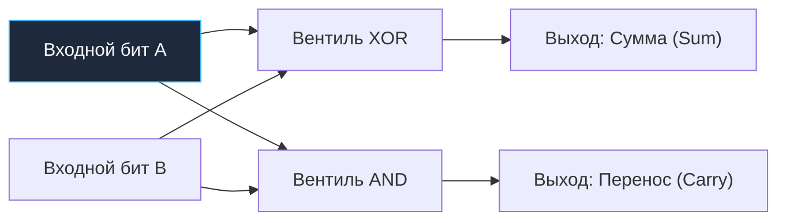
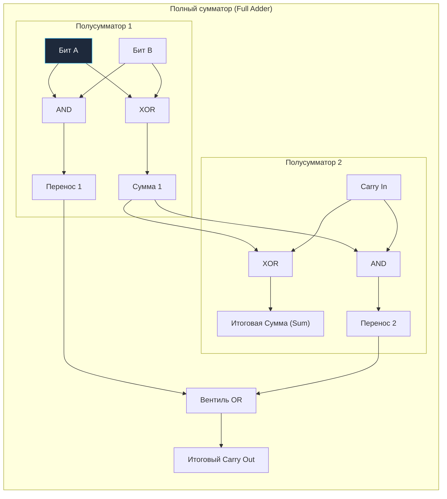
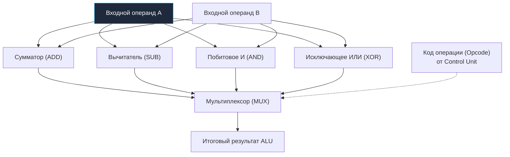

В XVII веке великий Блез Паскаль создал «Паскалину» — механический калькулятор, в котором сложение чисел происходило благодаря хитроумному сцеплению латунных шестеренок. Когда одно колесо совершало полный оборот, специальный храповой рычаг сдвигал соседнее колесо ровно на один шаг. Это был механический перенос десятка.

Спустя триста лет в кремниевых процессорах мы делаем ровно то же самое, но вместо латуни у нас полевые транзисторы, а вместо зубчатых передач — логические вентили.

В предыдущей лекции мы научили отдельные вентили проверять элементарные условия: `AND`, `OR`, `XOR`, `NOT`. Теперь сделаем следующий шаг: заставим кремний выполнять настоящую арифметику. Схемы, решающие эту задачу, называют **комбинационной логикой (Combinational Logic)**.

Главный закон комбинационной логики прост и изящен: **выходной сигнал схемы в любой момент времени однозначно определяется текущей комбинацией сигналов на ее входах**.  
Здесь нет ни тактового генератора, ни регистров, ни памяти о прошлом. В терминах языка Go комбинационная схема — это идеальная **чистая функция (pure function)** без побочных эффектов (side effects): подайте на вход одни и те же сигналы, и на выходе моментально (с микроскопической задержкой на движение электронов) возникнет предсказуемый результат.

---

## 1. Полусумматор (Half Adder): Сложение двух одиноких битов

Вспомним школьную арифметику в столбик, но переведенную в двоичную систему счисления, где есть только две цифры: `0` и `1`.

* $0 + 0 = 0_2$
* $0 + 1 = 1_2$
* $1 + 0 = 1_2$
* $1 + 1 = 10_2$ (в десятичной системе это число 2)

Взгляните на последний случай: при сложении двух единиц сумма равна двум, но цифра 2 не помещается в один двоичный разряд! Возникает **бит переноса (Carry)** в старший разряд.

Составим таблицу истинности для схемы с двумя входами ($A$ и $B$) и двумя выходами (младший разряд **Сумма / Sum** и старший разряд **Перенос / Carry**):

| Вход A | Вход B | Выход Сумма (Sum) | Выход Перенос (Carry) | Значение в двоичной записи |
|:---:|:---:|:---:|:---:|:---:|
| `0` | `0` | `0` | `0` | $00_2 = 0$ |
| `0` | `1` | `1` | `0` | $01_2 = 1$ |
| `1` | `0` | `1` | `0` | $01_2 = 1$ |
| `1` | `1` | `0` | `1` | $10_2 = 2$ |

Посмотрите на колонки выходов — в них открывается чистая математическая гармония:
1. Колонка **Sum** в точности повторяет таблицу истинности вентиля **XOR** (единица, только если биты различаются).
2. Колонка **Carry** в точности совпадает с вентилем **AND** (единица, только если оба входа равны единице).

Мы только что спроектировали элементарный узел процессора — **Полусумматор (Half Adder)**:

```go
// Программная модель полусумматора на уровне базовых вентилей
func HalfAdder(a, b uint8) (sum, carry uint8) {
	sum = a ^ b   // Вентиль XOR: сложение по модулю 2
	carry = a & b // Вентиль AND: формирование бита переноса
	return sum, carry
}
```



Почему эта схема называется *полусумматором*? Потому что у нее нет входа для переноса из предыдущего разряда. Она умеет складывать только два самых младших бита числа (бит 0). Чтобы сложить бит 1, нам понадобится полноценный инструмент.

---

## 2. Полный сумматор (Full Adder): Учитываем входящий перенос

При сложении многоразрядных чисел каждый разряд (кроме нулевого) обязан сложить не два, а **три** бита:
1. Бит числа $A$;
2. Бит числа $B$;
3. Входящий бит переноса из младшего разряда (**`carryIn`**).

Схема, способная на это, называется **Полным сумматором (Full Adder)**. Схемотехнически она элегантно собирается всего из **двух полусумматоров** и одного вентиля **OR**:



В коде на Go эта логика выглядит предельно понятно:
```go
func FullAdder(a, b, carryIn uint8) (sum, carryOut uint8) {
	// Первый полусумматор складывает биты a и b
	sum1, carry1 := HalfAdder(a, b)

	// Второй полусумматор складывает промежуточную сумму с входящим переносом
	sum, carry2 := HalfAdder(sum1, carryIn)

	// Перенос на следующий разряд возникает, если сработал ХОТЯ БЫ один полусумматор
	carryOut = carry1 | carry2 // Вентиль OR

	return sum, carryOut
}
```

---

## 3. Как складываются 64-битные числа: Ripple-Carry vs Carry-Lookahead

Теперь у нас есть универсальный строительный блок. Чтобы процессор мог сложить два 64-битных целых числа (`uint64`), самое очевидное решение — поставить 64 полных сумматора в цепочку. Выход `carryOut` каждого сумматора подключается к `carryIn` следующего.

Такая классическая схема называется **Ripple-Carry Adder (сумматор с последовательным волновым переносом)**: бит переноса «катится волной» от нулевого бита к старшему 63-му.

> [!info] Под капотом: Проблема Ripple-Carry и предел частоты CPU
> Главный враг любого схемотехника — **задержка распространения сигнала (Propagation Delay)**.  
> Электроны движутся по проводам со скоростью около $20\text{ см/нс}$, а каждому транзистору требуется время (около $5\dots 15\text{ пикосекунд}$), чтобы перезарядить затвор и переключить состояние.  
> В 64-битном Ripple-Carry сумматоре самый старший 63-й сумматор не может сформировать результат, пока сигнал переноса не пробежит последовательно через все 63 предыдущих каскада!  
> Суммарная задержка составит около $1\dots 1.5\text{ нс}$. Это означает, что процессор с таким сумматором физически не сможет работать на частоте выше 700–800 МГц!
> 
> **Как это решено в современных CPU:**  
> Процессоры с частотой 4–5 ГГц (где длительность такта составляет крошечные $0.2\text{ нс}$) используют **Carry-Lookahead Adder (сумматор с ускоренным параллельным переносом)**.  
> Дополнительная комбинационная логика заранее вычисляет функции *Generate* ($G = A \cdot B$) и *Propagate* ($P = A \oplus B$), позволяя рассчитать биты переноса для всех 64 разрядов параллельно всего за 2–3 логических уровня ценой сотен дополнительных транзисторов.

---

## 4. Рождение ALU и Мультиплексоров: аппаратный переключатель MUX

Процессор должен не только складывать. Ему нужно вычитать (`SUB`), умножать, делить, сдвигать биты и сравнивать числа.

На кремниевом кристалле для каждой такой математической операции проектируется отдельный специализированный комбинационный блок. Все они объединяются в **ALU (Арифметико-логическое устройство)**:



Обратите внимание на поразительный инженерный парадокс:  
Когда процессор выполняет инструкцию `ADD`, операнды подаются параллельно на **все** вычислительные блоки разом! И сумматор, и блок вычитания, и побитовые вентили вычисляют свои ответы одновременно.

Но наружу попадает ровно один результат. Как это контролируется?  
С помощью **Мультиплексора (MUX)**.

**Мультиплексор (MUX)** — это комбинационная схема, работающая как аппаратный переключатель `switch`:
```go
// Программный эквивалент аппаратного мультиплексора
func MUX(opcode uint8, addRes, subRes, andRes, xorRes uint64) uint64 {
    switch opcode {
    case OP_ADD:
        return addRes
    case OP_SUB:
        return subRes
    case OP_AND:
        return andRes
    case OP_XOR:
        return xorRes
    default:
        return 0
    }
}
```
Управляющий блок процессора (**Control Unit**) подает на вход мультиплексора код команды (**Opcode**). Мультиплексор открывает нужную пару транзисторов и направляет на выходную шину только результат сумматора, полностью отсекая остальные.

---

## 5. Mechanical Sympathy: Пакет math/bits, переполнение и Carry Flag

Что физически происходит при **целочисленном переполнении (Integer Overflow)**?

Представьте, что мы складываем два максимальных 64-битных числа `uint64`:
$$\text{math.MaxUint64} + 1 = 0$$

Старший 63-й сумматор в цепочке ALU сформировал бит переноса `carryOut = 1`. Но в 64-битной шине нет 65-го провода! Бит переноса отбрасывается, и число «оборачивается» в ноль.

В языках высокого уровня программисты часто не знают, произошло ли переполнение. Но на аппаратном уровне этот 65-й бит **никогда не теряется бесследно**: ALU выставляет его в специальный регистр процессора — **Регистр флагов (FLAGS / RFLAGS)**, взводя **Carry Flag (CF)**.

В большинстве прикладных вычислений Go игнорирует флаг `CF` ради максимальной скорости. Однако в криптографии (RSA, эллиптические кривые secp256k1, Ed25519) и при работе с большими числами (арифметика высокой точности `uint128`, `uint256`) критически важно учитывать бит переноса.

Для этого в стандартной библиотеке Go существует специализированный пакет `math/bits`:

```go
package main

import (
	"fmt"
	"math"
	"math/bits"
)

func main() {
	var a uint64 = math.MaxUint64 // 0xFFFFFFFFFFFFFFFF (все 64 бита равны 1)
	var b uint64 = 5

	// 1. Обычное сложение: переполнение тихо оборачивается
	regularSum := a + b
	fmt.Printf("Обычная сумма: %d\n", regularSum) // Выведет 4

	// 2. Аппаратное сложение с сохранением Carry Flag через bits.Add64
	// Входной carryIn = 0
	sum, carryOut := bits.Add64(a, b, 0)
	fmt.Printf("Сумма: %d, Бит переноса (CF): %d\n", sum, carryOut) 
	// Выведет: Сумма 4, Перенос 1
}
```

> [!tip] Собеседование: Что такое Compiler Intrinsics в Go?
> **Вопрос:** Функция `bits.Add64` возвращает два значения (`sum, carryOut`). Разве возврат дополнительного значения не замедляет сложение из-за затрат на вызов функции и передачу лишнего значения?  
> **Ответ:** Она работает с **максимально возможной физической скоростью процессора**.  
> Пакет `math/bits` обрабатывается компилятором Go особым образом. Если вы откроете его исходный код, вы увидите заглушки. Компилятор Go распознает вызовы функций `bits.*` как **Compiler Intrinsics (встроенные функции)** и напрямую транслирует `bits.Add64` в 1–2 машинные инструкции:
> - Инструкция сложения `ADD` (выставляет флаг переноса `CF`).
> - Инструкция сложения с переносом `ADC` (Add with Carry) или сохранение флага через `SETC`.
> 
> Никакого пролога/эпилога функций, перемещения стека и накладных расходов не происходит: ваш код на Go компилируется в ту же машинную инструкцию, которую написал бы опытный ассемблерный программист.

---

## Резюме

1. **Комбинационная логика** — это класс безынерционных схем без памяти и тактовых импульсов, где выход является чистой математической функцией входов.
2. **Полусумматор (Half Adder)** объединяет вентили `XOR` (сумма) и `AND` (перенос), складывая два одиночных бита.
3. **Полный сумматор (Full Adder)** объединяет два полусумматора и вентиль `OR`, позволяя учитывать входящий перенос (`carryIn`).
4. **Сумматор Carry-Lookahead** в современных процессорах заменяет медленный последовательный перенос Ripple-Carry на параллельный расчет флагов переноса, гарантируя сложение 64-битных чисел за один такт.
5. **ALU и Мультиплексор (MUX):** АЛУ вычисляет все операции одновременно, а мультиплексор направляет в шину данных нужный результат в соответствии с кодом операции (`Opcode`).
6. Пакет **`math/bits`** в Go предоставляет прямой доступ к аппаратному флагу переноса `Carry Flag (CF)` процессора через compiler intrinsics.

Мы научили кремний мгновенно производить расчеты. Но процессор всё еще страдает тотальной амнезией: как только электрический сигнал снимается со входов, результат исчезает навсегда. Чтобы построить настоящий компьютер, кремний нужно научить **помнить**. В следующей лекции мы создадим первую ячейку памяти из двух вентилей: [[4. Последовательностная логика. Учим кремний помнить]].