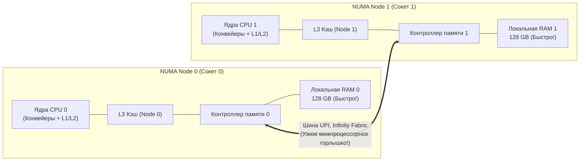
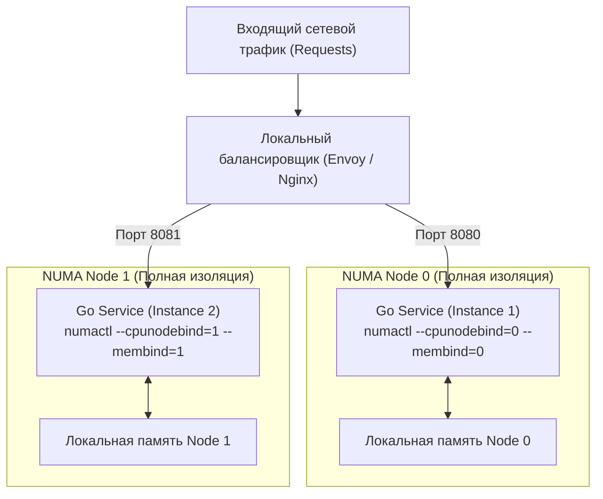

## Иллюзия единого пула памяти

В предыдущей главе ([[30. Huge Pages и Transparent Huge Pages]]) мы научились защищать систему от промахов TLB с помощью больших страниц памяти. Нам кажется, что теперь процессор может с максимальной эффективностью адресовать терабайты оперативной памяти. Мы пишем код на Go, создаем слайсы на миллионы элементов и интуитивно представляем себе оперативную память как один большой, однородный бассейн байтов, доступ к любой точке которого происходит с одинаковой предельной скоростью.

На вашем персональном ноутбуке или рабочем компьютере так оно и есть. Эта классическая архитектура называется **UMA (Uniform Memory Access — Однородный доступ к памяти)**: все вычислительные ядра процессора подключены к общему встроенному контроллеру памяти, а обращение к любому физическому адресу занимает строго одинаковое время. Это похоже на один общий холодильник на уютной кухне: за чем бы вы ни потянулись — за молоком или сыром — вам нужно сделать ровно три шага.

Но когда ваш скомпилированный Go-сервис деплоится на мощный production-сервер с двумя или четырьмя процессорными сокетами (например, на двухпроцессорный сервер с 128 ядрами Intel Xeon или AMD EPYC), архитектура UMA перестает работать.

Законы физики кремния неумолимы: одна общая шина памяти физически не способна пропустить через себя колоссальный поток данных от сотни жадных вычислительных ядер одновременно. Контроллер памяти захлебнулся бы в очереди запросов.

Чтобы преодолеть этот кризис пропускной способности, архитекторы перешли на архитектуру **NUMA (Non-Uniform Memory Access — Неоднородный доступ к памяти)**.

---

## Архитектура NUMA: Разделяй и властвуй

Чтобы снять «бутылочное горлышко» единой шины, инженеры архитектур x86_64 и ARM применили древний принцип: они децентрализовали память. Контроллеры памяти были перенесены непосредственно внутрь каждого процессора, а физические планки оперативной памяти (DIMM) были строго распределены между сокетами.

В архитектуре NUMA сервер логически и физически разделяется на автономные домены — **NUMA-узлы (NUMA Nodes)**. 
Как правило, один физический процессорный сокет представляет собой один NUMA-узел (хотя в современных чиплетных процессорах AMD EPYC и Intel Xeon один сокет может содержать внутри себя 2 или 4 отдельных NUMA-домена).

**Каждый NUMA-узел включает в себя:**
1. Группу собственных вычислительных ядер с локальными кэшами L1 и L2.
2. Локальный разделяемый кэш L3 (LLC).
3. Собственный контроллер памяти и выделенные каналы оперативной памяти.
4. Выделенные линии ввода-вывода (PCIe-слоты, привязанные к этому сокету).

Все NUMA-узлы на материнской плате соединены между собой высокоскоростными специализированными шинами-интерконнектами: **Intel UPI (Ultra Path Interconnect)** у Intel или **Infinity Fabric (xGMI)** у AMD.



### Локальная vs Удаленная память

Слово «Неоднородный» (Non-Uniform) отражает фундаментальную аппаратную асимметрию задержек при обращении к памяти:

1. **Local Access (Локальный доступ):**  
   Ядро на Node 0 читает данные из планки RAM, подключенной к контроллеру Node 0. Сигнал идет по коротким дорожкам текстолита прямо в свой процессор. Задержка минимальна — около **70–90 наносекунд**.
2. **Remote Access (Удаленный доступ):**  
   Ядро на Node 0 пытается прочитать байты, физически расположенные в оперативной памяти Node 1.  
   Запрос вынужден пройти длинный путь: из ядра в свой контроллер, затем выйти наружу в межпроцессорную шину UPI, преодолеть расстояние между сокетами, постучаться в контроллер сокета Node 1, дождаться считывания данных из DRAM и проделать весь обратный путь!

Удаленный доступ добавляет **от 50% до 120% задержки** (время доступа подскакивает до **140–200+ наносекунд**). 
Но истинная беда кроется даже не в задержке, а в **пропускной способности (Bandwidth)** межпроцессорной шины. Шины UPI и Infinity Fabric имеют жесткий лимит пропускной способности. Если сотня горутин на одном сокете начнет непрерывно прокачивать потоки данных из памяти соседнего сокета, межпроцессорная шина мгновенно захлебнется, порождая катастрофический затор, парализующий работу всего сервера.

---

## Linux и политика First-Touch

Как операционная система решает, на какую именно физическую планку памяти положить переменную вашей Go-программы?

Ядро Linux по умолчанию руководствуется политикой **First-Touch Allocation (Выделение по первому касанию)**.

Вспомним механику Demand Paging из [[28. Page Table, MMU и трансляция адресов]]: когда ваш код выделяет срез `make([]byte, 1<<30)` (1 ГБ памяти), операционная система резервирует лишь виртуальные адреса, не выделяя физических фреймов.

Физический фрейм выделяется ядром ровно в тот момент, когда горутина впервые пытается совершить **запись** в страницу памяти и генерирует аппаратное прерывание Page Fault.

В этот момент ядро Linux смотрит на топологию:  
> *«На каком физическом ядре исполняется данный поток прямо сейчас? На ядре из Node 0? Отлично! Значит, я выделю для этой страницы физический фрейм из локальной памяти Node 0»*.

> [!warning] Ловушка / Gotcha
> Политика First-Touch порождает хрестоматийную проблему при инициализации серверов на Go.
> 
> Представьте типичный веб-сервис: при старте приложения функция `main()` (выполняющаяся в одном главном системном потоке на Node 0) загружает из базы данных гигантский in-memory кэш на 40 Гигабайт и раскладывает его по структурам в памяти. 
> 
> Поскольку всю запись производил один поток на Node 0, **все 40 ГБ кэша физически оседают в локальной памяти Node 0**!
> Затем сервис запускает тысячи рабочих горутин для обработки входящих HTTP/gRPC запросов. Планировщик операционной системы равномерно распределяет горутины по обоим сокетам (Node 0 и Node 1).
> 
> В итоге половина всех воркеров, исполняющихся на ядрах Node 1, при каждом обращении к кэшу вынуждена совершать дорогостоящий **Remote Access**, непрерывно бомбардируя шину UPI и вызывая нелинейные просадки производительности сервиса.

> [!tip] Собеседование
> **Вопрос:** Компания арендовала двухсокетный сервер с 256 ГБ RAM (два NUMA-узла по 128 ГБ). Наш сервис потребляет около 140 ГБ памяти. Внезапно мониторинг фиксирует резкий всплеск дискового своппинга (Swap I/O), задержки сервиса взлетают до небес, при этом утилита `free -m` рапортует, что в системе свободно еще более 100 Гигабайт оперативной памяти! Как такое возможно при полупустой RAM?
> 
> **Ответ:** Это классический симптом **NUMA-дисбаланса (NUMA Imbalance)**.
> 
> Сервис стартовал на сокете Node 0 и за счет политики First-Touch жадно аллоцировал память в локальном узле. Когда 128 ГБ локальной памяти на Node 0 были полностью исчерпаны, ядро Linux (в зависимости от настроек параметра ядра `vm.zone_reclaim_mode`) вместо того, чтобы выделить память на соседней ноде Node 1, начало агрессивно сбрасывать «старые» страницы Node 0 в дисковый Swap, чтобы освободить место под новые локальные запросы!
> 
> **Решение:** Для равномерного распределения памяти память процесса можно принудительно чередовать между узлами, запустив бинарник через утилиту управления топологией:  
> `numactl --interleave=all ./my-service`.  
> Этот флаг приказывает ядру Linux распределять новые страницы строго поочередно: страница 0 на Node 0, страница 1 на Node 1, гарантируя идеальный баланс использования памяти.

---

## Mechanical Sympathy: Go-рантайм и NUMA

Каково отношение языка Go к архитектуре NUMA?

Исторически рантайм Go проектировался как **NUMA-agnostic (не знающий о NUMA)**. В отличие от экосистемы Java HotSpot (где JVM предоставляет флаги `-XX:+UseNUMA` для адаптации сборщика мусора) или C++ (где разработчики применяют системную библиотеку `libnuma` для жесткого связывания тредов и памяти), планировщик Go долгое время полностью игнорировал границы сокетов.

### Проблема планировщика (G-M-P)

В модели многозадачности Go рантайм управляет логическими процессорами `P` и привязанными к ним системными потоками ОС `M` (модель GMP).
1. Рантайм Go не закрепляет (не пинит через `sched_setaffinity`) свои потоки ОС `M` за конкретными ядрами или NUMA-сокетами. Планировщик ядра Linux имеет полное право в любой момент времени перебросить системный поток `M` с ядра сокета 0 на ядро сокета 1.
2. Когда горутина аллоцирует структуру в куче, объект физически ложится в ту ноду, на сокете которой поток исполнялся *в момент первой записи*.
3. Если через миллисекунду планировщик ОС или рантайм Go (через механизм Work-Stealing) перебросит горутину на другой сокет, вся её «горячая» локальная память мгновенно превращается в «холодную» удаленную память со штрафом задержки.

### Проблема сборщика мусора (GC)

Еще более драматично эффект NUMA проявляется во время работы сборщика мусора Go.

Сборщик мусора Go спроектирован предельно параллельным. На фазе маркировки (Concurrent Mark) рантайм Go мобилизует ровно **25% вычислительной емкости всех логических процессоров `P`** для сканирования указателей в куче.

Эти потоки сборщика мусора просыпаются одновременно на всех NUMA-сокетах сервера. Поток GC, выполняющийся на Node 1, начинает жадно обходить ссылки на структуры, которые физически были выделены на Node 0. На межпроцессорной шине UPI вспыхивает **настоящий шторм перекрестного межсокетного трафика**. В этот момент полезные горутины бизнес-логики испытывают жесточайшее замедление (Memory Bus Starvation), поскольку контроллеры памяти перегружены служебными запросами GC.

---

## Решения для Senior/Lead Go Engineers

Поскольку рантайм Go сам по себе не изолирует память между сокетами, в архитектурах с ультранизкой задержкой (High-Frequency Trading, AdTech RTB, телекоммуникационные шлюзы) применяют паттерн **Share-Nothing Architecture (Архитектура без разделения ресурсов)** на уровне развертывания.

Вместо того чтобы запускать **один гигантский экземпляр** Go-сервиса, который попытается утилизировать все 128 ядер на двух сокетах и породит NUMA-хаос, мы разделяем рабочую нагрузку:

1. Мы запускаем **два независимых изолированных процесса** одного и того же сервиса на одном физическом сервере.
2. С помощью стандартной утилиты Linux **`numactl`** мы жестко привязываем (pinning) каждый инстанс к своему персональному NUMA-узлу:

```bash
# Запускаем инстанс №1: жестко фиксируем ядра и память на Node 0
numactl --cpunodebind=0 --membind=0 ./my-go-service -port 8080 &

# Запускаем инстанс №2: жестко фиксируем ядра и память на Node 1
numactl --cpunodebind=1 --membind=1 ./my-go-service -port 8081 &
```

3. Перед процессами на том же сервере поднимается локальный легковесный прокси-балансировщик (Nginx, Envoy или HAProxy), равномерно распределяющий входящий сетевой трафик между портами `8080` и `8081`.



**Что дает этот архитектурный прием:**
- Каждый экземпляр Go-приложения живет в своем идеальном, локальном микрокосме UMA.
- Потоки планировщика GMP мигрируют только между ядрами своего родного сокета.
- Сборщик мусора сканирует исключительно локальные физические планки памяти со скоростью L3/DRAM без перекрестных запросов.
- Межпроцессорная шина UPI полностью свободна, а метрика $p99$ latency сокращается в 2–3 раза!

---

## Итоги

1. **NUMA (Non-Uniform Memory Access)** — физический стандарт современных многосокетных серверов и чиплетных процессоров: память разделена на локальную (быструю) и удаленную (медленную, требующую похода через межпроцессорную шину).
2. Политика **First-Touch Allocation** в Linux выделяет физическую память на том сокете, где работал поток в момент первой записи данных (Page Fault).
3. Рантайм Go исторически является **NUMA-agnostic**: планировщик и конкурентный сборщик мусора могут непреднамеренно генерировать тяжелый перекрестный трафик по шинам UPI / Infinity Fabric.
4. Для критических сервисов с высокими требованиями к задержкам лучшей практикой является развертывание по паттерну **Share-Nothing**: запуск независимых копий сервиса с явной привязкой к NUMA-доменам через утилиту `numactl`.

Мы научились эффективно распределять память и вычислительные потоки между физическими сокетами дата-центра. 
Но если мы спустимся обратно на уровень одного физического ядра процессора, нас ждет удивительное открытие: операционная система рапортует, что на сервере доступно 64 ядра, хотя физических микросхем ядер на кристалле всего 32!

Как одно физическое ядро умудряется одновременно притворяться двумя независимыми процессорами? Что такое аппаратные потоки, в чем подвох технологии Hyper-Threading, и почему виртуальные ядра могут замедлить ваш Go-код?

Ответы ждут нас в следующей главе: [[32. Hyper Threading и SMT]].