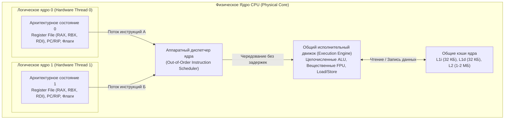

## Иллюзия ядер в htop

Представьте знакомую многим картину: вы заказываете у облачного провайдера или покупаете выделенный сервер с гордой надписью в спецификации: «8 физических ядер». Вы подключаетесь по SSH, запускаете утилиту `htop` или компилируете небольшую программу на Go с вызовом `runtime.NumCPU()`, и операционная система радостно рапортует: у вас в распоряжении целых **16 ядер**!

Планировщик Linux усердно распределяет процессы по шестнадцати строчкам в окне монитора, а Go-рантайм по умолчанию услужливо поднимает шестнадцать логических процессоров `P` в своей модели планирования `G-M-P`.

Но если взять отвертку, снять с сервера массивный медный радиатор и заглянуть в кремниевый кристалл под микроскопом, вы обнаружите ровно 8 физических кремниевых ядер. Никаких тайных фабрик внутри кремния нет. Откуда же взялись еще 8 вычислителей?

Перед нами классическая инженерная иллюзия — технология **SMT (Simultaneous Multithreading — Одновременная многопоточность)**. В маркетинговых материалах компании Intel эта концепция получила звучное имя **Hyper-Threading (HT)**, инженеры AMD именуют ее просто SMT, но физическая суть кремния везде едина. 

Это не «бесплатные ядра» и не удвоение вычислительной мощности из воздуха. Чтобы понять, почему в одних сценариях SMT ускоряет наш микросервис на треть, а в других — превращает высоконагруженную систему в кошмар с дикими задержками (`Latency`), нам придется заглянуть внутрь исполнительного конвейера процессора.

---

## Проблема простаивающего кремния

В главе [[12. Суперскалярность, Out Of Order Execution и Register Renaming]] мы выяснили, что современное ядро CPU — это колоссальный, невероятно широкий завод. На кристалле размещены десятки специализированных исполнительных блоков (`Execution Units`): 
- Несколько целочисленных `ALU` (арифметико-логических устройств);
- Блоки векторных и вещественных вычислений `FPU` (Floating Point Unit);
- Множество портов и очередей загрузки/сохранения (`Load/Store`);
- Механизмы переименования регистров и буферы переупорядочивания (`ROB`).

В теории такой суперскалярный процессор способен декодировать и запустить на исполнение 4, 6 или даже 8 инструкций за один-единственный такт генератора!

Однако в реальной жизни классического бэкенд-сервера этот могучий кремниевый конвейер большую часть времени мучительно скучает. Происходят так называемые **заторы и пузыри конвейера (Pipeline Stalls)**. 

Почему процессор простаивает?
1. **Cache Miss (Промах мимо кэша):** Программа обращается по указателю к данным в оперативной памяти (см. [[18. Кэши CPU. L1, L2, L3 и Cache Line]]). Если нужной строки нет в `L1` и `L2`, ядро отправляет запрос в медленный DRAM и буквально замирает на 150–250 тактов. Для частоты в 4 ГГц 200 тактов — это бесконечность: за это время ядро могло бы выполнить тысячу инструкций!
2. **Branch Misprediction (Ошибочное предсказание перехода):** В коде встретилась проверка `if err != nil`. Если branch predictor ошибся, сотни спекулятивно разогнанных инструкций аннулируются, конвейер принудительно сбрасывается, и работа начинается с нуля.
3. **Data Dependency (Зависимость по данным):** Инструкция сложения ждет, пока предыдущая инструкция умножения завершит расчет и запишет результат во временный регистр.

В результате реальный показатель IPC (Instructions Per Cycle) в типовом программном коде редко превышает 1–1.5 инструкции за такт. Огромный массив транзисторов `ALU` и `FPU` просто греет воздух, ожидая прибытия байт из шины памяти.

Инженеры Bell Labs и создатели процессорных микроархитектур задались логичным вопросом: если один поток команд физически не способен насытить работой широкий конвейер, почему бы не скормить одному физическому ядру сразу **два независимых потока инструкций одновременно**?

---

## Как работает SMT под капотом

Чтобы операционная система поверила, что перед ней два полноценных процессора, инженерам не потребовалось удваивать дорогостоящие транзисторы всего ядра. Достаточно было продублировать лишь так называемое **Архитектурное состояние (Architectural State)** процессора.

Что входит в архитектурное состояние? Только то, что однозначно определяет контекст выполняемой нити:
* **Файлы регистров общего назначения (Register File)**: регистры `RAX`, `RBX`, RCX, RDX, `RDI`, RSI, RSP, RBP и R8–R15;
* **Счетчик команд (Program Counter / PC/RIP)**: указатель на адрес следующей инструкции в кодовой секции;
* **Сегментные регистры, регистр флагов (RFLAGS)** и контрольные управляющие регистры.

В кремниевой топологии чипа это архитектурное состояние занимает крошечную площадь — **менее 5% от всей площади кристалла ядра**!

При этом все самые тяжелые, «горячие» и энергоемкие узлы процессора остаются **едиными и неделимыми**:
* **Исполнительный движок (`Execution Engine`)**: блоки `ALU`, блоки `FPU`, порты `Load/Store`;
* **Кэши первого и второго уровней (`L1`, `L2`)**: кэш инструкций L1i, кэш данных L1d и быстрый кэш L2;
* **Блоки предсказания ветвлений и буферы трансляции адресов (TLB)**.



### Ресторанная аналогия: один шеф-повар и два официанта

Чтобы живо представить работу SMT, вообразите элитный ресторан. 
- Физическое ядро — это кухня во главе с виртуозным шеф-поваром (`Execution Engine`).
- Если у шеф-повара всего один официант (однопоточное ядро без SMT), процесс выглядит так: официант приносит заказ, повар начинает жарить стейк. Вдруг официант вспоминает, что клиенту нужно редкое марочное вино, и убегает за ним в дальний винный погреб (`Cache Miss` в оперативную память). Шеф-повар вынужден выключить плиту и 15 минут стоять без дела, дожидаясь возвращения официанта. Кухня простаивает!
- Инженеры внедряют SMT: они нанимают **второго официанта** (второе логическое ядро). Официанты имеют свои блокноты с заказами (`Register File` и `PC/RIP`). Теперь, как только первый официант убежал в погреб за вином, второй официант мгновенно протягивает повару чек на салат. Повар тут же нарезает зелень на `ALU`. 

Когда поток А выполняет операцию чтения `a = *ptr` и наталкивается на промах кэша, аппаратный планировщик ядра не ждет ни наносекунды. Он производит **переключение контекста за ноль тактов (Zero Cycle Context Switch)**: в следующем же такте конвейер загружается инструкциями потока Б.

> SMT — это не увеличение абсолютной скорости вычислений. Это виртуозное заполнение «пузырей» простоя одного потока полезными инструкциями другого потока.

---

## Mechanical Sympathy: Hyper-Threading и Go

Когда ваше Go-приложение стартует в операционной системе, рантайм Go запрашивает число доступных процессоров через стандартные системные интерфейсы Linux (такие как `sched_getaffinity`). ОС радостно докладывает обо всех логических процессорах (`vCPU`).

По умолчанию Go инициализирует конфигурационную переменную `GOMAXPROCS` числом, равным количеству **логических ядер**. На нашем 8-ядерном сервере с включенным SMT рантайм Go создаст ровно 16 логических сущностей `P` в модели `G-M-P`. Каждая такая структура `P` получит свой локальный планировщик горутин (`runqueue`), кэш аллокатора `mcache` и закрепится за отдельным потоком ОС (`M`).

С точки зрения неопытного разработчика это выглядит как бесплатное удвоение мощности: «У меня теперь 16 процессоров, значит, код будет работать в два раза быстрее!» Увы, законы физики не обмануть.

> [!warning] Ловушка / Gotcha
> Многие разработчики ошибочно полагают, что 16 vCPU дадут производительность 16 физических ядер. Это опасная иллюзия.
> В зависимости от специфики исполняемого кода технология SMT дает прирост реальной суммарной пропускной способности (throughput) всего на **15% – 30%**. 
> Логические ядра не добавляют вычислительных мощностей; они лишь эффективнее утилизируют технологические паузы физического кристалла. Более того, задержка выполнения отдельного запроса (Single-Thread Latency) при включенном SMT почти всегда слегка *увеличивается*, так как поток делит конвейер с соседом!

### 1. Когда SMT работает идеально (Web-backend)

Типичный микросервис на Go — это классический ввод-вывод (`I/O-bound`):
* Десериализация и парсинг JSON/Protobuf с обильными аллокациями в куче;
* Чтение и запись в сетевые сокеты HTTP/gRPC;
* Вызовы базы данных (PostgreSQL, Redis), обход связанных списков и хэш-таблиц (`map`).

В таком коде переходы по указателям происходят на каждом шагу, а кэш-промахи сыплются сотнями тысяч в секунду. Для web-бэкенда SMT раскрывается во всем блеске: пока горутина №1 на логическом ядре 0 замерла в ожидании ответа от сетевой карты или подгрузки структуры из RAM, горутина №2 на логическом ядре 1 бодро сериализует байты в буфер. 

В сценариях классического веб-сервиса автоматическая настройка `GOMAXPROCS = 16` под число всех доступных логических ядер обеспечивает максимальный RPS (Requests Per Second). Рантайм Go извлекает максимум пользы из `GOMAXPROCS = 16`.

### 2. Когда SMT вредит (Math & Cache Contention)

Представьте диаметрально противоположную задачу. Вы пишете на Go высокооптимизированный вычислительный модуль (`CPU-bound`):
* Перемножение матриц или расчет графов для рекомендательной системы;
* Криптографическое хэширование (SHA-256, Argon2);
* Высокоскоростное сжатие данных (zstd, snappy).

Ваш код написан с глубоким «механическим сочувствием»: структуры выровнены по 64-байтовым границам, циклы развернуты, данные лежат плотно в непрерывных слайсах, процессорный конвейер почти не делает кэш-промахов, а векторные инструкции заполняют все порты `FPU` на 100%.

Что произойдет, если запустить такой алгоритм на всех логических ядрах?

> [!tip] Собеседование
> **Вопрос:** Если мы запустим 16 горутин с тяжелой математикой (`number crunching`) на 8 физических ядрах с включенным Hyper-Threading, будет ли это быстрее, чем запуск 8 горутин?
> **Ответ:** Это будет не быстрее, а зачастую **заметно медленнее** (на 10–25%)!
> **Почему?** 
> 1. Обе логические горутины будут яростно конкурировать за одни и те же аппаратные узлы (`ALU` и `FPU`), количество которых в физическом ядре жестко ограничено. Планировщик Out-of-Order Execution ядра начнет буксовать, пытаясь справедливо поделить порты исполнения, очереди `ROB` забьются, возникнут аппаратные пробки.
> 2. **Cache Thrashing (Разрушение кэша)**: Каждое логическое ядро делит с собратом крошечный кэш данных `L1` (обычно объемом всего **32 КБ**). Если два потока интенсивно работают со своими массивами, они начинают непрерывно выбивать строки кэша соседа. Частота `Cache Misses` подскакивает на порядки, и вместо быстрых вычислений из кэша оба потока толкаются в узком горлышке шины памяти.

```
+-------------------------------------------------------------------+
|               Физическое Ядро (Physical Core)                    |
|                                                                   |
|   Логическое Ядро 0 (Thread A)      Логическое Ядро 1 (Thread B)  |
|   [Математический расчет X]        [Математический расчет Y]     |
|              \                              /                     |
|               \                            /                      |
|                v                          v                       |
|           ======================================                  |
|           КОНКУРЕНЦИЯ ЗА ЕДИНСТВЕННЫЙ БЛОК FPU / ALU              |
|           Аппаратная давка за порты исполнения!                   |
|           ======================================                  |
|                             |                                     |
|                             v                                     |
|           ======================================                  |
|           L1d КЭШ (32 КБ) — ОБЩИЙ НА ДВА ПОТОКА                   |
|           Thread A вытесняет строки Thread B                      |
|           -> Взрывной рост Cache Misses (Cache Thrashing)        |
|           ======================================                  |
+-------------------------------------------------------------------+
```

Для тяжелых математических систем золотое правило — выставлять `GOMAXPROCS` равным количеству **физических**, а не логических ядер (либо использовать `taskset` / `numactl`, привязывая воркеры строго к четным физическим ядрам).

---

## "Шумные соседи" и Безопасность в Облаке

В эпоху публичных облаков (AWS, Google Cloud, Azure) концепция SMT обрела остросоциальное звучание.

Когда вы арендуете небольшую виртуальную машину в облаке (например, инстанс `t3.medium` в `AWS EC2` на 2 `vCPU`), провайдер почти никогда не выделяет вам два изолированных физических кремниевых ядра. В 99% случаев вам выделяют два **логических потока (vCPU)**, которые делят физические ядра с другими виртуальными машинами — вашими «шумными соседями».

Если соседняя виртуалка на том же кремнии решит запустить тяжелый майнинг криптовалюты или стресс-тест памяти, ваш Go-сервис мгновенно почувствует деградацию: его кэш `L1` окажется «вымыт», а исполнительные блоки будут заняты чужими инструкциями.

### Атаки по сторонним каналам (Side-Channel Attacks)

Но потеря производительности — это лишь половина беды. Общие кремниевые структуры логических ядер породили фундаментальный кризис информационной безопасности:
* **Spectre и Meltdown**: спекулятивное исполнение команд оставляет следы в общих микроархитектурных буферах;
* **L1TF (L1 Terminal Fault / Foreshadow)** и **MDS (Microarchitectural Data Sampling)**: уязвимости, позволяющие коду из одной виртуальной машины на логическом ядре 1 подсматривать содержимое нераспарсенных строк в `L1` кэше данных, принадлежащих совершенно другой горутине или виртуальной машине на логическом ядре 0!

Через микроскопические различия во времени доступа к кэшу (тайминги в тактах процессора) злоумышленник способен по крупицам восстановить приватные ключи шифрования TLS, пароли и токены авторизации, находящиеся в памяти вашего Go-сервиса.

Именно поэтому в индустриях с повышенными требованиями к безопасности, а также в мире сверхнизких задержек (**HFT — High Frequency Trading**):
1. **Hyper-Threading принудительно отключают в настройках BIOS**.
2. Жертвуют 20–30% общей пропускной способности ради железной стабильности задержек (устранения хвостовых `p99.9` Latency spikes) и криптографической изоляции.

---

## Итог

Подведем инженерные итоги нашего знакомства с Simultaneous Multithreading:

1. **SMT (Hyper-Threading)** — это элегантная кремниевая оптимизация, дублирующая лишь минимальное архитектурное состояние процессора (регистры и счетчик команд, менее 5% площади кристалла) при сохранении общих вычислительных мощностей (`ALU`, `FPU`, конвейер) и общих кэшей (`L1`, `L2`).
2. **Иллюзия для софта**: Операционная система и рантайм Go (через `runtime.NumCPU()`) воспринимают логические потоки SMT как полноценные физические процессоры, устанавливая `GOMAXPROCS` в суммарное число `vCPU`.
3. **Область максимальной пользы**: Наибольший выигрыш (до 20–30% к пропускной способности) SMT дает в задачах с частыми простоями по памяти — классических сетевых микросервисах, где инструкциям есть чем заполнить аппаратные «пузыри» простоя.
4. **Зона риска и деградации**: В чистых счетных задачах (`CPU-bound`, криптография, физика) SMT приводит к аппаратной давке за блоки вычислений и разрушению кэша (`Cache Thrashing`), увеличивая задержки.
5. **Безопасность**: Логические соседи по физическому ядру не изолированы на уровне кэшей `L1/L2`, что делает технологию уязвимой к аппаратным атакам по сторонним каналам (`Spectre`, `Meltdown`, `L1TF`).

Мы разобрались, как одно ядро может эффективно притворяться двумя. Но в современных серверных процессорах масштабирование давно вышло за рамки отдельного монолитного кристалла. 

Сегодня процессоры собираются как конструктор Lego из отдельных миниатюрных чипов, объединенных высокоскоростными шинами. Чтобы понять, почему соседние ядра в современных чипах могут общаться с радикально разной скоростью, в следующей лекции мы разберем: [[33. Архитектура современных CPU. Chiplet, CCX, CCD, Ring Bus, Mesh]].