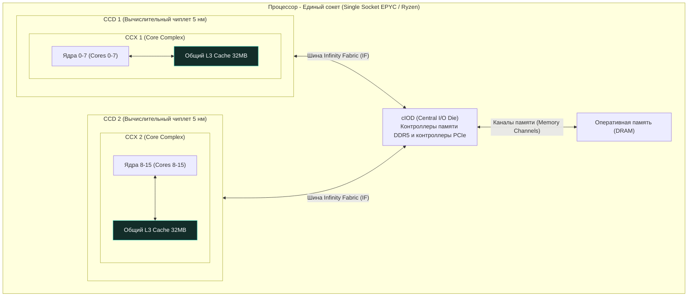

## Конец эпохи монолитов

В добрые старые времена закон Мура казался непоколебимым законом вселенной: каждые полтора-два года плотность транзисторов на кремниевой пластине удваивалась, и инженеры просто упаковывали всё больше вычислительных блоков на один кремниевый кристалл. Такой традиционный процессор в микроэлектронике называют **монолитным (Monolithic Die)** — в нем ядра, все уровни кэш-памяти, контроллеры оперативной памяти и шины ввода-вывода вытравлены на едином монолитном куске сверхчистого кремния.

Однако законы квантовой физики и экономики расставили безжалостные ловушки:
1. **Экономика брака и выход годных кристаллов (`Yields`):** Кремниевые пластины (Wafers) диаметром 300 мм никогда не бывают абсолютно идеальными — на них неизбежно оседают микроскопические дефекты решетки и пылинки. Если кристалл монолитного процессора имеет огромную площадь (например, 700–800 мм² для серверного гиганта на 56 или 64 ядра), вероятность попадания пылинки в критический узел стремится к 100%. Выход годных кристаллов (`Yields`) падает до катастрофических 10–20%, а стоимость каждого уцелевшего процессора улетает в стратосферу.
2. **Проблема теплоотвода и «темного кремния» (Dark Silicon):** Рассеивать 300–400 Вт тепла из крошечной монолитной точки кристалла становится физически невозможно без экзотического жидкостного охлаждения.

Инженерный прорыв, перевернувший мировую полупроводниковую индустрию (и триумфально популяризированный компанией AMD в микроархитектуре **AMD Zen**), получил название **Чиплеты (Chiplets)**. 

Вместо того чтобы печатать огромный рискованный суперчип, инженеры разделили процессор на несколько маленьких, компактных кристаллов и начали собирать процессор на подложке из текстолита как конструктор Lego. Дешевые в производстве маленькие кристаллы обладают выходом годных более 90%, а дефектный чиплет можно просто выбросить, не теряя весь процессор.

Для нас, бэкенд-разработчиков и системных инженеров Go, эта революция принесла фундаментальный тектонический сдвиг: **внутри одного физического сокета ядра CPU больше не равноправны**. Одинаковые с виду ядра находятся на разном расстоянии друг от друга, а скорость обмена данными между горутинами зависит от кремниевой топологии.

---

## Архитектура AMD: CCX, CCD и Infinity Fabric

Чтобы осознанно писать и профилировать высоконагруженные Go-сервисы на современных серверах (таких как AMD EPYC Rome, Milan, Genoa или десктопных Ryzen), необходимо понимать их анатомическое устройство.

Архитектура современного чиплетного процессора строится из четких строительных блоков:
1. **CCX (Core Complex)**: Базовый кремниевый кластер. Это группа ядер (в ранних версиях 4, в современных — ровно 8), которые делят между собой общий физический блок кэша третьего уровня (**L3 Cache**). Если две ваши горутины исполняются на ядрах внутри одного и того же CCX, они синхронизируют данные через общий L3-кэш на фантастической скорости (~10–12 наносекунд).
2. **CCD (Core Chiplet Die)**: Физический миниатюрный кристалл кремния (чиплет), изготовленный по самому передовому техпроцессу (например, 5 нм или 4 нм). В современных чипах (Zen 3, Zen 4, Zen 5) один CCD содержит ровно один монолитный CCX на 8 ядер и 32 МБ (или 96 МБ с 3D V-Cache) общего L3-кэша.
3. **cIOD (I/O Die)**: Большой вспомогательный кристалл, расположенный в геометрическом центре процессора. Он выполнен по более старому, дешевому и проверенному техпроцессу (например, 12 нм или 6 нм). На cIOD нет вычислительных ядер: здесь сосредоточены контроллеры оперативной памяти DDR4/DDR5, контроллеры шины PCIe/CXL и центральный коммуникационный хаб.
4. **Infinity Fabric (IF)**: Внутрипроцессорная высокоскоростная сеть с пакетной передачей данных, соединяющая каждый чиплет CCD с центральным кристаллом cIOD.



> [!info] Под капотом
> В микроархитектуре Zen 2 (серверные процессоры EPYC Rome) внутри одного физического кристалла CCD инженеры размещали *два* независимых CCX по 4 ядра в каждом, и у каждого CCX был свой изолированный кусок L3-кэша по 16 МБ. Это создавало чудовищную асимметрию задержек: если поток перепрыгивал с ядра 3 на ядро 4 в пределах одного чипа, доступ к данным замедлялся втрое!  
> Начиная с архитектуры Zen 3 инженеры AMD объединили все 8 ядер чиплета в единый монолитный CCX с цельным общим кэшем объемом 32 МБ. Это кардинально снизило внутричиплетные задержки (`Latency`) и дало мощный импульс производительности базам данных и Go-микросервисам.

---

## Архитектура Intel: Ring Bus и Mesh

Компания Intel исторически сохраняла верность монолитному дизайну намного дольше своего конкурента (вплоть до появления архитектур Sapphire Rapids и Meteor Lake). Однако даже на одном огромном монолитном кристалле кремния инженеры столкнулись с той же проблемой: как связать между собой десятки ядер, сегменты L3-кэша и контроллеры памяти?

### Ring Bus (Кольцевая шина)

В потребительских и десктопных процессорах Intel (линейки Core i5, i7, i9) применяется топология **Ring Bus**. Все ядра процессора, распределенные блоки общего L3-кэша, встроенная графика и системный агент нанизаны на двунаправленное скоростное кольцо из проводников.
* **Плюсы**: Сверхнизкая задержка (`Latency` < 5–7 наносекунд) и гигантская пропускная способность при небольшом количестве ядер (до 8–10 ядер).
* **Минусы**: Катастрофически плохая масштабируемость. Если попытаться замкнуть в кольцо 28 или 32 ядра, пакету данных придется совершать десятки тактов в пути от ядра №0 до ядра №16 на противоположной стороне кольца.

```
       +----> [ Core 0 ] ----> [ Core 1 ] ----> [ Core 2 ] ---->+
       |         |                 |                 |          |
       |         v                 v                 v          |
       |     [ L3 Block ]      [ L3 Block ]      [ L3 Block ]   |  Ring Bus
       |         ^                 ^                 ^          |
       |         |                 |                 |          |
       +<---- [ Core 5 ] <---- [ Core 4 ] <---- [ Core 3 ] <----+
```

### Mesh Architecture (Сетка)

Когда компании Intel потребовалось создавать серверные процессоры Xeon Scalable на 28, 40 и более ядер на кристалл, инженеры демонтировали кольцевую шину и внедрили топологию **Mesh (Двумерная сетка)**. 

Ядра, кэши и контроллеры шины расположены в виде матричной сетки (наподобие улиц и авеню на Манхэттене). На каждом пересечении установлен аппаратный маршрутизатор (Switch/Router). Пакеты с кэш-линиями перемещаются по координатной сетке алгоритмами `X-Y routing` (сначала по горизонтали, затем по вертикали).
* **Плюсы**: Высокая совокупная пропускная способность шины, простота добавления новых ядер и предсказуемая задержка даже на 64+ ядрах.
* **Минусы**: Базовая задержка между двумя физически соседними ядрами выше, чем на коротком Ring Bus (около 15–20 нс).

---

## Mechanical Sympathy: Micro-NUMA внутри одного сокета

В лекции [[31. NUMA. Non Uniform Memory Access]] мы подробно исследовали задержки доступа в многосокетных серверах, где путь к памяти соседа проходит через межсокетные шины (UPI / Infinity Fabric).

Но внедрение чиплетного дизайна привело к поразительному явлению: **сегодня даже один физический процессор в одном сокете является скрытой NUMA-системой (Micro-NUMA)**!

Рассмотрим хрестоматийный паттерн любого Go-бэкенда — пул рабочих горутин (`worker pool`). У нас есть буферизованный канал, в который одна горутина-продюсер отправляет входящие сетевые запросы, а 10 горутин-воркеров непрерывно вычитывают данные. Вспомним, что канал под капотом рантайма Go — это обычная структура памяти с внутренним мьютексом `sync.Mutex` и циклическим буфером (см. [[21. False Sharing и Cache Line Contention]]).

Что происходит в кремнии чиплетного процессора AMD EPYC?

```
СЦЕНАРИЙ А: Все горутины на CCD 1 (внутри одного CCX)
[Горутина 1] <--- Общий L3-кэш (32 МБ) ---> [Горутина 2]
               Задержка синхронизации: ~10 нс!

СЦЕНАРИЙ Б: Горутина 1 на CCD 1, а Горутина 2 на CCD 2
[Горутина 1 (CCD 1)] 
         |
         v (Infinity Fabric)
     [ cIOD (Центральный контроллер) ] 
         |
         v (Infinity Fabric)
[Горутина 2 (CCD 2)]
               Задержка синхронизации: ~40-60 нс!
```

1. **Идеальный сценарий (Intra-CCX):** Планировщик операционной системы распределил горутины продюсера и воркеров по ядрам внутри **одного CCX** (например, ядра с 0 по 7). Передача владения мьютексом канала происходит за доли такта через разделяемый L3-кэш. Задержка доступа составляет скромные **~10 наносекунд**.
2. **Кошмарный сценарий (Inter-CCD):** Планировщик Linux раскидал горутины по разным кристаллам: продюсер работает на CCD 1, а воркер — на CCD 2. 
   В кэше L3 второго чиплета этих данных нет. Физическое ядро на CCD 2 вынуждено послать пакет запроса через шину `Infinity Fabric` в кристалл `cIOD`, оттуда запрос перенаправляется по шине в чиплет CCD 1, инвалидирует строку кэша продюсера по протоколу когерентности, упаковывает 64 байта в сетевой пакет и транспортирует обратно в CCD 2. Задержка подскакивает до **40–60+ наносекунд**!

Если ваше приложение активно обменивается общими данными между горутинами через глобальные мьютексы или каналы, добавление ядер в чиплетном процессоре способно не ускорить, а катастрофически замедлить систему.

> [!warning] Ловушка / Gotcha
> Вы запускаете профилирование, замечаете высокую нагрузку и решаете увеличить переменную `GOMAXPROCS` с 8 до 16, ожидая двукратного ускорения. Однако после перезапуска latency сервиса подскакивает на 30%, а утилизация процессора растет при неизменном RPS!
> **В чем причина?** На 8 ядрах все горутины вашего сервиса мирно помещались в один чиплет CCD и мгновенно согласовывали кэш-линии через локальный L3-кэш. Как только вы выставили `GOMAXPROCS = 16`, рантайм Go задействовал второй чиплет CCD. Шина `Infinity Fabric` моментально захлебнулась во встречном служебном трафике протокола когерентности кэшей (Cache Coherence Traffic), а ядра встали в очередях ожидания.

### Как с этим жить бэкендеру на Go?

Планировщик Go (`runtime.scheduler`) спроектирован очень тщательно. Он использует эвристику локальности кэша и старается удерживать исполняемую горутину (`G`) на одном и том же логическом процессоре (`P`) и системном потоке ОС (`M`), чтобы сохранить прогретыми кэши данных L1/L2 (см. [[18. Кэши CPU. L1, L2, L3 и Cache Line]]).

Однако планировщик Go **абсолютно слеп к кремниевой топологии CCX, CCD и шин Infinity Fabric**! Он видит плоский список процессоров от `0` до `N-1`, предоставляемый ядром операционной системы. 

В высоконагруженных системах (таких как распределенные базы данных, брокеры сообщений или HFT-шлюзы) системные инженеры берут управление в свои руки:

1. **CPU Pinning (Изоляция ядер через маски сродства)**: С помощью системных утилит `taskset` или настроек cgroups контейнера процесс приложения жестко привязывается к диапазону ядер одного чиплета CCX (например, `taskset -c 0-7 ./my_go_service`). Если приложению требуется 32 ядра, запускают 4 изолированных экземпляра микросервиса, каждый из которых заперт внутри своего 8-ядерного CCD.
2. **Share-Nothing Архитектура (Разделяй и властвуй)**: Проектирование софта ведется по принципу полного отказа от глобально разделяемой памяти. Воркеры получают изолированные фрагменты данных (партиции/шарды), не используют общие мьютексы и не пишут в централизованные каналы. Каждая горутина работает только со своим локальным состоянием, а объединение результатов происходит пакетно на финальной стадии.

> [!tip] Собеседование
> **Вопрос:** Мы проектируем in-memory кэш на Go. На 64-ядерном сервере AMD EPYC (8 чиплетов CCD) мы наблюдаем тяжелую деградацию пропускной способности при операциях записи. Профилировщик `pprof` показывает, что 80% процессорного времени потоки проводят в ожидании `sync.RWMutex`. Что происходит на физическом уровне железа и как это исправить?
> **Ответ:** 
> 1. **На уровне железа**: Захват мьютекса на запись — это атомарная инструкция CAS (`LOCK CMPXCHG`), требующая эксклюзивного владения кэш-линией (состояние *Modified* в протоколе MESI). 64 ядра из 8 разных чиплетов CCD одновременно пытаются захватить одну и ту же 64-байтовую строку. Линия непрерывно пересылается между кристаллами через шину `Infinity Fabric`, вызывая шторм инвалидации кэшей (Cache Coherence Invalidation Storm). Шина перегружается, а ядра тратят сотни тактов на ожидание.
> 2. **Архитектурное решение**: Внедрить **шардирование блокировок (Lock Sharding)**. Вместо одной монолитной структуры с одной блокировкой мы создаем слайс из 64 или 256 независимых шардов (отдельных структур `map`, каждая со своим `sync.RWMutex`). Хэш ключа определяет номер шарда (`hash(key) % numShards`). В результате горутины обращаются к разным адресам памяти в разных кэш-линиях, межчиплетный трафик падает до нуля, а масштабируемость становится линейной.

---

## Итоги раздела

Появление чиплетного компонования (CCX, CCD), скоростных кольцевых шин (`Ring Bus`) и координатных сеток (`Mesh`) окончательно похоронило наивную иллюзию о том, что «все ядра внутри процессора равноудалены друг от друга».

Современный процессор — это не просто вычислитель, это высокоскоростная локальная вычислительная сеть на кремнии (**Network-on-Chip, NoC**). Стоимость пересылки даже одного байта между горутинами, оказавшимися на разных чиплетах, в 4–6 раз превышает обмен внутри одного кристалла. Для создания по-настоящему быстрого кода на Go мы обязаны минимизировать разделяемое состояние (shared state) и сочувствовать топологии кремния.

На этом мы триумфально завершаем изучение внутреннего устройства процессора, памяти и кремниевой адресации. Мы изучили транзисторы, конвейеры, суперскалярность, кэши, виртуальные страницы, TLB и чиплеты. Наш процессор разогрет, кэш-линии заполнены, а инструкции готовы к исполнению.

Но как процессор понимает, когда нужно приостановить выполнение пользовательского кода на Go и передать бразды правления ядру операционной системы? Как операционная система Linux перехватывает управление при нажатии клавиши, поступлении сетевого пакета или системной ошибке?

Переходим к четвертому блоку архитектуры компьютера — системному вводу-выводу: [[34. Аппаратные прерывания и Системные вызовы]].