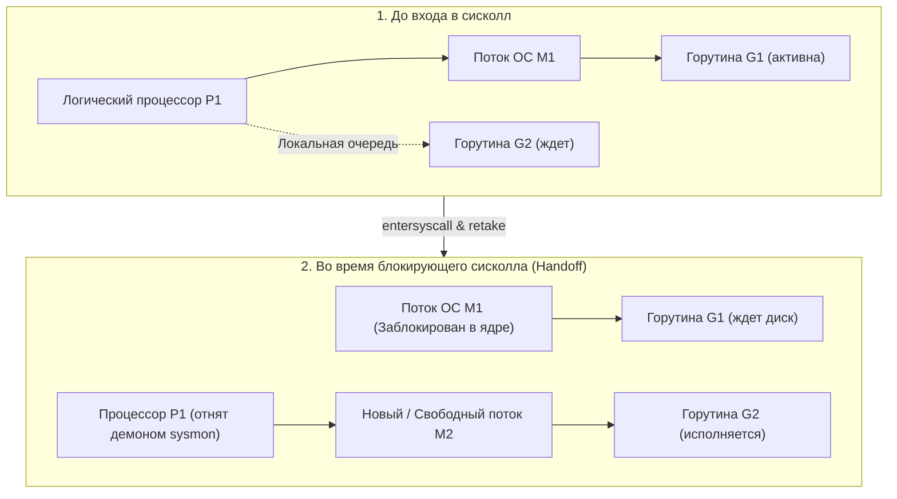

## Граница двух миров

В предыдущих главах мы разобрали центральный процессор буквально до мельчайших кремниевых вентилей. Мы изучили кэши, конвейеры, суперскалярное исполнение, виртуальные страницы памяти и чиплетные топологии. Мы увидели, с какой головокружительной скоростью CPU способен перемалывать данные внутри своих регистров.

Но если бы процессор умел только крутить вычисления в регистрах, он остался бы бесполезной кремниевой грелкой — абстрактным калькулятором в безвоздушном пространстве. Компьютер становится полезным сервером лишь тогда, когда он умеет взаимодействовать с внешним миром: принимать сетевые пакеты по оптоволокну, сохранять транзакции на NVMe-диск, опрашивать таймеры и подчиняться командам операционной системы.

Как процессору общаться с этим хаотичным зоопарком внешних устройств?

Первая наивная мысль начинающего программиста — заставить ядро CPU непрерывно в бесконечном цикле опрашивать сетевую карту или контроллер диска: «Есть данные? А сейчас? А теперь?». Это называется активным опросом (`busy wait` или polling). Но на скорости работы периферии процессор сжег бы 100% своего драгоценного времени впустую, сжигая электроэнергию и не выполняя полезного кода.

Инженеры Bell Labs и архитекторы микросхем нашли изящный дуальный механизм:
1. Когда внешнему миру что-то нужно от процессора — генерируются **Прерывания (Interrupts)**.
2. Когда вашей Go-программе что-то нужно от внешнего мира — она совершает **Системные вызовы (Syscalls)**.

Эти два механизма — фундаментальный мост между кодом прикладного программиста и физической реальностью кремния.

---

## Что такое прерывание?

**Прерывание (Interrupt)** — это аппаратный или микропрограммный сигнал, который предписывает процессору немедленно приостановить выполнение текущей последовательности инструкций, надежно сохранить текущее состояние и переключиться на исполнение специальной подпрограммы операционной системы — **Обработчика прерываний (Interrupt Handler или ISR — Interrupt Service Routine)**.

### Физическая аналогия с дверным звонком

Представьте, что вы сидите в кресле и читаете захватывающий детектив (процессор исполняет ваш Go-код).
- **Схема с `busy wait`:** Каждые три секунды вы откладываете книгу, встаете с кресла, подходите к входной двери, открываете ее, смотрите на пустую лестничную площадку, возвращаетесь, садитесь и снова ищете строку, на которой остановились. Прочитать книгу при таком подходе невозможно!
- **Схема с прерыванием (Interrupt):** Вы спокойно читаете книгу в свое удовольствие. Входная дверь оборудована электрическим звонком. Когда курьер доставил пиццу, звенит звонок. Вы вкладываете в книгу закладку с номером страницы (сохраняете регистры `PC/RIP` и флаги в стек), идете к двери, расписываетесь и забираете коробку (выполняется код ядра ОС), возвращаетесь в кресло, открываете книгу по закладке и мгновенно продолжаете чтение с того же полуслова.

### 1. Аппаратные прерывания (Hardware Interrupts)

Аппаратные прерывания порождаются физическими микросхемами и контроллерами на материнской плате. Через специальный программируемый контроллер прерываний (**APIC — Advanced Programmable Interrupt Controller**) электрический импульс поступает на специальную ножку ядра CPU:
* **Таймер (Timer Interrupt)**: Метроном и пульс всей операционной системы. Каждые несколько миллисекунд (или микросекунд) аппаратный таймер «бьет в набат» ядра CPU. Именно благодаря таймеру планировщик Linux (CFS) вытесняет жадные потоки и распределяет процессорное время между процессами. Если бы не прерывания таймера, простейший бесконечный цикл `for {}` без системных вызовов захватил бы процессорное ядро и повесил бы операционную систему навсегда!
* **Сетевая карта (NIC)**: Получив кадр Ethernet из физической среды, контроллер сетевой карты складывает его в память и бьет тревогу: «Пакет прибыл, заберите его из кольцевого буфера!».
* **Диск/NVMe**: Контроллер накопителя сообщает ядру: «Блок данных размером 4 КБ успешно вычитан из ячеек флэш-памяти и скопирован в системную память».

### 2. Программные прерывания и Исключения (Exceptions)

Эти сигналы генерируются не внешними проводами, а самой логикой процессорного ядра при возникновении особых ситуаций во время декодирования или исполнения кода:
* **Page Fault (Отказ страницы)**: Мы детально разбирали его в статье [[28. Page Table, MMU и трансляция адресов]]. Когда программа обращается по виртуальному адресу, для которого в MMU отсутствует физическая страница, ядро генерирует архитектурное прерывание, чтобы ОС загрузила страницу с диска или выделила новый физический фрейм.
* **Исключения процессора (Faults, Traps, Aborts)**: Попытка деления на ноль, обращение к несуществующей инструкции или нарушение защиты памяти. Процессор аппаратно останавливает программу, обращается к ОС, а ядро посылает процессу сигналы `SIGFPE`, `SIGILL` или `SIGSEGV`, что в среде Go трансформируется в панику рантайма (`runtime panic`).
* **Syscall (Системный вызов)**: Осознанное, спланированное программное прерывание, с помощью которого прикладной код добровольно стучится в двери ядра.

---

## Системные вызовы (Syscalls): Врата в Kernel Space

Любая программа на Go по умолчанию выполняется в непривилегированном пользовательском режиме процессора (**User Space, Ring 3**). Архитектура x86-64 и ARM64 на аппаратном уровне блокирует для Ring 3 прямое исполнение опасных команд (запись в управляющие регистры `CR0/CR3`, отключение прерываний `CLI`, прямой доступ к портам ввода-вывода). 

Это фундаментальный принцип безопасности: ошибка разработчика или вредоносный код не должны иметь возможности уничтожить файловую систему или прочитать чужие секреты из памяти соседей.

Если приложению нужно вывести текст на экран, открыть файл на диске или передать байты по сети, оно обязано вежливо обратиться к полновластному хозяину машины — ядру операционной системы (**Kernel Space, Ring 0**). Такой запрос и называется **Системным вызовом (Syscall)**.

### Механика системного вызова (x86_64)

Представьте вызов, с которого начинается знакомство любого инженера с языком Go:
```go
fmt.Println("Hello")
```
Под капотом стандартная библиотека Go форматирует строку и обращается к системному вызову `write`. На физическом уровне процессора разворачивается следующая строгая церемония:

1. Рантайм Go помещает уникальный числовой идентификатор сисколла в регистр `RAX` (для сисколла `write` в Linux x86_64 это число `1`).
2. Аргументы функции раскладываются по соглашению об ABI в регистры `RDI` (файловый дескриптор `stdout = 1`), `RSI` (указатель на массив байтов `"Hello\n"` в памяти) и `RDX` (длина буфера = 6).
3. Процессор выполняет специализированную ассемблерную инструкцию `SYSCALL` (пришедшую на смену устаревшему и медленному программному прерыванию `INT 0x80`).
4. Ядро процессора за доли наносекунды осуществляет аппаратный фазовый переход:
   * Повышает уровень привилегий с Ring 3 до Ring 0 (`Kernel Space`).
   * Переключает указатель стека с пользовательского стека горутины (`RSP`) на защищенный стек ядра операционной системы (TSS / Kernel Stack).
   * Считывает защищенный адрес точки входа ядра из специального моделезависимого регистра `MSR` (`IA32_LSTAR`) и передает туда управление.
5. Диспетчер ядра Linux валидирует переданные указатели, проверяет права доступа процесса, копирует данные в буфер терминала и исполняет возвратную инструкцию `SYSRET`.
6. Процессор мгновенно переключается обратно в Ring 3 и возвращает управление Go-коду.

> [!warning] Ловушка / Gotcha
> Системный вызов — это **чрезвычайно дорогая операция** с точки зрения Mechanical Sympathy. 
> Переключение контекста между Ring 3 и Ring 0 принудительно сбрасывает суперскалярный конвейер инструкций, инвалидирует таблицы спекулятивного предсказания ветвлений и требует от процессора нескольких сотен драгоценных тактов. После патчей против атак Spectre/Meltdown (механизм KPTI — Kernel Page Table Isolation) стоимость каждого сисколла дополнительно возросла.
> 
> Именно поэтому стандартный пакет `bufio` в Go жизненно необходим каждому бэкендеру! Запись в файл или сетевой сокет по одному байту убьет сервис тысячами бесполезных сисколлов `write`. Использование `bufio.Writer` накапливает данные в пользовательской памяти (User Space) и сбрасывает их на диск одним системным вызовом размером в 4 или 64 КБ, сокращая накладные расходы ядра в тысячи раз.

---

## Go Runtime и магия Системных вызовов

Вот здесь раскрывается истинное величие инженерной мысли создателей языка Go.

В традиционных средах разработки со старыми потоковыми моделями (стандартный C/C++, Java, Ruby, PHP) системный вызов жестко блокирует системный поток операционной системы (Thread). Если ваше приложение создаст 1000 потоков и каждый поток выполнит синхронное чтение из сокета или файла, все 1000 потоков ОС погрузятся в глубокий сон. Ядро операционной системы захлебнется в тысячах переключений контекста (`Context Switch`), память уйдет на хранение стеков (по 8 МБ на поток), и сервер потерпит крах.

Рантайм языка Go полностью переосмыслил взаимодействие с ядром через трехзвенную модель планировщика: **Горутины (`G`)**, **Системные потоки ОС (`M`)** и **Логические процессоры (`P`)**.

Архитектура Go делит все системные вызовы на два принципиально разных класса: **Блокирующие** (файловый ввод-вывод, CGO) и **Неблокирующие** (сетевой ввод-вывод).

### 1. Блокирующие Syscalls (Файлы, CGO)

В ядре Linux традиционные операции с дисковыми файлами долгое время оставались синхронными (интерфейс `io_uring` лишь недавно начал проникать в производственные базы данных). Поэтому вызов `os.ReadFile` или `os.Open` неизбежно погружает вызвавший его поток ядра в сон.

Как планировщик Go элегантно выходит из этой ситуации?

1. Горутина `G1` собирается прочитать фрагмент файла с диска.
2. Перед выполнением инструкции `SYSCALL` рантайм вызывает внутреннюю функцию `entersyscall`. Состояние регистров горутины `G1` бережно сохраняется в ее дескрипторе.
3. Поток операционной системы `M1`, на котором исполнялась горутина `G1`, уходит в ядро Linux и засыпает на время считывания секторов диска. Поток `M1` заблокирован.
4. **Handoff (Передача процессора)**: Фоновый сторожевой демон рантайма Go — `sysmon` (System Monitor), работающий в отдельном бесконечном цикле без привязки к `P`, видит, что процессор `P1` простаивает, так как поток `M1` завис в системном вызове дольше определенного кванта времени.  
   Механизм Handoff отрывает логический процессор `P1` от спящего потока `M1` и передает его свободному системному потоку `M2` (или порождает новый поток ОС).
5. Поток `M2` немедленно приступает к выполнению других горутин из очереди `P1`. Вычислительная мощность машины не простаивает ни единого такта!
6. Когда контроллер накопителя завершает чтение секторов и генерирует аппаратное прерывание, поток `M1` просыпается, выполняет `exitsyscall` и пытается вновь занять свободный логический процессор `P`. Если все процессоры `P` заняты полезной работой, горутина `G1` отправляется в глобальную очередь задач (**Global Run Queue**), а освободившийся поток `M1` усыпляется и помещается в пул резервных потоков рантайма.



> [!tip] Собеседование
> **Вопрос:** Вы написали микросервис на Go, который запустил 10 000 параллельных горутин, и каждая горутина одновременно выполняет вызов `os.ReadFile` для чтения тяжелого лог-файла с медленного сетевого хранилища NFS. Что произойдет с приложением на уровне операционной системы?
> **Ответ:** Произойдет лавинообразный рост числа потоков ОС (`M`). Поскольку каждый системный вызов к файлу блокирует поток ОС, демон `sysmon` будет непрерывно спасать процессоры `P`, создавая все новые и новые потоки `M` через `clone()`. Когда суммарное число потоков ОС достигнет жесткого лимита рантайма Go (по умолчанию `debug.SetMaxThreads` равен **10 000**), приложение мгновенно упадет с критической ошибкой: `fatal error - thread exhaustion`.
> **Решение:** Никогда не запускать неограниченный файловый ввод-вывод в горутинах! Для работы с файлами всегда используйте паттерн **Worker Pool** или ограничивающий семафор на буферизованном канале, чтобы количество одновременных вызовов `os.Open` не превышало разумного значения (например, удвоенного числа ядер CPU).

### 2. Неблокирующие Syscalls (Сеть и Netpoller)

Если бы для обслуживания сетевых запросов Go использовал блокирующие системные вызовы, наш сервер никогда бы не смог держать миллион одновременных TCP-соединений. Сетевая модель Go построена совершенно иначе благодаря встроенному в рантайм компоненту — **Netpoller**.

Netpoller — это высокопроизводительный платформонезависимый слой абстракции над механизмами мультиплексирования ввода-вывода ядра ОС: `epoll` в Linux, `kqueue` в macOS/BSD и `IOCP` в Windows.

Как устроен прием и чтение данных из TCP-сокета в Go:
1. Вы пишете максимально простой, линейный и очевидный код:
   ```go
   data := make([]byte, 1024)
   n, err := conn.Read(data)
   ```
2. Под капотом рантайм Go при создании любого сетевого соединения переводит файловый дескриптор сокета в неблокирующий режим с помощью флага `O_NONBLOCK`.
3. Когда ваш код вызывает `conn.Read`, рантайм делает системный вызов `read`. Если данных в сетевом буфере ядра еще нет, вызов мгновенно возвращает управление в User Space со специфической ошибкой ядра `EAGAIN` или `EWOULDBLOCK` («данных пока нет, повторите позже»).
4. Рантайм Go не паникует и **не блокирует системный поток ОС (`M`)**! Вместо этого он регистрирует дескриптор сокета в системном селекторе `epoll` ядра Linux.
5. Сама горутина переводится в состояние `waiting` (паркуется через `gopark`), освобождая поток `M` для других горутин. Процессор `P` и поток `M` остаются свободными и немедленно берут в работу следующую горутину из очереди. Никаких новых потоков не создается!
6. Когда в сетевую карту поступают физические Ethernet-пакеты, контроллер карты генерирует аппаратное прерывание. Сетевой стек Linux собирает TCP-сегменты, складывает их в буфер сокета и помечает дескриптор в структуре `epoll` как готовый к чтению.
7. Фоновый поток `sysmon` или сам планировщик Go при поиске задач регулярно опрашивает `epoll_wait`. Обнаружив готовый дескриптор, рантайм извлекает спящую горутину из ожидания, переводит ее статус в `runnable` и ставит в локальную очередь процессора `P`.
8. Горутина просыпается ровно на той же строчке кода и успешно считывает прибывшие байты из сокета!

В этом заключается один из величайших триумфов архитектуры Go: программист пишет кристально ясный, синхронный код без «ада колбэков» (callback hell) и сложных промисов, а рантайм превращает его в ультраэффективную асинхронную конечную машину состояний (**State Machine**), утилизирующую ядра процессора на 100%.

---

## Итог

Подведем фундаментальные итоги работы с прерываниями и системными вызовами:

1. **Аппаратные прерывания** — это физический дверной звонок процессора, позволяющий железу (таймерам, дискам, сетевым адаптерам) асинхронно привлекать внимание CPU без напрасной траты ресурсов в циклах активного ожидания (`busy wait`).
2. **Системные вызовы (Syscalls)** — это контролируемые врата перехода из непривилегированного User Space (Ring 3) в Kernel Space (Ring 0). Это тяжелая операция, сбрасывающая конвейер и требующая сотен тактов процессора.
3. **Буферизация — лучший друг бэкендера**: Использование пакета `bufio` спасает приложение от деградации за счет группировки тысяч микроскопических записей в один системный вызов.
4. **Умный Handoff при блокировках**: В операциях с файлами рантайм Go блокирует поток ОС, но отвязывает логический процессор `P` с помощью `sysmon`, сохраняя вычислительный темп остальных горутин.
5. **Netpoller и миллионы соединений**: Сетевой ввод-вывод в Go всегда неблокирующий (`O_NONBLOCK`). Парковка горутин через `epoll/kqueue` позволяет удерживать колоссальное количество одновременных сетевых подключений при ничтожном потреблении памяти.

Мы поняли, как процессор переключает внимание между ядром ОС и прикладным кодом. Но как сами гигабайты сетевых пакетов и дисковых блоков физически переносятся с контроллеров в микросхемы оперативной памяти? Неужели ядро процессора само вручную копирует каждый байт в регистрах?

Чтобы раскрыть секрет технологии, избавившей процессор от рутины перемещения байт, в следующей лекции мы разберем: [[35. IO подсистема. Шины, Контроллеры и DMA]].