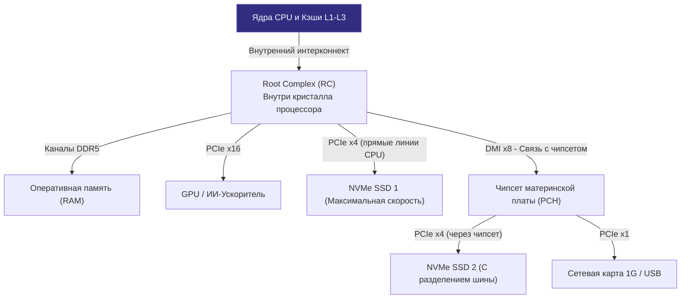

## Анатомия транспортной артерии

В предыдущей главе [[35. IO подсистема. Шины, Контроллеры и DMA]] мы узнали, что центральный процессор давно освобожден от унизительной роли складского грузчика. Аппаратный механизм DMA позволяет дискам и сетевым адаптерам пересылать гигабайты данных напрямую в микросхемы оперативной памяти.

Но здесь возникает естественный инженерный вопрос: по каким физическим «рельсам» и дорогам несутся эти данные?

Если вы снимете крышку современного двухсокетного сервера, перед вашим взором предстанет настоящая цифровая магистраль:
* Двухпортовая сетевая карта на 100 или 200 Гбит/с, ежесекундно перемалывающая миллионы сетевых кадров;
* Массив из четырех корпоративных NVMe SSD-накопителей, каждый из которых считывает данные со скоростью свыше 7 ГБ/с;
* Пара графических ускорителей (GPU) или специализированных тензорных чипов для инференса нейросетей, требующих колоссальной полосы пропускания.

Суммарный поток данных (**Bandwidth**) от этих устройств легко переваливает за 100–200 Гигабайт в секунду! 

Какая системная шина способна пропустить этот гигантский цунами байтов сквозь материнскую плату прямо в оперативную память без пробок и задержек? Такой шиной является **PCIe (Peripheral Component Interconnect Express)**.

---

## От общей шины к коммутируемой сети

На заре персональных компьютеров шины ввода-вывода были в буквальном смысле **параллельными и разделяемыми (Shared Bus)**. 

Классические стандарты ISA и PCI 1990-х годов представляли собой жгут из 32 или 64 параллельных медных дорожек, вытравленных на текстолите материнской платы. К этим общим проводам параллельно подпаивались все слоты расширения.

Эта схема работала в точности как старый сетевой концентратор (Ethernet Hub):
* Среда передачи была общей: если одно устройство (например, звуковая карта) транслировало байты, все остальные устройства на шине обязаны были молчать и ждать.
* При попытке поднять тактовую частоту шины выше 33–66 МГц физика встала на дыбы: длина дорожек на плате слегка различалась, и фронты сигналов на соседних проводах начали приходить в разное время. Это явление называется **рассинхронизацией сигналов (Clock Skew)**. Кроме того, параллельные проводники создавали взаимные электромагнитные наводки (Cross-talk).

Инженеры поняли, что параллельные шины зашли в тупик. Было принято смелое и радикальное решение, определившее облик вычислительных систем XXI века:

> **PCIe — это вовсе не «шина» в привычном понимании слова. Это высокоскоростная, последовательная (Serial) локальная вычислительная сеть прямо на материнской плате, построенная по топологии «точка-точка» (Point-to-Point).**

### Линии (Lanes) и масштабируемость

Вместо широкого пучка медленных параллельных проводов в основу PCIe заложена концепция независимых последовательных **линий (Lanes)**.

Каждая линия PCIe физически состоит всего из двух дифференциальных пар проводников:
* Две дорожки для передачи данных (**TX** — Transmit);
* Две дорожки для приема данных (**RX** — Receive).

Данные передаются строго последовательно, бит за битом, в дуплексном режиме, но на колоссальной тактовой частоте (измеряемой в гигагерцах). 

Чтобы увеличить пропускную способность для прожорливых устройств, архитекторы не стали расширять шину, а позволили объединять несколько линий в единый логический канал:
* **x1 (одна линия)**: Используется для нетребовательной периферии — простых сетевых адаптеров на 1 Гбит/с, звуковых карт или плат сбора данных.
* **x4 (четыре линии)**: Общепринятый золотой стандарт для современных скоростных твердотельных накопителей NVMe SSD (форм-факторы M.2 и U.2).
* **x8 и x16 (восемь и шестнадцать линий)**: Используются для видеокарт (GPU), ускорителей вычислений и серверных сетевых адаптеров на 100, 200 и 400 Гбит/с.

> [!info] Под капотом
> Каждое новое поколение стандарта PCIe удваивает полезную пропускную способность одной линии за счет повышения частоты и оптимизации схем кодирования сигнала:
> * **PCIe 3.0**: обеспечивает ~1 ГБ/с на одну линию (слот NVMe x4 выдает до 4 ГБ/с).
> * **PCIe 4.0**: обеспечивает ~2 ГБ/с на одну линию (тот же слот NVMe x4 разгоняется уже до 8 ГБ/с).
> * **PCIe 5.0**: обеспечивает ~4 ГБ/с на одну линию (слот NVMe x4 достигает невероятных 16 ГБ/с, а слот x16 — до 64 ГБ/с в каждую сторону!).
> * **PCIe 6.0**: удваивает скорость до ~8 ГБ/с на линию за счет перехода на амплитудно-импульсную модуляцию PAM4.

---

## Топология PCIe: Сеть под микроскопом

Поскольку PCIe спроектирована как пакетная компьютерная сеть, она обладает четкой сетевой иерархией:

1. **Root Complex (RC)**: Главный сетевой маршрутизатор и шлюз («Корневой комплекс»). В современных микроархитектурах (Intel Core/Xeon, AMD Ryzen/EPYC) Root Complex физически интегрирован непосредственно в кристалл процессора (вспомните центральный кристалл `cIOD`, который мы разбирали в [[33. Архитектура современных CPU. Chiplet, CCX, CCD, Ring Bus, Mesh]]). Именно Root Complex связывает слоты PCIe с контроллером оперативной памяти DDR4/DDR5 и внутренними кэшами CPU.
2. **Endpoint (EP)**: Оконечные узлы сети — ваши NVMe-накопители, сетевые карты или дискретные GPU.
3. **Switch (Коммутатор шины)**: Специализированная микросхема-свитч, позволяющая мультиплексировать несколько устройств в ограниченное число процессорных линий PCIe (точно так же, как офисный Ethernet-коммутатор).



> [!warning] Ловушка / Gotcha
> Обратите пристальное внимание на архитектурную схему выше. Если вы приобретете два идентичных флагманских диска NVMe со скоростью чтения 7 ГБ/с и подключите один в слот, идущий напрямую к процессору (`NVMe1`), а второй — в слот, подключенный к чипсету материнской платы (`NVMe2`), вы с удивлением обнаружите колоссальную разницу в задержках и пропускной способности!  
> Трафик накопителя `NVMe2` пойдет через чипсет (**PCH**) по промежуточной шине **DMI** (Direct Media Interface), которая делит полосу пропускания с USB-портами, звуковым кодеком, SATA и сетевым интерфейсом. Под пиковой нагрузкой шина DMI превратится в узкое горлышко. В надежных высоконагруженных серверах баз данных накопители и быстрые сетевые карты всегда подключаются *исключительно* к процессорным линиям PCIe.

---

## Пакеты и TLP (Transaction Layer Packet)

Поскольку PCIe является сетью, передача байтов по ней происходит не сплошным аналоговым потоком, а дискретными стандартизированными пакетами. Они называются **TLP (Transaction Layer Packet — Пакеты уровня транзакций)**.

Когда DMA-контроллер на сетевом адаптере или диске хочет передать вычитанный блок данных в оперативную память, он упаковывает данные в TLP-пакет типа `Memory Write`:

```
+-------------------------------------------------------------------------------+
| Header (Заголовок, 12-16 байт) | Payload (Полезная нагрузка) | CRC (4 байта)  |
| - Тип команды: Memory Write    | - Сырые данные от 1 байта   | - Аппаратная   |
| - Физический адрес памяти RAM  |   до 4096 байт (Data Block) |   контрольная  |
| - Идентификатор отправителя    |                             |   сумма        |
+-------------------------------------------------------------------------------+
```

1. **Header (Заголовок)**: Содержит физический 64-битный адрес оперативной памяти, куда предназначаются данные, длину пакета и метаданные транзакции.
2. **Payload (Полезная нагрузка)**: Непосредственно полезные байты — от 1 байта до 4096 байт (максимальный размер пакета Payload определяется параметром `Max Payload Size`).
3. **CRC (Контрольная сумма)**: Аппаратный код проверки целостности на лету (LCRC на канальном уровне и ECRC на уровне транзакций).

Пакет летит по медным дорожкам в процессорный Root Complex. Маршрутизатор Root Complex распаковывает TLP-пакет и направляет данные напрямую в контроллер оперативной памяти, где они оседают в физической памяти RAM. Ядра центрального процессора об этом даже не догадываются — пока контроллер устройства не отправит специальный TLP-пакет прерывания (**MSI-X** — Message Signaled Interrupts Extended), который заставит ядро Linux обработать готовые данные.

---

## Mechanical Sympathy: Kernel Bypass и Go

А теперь перейдем к высшему пилотажу системной инженерии. Как знание архитектуры PCIe помогает инженерам выжимать экстремальную производительность в Go-бэкендах, брокерах сообщений и базах данных?

Вспомним классический цикл обработки входящего сетевого пакета:
1. Сетевая карта складывает кадр в память через DMA (генерируя TLP `Memory Write`).
2. Карта отправляет процессору сигнал прерывания `MSI-X` (см. [[34. Аппаратные прерывания и Системные вызовы]]).
3. Ядро Linux прерывает выполнение полезного кода, выполняет переключение контекста, запускает softirq и копирует пакет из буфера драйвера в буфер сокета пользовательского процесса.
4. Ваша горутина считывает данные через сетевой сокет.

На скорости сетевых интерфейсов в 100 Гбит/с этот классический стек ядра Linux захлебывается: миллионы прерываний в секунду и постоянные переключения контекста сжигают 100% мощности процессора только на обслуживание сетевого стека ядра!

### DPDK, SPDK и современные AF_XDP (Обход ядра)

Чтобы полностью раскрыть потенциал аппаратных линий PCIe, в индустрии применяются технологии обхода ядра (**Kernel Bypass**): фреймворк **DPDK** (для сетевых адаптеров) и **SPDK** (для NVMe-накопителей).

Как устроен Kernel Bypass на уровне железа:
1. Операционная система Linux «отбирает» PCIe-устройство у стандартного драйвера ядра с помощью подсистемы `VFIO` (Virtual Function I/O).
2. Регистры управления устройства (**BAR — Base Address Registers**) и кольцевые буферы (Ring Buffers) проецируются напрямую в виртуальное адресное пространство вашего пользовательского процесса (User Space) с использованием Huge Pages (см. [[30. Huge Pages и Transparent Huge Pages]]).
3. Ваша программа на Go (через специализированные CGO-биндинги или современный интерфейс **AF_XDP** — XDP Sockets) получает прямой доступ к кольцевым буферам сетевой карты в оперативной памяти.
4. **Аппаратные прерывания полностью отключаются!** Выделенная горутина Go, жестко привязанная к физическому ядру CPU, крутится в плотном бесконечном цикле `for {}`, непрерывно опрашивая (polling) кольцевой буфер в памяти.

Вместо того чтобы ждать прерываний от ОС, процессор сам за доли наносекунд подхватывает поступающие пакеты. Да, такое ядро процессора загружено на 100%, но задержка сетевого отклика (**Latency**) падает с 30–50 микросекунд до невероятных **1–2 микросекунд**!

> [!tip] Собеседование
> **Вопрос:** Мы разрабатываем ультраскоростную распределенную базу данных на Go. Сервер двухсокетный (NUMA-архитектура). Мы установили передовой накопитель PCIe 4.0 NVMe с паспортной скоростью 7 ГБ/с. Синтетический бенчмарк `fio` подтверждает скорость 7 ГБ/с. Однако наша Go-программа под нагрузкой способна выжать максимум 3.2 ГБ/с, а профилировщик `pprof` не находит узких мест в кодовой базе. В чем физическая причина просадки скорости?
> **Ответ:** Вы столкнулись с классической топологической ловушкой NUMA (о которой мы говорили в главе [[31. NUMA. Non Uniform Memory Access]]).  
> Линии слота PCIe физически разведены по материнской плате и припаяны к шинам **Root Complex конкретного процессорного сокета** (например, Socket 0 / Node 0).  
> Если планировщик операционной системы запустил Go-процесс на ядрах сокета 1 (Node 1), то каждый TLP-пакет от диска должен сначала пройти через Root Complex первого процессора, затем пробиться через межпроцессорную шину UPI/Infinity Fabric во второй сокет, и только затем попасть в кэш и память программы. Межсокетный интерконнект становится непреодолимым бутылочным горлышком.  
> **Решение:** Проверить аппаратную привязку слота через `/sys/bus/pci/devices/.../numa_node` и запускать Go-сервис строго на родном NUMA-узле с помощью утилиты `numactl --cpunodebind=0 --membind=0 ./my_database`. Скорость мгновенно вернется к 7 ГБ/с!

---

## Итог

Подведем итоги нашего исследования главной транспортной артерии современного компьютера:

1. **PCIe — это не параллельная шина, а пакетная сеть**: Топология «точка-точка» с последовательной передачей данных избавила архитектуру от проблем рассинхронизации сигналов (`Clock Skew`) и обеспечила невероятную масштабируемость.
2. **Линейная гибкость**: Скорость легко наращивается объединением линий (**Lanes: x1, x4, x8, x16**), а каждое новое поколение PCIe удваивает пропускную способность.
3. **Аппаратный Root Complex**: Главный сетевой коммутатор интегрирован непосредственно в кристалл CPU, направляя **TLP-пакеты** периферийных устройств прямо в контроллер оперативной памяти через механизмы прямого доступа (DMA).
4. **Опасность чипсетных мостов**: Подключение критически важных накопителей и сетевых карт через чипсетные слоты (PCH / DMI) создает риск просадок производительности из-за разделения общей шины.
5. **Kernel Bypass и AF_XDP**: Знание устройства PCIe позволяет в исключительных highload-сценариях на Go обходить системный стек ядра Linux, опрашивая память контроллера напрямую и достигая микросекундных задержек.

Мы проследили путь сигналов от кристалла процессора до разъемов материнской платы. Теперь пришло время заглянуть внутрь устройства, которое совершило одну из величайших революций в архитектуре серверов и баз данных за последние 20 лет, навсегда отправив в музей медленные вращающиеся магнитные диски.

В следующей лекции мы разберем твердотельные накопители: [[37. SSD, NVMe и почему современные диски такие быстрые]].