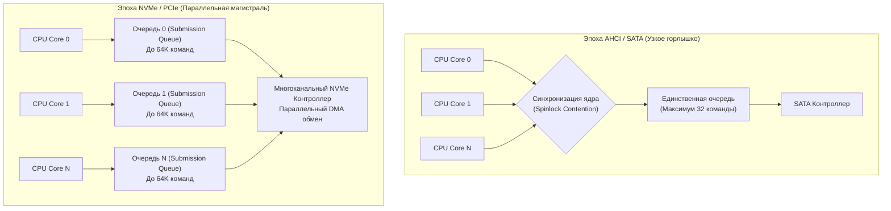

## Конец эпохи вращающихся блинов

В предыдущей главе [[36. PCIe. Как устройства общаются с CPU]] мы увидели, как материнская плата превратилась в сверхскоростную коммутируемую сеть, способную прокачивать сотни гигабайт данных в секунду между процессором и шинами расширения.

Однако долгие четыре десятилетия эта фантастическая электронная мощь кремния разбивалась о неумолимые законы классической ньютоновской механики.

Вспомните традиционный серверный жесткий диск (HDD): герметичная банка, внутри которой со скоростью 10 000 или 15 000 оборотов в минуту вращаются зеркальные алюминиевые или стеклянные «блины», покрытые магнитным слоем. Над ними на микроскопической воздушной подушке парит механическое коромысло со считывающей головкой. 

Чтобы прочитать хотя бы один сектор данных, сервопривод должен физически разогнать коромысло, спозиционировать его над нужной концентрической дорожкой (время поиска — **Seek Time**) и дождаться, пока искомый сектор диска пролетит под головкой. 

Эта механическая задержка измеряется миллисекундами (обычно 5–10 мс). В итоге самый совершенный серверный HDD физически не способен выдать более **150-200 IOPS** (операций ввода-вывода в секунду) при случайном доступе! Когда на сервер базы данных наваливались тысячи клиентов, дисковая подсистема начинала судорожно трещать головками, а время отклика сервиса подскакивало до секунд.

Триумфальное появление твердотельных накопителей (**SSD — Solid State Drives**) навсегда отправило вращающиеся блины в музей, заменив механику на кремниевые микросхемы. Но чтобы выжать из современных NVMe-дисков миллионы IOPS и ненароком не разрушить их ресурс безграмотным Go-кодом, инженеру необходимо заглянуть в физику ячеек флэш-памяти.

---

## Анатомия NAND Flash: Страницы и Блоки

В оперативной памяти (DRAM) мы можем адресовать и перезаписывать любой произвольный байт или 64-битное слово. Во флэш-памяти типа **NAND** законы микроэлектроники совершенно иные. 

Физически массив энергонезависимой памяти на кристалле кремния организован в строгую двухуровневую иерархию: **Страницы (Pages)** и **Блоки (Blocks)**.

* **Страница (Page)**: Минимальная неделимая единица чтения и записи данных. В современных многослойных 3D-NAND кристаллах размер страницы составляет **от 4 КБ до 16 КБ**.
* **Блок (Block)**: Крупный физический кластер, объединяющий от 128 до 512 страниц (типичный размер блока в современных SSD составляет от 2 до 8 Мегабайт).

Именно в этой асимметрии кроется фундаментальный парадокс и главное ограничение полупроводниковой флэш-памяти:

1. **Чтение:** Мы можем прочитать произвольную физическую страницу (например, 4 КБ) за микросекунды.
2. **Запись:** Мы можем записать страницу данных (4 КБ), но **исключительно в чистую (пустую) страницу**, ячейки которой предварительно сброшены в состояние логической единицы.
3. **Перезапись невозможна:** Мы **НЕ МОЖЕМ** перезаписать уже занятую страницу «поверх» старых данных!

Чтобы изменить хотя бы один-единственный байт в уже заполненной странице, физика требует подать на подложку кристалла высокое напряжение (~20 Вольт) и **полностью стереть ВЕСЬ БЛОК целиком (несколько Мегабайт)**!

Это железное физическое правило называется **Erase-Before-Write (Стирание перед записью)**. При этом операция стирания блока в сотни раз медленнее записи, а главное — она физически деградирует диэлектрический слой кремниевых ячеек памяти (каждый блок выдерживает строго ограниченное число циклов стирания/записи — **P/E cycles**, Program/Erase cycles).

### FTL: Flash Translation Layer — компьютер внутри диска

Если бы ядро Linux или файловая система напрямую пытались управлять блоками и страницами NAND, любой SQL-запрос с простым `UPDATE` приводил бы к зависанию всей операционной системы на миллисекунды.

Чтобы изолировать операционную систему от столь суровой физической реальности, каждый современный SSD несет на борту **собственный автономный компьютер**. Внутри накопителя установлен многоядерный ARM-контроллер, гигабайты собственной скоростной кэш-памяти LPDDR4/DDR5 и сложнейшая операционная система реального времени — **FTL (Flash Translation Layer — Уровень трансляции флэш-памяти)**.

Контроллер FTL создает для внешнего мира совершенную иллюзию классического блочного устройства с плоской адресацией секторов (**LBA — Logical Block Addressing**).

Когда ваша программа на Go перезаписывает файл или обновляет запись в базе данных, FTL проворачивает виртуозную операцию:
1. Он никогда не пытается стереть старую страницу на месте.
2. Контроллер берет новые данные и записывает их в **новую чистую страницу** в совершенно другом, свободном блоке.
3. Во внутренней таблице маппинга (хранящейся в быстрой RAM контроллера) FTL обновляет трансляцию: виртуальный логический сектор `LBA 100` теперь привязан к новому физическому адресу.
4. Старая физическая страница не стирается — она просто помечается битовым флагом как «Мусор» (**Stale / Invalid**).

```
ЛОГИЧЕСКИЙ МИР (User Space / Go):
[LBA 100: "Версия 1"] ---> Запись новых данных ---> [LBA 100: "Версия 2"]

ФИЗИЧЕСКИЙ МИР NAND FLASH (Контроллер FTL):
[Физический Блок А: Страница 12] = "Версия 1" (Помечена как МУСОР / STALE)
[Физический Блок Б: Страница 85] = "Версия 2" (АКТИВНАЯ, LBA 100 указывает сюда)
```

> [!info] Под капотом
> Прямо как в среде исполнения Go, контроллер любого SSD непрерывно выполняет собственный аппаратный **Сборщик мусора (Garbage Collector)**!  
> В фоновом режиме (или при нехватке чистых блоков) дисковый GC находит блоки с наибольшим процентом «мусорных» (Stale) страниц. Он аккуратно считывает оставшиеся «живые» страницы, копирует их в новый чистый блок, а старый «грязный» блок подвергает операции стирания (**Erase**), возвращая его в пул чистых страниц для будущих записей.

---

## Mechanical Sympathy: Write Amplification (Усиление записи)

Непонимание взаимодействия между размером страниц NAND, блоками и работой FTL порождает одну из самых коварных проблем высоконагруженных хранилищ — **Write Amplification (Усиление записи)**.

Коэффициент усиления записи ($WAF$) показывает, сколько реальных байтов записал контроллер во флэш-память по отношению к тому, сколько байтов попросила записать прикладная программа:
$$WAF = \frac{\text{Байты, физически записанные в NAND Flash}}{\text{Байты, отправленные приложением через syscall write}}$$

Представьте, что вы пишете серверный логгер на Go и наивно сбрасываете события на диск по 100 байт за вызов без буферизации, напрямую дергая системный вызов `write`:
1. Ваша программа передает в ядро ОС ровно 100 байт.
2. Но минимальная неделимая единица записи контроллера SSD — физическая страница размером **4 КБ** (или 16 КБ).
3. Контроллер вынужден записать целую 4-килобайтную страницу во флэш-память! 
4. Вы получаете колоссальное усиление записи: $WAF \approx 40$. Вместо 100 байт износу подверглись 4096 байт кремния!

Ситуация становится катастрофической при **Случайной записи (Random Write)** мелкими порциями по всему объему хранилища (характерное поведение классических реляционных баз данных с обновлениями строк на месте).  
Контроллер FTL начинает захлебываться: свободные страницы стремительно фрагментируются, фоновый сборщик мусора диска (Garbage Collector) работает без передышки, непрерывно перенося живые страницы из блока в блок. 

В результате задержки записи вырастают в десятки раз, паспортные миллионы `IOPS` схлопываются до нескольких тысяч, а ресурс долговечности SSD исчерпывается за считанные месяцы!

> [!warning] Ловушка / Gotcha
> Хотя на SSD скорость случайного чтения (**Random Read**) почти не уступает последовательному (ведь механическая головка отсутствует), **случайная запись мелких блоков (Random Write) — это абсолютное архитектурное зло**!  
> Запись на SSD обязана производиться крупными последовательными порциями (**Sequential Write**), кратными размеру страницы (4–16 КБ) или блока. Именно поэтому пользовательская буферизация через стандартный пакет `bufio` в Go жизненно важна даже при работе с самыми дорогостоящими корпоративными NVMe-накопителями.

> [!tip] Собеседование
> **Вопрос:** Почему подавляющее большинство современных распределенных баз данных и хранилищ временных рядов (Cassandra, RocksDB, ClickHouse, BadgerDB в Go, Pebble) спроектированы на основе структуры **LSM-деревьев (Log-Structured Merge-Tree)**, а не классических B-Tree (как в традиционных движках PostgreSQL или MySQL InnoDB)?
> **Ответ:** Архитектура B-Tree построена на концепции модификации страниц на месте (In-Place Update). При изменении одной записи в строке или обновлении индекса B-Tree перезаписывает целую страницу дерева в произвольном месте файла. Это порождает лавину случайных записей мелких блоков (**Random Writes**), перегружает FTL и приводит к чудовищному коэффициенту Write Amplification.
> 
> Напротив, **LSM-Tree никогда не изменяет существующие данные на диске**!  
> Все входящие операции записи и обновления накапливаются в оперативной памяти в виде упорядоченной таблицы (**MemTable**). Когда размер MemTable достигает 64 или 128 МБ, она сбрасывается на накопитель единым, монолитным, строго последовательным файлом (**SSTable — Sorted String Table**, работающим по принципу **Append-Only**).  
> Это на 100% созвучно физической природе NAND Flash: коэффициент $WAF$ минимизируется, дисковый Garbage Collector не перегружается, а скорость записи упирается в максимальную физическую пропускную способность шины PCIe!

---

## От SATA к NVMe: Программная революция

С физикой кремниевых ячеек NAND всё понятно. Но почему первые поколения SATA SSD выдавали скромные 500 МБ/с и максимум 100 000 IOPS, в то время как современные накопители стандарта NVMe на точно таких же кремниевых кристаллах выдают 14 000 МБ/с (14 ГБ/с) и свыше **2 500 000 IOPS**?

Ответ кроется не в кремнии памяти, а в **сетевом и программном протоколе связи**.

На протяжении десятилетий твердотельные накопители подключались через устаревший интерфейс **SATA** и протокол **AHCI** (Advanced Host Controller Interface), разработанный компанией Intel в далеком 2004 году. Этот протокол проектировался для медленных вращающихся магнитных дисков:
* Протокол AHCI поддерживал **ровно одну очередь команд (Queue)**.
* Глубина этой единственной очереди составляла всего **32 команды**.

Представьте 64-ядерный современный сервер, где сотни параллельных горутин Go одновременно обращаются к файлам на диске. В эпоху AHCI/SATA все эти 64 ядра процессора были вынуждены выстраиваться в одну общую очередь в ядре операционной системы, толкаясь за единственный мьютекс (**Lock Contention**) и ожидая освобождения 32 слотов в контроллере!

Стандарт **NVMe (Non-Volatile Memory Express)** был спроектирован с чистого листа специально для многоядерных архитектур и прямого подключения к шине PCIe:

1. **64 000 независимых очередей**: Спецификация NVMe поддерживает до **65 535 очередей отправки (Submission Queues)** и до 65 535 очередей завершения (**Completion Queues**).
2. **64 000 команд в каждой очереди**: Каждая отдельная очередь вмещает до 65 535 одновременных команд ввода-вывода.
3. **Прямое соединение через PCIe**: Полное исключение медленных мостовых контроллеров SATA/PCH.



### Архитектура Lockless (Без блокировок)

Драйвер NVMe в ядре Linux реализован с безупречным следованием принципу Mechanical Sympathy: он выделяет ровно одну независимую пару аппаратных очередей (Submission Queue и Completion Queue) **на каждое логическое ядро процессора**.

Когда горутина на ядре `CPU Core 0` выполняет системный вызов чтения или записи, ядро Linux помещает дескриптор команды прямо в локальную процессорную `Очередь 0`.  
**Никаких глобальных блокировок! Никакого ожидания других процессорных ядер!** 

Регистрация новой команды для диска сводится к простой записи в локальный регистр-звонок (**Doorbell Register**), отображенный в адресное пространство памяти контроллера. Каждое ядро процессора общается с диском по своему собственному скоростному выделенному коридору.

---

## Итог

Подведем итоги нашего погружения в мир твердотельных накопителей и протокола NVMe:

1. **Фундаментальная асимметрия NAND Flash**: Флэш-память читается и пишется страницами (4–16 КБ), но стирается только гигантскими блоками (2–8 МБ) по правилу **Erase-Before-Write**.
2. **Интеллект FTL**: Прошивка контроллера диска маппит виртуальные логические секторы на физические страницы памяти «на лету» и непрерывно выполняет собственный сборщик мусора (**Garbage Collector**) для очистки невалидных страниц.
3. **Опасность случайных записей**: Мелкие случайные обновления данных (**Random Writes**) многократно увеличивают коэффициент усиления записи (**Write Amplification**), убивают IOPS и физически изнашивают ячейки кремния.
4. **Торжество LSM-деревьев**: Архитектурный отказ баз данных от модификаций страниц на месте в пользу последовательной записи (**Append-Only SSTables**) раскрывает 100% потенциала твердотельных накопителей.
5. **Параллелизм NVMe**: Революционный скачок производительности обеспечен отказом от узкой одиночной очереди AHCI и переходом на 64 000 параллельных аппаратных очередей (**Submission Queues**), привязанных к ядрам процессора в архитектуре **Lockless**.

Мы изучили архитектуру компьютера от кремниевых вентилей процессора до очередей команд NVMe-диска. Но чтобы все эти знания стали действенным инженерным инструментом в повседневной разработке на Go, нам необходимо сложить их в единую, кристально ясную систему координат.

Какова цена доступа к кэшу L1 по сравнению с оперативной памятью? Сколько тактов стоит сетевой пинг до соседнего дата-центра?

В следующей лекции мы соберем главную шпаргалку любого бэкенд-архитектора: [[38. Latency Numbers Every Programmer Should Know]].