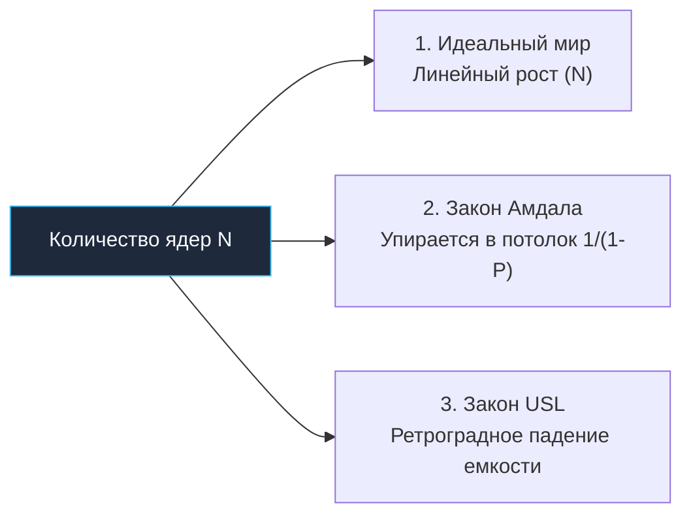

## Миф о бесплатном масштабировании

В карьере каждого ведущего инженера или архитектора бэкенда наступает момент горького прозрения.

Картина выглядит до боли знакомо: ваш сервис на Go начинает задыхаться в часы пиковых нагрузок. Графики мониторинга показывают 100% утилизацию процессора на 8-ядерном сервере. Вы приходите к техническому директору с обоснованием бюджета: «Нам нужно масштабирование! Дайте нам сервер на 64 ядра, и мы играючи выдержим восьмикратный поток трафика!».

Бизнес выделяет деньги, сервер смонтирован в стойку, в конфигурации обновлен параметр `GOMAXPROCS = 64`. Вы запускаете нагрузочный генератор, предвкушая триумф.

И тут наступает холодный душ:
* Пропускная способность (**RPS**) вместо ожидаемого 8-кратного роста поднялась всего в 2.2 раза.
* Потребление памяти подскочило до небес.
* Задержки на 99-м перцентиле (**p99 latency**) вместо снижения драматически ухудшились, а сервис начал спорадически захлебываться таймаутами.

Почему дорогостоящий 64-ядерный монстр не отработал вложенные деньги? 

Потому что в мире параллельных вычислений и распределенных систем действует суровая математика. Производительность реальных многоядерных систем **почти никогда не масштабируется линейно**. Чтобы понимать, где прячутся невидимые барьеры, нам необходимо изучить фундаментальные законы масштабируемости.

---

## 1. Закон Амдала (Amdahl's Law)

В 1967 году легендарный компьютерный архитектор Джин Амдал (Gene Amdahl), стоявший у истоков создания мэйнфрейма IBM System/360, сформулировал базовый закон параллельных вычислений.

Закон Амдала гласит: **максимальное теоретическое ускорение программы при увеличении числа процессоров жестко ограничено той долей работы, которая должна выполняться строго последовательно.**

Математическая формулировка закона выглядит так:
$$S(N) = \frac{1}{(1 - P) + \frac{P}{N}}$$

Где:
* $S(N)$ — результирующий коэффициент ускорения (Speedup);
* $N$ — количество параллельных исполнителей (ядер процессора);
* $P$ — доля вычислительной работы, которая может быть идеально распараллелена;
* $(1 - P)$ — последовательная (серийная) часть программы, которую невозможно разделить между ядрами.

### Как это выглядит в реальных цифрах?

Представьте, что вы написали высококлассный, продуманный Go-код. Целых **95%** времени ваша программа исполняется абсолютно параллельно: независимые горутины парсят JSON-документы, валидируют входящие данные и выполняют независимые сетевые запросы ($P = 0.95$).

И лишь скромные **5%** времени занимают последовательные операции: горутины складывают агрегированный результат в общую хэш-таблицу под мьютексом, инкрементируют глобальный счетчик или сбрасывают буфер в один сетевой сокет ($(1 - P) = 0.05$).

Казалось бы: целых 95% параллелизма! Посмотрим, какое ускорение $S(N)$ мы получим при наращивании процессорных ядер $N$:
* **1 ядро:** $S(1) = 1\times$ (базовая скорость)
* **10 ядер:** $S(10) = \frac{1}{0.05 + 0.95/10} \approx \mathbf{6.8\times}$ (хороший результат)
* **32 ядра:** $S(32) \approx \mathbf{12.5\times}$ (уже меньше половины от идеала)
* **64 ядра:** $S(64) \approx \mathbf{15.4\times}$ (мы добавили вдвое больше ядер, но получили прирост всего на 23%)
* **1000 ядер:** $S(1000) \approx \mathbf{19.6\times}$
* **$\infty$ ядер:** Предел при $N \to \infty$ равен $\frac{1}{1 - P} = \frac{1}{0.05} = \mathbf{20\times}$!

```
ПРЕДЕЛ АМДАЛА ДЛЯ 5% СЕРИЙНОГО КОДА:
Ускорение
 ^
20x |--------------------------------------------- Асимптотический потолок (20x)
    |                                   .........
15x |                         . . . . .
    |               . . . . .
10x |        . . . .
 5x |  . . .
 0x +--------------------------------------------> Число ядер CPU (N)
    1    10         32        64        100      1000
```

**Фундаментальный вывод закона Амдала:** Сколько бы миллионов долларов вы ни потратили на закупку сотен ядер, если в вашем коде остается всего 5% последовательной синхронизации, вы **никогда не сделаете систему быстрее, чем в 20 раз**. Ограничение заложено не в кремнии, а в алгоритмической структуре вашего кода.

---

## 2. Универсальный закон масштабируемости (USL)

Однако в реальной инженерной практике всё обстоит еще драматичнее. Закон Амдала — это идеализированная картина, предполагающая, что параллельные потоки абсолютно не мешают друг другу и работают в полной изоляции.

В 1993 году физик и специалист по производительности компьютерных систем доктор Нил Гюнтер (Neil J. Gunther) создал **Универсальный закон масштабируемости (Universal Scalability Law — USL)**. 

Гюнтер добавил в формулу Амдала два фундаментальных физических фактора, неизбежно возникающих в любой многоядерной или распределенной системе:
1. **Конкуренция за ресурсы (Contention, коэффициент $\alpha$)**: Потоки выстраиваются в очереди к разделяемым ресурсам (мьютексы, каналы, шина памяти, очереди диска).
2. **Координация и согласованность (Crosstalk / Coherency, коэффициент $\beta$)**: Затраты времени ядер на непрерывное согласование общего состояния между собой.

Математическая формула закона USL:
$$C(N) = \frac{N}{1 + \alpha(N-1) + \beta N(N-1)}$$

Обратите самое пристальное внимание на третий член знаменателя: $\beta N(N-1)$. 
Это квадратичная зависимость ($O(N^2)$)! Она отражает количество связей между $N$ ядрами: каждое ядро вынуждено согласовывать данные со всеми остальными $(N-1)$ ядрами. 



### Ретроградная масштабируемость (Retrograde Scalability)

Главное предостережение закона USL заключается в том, что графики масштабируемости реальных систем не просто выходят на плато: **после достижения критической точки перегиба добавление новых ядер начинает УМЕНЬШАТЬ совокупную производительность!**

Система впадает в состояние ретроградного масштабирования (**Retrograde Scalability**): новые ядра тратят больше времени на междоусобную координацию и аппаратные споры за кэш-линии, чем на выполнение полезного кода программы.

> [!info] Под капотом
> Как координация ($\beta$) проявляется на уровне кремния и в рантайме Go?
> 1. **Аппаратный шторм когерентности кэшей (Cache Coherence Traffic)**: Как мы выяснили в главах [[33. Архитектура современных CPU. Chiplet, CCX, CCD, Ring Bus, Mesh]] и [[21. False Sharing и Cache Line Contention]], когда 64 ядра пытаются атомарно обновить одну разделяемую переменную (или соседние поля в одной 64-байтовой строке), шины Infinity Fabric / UPI захлебываются миллионами служебных сообщений инвалидации строк кэша.
> 2. **Координация в Сборщике Мусора Go (GC Mark Phase)**: Во время параллельной фазы разметки памяти сборщик мусора Go привлекает до 25% всех процессорных ресурсов (`P`). Чем больше ядер в системе, тем больше системных потоков ОС одновременно сканируют указатели в куче и тем выше затраты на синхронизацию рабочих очередей сканирования (*work-stealing queues*).

> [!tip] Собеседование
> **Вопрос:** Мы развернули in-memory кэш на Go на современном сервере с 64 физическими ядрами. При увеличении переменной `GOMAXPROCS` с 32 до 64 пропускная способность сервиса (RPS) неожиданно упала на 15%, а задержки выросли. Что произошло на уровне архитектуры?
> **Ответ:** Система преодолела точку оптимума и вошла в зону ретроградного масштабирования по Универсальному закону масштабируемости (**USL**).  
> 1. Из-за наличия единой структуры данных с глобальной блокировкой (`sync.RWMutex` над общей мапой) резко возросла Конкуренция ($\alpha$).
> 2. При 64 потоках затраты на Координацию ($\beta \cdot N^2$) превратились в лавину: 64 ядра непрерывно перехватывают владение кэш-линией мьютекса через инструкции `LOCK CMPXCHG` (CAS), вызывая постоянные промахи L1/L2 кэшей во всех ядрах.
> 
> **Решение:** Провести **шардирование блокировок (Lock Sharding)**: разбить монолитную мапу на 256 независимых шардов, каждый со своим изолированным мьютексом, чтобы свести взаимную координацию ядер ($\beta$) практически к нулю.

---

## 3. Теория массового обслуживания и "Клюшка" (Queueing Theory)

Следующая фундаментальная причина нелинейности поведения серверов кроется в математике очередей — **Теории массового обслуживания (Queueing Theory)**.

Вообразите кассу в магазине самообслуживания. Кассир (ядро CPU) обслуживает одного покупателя (HTTP-запрос) ровно за 10 миллисекунд.  
Если бы покупатели подходили к кассе строго по таймеру — ровно через каждые 10 миллисекунд, — то загрузка кассира составила бы 100%, и при этом никакой очереди не возникло бы вовсе!

Однако в реальном сетевом мире запросы не приходят по метроному. Они подчиняются стохастическим законам (распределение Пуассона) и прилетают неравномерными пачками (**Bursts**). 

В теории очередей задержка ожидания в очереди описывается знаменитым приближением Кингмана (Kingman's Formula). Главным компонентом этой формулы является нелинейный множитель утилизации:
$$\text{Множитель ожидания в очереди} \approx \frac{\rho}{1 - \rho}$$
*(где $\rho$ — коэффициент утилизации системы от $0.0$ до $1.0$).*

Проследим, как ведет себя эта функция по мере роста нагрузки на CPU:
* При загрузке процессора **$50\%$** ($\rho = 0.5$): Множитель $= \frac{0.5}{1 - 0.5} = \mathbf{1}$. Задержка минимальна, очереди нет.
* При загрузке процессора **$80\%$** ($\rho = 0.8$): Множитель $= \frac{0.8}{1 - 0.8} = \mathbf{4}$. Задержка начинает заметно подрастать.
* При загрузке процессора **$90\%$** ($\rho = 0.9$): Множитель $= \frac{0.9}{0.1} = \mathbf{9}$. Очередь ощутимо уплотняется.
* При загрузке процессора **$95\%$** ($\rho = 0.95$): Множитель $= \frac{0.95}{0.05} = \mathbf{19}$.
* При загрузке процессора **$99\%$** ($\rho = 0.99$): Множитель $= \frac{0.99}{0.01} = \mathbf{99}$!

```
ГРАФИК «КЛЮШКИ» (HOCKEY STICK CURVE):
Задержка (Latency)
 ^
 |                                                    | (Взрыв задержек!)
 |                                                   /
 |                                                 /
 |                                              /
 |                                          _ -'
 |                                     _ - '
 |                         _ - - - - '
 +------------------------+-------------------+--------> Загрузка CPU (rho)
 0%                      50%                 80%  95% 100%
                          [Зона комфорта]     [Опасность]
```

Этот график в системной инженерии называют **«Кривой-клюшкой» (Hockey Stick Curve)**.  
До уровня утилизации 70–75% ваш Go-сервис отвечает стабильно и предсказуемо. Но как только средняя загрузка CPU перешагивает порог в 85–90%, малейший микро-всплеск трафика мгновенно переполняет локальные очереди планировщика Go (`runq`), и задержка ответа взлетает экспоненциально вверх — с 5 миллисекунд до нескольких секунд!

> [!warning] Ловушка / Gotcha
> Никогда не рассчитывайте производственную емкость (Capacity Planning) бэкенд-кластера впритык, допуская штатную работу серверов под нагрузкой 90%+ CPU!  
> Для синхронных сервисов, чувствительных к задержкам (**Synchronous API**), золотой стандарт целевой утилизации — **не более 60–70%**. Оставшиеся 30–40% свободного кремния — это не «выброшенные на ветер ресурсы», а необходимый демпфер для гашения стохастических всплесков очередей.

---

## 4. Оверхед планировщика и Thrashing

Четвертый разрушительный фактор нелинейности — избыточный параллелизм и накладные расходы планировщика.

Легковесность горутин в Go часто играет с разработчиками злую шутку. Видя огромный слайс на 1 000 000 элементов, программист пишет:
```go
for _, item := range items {
    go process(item) // Опасный паттерн: миллион горутин для вычислений!
}
```

Если функция `process` не выполняет сетевого ввода-вывода, а занимается интенсивными расчетами (`CPU-bound`), то на 16-ядерном процессоре 16 аппаратных ядер должны одновременно делить между собой миллион жаждущих вычислений горутин.

Планировщик Go (`runtime.schedule()`) вынужден каждые несколько микросекунд переключать контексты, перемещать горутины между локальными и глобальными очередями, чтобы соблюсти принцип справедливости (**Fairness**).

В результате наступает состояние **Thrashing (Пробуксовка / Дребезг)**:
1. **Вымывание кэшей**: Каждая новая горутина подгружает в кэш `L1` свои данные, вытесняя данные предыдущей задачи. Эффективность кэша падает до нуля.
2. **Засорение буфера TLB**: Постоянные переключения между нелокальными фрагментами памяти приводят к лавине промахов трансляции страниц.
3. **Оверхед на переключение**: Процессор тратит 70–80% полезного времени на обслуживание самого диспетчера планировщика, а не на полезные вычисления!

Именно поэтому жестко ограниченные пулы воркеров (**Worker Pools**), размер которых пропорционален числу физических ядер CPU, на счетных задачах работают в десятки раз быстрее, чем наивное порождение миллионов параллельных горутин.

---

## Итог

Подведем итоги законов нелинейной производительности:

1. **Закон Амдала (Amdahl's Law)**: Небольшая доля строго последовательного кода (всего 5%) устанавливает непреодолимый потолок ускорения при любом числе процессоров.
2. **Универсальный закон масштабируемости (USL)**: Учитывает квадратичные затраты на межядерную координацию ($\beta N^2$) и взаимные блокировки ($\alpha$). При превышении критического порога добавление новых ядер ухудшает производительность (**Retrograde Scalability**).
3. **Кривая-клюшка теории очередей**: Задержка растет пропорционально $\frac{\rho}{1 - \rho}$. Серверы, нагруженные выше 85% CPU, неизбежно генерируют лавинообразные всплески задержек (Latency Spikes).
4. **Опасность Thrashing**: Избыточное количество конкурирующих CPU-bound горутин убивает производительность накладными расходами на переключение контекста и вымыванием кэшей.

Мы изучили физику процессора, памяти, шин, накопителей и математические законы многопоточности. Мы обладаем полным арсеналом фундаментальных знаний о компьютере.

Как объединить всё это в цельную инженерную философию? Как научиться писать чистый, надежный и бескомпромиссно быстрый код на Go, сочувствующий физике кремния?

В следующей лекции мы сформулируем главный свод правил высоконагруженной разработки: [[40. Mechanical Sympathy. Как писать код с учетом устройства железа]].