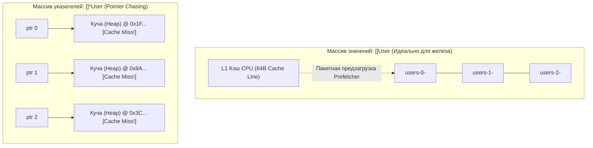

## Искусство дружить с железом

Термин **Mechanical Sympathy** («Механическое сочувствие», или искусство гармонии с машиной) вошел в современный лексикон программирования благодаря Мартину Томпсону (Martin Thompson), создателю легендарного ультрабыстрого кольцевого буфера **LMAX Disruptor**.

Сама эта концепция родилась в мире королевских автогонок Formula 1. Трехкратный чемпион мира сэр Джеки Стюарт (Jackie Stewart) любил повторять: гонщику вовсе не обязательно иметь диплом инженера-моторостроителя и уметь собирать двигатель своими руками. Но пилот обязан глубоко понимать, как двигатель, коробка передач и подвеска взаимодействуют с трассой. Только тогда он сможет выжать из болида абсолютный максимум скорости на грани сцепления и не сжечь мотор на первом же повороте.

В разработке программного обеспечения на языке Go действует тот же фундаментальный принцип.

Рантайм языка Go — это первоклассный болид с автоматической коробкой передач: он любезно берет на себя рутину управления памятью (автоматический сборщик мусора GC), распределение задач (планировщик горутин G-M-P) и сетевой ввод-вывод (Netpoller). 

Но если водитель на полном ходу начнет дергать рычаг стояночного тормоза — бездумно разбрасывать миллионы микроскопических объектов по куче, заставлять процессоры драться за разделяемые мьютексы и бомбардировать ядро операционной системы единичными системными вызовами, — спортивный болид неминуемо вылетит с трассы в глубокий кювет деградации производительности.

> **Писать код с механической симпатией** — значит проектировать структуры данных, раскладку памяти и алгоритмы так, чтобы они естественно, легко и гармонично ложились на физическую архитектуру кремния: регистры, конвейеры, иерархию кэшей и подсистему памяти, которые мы так детально изучили в предыдущих 39 главах.

---

## 1. Value Semantics vs Pointer Chasing

Многие разработчики, переходящие в Go из Java, C# или Python, приносят с собой укоренившийся рефлекс ссылочной модели: «Объект всегда должен передаваться по ссылке (указателю), ведь передать 8 байт адреса быстрее, чем копировать данные!».

В Go у нас есть свобода осознанного выбора между семантикой значений (**Value Semantics**) и семантикой указателей (**Pointer Semantics**). И этот выбор кардинально предопределяет поведение оборудования.

Сравним два объявления слайса структур:
```go
// Антипаттерн из ссылочного мира Java:
users := make([]*User, 0, 1000)

// Идиоматичный Go с механической симпатией:
users := make([]User, 0, 1000)
```

С точки зрения поверхностной бизнес-логики оба слайса хранят список пользователей. Но на уровне кремния, физической памяти и кэшей процессора (см. [[18. Кэши CPU. L1, L2, L3 и Cache Line]] и [[29. TLB. Translation Lookaside Buffer и стоимость промаха]]) между ними разверзается пропасть:

1. **Массив указателей (`[]*User`)**: Сам слайс представляет собой непрерывный массив 8-байтовых адресов памяти. Однако сами структуры `User` создавались динамически и хаотично раскиданы по всему пространству кучи (**Heap**).  
   Когда цикл итерируется по слайсу, ядро CPU считывает адрес, обращается по нему в оперативную память и натыкается на кэш-промах (**Cache Miss**). Процессор замирает на 100 наносекунд в ожидании DRAM. На следующей итерации процессор считывает новый адрес — и снова промахивается мимо кэша!  
   Этот убийственный для производительности паттерн в архитектуре называют **Pointer Chasing (Погоня за указателями)**: конвейер процессора 90% времени стоит без дела, ожидая прибытия байтов из шины памяти.
2. **Массив значений (`[]User`)**: Слайс содержит структуры данных, упакованные в памяти абсолютно монолитно и непрерывно друг за другом.  
   Когда программа запрашивает элемент `users[0]`, контроллер шины за один такт загружает в кэш `L1` целую 64-байтовую строку кэша, автоматически захватывая `users[1]`, `users[2]` и часть `users[3]`.  
   Аппаратный предсказатель памяти процессора (**Prefetcher**) мгновенно распознает линейный паттерн доступа и заблаговременно подгружает следующие кэш-линии из RAM. Промахи кэша и буфера `TLB` стремятся к нулю, а утилизация вычислительных блоков `ALU` достигает предельных 100%!



> [!tip] Собеседование
> **Вопрос:** Если мы передаем структуру размером 128 байт в функцию по значению, процессор копирует эти 128 байт. Передача по указателю скопировала бы всего 8 байт. Неужели передача по значению не медленнее?
> **Ответ:** В подавляющем большинстве случаев передача по значению **быстрее**!  
> 1. Копирование 128 байт на стеке выполняется процессором за пару тактов (через регистры общего назначения или векторные инструкции SIMD прямо внутри горячего L1-кэша — это занимает около 1 наносекунды).  
> 2. Передача указателя может разрушить локальность и заставить компилятор вынести структуру со стека в кучу (через Escape Analysis). Обращение к «холодной» памяти кучи стоит ~100 наносекунд, плюс создание объекта в куче накладывает накладные расходы на работу сборщика мусора (GC).  
> Копирование данных на стеке в десятки раз дешевле, чем одна аллокация в куче и последующий Cache Miss при разыменовании указателя.

---

## 2. Escape Analysis и Стек

В классических системных языках C и C++ программист вынужден вручную принимать решение о месте размещения каждой переменной: вызвать `malloc` для кучи или выделить локальную переменную на стеке.

В языке Go этим процессом управляет оптимизирующий компилятор через алгоритм **анализа побега (Escape Analysis)**.

Стек горутины (начальным размером всего 2 КБ) — это самая производительная и «горячая» память компьютера. Она практически гарантированно находится в кэшах `L1` и `L2` физического процессорного ядра.  
Выделение памяти на стеке — это элементарная операция: инкремент регистра указателя стека `SP` (Stack Pointer). Освобождение памяти при выходе из функции — это обратный декремент `SP`. Это занимает ровно **0 тактов полезного времени**, не требует блокировок и полностью освобождает сборщик мусора от работы!

Механическая симпатия призывает писать код так, чтобы данные оставались на стеке и не «убегали» в кучу без строгой необходимости:

```go
// Плохо: функция возвращает указатель на локальную переменную.
// Компилятор видит, что время жизни переменной выходит за рамки функции,
// и вынужден отправить ее в кучу (Heap allocation).
func NewConfig() *Config {
    cfg := Config{Timeout: 10}
    return &cfg 
}

// Превосходно: возврат по значению (Value Semantics).
// Структура создается на стеке, копируется через регистры при возврате,
// куча остается чистой, сборщик мусора не нагружается.
func NewConfig() Config {
    return Config{Timeout: 10}
}
```

Вы всегда можете беспристрастно проконтролировать решения компилятора Go с помощью флага сборки:
```bash
go build -gcflags="-m"
```
Компилятор детально покажет места утечек:
```bash
./main.go:4:9: &cfg escapes to heap
./main.go:3:2: moved to heap: cfg
```

> [!warning] Ловушка / Gotcha
> Любое неявное приведение типа к интерфейсу `interface{}` или `any` (например, вызов `fmt.Println(val)` или передача контекста в логгеры через `zap.Any()`) автоматически приводит к боксингу и «побегу» переменной со стека в кучу!  
> Внутри рантайма структура интерфейса (`eface`) обязана хранить указатель на данные. Поэтому на высоконагруженных «горячих» путях исполнения (Hot Paths) следует полностью избегать интерфейсов `any` в пользу строго типизированных сигнатур и кодогенерации.

---

## 3. Выравнивание данных (Padding) и False Sharing

Мы всесторонне исследовали опасности ложного разделения кэш-линий в главе [[21. False Sharing и Cache Line Contention]]. 

Механическая симпатия обязывает инженера постоянно помнить: **минимальной единицей обмена между кэшами ядер процессора является 64-байтовая кэш-линия**.

Представим типичную структуру серверной статистики, обновляемую параллельными воркерами:
```go
type WorkerStat struct {
    Processed uint64 // 8 байт
    Errors    uint64 // 8 байт
}

var stats [8]WorkerStat // Массив статистики для 8 параллельных воркеров
```

Под капотом этот массив занимает в памяти $16 \times 8 = 128$ байт — ровно две кэш-линии процессора.  
Если Воркер 0 (исполняемый на процессорном ядре 0) инкрементирует `stats[0]`, а Воркер 1 (на ядре 1) инкрементирует `stats[1]`, они попадают в общую 64-байтовую строку!

Протокол когерентности кэшей MESI заставляет ядра непрерывно отбирать друг у друга эксклюзивное право записи, бомбардируя шины процессора сигналами инвалидации (см. [[33. Архитектура современных CPU. Chiplet, CCX, CCD, Ring Bus, Mesh]]). Производительность сервиса падает в десятки раз на ровном месте из-за аппаратной давки за шину памяти.

### Решение через Mechanical Sympathy: искусственный Padding

Опираясь на законы выравнивания структур из главы [[25. Выравнивание данных, Padding и Struct Layout]], мы изолируем переменные разных ядер, принудительно раздвигая их по независимым кэш-линиям с помощью балластных байтов (**Padding**):

```go
type WorkerStat struct {
    Processed uint64
    Errors    uint64
    // Дополняем размер структуры ровно до 64 байт: 64 - 8 - 8 = 48 байт
    _ [48]byte // Padding: изоляция кэш-линии
}
```

Теперь размер каждого экземпляра `WorkerStat` составляет строго 64 байта. Каждое физическое ядро работает исключительно со своей персональной кэш-линией. Конкуренция на шине (**Contention**) устраняется на 100%!

---

## 4. Архитектура sync.Pool: Шедевр Mechanical Sympathy

В стандартной библиотеке языка Go есть пакет `sync`. Его компонент `sync.Pool` предназначен для переиспользования ранее выделенных в памяти структур и буферов байтов `[]byte`, предотвращая повторные аллокации в куче и разгружая сборщик мусора.

Почему `sync.Pool` работает с феноменальной скоростью даже под колоссальной многопоточной нагрузкой? Потому что он спроектирован с глубочайшим учетом многоядерной топологии, архитектуры NUMA и кэшей CPU!

Внутри рантайма Go (внутренняя структура `poolLocal`) пул объектов шардирован: он разбит на независимые локальные пулы — **ровно по одному пулу на каждый логический процессор (`P`) модели G-M-P**.

Что происходит, когда горутина вызывает `pool.Get()`:
1. Рантайм немедленно закрепляет исполняемую горутину (`g`) за текущим логическим процессором (`p`) через операцию `pin`, временно запрещая планировщику ОС переносить ее на другое ядро.
2. Пул считывает свободный объект из **локального приватного слота текущего `p`**.
3. Поскольку к приватному слоту процессора `p` в данный момент имеет доступ только один системный тред `m`, операция извлечения объекта выполняется **абсолютно без атомарных инструкций (`CAS`) и без блокировок мьютексов**!
4. Извлеченный объект с вероятностью почти 100% уже находится в горячем L1-кэше текущего физического ядра, так как этот же тред недавно вернул его туда вызовом `pool.Put()`.

Разработчики рантайма Go продемонстрировали эталон механической симпатии: шардирование данных по ядрам, отказ от дорогих сисколлов, lock-free быстрый путь и максимальная утилизация кэша `L1`.

---

## 5. Буферизация и Системные вызовы (Batching)

Современный центральный процессор способен выполнять миллиарды инструкций в секунду.  
Системный вызов (**Syscall**), как мы установили в главе [[34. Аппаратные прерывания и Системные вызовы]], обходится в сотни и тысячи тактов: это аппаратный фазовый переход из Ring 3 в Ring 0, сброс суперскалярного конвейера и частичная инвалидация таблиц буфера TLB.

Механическая симпатия к подсистеме ввода-вывода формулирует непреложный закон: **Пакетная обработка (Batching)**.

Сравним два подхода при записи логов или передаче сообщений в сокет:

```go
// Антипаттерн: одиночный системный вызов write на каждый крошечный кусок данных
for _, data := range chunks {
    file.Write(data) // Тысячи переходов в Ring 0 и сбросов конвейера CPU!
}

// Mechanical Sympathy: буферизация в пространстве пользователя (User Space)
// Накапливаем данные в памяти RAM (на скорости кэшей CPU) и сбрасываем одним блоком 4 КБ
writer := bufio.NewWriterSize(file, 4096)
for _, data := range chunks {
    writer.Write(data) // Копирование в памяти User Space (наносекунды)
}
writer.Flush() // Ровно ОДИН системный вызов в ядро ОС на весь блок!
```

Точно так же, опираясь на понимание работы контроллеров прямого доступа к памяти из главы [[35. IO подсистема. Шины, Контроллеры и DMA]], мы используем `io.Copy()` для трансляции файлов в сокет, позволяя аппаратному DMA-контроллеру шины PCIe передавать байты по технологии **Zero-Copy** вообще без участия центрального процессора.

---

## Итог

Подведем итоги философии Mechanical Sympathy. 

Механическая симпатия — это не набор хаотичных низкоуровневых трюков и не «преждевременная оптимизация». Это фундаментальное мировоззрение зрелого инженера:

1. **Кэши процессора** любят непрерывные, плотно упакованные структуры данных и предсказуемые линейные циклы (Value Semantics вместо слепой погони за указателями).
2. **Многоядерность** ненавидит разделяемое изменяемое состояние (Shared Mutable State). Если параллельный доступ неизбежен — изолируйте данные по ядрам и выравнивайте структуры по границам кэш-линий (**Padding**).
3. **Аллокатор памяти и GC** требуют уважения к ресурсам. Помогайте компилятору оставлять переменные на быстром стеке (**Escape Analysis**) и переиспользуйте горячие буферы через `sync.Pool`.
4. **Шины и операционная система** обожают крупные порции (**Batching**). Группируйте операции с диском и сетью через буферизацию `bufio`, минимизируя дорогостоящие переходы в Kernel Space.

Вы прошли грандиозный путь — от кремниевых полупроводников, логических вентилей и конвейеров до виртуальной памяти, протоколов NVMe и законов масштабирования систем. Теперь у вас сформирован прочный фундамент понимания того, как работает вычислительная машина.

Пришло время собрать все части мозаики в единую, кристально ясную панораму. В заключительной лекции первого раздела мы подведем итоги: [[41. Итоги раздела. Полная картина архитектуры компьютера для Go-разработчика]].