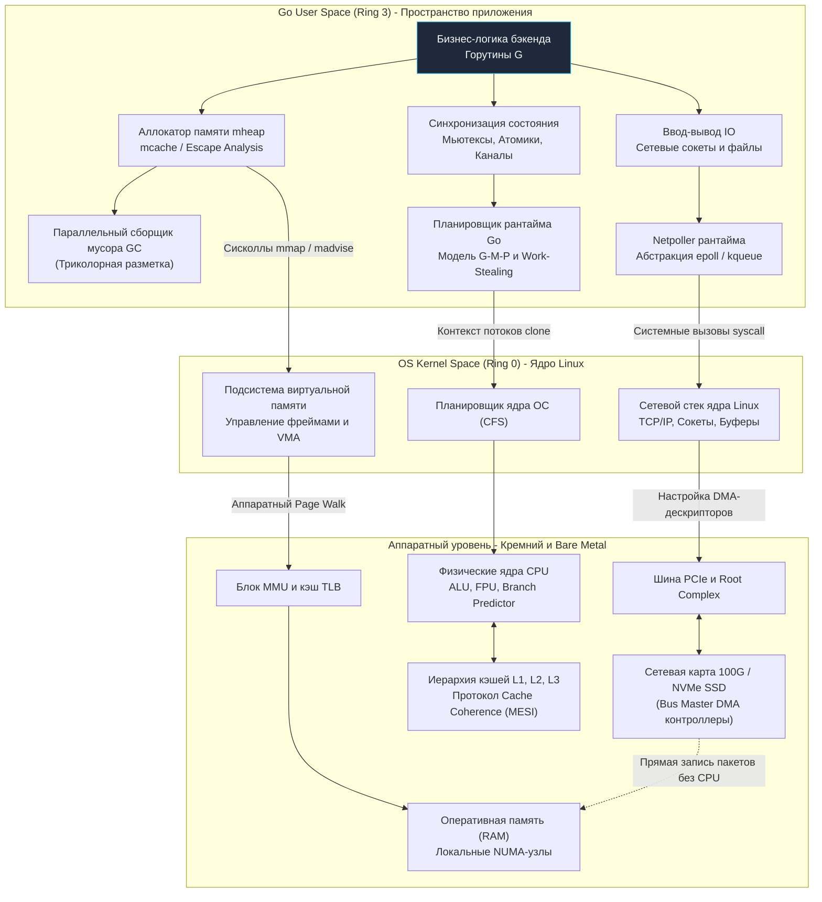

Вот мы и подошли к торжественному финалу первого, самого фундаментального раздела нашей инженерной энциклопедии.

Мы начали это путешествие с самых истоков — с того, как физика полупроводников и кремниевые p-n переходы формируют элементарные логические вентили, способные хранить бит информации. А завершили его глубокими математическими законами параллельных систем и теорией массового обслуживания, объясняющими, почему бездумное добавление 64 процессорных ядер способно замедлить веб-сервис вместо ускорения.

Для большинства начинающих разработчиков компьютер до сих пор остается непроницаемым «черным ящиком», таинственным монолитом, который по взмаху волшебной палочки компилятора исполняет инструкции. 

Но для настоящего Staff / Principal Backend Engineer и архитектора распределенных систем этот ящик стал абсолютно прозрачным.

Когда вы пишете код на Go:
* Выбор между слайсом указателей `[]*User` и слайсом структур по значению `[]User` — это для вас больше не вопрос вкуса или привычки из других языков. Это осознанный инженерный выбор между лавиной промахов буфера `TLB` со 100-наносекундными паузами памяти DRAM и плотной, кристальной утилизацией 64-байтовых линий кэша `L1` с включением аппаратного префетчера.
* Обработка ошибок через привычный `if err != nil` — это не просто строчка кода, а проверка, за которой пристально следит суперскалярный блок предсказания ветвлений процессорного ядра.

Соберем всю изученную архитектуру компьютера в единую, гармоничную панораму сквозь призму языка Go.

---

## Полная архитектурная карта бэкенда

Ваш Go-сервис никогда не работает в изолированном вакууме. Любая операция — будь то вызов функции, чтение из сокета или аллокация объекта в куче — пронизывает насквозь все слои компьютерных абстракций, опускаясь на физический уровень кремния:

Взгляните на эту схему как на партитуру сложнейшей симфонии. Рантайм Go в пользовательском пространстве (User Space), ядро Linux в пространстве ядра (Kernel Space) и кремниевые компоненты компьютера (Bare Metal) непрерывно обмениваются сигналами, прерываниями и транзакциями памяти.

---

## 4 Столпа Производительности (Mechanical Sympathy)

Обобщая все изученные механизмы (и особенно принципы из главы [[40. Mechanical Sympathy. Как писать код с учетом устройства железа]]), мы можем сформулировать **четыре фундаментальных столпа инженерного проектирования высокопроизводительных систем**:

### 1. Процессор и Вычисления: Предсказуемость

Современный суперскалярный конвейер Out-of-Order процессора (см. [[13. Предсказание ветвлений и Спекулятивное исполнение]]) — это сверхскоростной поезд, который ненавидит резкие торможения. Непредсказуемые переходы и ветвления сбрасывают конвейер, уничтожая десятки тактов работы. 

Полиморфные вызовы методов через нетипизированные интерфейсы (`interface{}`) заставляют процессор совершать косвенные переходы через таблицы виртуальных методов (Virtual Method Table / `itab`), лишая компилятор возможности применить инлайнинг (**Inlining**).
* **Идиома Go:** Стремитесь к чистому, прямолинейному коду. На критических путях исполнения (Hot Paths) избегайте развесистых иерархий динамических интерфейсов. Применяйте строгие типы и дженерики Go, позволяя компилятору разворачивать код в компактные, предсказуемые для `Branch Predictor` машинные циклы.

### 2. Память и Кэши: Пространственная и Временная Локальность

Шина оперативной памяти — самое узкое и медленное место современного компьютера. Из глав [[18. Кэши CPU. L1, L2, L3 и Cache Line]] и [[29. TLB. Translation Lookaside Buffer и стоимость промаха]] мы знаем, что процессор мыслит не отдельными байтами, а неделимыми квантами: строками кэша по **64 байта** и страницами памяти по **4 КБ / 2 МБ**.
* **Идиома Go:** Ставьте во главу угла семантику значений (**Value Semantics**). Упаковывайте данные в плотные, непрерывные слайсы (`[]Struct`, а не `[]*Struct`), позволяя процессору на лету предзагружать строки через Prefetcher. Помогайте компилятору удерживать структуры на сверхбыстром стеке горутины через **Escape Analysis**. Предотвращайте катастрофическое ложное разделение (**False Sharing**) в многопоточных счетчиках, разделяя поля искусственным выравниванием (**Padding**), как мы изучили в [[21. False Sharing и Cache Line Contention]].

### 3. Многоядерность: Изоляция (Share Nothing)

Универсальный закон масштабируемости Нила Гюнтера (**USL**) из [[39. Почему производительность бывает нелинейной]] и чиплетная топология процессоров из [[33. Архитектура современных CPU. Chiplet, CCX, CCD, Ring Bus, Mesh]] математически и физически доказали нам: чем больше ядер конкурируют за общее изменяемое состояние, тем сильнее проседает совокупная производительность системы. Трафик протокола когерентности кэшей парализует внутренние шины `Infinity Fabric` и `Ring Bus`.
* **Идиома Go:** Руководствуйтесь фундаментальным девизом Go: *«Не общайтесь, разделяя память; разделяйте память, общаясь»*. Каналы превосходно передают владение данными.  
  При экстремальных нагрузках применяйте шардирование блокировок (**Lock Sharding**), используйте структуры, локальные для каждого процессора `P`, и переиспользуйте горячие объекты через `sync.Pool`, исключая глобальные узкие места вокруг `sync.RWMutex`. Всегда учитывайте физическую топологию серверов с неравномерным доступом к памяти ([[31. NUMA. Non Uniform Memory Access]]).

### 4. Ввод-Вывод: Полное Делегирование

Процессор слишком дорог и ценен, чтобы работать грузчиком. Главы [[34. Аппаратные прерывания и Системные вызовы]] и [[35. IO подсистема. Шины, Контроллеры и DMA]] наглядно продемонстрировали чудовищную цену переключений контекста между Ring 3 и Ring 0.
* **Идиома Go:** Всегда применяйте буферизацию пользовательского пространства через пакет `bufio`. Для передачи больших объемов данных между диском и сокетом используйте связку `io.Copy`, передавая управление аппаратному контроллеру DMA через системный вызов `sendfile` (Zero-Copy).  
  Доверяйте сетевому поллеру рантайма (**Netpoller**): пишите линейный, синхронный код на горутинах, а рантайм Go сам трансформирует его в высокоэффективный неблокирующий опрос через системный селектор `epoll`, удерживая миллионы соединений без расхода системных потоков ОС.

---

> [!tip] Собеседование
> **Вопрос:** Если вы претендуете на позицию Lead Go Engineer или системного архитектора, на собеседовании вам могут задать каверзный вопрос:  
> *«Представьте, что мы берем сервер базы данных, отключаем в BIOS технологию Hyper-Threading (SMT), активируем Huge Pages в операционной системе и жестко привязываем Go-процесс к одному NUMA-узлу через `numactl`. Какой тип сервиса (I/O-bound или CPU-bound) получит от такой настройки колоссальное ускорение, а для какого это приведет к просадке производительности?»*
> 
> **Ответ:** Это эталонный, бескомпромиссный сетап для тяжелых **CPU/Memory bound** приложений (In-memory баз данных, высокочастотных торговых движков HFT, OLAP-аналитики или графических расчетов):
> 1. **Отключение SMT** устраняет аппаратную давку за порты ALU/FPU и исключает разрушение кэша `L1` (Cache Thrashing) между логическими потоками ядра.
> 2. **Huge Pages (2 МБ)** кардинально сокращают промахи буфера `TLB` при обходе сотен гигабайт памяти в слайсах и хэш-таблицах `map` или `slice`.
> 3. **Привязка к локальному NUMA-узлу** полностью исключает задержки от удаленного доступа к чужой памяти через межпроцессорный интерконнект `UPI` / `Infinity Fabric`.
> 
> Напротив, для классического сетевого микросервиса (**I/O bound**), который 90% времени ждет ответов от сетевых сокетов, такие тюнинги бесполезны. Более того: отключение SMT снизит его общую пропускную способность (RPS), поскольку логические потоки SMT великолепно утилизируют технологические паузы конвейера процессора во время сетевых ожиданий.

---

## Переход на новый уровень

Вы больше никогда не будете смотреть на написанный код на Go прежними глазами. Вы обрели **механическую симпатию к машине**. 

Теперь вы точно знаете, что происходит в физическом мире кремния, когда компилируется исходный файл, инициализируется рантайм, выделяется срез или передается сетевой пакет.

Однако до сих пор в наших рассуждениях присутствовало одно фундаментальное допущение: мы неявно предполагали, что серверное железо отдано нашей программе в единоличное пользование.

В суровой реальности производственных серверов всё обстоит иначе:
* В системе параллельно крутятся сотни других процессов и демонов;
* Кто-то должен справедливо делить между ними процессорные кванты времени, следить за приоритетами и управлять энергопотреблением;
* Кто-то должен разграничивать адресные пространства, настраивать таблицы страниц памяти `CR3`, защищать конфиденциальные данные и перехватывать системные сбои;
* Кто-то должен изолировать микросервисы в контейнерах через `cgroups` и `namespaces`.

Этот могущественный дирижер всей вычислительной системы — **Операционная Система**.

И чтобы понять, как рантайм Go (со своим системным монитором `sysmon`, аллокатором `mheap` и сетевым селектором `Netpoller`) на равных взаимодействует с ядром Linux, мы переходим ко второму монументальному разделу нашей энциклопедии:

**Раздел 1: «Архитектура компьютера» — ПОЛНОСТЬЮ ЗАВЕРШЕН (41/41 лекций).**  
**Добро пожаловать в Раздел 2: «Устройство и работа ОС»!**