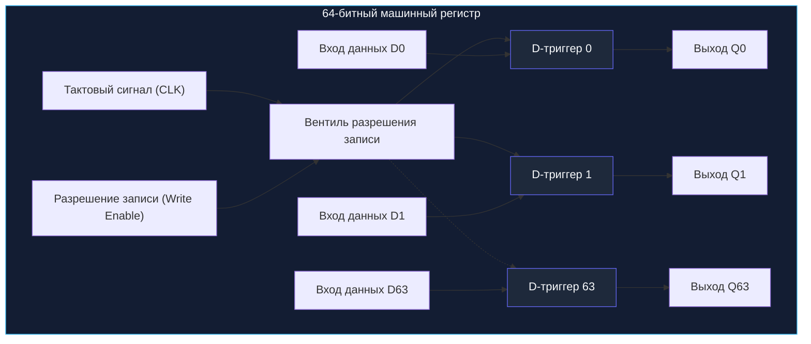
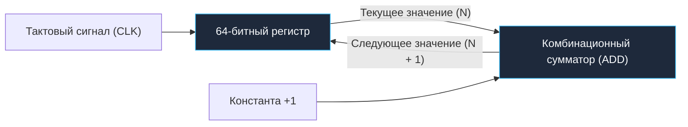
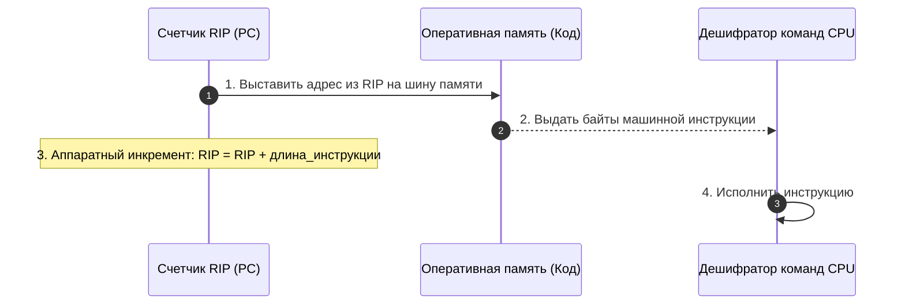
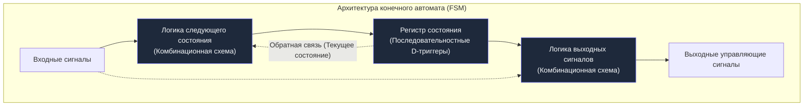

В предыдущей главе [[4. Последовательностная логика. Учим кремний помнить]] мы совершили важнейший прорыв: заставили кремний запоминать информацию. Мы собрали D-триггер — крошечную ячейку с обратной связью, способную надежно удерживать ровно один бит (`0` или `1`) и обновлять его синхронно с тактовым генератором процессора.

Однако реальные программы на Go мыслят не отдельными битами. Базовый целочисленный тип `int` или указатель памяти на современной 64-битной архитектуре занимает 64 бита (8 байт). Чтобы оперировать такими числами, нам нужно объединить микроскопические битовые ячейки в слаженные аппаратные ансамбли.

Сегодня мы сделаем следующий эволюционный шаг:
- Построим **машинные регистры** — самую быструю память во Вселенной;
- Соберем **счетчики**, без которых процессор не смог бы выполнить ни одной программы;
- И познакомимся с **конечными автоматами (FSM)** — математической и физической основой блока управления CPU и золотым стандартом надежной бизнес-логики в бэкенд-разработке.

---

## Регистры: Массив из триггеров

Если один D-триггер — это одиночный электрический выключатель на стене, то **регистр (Register)** — это ряд из 64 таких выключателей, управляемых единым рычагом.

Поставим в ряд 64 D-триггера и подключим их тактовые входы `CLK` (Clock) к одной общей шине генератора тактовых импульсов. На входы данных $D_0 \dots D_{63}$ подадим 64-битное число, а с выходов $Q_0 \dots Q_{63}$ снимем сохраненный результат. Мы получили **64-битный параллельный регистр**.



### Проблема постоянной перезаписи и сигнал Write Enable
Вспомним физику: тактовый генератор процессора никогда не останавливается. На частоте 4 ГГц сигнал `CLK` взлетает и падает 4 миллиарда раз в секунду. Если бы D-триггеры защелкивали данные на каждом такте, регистр перезаписывал бы свое содержимое хаотическим мусором с входной шины быстрее, чем процессор успел бы им воспользоваться!

Регистр обязан уметь **сохранять старое значение**, пока процессор явно не прикажет записать новое.

Для этого в схему вводится специальный управляющий провод — **Write Enable (`WE`, Разрешение записи)**. 

В схемотехнике есть два способа реализовать Write Enable:
1. **Clock Gating (стробирование такта):** пропустить сигнал `CLK` через вентиль AND вместе с проводом `WE`. Если $WE = 0$, такт просто не доходит до триггеров. Однако стробирование такта может вызывать задержки и рассинхронизацию (Clock Skew).
2. **Мультиплексирование входа данных (Muxed D-Input):** перед каждым D-триггером ставится крошечный мультиплексор 2:1. Если $WE = 1$, на вход $D$ подаются новые внешние данные. Если $WE = 0$, мультиплексор подает на вход $D$ собственный выход $Q$ триггера! На каждом такте триггер просто заново перезаписывает сам себя, удерживая число неизменным.

> [!info] Под капотом: Почему регистры — абсолютный идеал памяти
> Регистры физически расположены прямо внутри ядра процессора, в считанных микрометрах от вычислительных блоков ALU.
> - Сигналу не нужно преодолевать емкости внешних шин данных.
> - Доступ к регистру занимает **0 дополнительных тактов задержки (Latency = 0)**: значение с выходов триггеров считывается мгновенно, поскольку провода $Q$ непрерывно находятся под электрическим потенциалом.
> - Компилятор Go на этапе компиляции строит SSA-граф (Static Single Assignment) и запускает сложнейший алгоритм раскраски графов (Graph Coloring Register Allocation), чтобы разместить максимум локальных переменных в регистрах общего назначения (`RAX`, `RBX`, `RCX`, `RDX` и т.д.), полностью избегая медленных обращений к стеку в оперативной памяти.

---

## Счетчики: Регистр + Сумматор

А теперь соединим наши наработки из предыдущих лекций: возьмем комбинационный сумматор из статьи [[3. Комбинационная логика. Учим кремний считать]] и последовательностный регистр.

Что произойдет, если мы замкнем их в кольцо:
1. Выход 64-битного регистра подадим на первый вход сумматора;
2. На второй вход сумматора жестко подадим константу `1`;
3. Выход суммы заведем обратно на вход данных регистра?



Мы получили фундаментальный узел вычислительной техники — **аппаратный счетчик (Synchronous Counter)**.
С каждым фронтом тактового сигнала `CLK` число в регистре делает шаг вперед: $0 \to 1 \to 2 \to 3 \dots$ 

Зачем процессору счетчики? На них держится всё управление выполнением программ.

---

### Program Counter (Instruction Pointer)

Самый главный счетчик в любом компьютере — это **Счетчик команд (Program Counter, PC)**. 
В архитектуре x86-64 он живет в легендарном регистре **`RIP` (64-bit Instruction Pointer)**, а в архитектуре ARM64 — в регистре `PC`.

`RIP` хранит адрес ячейки оперативной памяти, из которой процессор должен загрузить следующую команду для исполнения.



Именно благодаря счетчику команд процессор читает машинный код строка за строкой, последовательно шаг за шагом:
- Процессор выставляет значение `RIP` на шину адреса.
- Память отдает байты инструкции.
- Счетчик команд **автоматически инкрементируется** на длину прочитанной инструкции (в x86-64 команды имеют переменную длину от 1 до 15 байт, поэтому к `RIP` прибавляется соответствующая длина).
- Процессор готов читать следующую инструкцию.

#### А как же ветвления?
Что происходит, когда в вашем Go-коде срабатывает условие:
```go
if user.IsAdmin {
    grantAccess()
}
```
Или выполняется цикл `for`:
```go
for i := 0; i < 1000; i++ {
    process(i)
}
```
Или вызывается функция через конструкцию `func()`?

Компилятор транслирует ветвления в инструкции условного и безусловного перехода: **`JMP` (Jump)**, **`CALL`** или условные переходы вроде `JE` (Jump if Equal), `JNE` (Jump if Not Equal).

На аппаратном уровне эти инструкции делают нечто предельно простое: они выставляют сигнал `Write Enable` на регистре `RIP` и **насильно перезаписывают в него новый адрес памяти**, игнорируя результат естественного инкремента! 
- Встретив `JMP`, процессор загружает в `RIP` адрес прыжка вперед или назад.
- Встретив `CALL`, процессор сохраняет текущий `RIP` на вершину стека (чтобы знать, куда вернуться через `RET`) и загружает в `RIP` адрес целевой функции.

> [!tip] Собеседование: Аппаратные счетчики производительности (Hardware Performance Counters / PMCs)
> **Вопрос:** Что такое аппаратные счетчики производительности (PMCs) и как они используются при профилировании бэкенда на Go?
> 
> **Ответ:** PMCs — это выделенные физические счетчики внутри кремниевого кристалла CPU (модели MSR — Model-Specific Registers), которые инкрементируются самой аппаратурой при наступлении специфических микроархитектурных событий:
> - `instructions` / `cycles` (расчет IPC — Instructions Per Cycle);
> - `cache-misses` / `L1-dcache-load-misses` (промахи мимо кэш-памяти);
> - `branch-misses` (ошибки блока предсказания ветвлений);
> - `page-faults` (промахи трансляции виртуальной памяти TLB).
> 
> Низкоуровневые профилировщики ядра Linux, такие как **`perf`** (а также утилиты трассировки рантайма вроде `go tool ptrace` / `ptrace`-профайлеры), программируют эти аппаратные счетчики через системный вызов `perf_event_open`. CPU настраивается на генерацию прерывания каждые, например, 10 000 промахов кэша, позволяя составить точнейшую тепловую карту строк кода на Go, вызывающих просадки производительности.

---

## Конечные автоматы (Finite State Machines)

Мы подошли к вершине эволюции базовой цифровой схемотехники.  
У нас есть:
1. Комбинационная логика для вычислений (сумматоры, ALU, компараторы);
2. Последовательностная логика для хранения данных (регистры, счетчики).

Если мы объединим их в единый контур, где логика принимает решения на основе текущего содержимого регистра, мы получим краеугольный камень компьютерных наук — **Конечный автомат (Finite State Machine, FSM)**.



Аппаратный конечный автомат состоит из трех ключевых узлов:
1. **Регистр состояния (State Register):** хранит код текущего состояния системы (например, 3-битный регистр может хранить одно из 8 состояний).
2. **Логика перехода (Next State Logic):** комбинационная схема из вентилей, которая смотрит на *Входные сигналы* и *Текущее состояние* и вычисляет, в какое состояние автомат должен перейти на следующем фронте такта `CLK`.
3. **Логика формирования выхода (Output Logic):** комбинационная схема, генерирующая управляющие сигналы наружу:
   - В автоматах Мура (Moore Machine) выходы зависят *только* от текущего состояния;
   - В автоматах Мили (Mealy Machine) выходы зависят от *текущего состояния и входных сигналов*.

### Почему это фундаментально для компьютера?
Потому что **Control Unit (Устройство управления)** любого процессора — это гигантский аппаратный конечный автомат.  
Каждый машинный такт Control Unit находится в определенном состоянии своего бесконечного цикла:
$$\text{Fetch (Выборка)} \to \text{Decode (Декодирование)} \to \text{Execute (Выполнение)} \to \text{Memory (Память)} \to \text{Writeback (Запись)}$$

Находясь в состоянии `Decode`, FSM активирует чтение регистров. В состоянии `Execute` подает код операции на мультиплексор ALU. В состоянии `Writeback` выставляет сигнал `Write Enable` на целевом регистре. Процессор — это физическое воплощение конечного автомата.

---

## Mechanical Sympathy: FSM в программном коде

Паттерн «Конечный автомат» родился в кремнии, но стал одним из самых мощных архитектурных инструментов в высокоуровневом бэкенде на Go.

Типичная ошибка начинающего инженера при моделировании бизнес-логики со сложными переходами — разводить паутину из разрозненных булевых флагов и ветвлений `if/else`:
```go
// Антипаттерн: "ад флагов"
type BadOrder struct {
    isPaid      bool
    isShipped   bool
    isDelivered bool
    isCancelled bool
}
```
Такой подход быстро приводит к недопустимым состояниям (например, заказ одновременно `isCancelled == true` и `isDelivered == true`), порождая трудноуловимые баги.

### Реальные примеры FSM в бэкенде:
1. **Сетевой стек ядра Linux (TCP FSM):**  
   Любой сокет ОС управляется строгим конечным автоматом RFC 793. Вы не можете отправить данные в сокет, пока он не пройдет состояния:
   `LISTEN` $\to$ `SYN_RCVD` $\to$ `ESTABLISHED`.  
   Попытка записи в сокет в состоянии `CLOSED` или `CLOSE_WAIT` немедленно пресекается ядром.
2. **Бизнес-процессы электронной коммерции:**  
   Жизненный цикл заказа описывается четким направленным графом допустимых переходов:  
   `New -> Paid -> Shipped -> Delivered`  
   Из состояния `New` можно перейти в `Paid` или `Cancelled`. Но перейти из `New` сразу в `Delivered` — архитектурно запрещено.

---

### Пример реализации FSM на Go

Давайте спроектируем надежный, идиоматичный конечный автомат на Go, реализующий упрощенный жизненный цикл сетевого протокола или бизнес-сущности.

Для максимальной производительности и защиты от гонок мы объединим перечисления констант (`iota`) и табличную схему переходов:

```go
package main

import (
	"errors"
	"fmt"
	"sync"
)

// State описывает текущее состояние нашего "Регистра состояния"
type State int

const (
	StateClosed State = iota
	StateListen
	StateEstablished
)

func (s State) String() string {
	switch s {
	case StateClosed:
		return "CLOSED"
	case StateListen:
		return "LISTEN"
	case StateEstablished:
		return "ESTABLISHED"
	default:
		return "UNKNOWN"
	}
}

// Event описывает входной сигнал для нашего автомата
type Event int

const (
	EventPassiveOpen Event = iota
	EventReceiveSYNACK
	EventClose
)

func (e Event) String() string {
	switch e {
	case EventPassiveOpen:
		return "PassiveOpen"
	case EventReceiveSYNACK:
		return "ReceiveSYNACK"
	case EventClose:
		return "Close"
	default:
		return "UNKNOWN_EVENT"
	}
}

var ErrInvalidTransition = errors.New("недопустимый переход конечного автомата")

// TCPMachine представляет потокобезопасный конечный автомат
type TCPMachine struct {
	mu    sync.RWMutex
	state State // Наш программный "Регистр состояния"
}

// NewTCPMachine инициализирует автомат в начальном состоянии
func NewTCPMachine() *TCPMachine {
	return &TCPMachine{state: StateClosed}
}

// Transition выполняет "Логику следующего состояния"
func (m *TCPMachine) Transition(event Event) error {
	m.mu.Lock()
	defer m.mu.Unlock()

	switch m.state {
	case StateClosed:
		if event == EventPassiveOpen {
			m.state = StateListen
			return nil
		}
	case StateListen:
		if event == EventReceiveSYNACK {
			m.state = StateEstablished
			return nil
		}
	case StateEstablished:
		if event == EventClose {
			m.state = StateClosed
			return nil
		}
	}

	// Любой переход, не предусмотренный логикой, вызывает контролируемую ошибку
	return fmt.Errorf("%w: из состояния %s по событию %s", ErrInvalidTransition, m.state, event)
}

func (m *TCPMachine) CurrentState() State {
	m.mu.RLock()
	defer m.mu.RUnlock()
	return m.state
}

func main() {
	machine := NewTCPMachine()
	fmt.Println("Начальное состояние:", machine.CurrentState()) // CLOSED

	// Корректный переход
	if err := machine.Transition(EventPassiveOpen); err == nil {
		fmt.Println("Переход успешен. Текущее состояние:", machine.CurrentState()) // LISTEN
	}

	// Попытка невалидного перехода: из LISTEN нельзя вызвать Close напрямую
	if err := machine.Transition(EventClose); err != nil {
		fmt.Printf("Ожидаемый отказ: %v\n", err)
	}

	// Завершаем рукопожатие
	if err := machine.Transition(EventReceiveSYNACK); err == nil {
		fmt.Println("Соединение установлено:", machine.CurrentState()) // ESTABLISHED
	}
}
```

#### Табличный FSM (Table-Driven Approach)
В высоконагруженных шлюзах данных и синтаксических анализаторах (парсерах HTTP/JSON) вместо громоздких веток `switch` инженеры применяют **таблицы переходов**. 
Таблица строится в виде двумерного массива или плоской структуры `map[[2]int]State`, где ключом выступает пара `(Текущее состояние, Событие)`, а значением — `Следующее состояние` и колбэк-обработчик.

Такой подход дает гарантированное время перехода $O(1)$ без единого условия `if/else`, что невероятно дружелюбно к аппаратным механизмам процессора: конвейер CPU не страдает от непредвиденных сбросов из-за промахов предсказателя ветвлений (Branch Predictor).

---

## Итог

1. **Регистры** — это массивы параллельных D-триггеров с общим тактовым сигналом `CLK` и управляющим входом `Write Enable`. Это самая быстрая память в компьютерной архитектуре с нулевой задержкой доступа.
2. **Счетчики** рождаются из замыкания выхода регистра на вход комбинационного сумматора. Они непрерывно отсчитывают такты и шаги выполнения программы.
3. **Счетчик команд (`RIP` в x86-64 / `PC` в ARM64)** указывает на адрес текущей исполняемой машинной инструкции. Обычное выполнение программы — это последовательный инкремент `RIP`.
4. **Условные операторы и циклы** (`if`, `for`, вызовы функций `func()`, инструкции `JMP` и `CALL`) работают путем принудительной перезаписи значения регистра `RIP`.
5. **Аппаратные счетчики производительности (PMCs)** считают микроархитектурные события (промахи кэша, сбои ветвлений), позволяя системным утилитам (`perf`, `go tool ptrace`) диагностировать узкие места бэкенда.
6. **Конечные автоматы (FSM)** объединяют логику переходов, регистр текущего состояния и логику выходов. На аппаратных FSM построен весь блок управления CPU (Control Unit), а в коде на Go паттерн FSM обеспечивает надежное управление сетевыми протоколами и бизнес-логикой.

Теперь мы владеем всеми базовыми кирпичиками цифрового мира: у нас есть логические вентили, сумматоры ALU, триггеры, регистры, счетчики и управляющие автоматы. 

Настало время собрать их воедино и заглянуть внутрь кристалла микропроцессора. В следующей главе мы увидим, как эти узлы формируют тракт данных и как процессор превращает абстрактный машинный код в физические вычисления: [[6. Анатомия CPU. Datapath, Control Unit и Register File]].