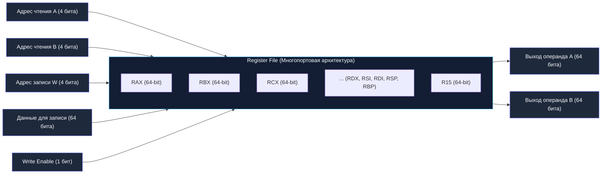
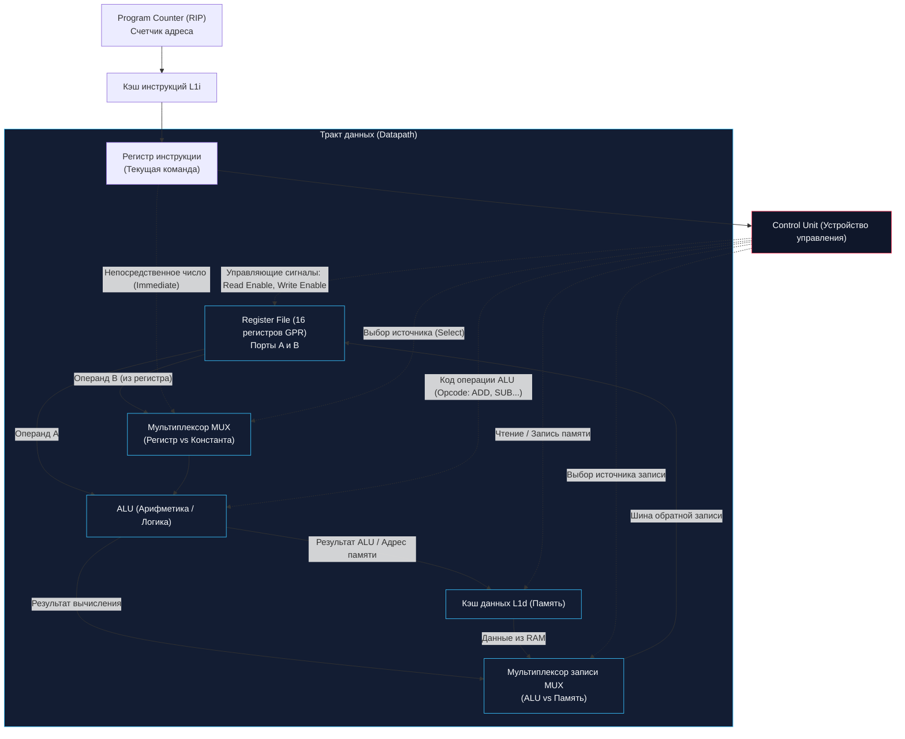

В предыдущих главах мы собрали все ключевые детали нашего кремниевого конструктора: транзисторы, логические вентили, сумматор и ALU из комбинационной логики, а затем триггеры, регистры, счетчики и конечные автоматы из последовательностной.

Теперь настало время сделать шаг назад и взглянуть на всю картину целиком. Как соединить эти разрозненные электронные узлы в единый, слаженно работающий организм — **Центральный Процессор (CPU)**?

В классической архитектуре фон Неймана и современных микропроцессорах кристалл каждого процессорного ядра концептуально делится на три главных органа:
1. **Register File (Регистровый файл):** сверхбыстрый рабочий блокнот, лежащий прямо в кармане ядра;
2. **Datapath (Тракт данных):** мускулы и кровеносная система процессора, по которым текут и где физически преобразуются биты;
3. **Control Unit (Устройство управления):** мозг и нервная система процессора, дирижирующая мускулами в такт кварцевому генератору.

Давайте разберем их анатомию, физические ограничения и то, как понимание этих узлов помогает писать максимально производительный код на Go.

---

## Register File: Сверхбыстрый блокнот процессора

**Регистровый файл (Register File)** — это массив регистров общего назначения (GPR — General Purpose Registers), встроенный непосредственно в конвейер процессорного ядра. 

Как мы выяснили в [[5. Регистры, счетчики и конечные автоматы]], регистры собраны из массивов D-триггеров (быстрой SRAM-памяти). Это единственное место во всем компьютере, где процессор может манипулировать данными *напрямую*. Ни один современный процессор x86-64 или ARM не может взять два числа из планки оперативной памяти DDR5, сложить их и положить обратно в память за одну команду — данные обязаны быть предварительно загружены в регистровый файл.

В 64-битной архитектуре **x86-64** регистров общего назначения всего **16**:
- Исторические регистры: `RAX` (аккумулятор), `RBX` (база), `RCX` (счетчик), `RDX` (данные), `RSI` (источник), `RDI` (приемник), `RBP` (указатель базы фрейма), `RSP` (указатель вершины стека);
- Расширенные регистры (появившиеся с переходом на x86-64): от `R8` до `R15`.

Каждый регистр вмещает ровно 64 бита (8 байт). 
Простая арифметика открывает поразительный факт:
$$16 \text{ регистров} \times 8 \text{ байт} = 128 \text{ байт!}$$
Вся «рабочая память» мощнейшего серверного процессора Intel Xeon или AMD EPYC на уровне регистров ядра составляет крошечные **128 байт** (плюс регистры расширений SIMD/AVX). Всё остальное — оперативная память, кэши, диски — находится за пределами непосредственного вычислительного ядра.



### Почему регистров так мало?
Почему инженеры не поставят 1 000 или 10 000 регистров, чтобы программам вообще не требовалась оперативная память?
1. **Кодирование инструкций:** Чтобы указать регистр в машинной команде, требуется выделить биты в ее формате. Для 16 регистров нужно $4\text{ бита}$ ($2^4 = 16$). Если бы регистров было 1024, для адресации каждого потребовалось бы по $10\text{ бит}$. Инструкция сложения трех операндов $R_d = R_a + R_b$ потратила бы 30 бит только на адресацию регистров!
2. **Многопортовость и физика кремния:** Чтобы выполнить инструкцию `ADD RAX, RBX` за один такт, регистровый файл должен одновременно выдать два операнда и принять один результат. Это архитектура **2R1W (Two Read Ports, One Write Port)**. Каждый триггер обвешивается дополнительными шинами и транзисторами выборки. При росте числа регистров площадь и паразитная емкость шин растут пропорционально квадрату $O(N^2)$, что катастрофически снижает тактовую частоту процессора.

> [!info] Под капотом: Архитектурные vs Физические регистры (Register Renaming)
> Не путайте архитектурные регистры, которые видит компилятор Go (16 регистров x86-64), с физическими регистрами внутри современного Out-of-Order ядра.  
> Современные микропроцессоры (Intel Core, AMD Zen, Apple M-серия) используют блок **переименования регистров (Register Alias Table, RAT)**. Физически на кристалле распаяно от 168 до 256+ физических регистров (PRF — Physical Register File). Аппаратный планировщик на лету связывает 16 «логических» регистров ассемблера с разными свободными физическими ячейками, устраняя ложные зависимости по данным (Write-After-Read и Write-After-Write) и позволяя параллельно выполнять не зависящие друг от друга куски кода.

---

## Datapath: Мускулы и кровеносная система

**Тракт данных (Datapath)** — это сеть кремниевых магистралей и вычислительных узлов, по которой физически перемещаются биты операндов и результатов.

В состав Datapath входят:
1. **ALU (Арифметико-логическое устройство):** набор комбинационных схем (сумматоры, вычитатели, битовые вентили AND/OR/XOR, сдвигатели barrel shifter), выполняющих элементарные математические преобразования.
2. **Регистровый файл:** главный поставщик операндов и приемник готовых значений.
3. **Шины данных (Buses):** параллельные пучки из 64 металлических микропроводников, соединяющие регистры с ALU и контроллером кэш-памяти.
4. **Мультиплексоры (MUX):** кремниевые развилки, переключающие источники сигналов. Например, вторым операндом для ALU может выступать либо значение из регистра (`ADD RAX, RBX`), либо непосредственное число (константа), зашитая прямо в тело команды (`ADD RAX, 42`). Мультиплексор выбирает нужный источник под управлением Control Unit.



---

## Control Unit: Мозг и Дирижер

Если Datapath — это послушные кремниевые мускулы, то **Control Unit (CU, Устройство управления)** — это мозг и нервная система процессорного ядра.

Сам по себе тракт данных безжизненен: это набор проводников, вентилей и триггеров. Ему требуется ежетактный приказ: из каких регистров забрать операнды, какую операцию поручить ALU, обращаться ли к шине памяти и куда сохранить результат.

Control Unit представляет собой сложнейший конечный автомат (FSM), работающий синхронно с тактовой частотой.

### Как Control Unit превращает байты в действие?
Представим, что из памяти прочитана машинная инструкция:
```assembly
ADD RAX, RBX
```
В машинном бинарном коде x86-64 эта инструкция кодируется последовательностью байт `01001000 00000001 11000011` (в шестнадцатеричном виде `48 01 c3`):
- Префикс `01001000` (`0x48`) — префикс REX.W, указывающий на 64-битный размер операндов;
- Опкод `00000001` (`0x01`) — операция `ADD`;
- Байт ModR/M `11000011` (`0xc3`) — указание регистров `RAX` (назначение) и `RBX` (источник).

Двоичный код попадает в **Дешифратор команд (Instruction Decoder)** внутри Control Unit. Дешифратор мгновенно расщепляет эти биты и подает серию скоординированных управляющих напряжений (логических единиц и нулей):
1. **`Read Enable`** активируется на порту чтения A (выбирая `RAX`) и порту B (выбирая `RBX`);
2. Мультиплексор операнда настраивается на выборку регистра (а не константы);
3. На вход выбора операции ALU подается код «Сложение»;
4. Мультиплексор записи переключается на выход ALU;
5. Выставляется флаг **`Write Enable`** на входе регистра `RAX`.

На следующем фронте тактового импульса `CLK` сумма операндов защелкивается в регистре `RAX`, а регистр флагов `RFLAGS` обновляет признаки переноса и нуля. Инструкция завершена!

---

## Mechanical Sympathy: Go и вызов функций через регистры

Понимание того, как устроен регистровый файл, переворачивает взгляд разработчика на производительность программ на Go.

Исторически компилятор Go (до версии **1.17**) использовал стековую конвенцию вызовов (**Go ABI0**), доставшуюся языку в наследство от операционной системы Plan 9. 
При вызове любой функции вызывающая сторона (`caller`) была обязана:
1. Записать все аргументы в память текущего стекового фрейма (через инструкции `MOVQ ... (SP)`);
2. Выполнить команду перехода `CALL`;
3. Вызываемая функция (`callee`) считывала аргументы из оперативной памяти обратно в регистры процессора, чтобы начать вычисления.

Память (даже кэш L1) работает медленнее, чем регистры. Это создавало паразитный трафик шин памяти на каждый тривиальный вызов функции.

```mermaid
flowchart LR
    subgraph OldABI ["Старый Go (до 1.17, ABI0): Стек"]
        Caller1["Вызывающая функция"] -->|Запись в память RAM/L1| StackFrame["Стек вызовов (Память)"]
        StackFrame -->|Чтение из памяти| Callee1["Вызываемая функция"]
    end

    subgraph NewABI ["Современный Go (1.17+, ABIInternal): Регистры"]
        Caller2["Вызывающая функция"] -->|RAX, RBX, RCX, RDI, RSI... (0 ns!)| Callee2["Вызываемая функция"]
    end

    classDef old fill:#1e293b,stroke:#f43f5e,stroke-width:1px,color:#f8fafc;
    classDef new fill:#1e293b,stroke:#10b981,stroke-width:1px,color:#f8fafc;
    class OldABI old;
    class NewABI new;
```

### Революция ABIInternal (Go 1.17+)
Начиная с Go 1.17, инженеры рантайма внедрили **Register-based Calling Convention (ABIInternal)** (подробно мы исследуем его анатомию в [[10. ABI, Calling Convention и стек вызовов]]).

Теперь компилятор Go мапит аргументы и возвращаемые значения прямо на физический регистровый файл:
- **Целочисленные аргументы и указатели:** до **9 регистров** x86-64 (`RAX`, `RBX`, `RCX`, `RDI`, `RSI`, `R8`, `R9`, `R10`, `R11`);
- **Числа с плавающей точкой:** до **15 регистров** SIMD (`X0` – `X14`).

Передача аргументов через регистры происходит с нулевой задержкой доступа ($0\text{ нс}$), что принесло стандартным Go-программам прирост скорости от 5% до 15% просто за счет перекомпиляции!

---

> [!warning] Ловушка / Gotcha: Проливание регистров (Register Spilling)
> Регистровый файл не безграничен. Если сигнатура вашей функции содержит более 9 аргументов типа `int` (или принимает массивную структуру по значению), доступные регистры исчерпываются.
> 
> Первые 9 аргументов займут доступные регистры процессора, а 10-й, 11-й и 12-й будут вынужденно сброшены в память — произойдет так называемый **Spill на стек**. Компилятор вернется к генерации инструкций обращения к памяти `MOVQ AX, 16(SP)`.
> 
> **Практический совет:** Проектируйте публичные API функций лаконичными (не более 3–4 параметров) либо передавайте конфигурационную структуру по указателю (`*Config`), чтобы аргумент укладывался в единственный регистр-указатель.

---

> [!tip] Собеседование: Как проверить использование регистров в скомпилированном Go-коде?
> **Вопрос:** Как на практике убедиться, что конкретная функция Go передает параметры через регистры процессора, а не через память стека?
> 
> **Ответ:** Запустить компилятор Go с выводом ассемблерного листинга SSA:
> ```bash
> go build -gcflags="-S" main.go
> ```
> В полученном выводе смотрим на пролог вызываемой функции:
> - Если передача идет через регистры (ABIInternal), перед инструкцией `CALL` компилятор готовит операнды командами вида `MOVQ AX, BX` или обращается к аргументам прямо в регистрах `AX`, `BX`, `CX`.
> - Если регистров не хватило или переменная пролита, вы увидите запись со смещением от указателя стека: `MOVQ AX, 16(SP)`.
> 
> Также можно использовать утилиту дизассемблирования готового бинарника: `go tool objdump -s "main.MyFunc" mybinary`.

---

## Итог

1. **Register File (Регистровый файл)** — миниатюрный массив регистров GPR (16 регистров по 64 бита в x86-64, всего 128 байт), встроенный прямо в ядро CPU. Он обладает многопортовой архитектурой (2R1W) для одновременного чтения двух операндов и записи одного результата за 1 такт.
2. **Datapath (Тракт данных)** — комбинационная кровеносная система (ALU, мультиплексоры, шины данных), по которой биты операндов путешествуют от регистров к вычислительным блокам и обратно.
3. **Control Unit (Устройство управления)** — аппаратный конечный автомат, декодирующий бинарные инструкции и подающий управляющие импульсы на порты регистров, мультиплексоры и ALU.
4. **Революция Go 1.17+ (ABIInternal):** переход с передачи аргументов через стек памяти на передачу через 9 целочисленных регистров дал ускорение CPU-bound кода на 5–15% благодаря исключению лишних инструкций чтения/записи RAM.

Мы увидели структуру процессора в статике. Но как эта машина оживает во времени? Как именно процессор берет байты из памяти, расшифровывает их и прокручивает вычисления со скоростью миллиарды операций в секунду?

В следующей лекции мы детально разберем фундаментальный ритм кремния — классический трехфазный машинный цикл: [[7. Цикл исполнения инструкции. Fetch, Decode, Execute]].