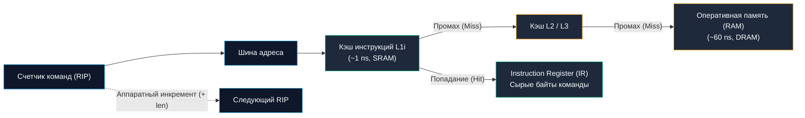
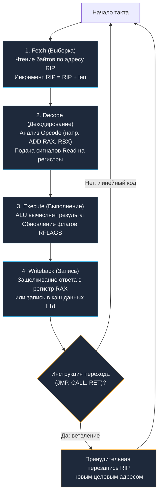

В предыдущей главе [[6. Анатомия CPU. Datapath, Control Unit и Register File]] мы изучили устройство центрального процессора в статике: познакомились с регистровым файлом, вычислительным трактом данных (Datapath) и дирижером оркестра — устройством управления (Control Unit).

Теперь пришло время вдохнуть в этот кремниевый кристалл жизнь и посмотреть на процессор в динамике.

С момента нажатия кнопки питания на сервере и до выключения питания процессор занят ровно одним делом. Он выполняет один и тот же монотонный, математически строгий алгоритм, повторяющийся такт за тактом со скоростью несколько миллиардов раз в секунду:
$$\text{Fetch (Выборка)} \longrightarrow \text{Decode (Декодирование)} \longrightarrow \text{Execute (Выполнение)}$$

Этот неумолимый кремниевый пульс называется **циклом исполнения инструкции (Instruction Execution Cycle)**. Давайте разберем каждый его этап под микроскопом, заглянем в физику задержек и выясним, как высокоуровневый рантайм Go умудряется взаимодействовать с этим аппаратным циклом на лету.

---

## 1. Fetch (Выборка инструкции)

Процессор не обладает человеческим сознанием и не может «охватить взглядом» вашу программу на Go целиком. Для него не существует ни пакетов, ни структур, ни модулей. В каждый отдельный миг времени кругозор ядра сужен до одной-единственной машинной команды, на которую указывает его главный ориентир.

В архитектуре x86-64 этот ориентир хранится в регистре **`RIP` (64-bit Instruction Pointer)**, а в ARM64 — в регистре `PC` (Program Counter).



На фазе **Fetch** происходит следующая цепочка физических событий:
1. Control Unit выставляет число из регистра `RIP` на шину адреса памяти.
2. Процессор пытается прочитать инструкцию. Первым делом запрос попадает в выделенный аппаратный **кэш инструкций первого уровня (L1i)**. Он построен на сверхбыстрых SRAM-триггерах и отдает данные за **1 такт CPU (около 0.25–1 нс)**.
3. Прочитанные байты машинного кода (например, шестнадцатеричная тройка `48 01 D8`) защелкиваются во внутреннем буфере ядра — **Instruction Register (IR)**.
4. Аппаратный сумматор **инкрементирует значение `RIP`**, прибавляя к нему длину прочитанной инструкции, чтобы подготовить ядро к следующему такту.

> [!info] Под капотом: L1i Cache Miss, Pipeline Stall и Profile-Guided Optimization (PGO) в Go
> Если ваш код изобилует мелкими разрозненными функциями, глубокими цепочками интерфейсов и хаотичными переходами, процессор регулярно промахивается мимо кэша L1i (**L1i Cache Miss**). 
> В этот момент фаза Fetch захлебывается: ядро процессора вынуждено отправлять запросы в медленную память DRAM и замирает в ожидании на **200–300 тактов**. Это явление называется **Pipeline Stall (остановка конвейера)**.
> 
> Начиная с **Go 1.22+**, компилятор активно использует **Profile-Guided Optimization (PGO)**. Анализируя реальный профиль нагрузки сервиса (`default.pgo`), компилятор переупорядочивает скомпилированные функции и горячие ветки кода так, чтобы они располагались в оперативной памяти строго линейно и последовательно. Это максимизирует попадания в L1i кэш на этапе Fetch и поднимает производительность бэкенда на 2–7% абсолютно бесплатно!

---

## 2. Decode (Декодирование)

Сырые байты загружены в Instruction Register, но для вычислительного блока (Datapath) они пока остаются слепым набором битов. Набор байтов необходимо расшифровать и превратить в скоординированные электрические сигналы управления.

Эту задачу решает **Instruction Decoder (Декодер инструкций)** — сложнейшая комбинационная схема внутри Control Unit.

На этапе **Decode**:
1. Декодер анализирует код операции (Opcode). Увидев байты `48 01 D8`, декодер распознает:
   - Префикс `48` — операция над 64-битными регистрами;
   - Опкод `01` — операция сложения (`ADD`);
   - Байт `D8` — операнды `RAX` и `RBX` (сложение `ADD RAX, RBX`).
2. Декодер определяет, какие именно регистры нужны для вычислений, и подает управляющий сигнал `Read` на соответствующие порты регистрового файла (Register File).
3. Настраиваются аппаратные мультиплексоры (MUX), коммутирующие шины между регистрами и входами ALU.
4. На управляющие входы ALU подается бинарный код команды `ADD`.

> [!warning] Ловушка / Gotcha: Проклятие переменной длины x86-64 против элегантности RISC
> В серверных процессорах с архитектурой x86-64 инструкции имеют **переменную длину — от 1 до 15 байт**! 
> Чтобы просто выяснить, где заканчивается текущая инструкция и где начинается следующая, аппаратному декодеру x86 приходится производить сложнейший предварительный анализ префиксов. Современные ядра Intel/AMD вынуждены ставить до 4–6 параллельных декодеров и отдельный кэш декодированных микроопераций ($\mu$op Cache), который потребляет ощутимую долю энергии чипа.
> 
> Напротив, в архитектуре **ARM64 (Apple Silicon, AWS Graviton, Neoverse)** абсолютно все инструкции имеют строго фиксированную длину: **ровно 4 байта (32 бита)**. 
> Декодеру ARM не нужно гадать, где кончается команда — адрес следующей инструкции всегда равен $PC + 4$. Это позволяет строить дешифраторы гораздо проще, компактнее и холоднее, обеспечивая выдающуюся энергоэффективность ARM-серверов в облачных дата-центрах.

---

## 3. Execute (Выполнение)

Все подготовительные цепи скоммутированы, операнды выставлены на входные шины. Наступает момент физического совершения полезной работы.

На этапе **Execute**:
1. **Вычисление:** Арифметико-логическое устройство (ALU) выполняет команду. Например, при сложении операндов `RAX` и `RBX` кремниевые сумматоры Carry-Lookahead прогоняют биты через каскады вентилей за доли наносекунды.
2. **Обновление флагов:** По результату операции ALU выставляет признаки в регистре состояния `RFLAGS` (Zero Flag `ZF` — равен ли результат нулю, Carry Flag `CF` — произошел ли перенос, Overflow Flag `OF` — случилось ли знаковое переполнение).
3. **Запись результата (Writeback):** Полученная сумма по шине данных направляется обратно в регистровый файл и по сигналу `Write Enable` защелкивается в целевом регистре `RAX`.
4. **Ветвления и прыжки:** Если выполнялась инструкция ветвления (например, безусловный `JMP`, условный переход или вызов функции `CALL`), то на этапе Execute результат вычисления адреса принудительно перезаписывает счетчик `RIP`. Линейный ход программы нарушается, и следующий цикл Fetch начнется с нового адреса в памяти.



---

## Mechanical Sympathy: Go Runtime и цикл процессора

Понимание непрерывного цикла «Fetch-Decode-Execute» позволяет блестяще ответить на один из самых классических вопросов для Senior Go-разработчиков: **как устроена невытесняющая и вытесняющая многозадачность?**

> [!tip] Собеседование: Горутина в бесконечном цикле и сигнал SIGURG
> **Вопрос:** Представьте программу на Go, запущенную на одноядерной машине (или с жестким ограничением потоков):
> ```go
> package main
> 
> import (
> 	"fmt"
> 	"runtime"
> 	"time"
> )
> 
> func main() {
> 	runtime.GOMAXPROCS(1)
> 	go func() {
> 		for {
> 			// Пустой бесконечный цикл без вызовов функций
> 		}
> 	}()
> 	time.Sleep(time.Millisecond * 10)
> 	fmt.Println("Готово!")
> }
> ```
> Выведет ли эта программа строку «Готово!»? Как именно рантайм Go вытесняет горутину, застрявшую в плотном цикле `for {}`?
> 
> **Ответ:**
> 1. **В старых версиях Go (до 1.14):** Программа зависала навсегда! 
>    Планировщик Go был исключительно **кооперативным**. Компилятор вставлял инструкцию проверки стека (`runtime.morestack`) только в пролог функций. Поскольку в пустом цикле `for {}` нет вызовов функций, процессор крутил инструкцию прыжка `JMP` на одном месте в цикле `Fetch-Decode-Execute`. Горутина монополизировала поток ОС, не отдавая управление планировщику.
> 
> 2. **В современном Go (1.14+):** Программа успешно напечатает «Готово!».
>    В Go была реализована **асинхронная вытесняющая многозадачность (Non-cooperative Goroutine Preemption)** на основе сигналов ОС:
>    - Фоновый системный поток Go-рантайма — **`sysmon`** (system monitor) — просыпается каждые $20\dots 100\text{ мкс}$ и проверяет состояние горутин.
>    - Если `sysmon` видит, что горутина выполняется на одном потоке `M` дольше **10 миллисекунд**, он инициирует вытеснение.
>    - Рантайм посылает системному потоку сигнал ОС — в Linux это специальный сигнал **`SIGURG`** (в старых версиях планировался `SIGIO`, но `SIGURG` не конфликтует с отладчиками и стандартными библиотеками C).
>    - Ядро Linux генерирует **аппаратное прерывание** (подробнее в [[34. Аппаратные прерывания и Системные вызовы]]). 
>    - Аппаратное прерывание физически **разрывает цикл Fetch-Decode-Execute** текущего потока! Ядро CPU сохраняет текущие регистры и `RIP` зависшей горутины в сигнальный стек и передает управление в обработчик `runtime.sighandler`.
>    - Обработчик сигнала Go подменяет адрес возврата в стеке на функцию `runtime.asyncPreempt`. Когда сигнал завершается, процессор возобновляет работу, но попадает прямо в `asyncPreempt`, которая аккуратно паркует бесконечный цикл и переключает поток на выполнение горутины `main`!

```mermaid
sequenceDiagram
    autonumber
    participant CPU as Ядро CPU (Fetch-Decode-Execute)
    participant Loop as Горутина с for {}
    participant Sysmon as Фоновый поток sysmon
    participant Kernel as Ядро Linux
    participant Runtime as Рантайм Go (sighandler)

    CPU->>Loop: Непрерывное исполнение цикла: JMP -> JMP -> JMP
    Note over Sysmon: Горутина крутится > 10 мс без прерываний!
    Sysmon->>Kernel: tgkill(tid, SIGURG)
    Kernel->>CPU: Аппаратное прерывание (Signal Delivery)
    Note over CPU: Разрыв цикла Fetch-Decode-Execute!<br>Сохранение RIP в стек
    CPU->>Runtime: Переход в обработчик runtime.sighandler
    Runtime->>Runtime: Подмена точки возврата на runtime.asyncPreempt
    Runtime-->>CPU: Возврат из сигнала
    CPU->>Runtime: Исполнение asyncPreempt: парковка горутины
    CPU->>CPU: Планировщик переключается на функцию main() -> "Готово!"
```

Именно так глубокое понимание аппаратного цикла инструкций и аппаратных прерываний превращает загадочную магию рантайма Go в абсолютно прозрачный инженерный механизм.

---

## Итог

1. **Fetch (Выборка):** Ядро считывает байты машинной команды по адресу из регистра `RIP` (или `PC`), загружает их в регистр инструкции `IR` и инкрементирует счетчик адреса. Промахи в кэше инструкций L1i приводят к простоям конвейера на сотни тактов.
2. **Decode (Декодирование):** Комбинационный дешифратор команд разбирает опкод (например, `48 01 D8`), подготавливает входы ALU и выставляет сигналы `Read` на регистрах операндов. В архитектуре x86 переменная длина команд (1–15 байт) сильно усложняет декодер по сравнению с фиксированным 4-байтным форматом ARM64.
3. **Execute (Выполнение) и Writeback:** ALU физически перемалывает биты, выставляет флаги состояний `RFLAGS` и сохраняет ответ обратно в регистровый файл по сигналу `Write Enable`.
4. **Инструкции переходов и ветвления (`if/else`, `JMP`, `CALL`, `RET`):** Ломают последовательный шаг $RIP = RIP + \text{len}$ и принудительно загружают в счетчик команд новый адрес в памяти.
5. **Асинхронное вытеснение в Go (1.14+):** Единственный способ прервать плотный бесконечный цикл `for {}` в кремнии — послать потоку сигнал ядра Linux (`SIGURG`), вызвав аппаратное прерывание процессора.

Мы разобрались, как процессор читает, декодирует и выполняет машинные команды. Но кто определяет сам словарь этих команд? Откуда компилятор Go знает, что сложение 64-битных регистров — это именно байты `48 01 D8`, а не какие-то другие?

Ответ на этот вопрос дает великий архитектурный контракт между создателями кремния и разработчиками компиляторов. В следующей статье мы изучим: [[8. ISA. Интерфейс между железом и софтом]].