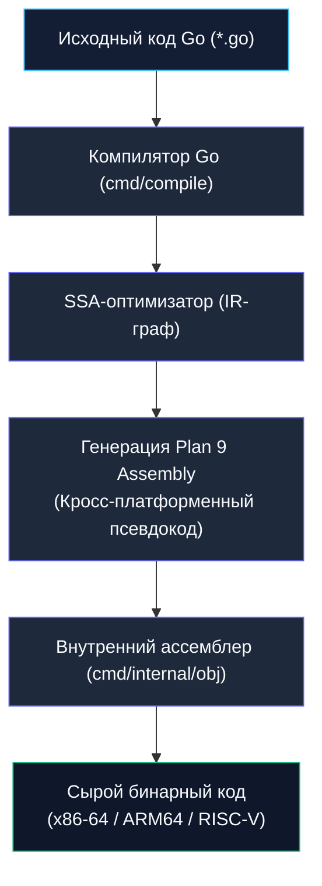
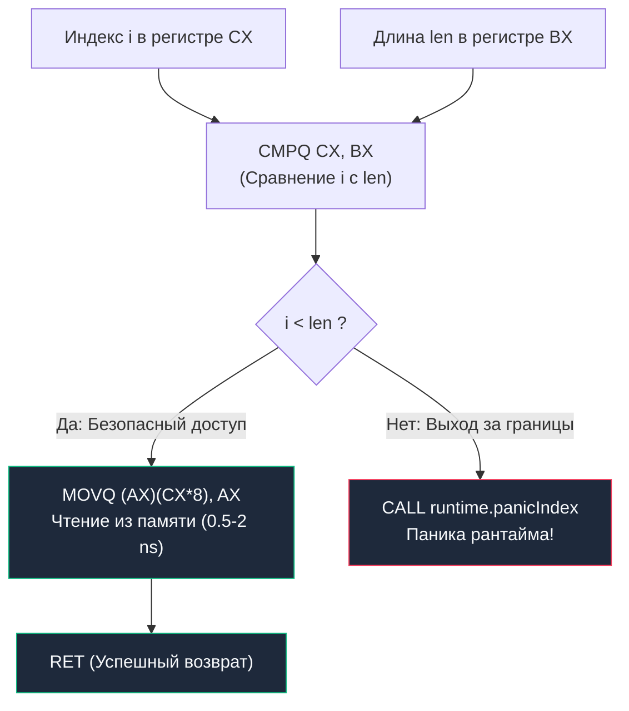

Для прикладного разработчика исходный код — это лаконичные структуры, замыкания, каналы и архитектурные абстракции. Для кремниевого кристалла процессора этих концепций не существует. На уровне транзисторов есть лишь непрерывный поток машинных битов, переключающий мультиплексоры и триггеры.

**Ассемблер** — это тончайшая и абсолютно прозрачная граница между человеческим мышлением и физикой машины. Это символическое, человекочитаемое представление машинного кода той самой ISA, которую мы изучили в [[8. ISA. Интерфейс между железом и софтом]].

Умение читать ассемблер — одна из главных суперсил Senior-инженера. Высокоуровневый код на Go может скрывать детали: компилятор может незаметно вставить аллокацию в кучу, аппаратную проверку границ массива или вызов диспетчера рантайма. **Ассемблер не врет никогда.** Это окончательная, обнаженная истина о том, какие именно инструкции выполнит ваше процессорное ядро.

В этой лекции мы развеем миф о «непостижимой сложности» ассемблера, освоим диалект Plan 9, на котором говорят компилятор и рантайм Go, и научимся исследовать скрытые механизмы собственного кода.

---

## Диалект Plan 9: Свой путь Go

В мире x86-64 исторически конкурируют два стандарта оформления инструкций:
1. **Синтаксис Intel:** принят в документации Intel/AMD и в мире Windows (формат: `Opcode Destination, Source` — приемник слева);
2. **Синтаксис AT&T:** исторический стандарт мира UNIX и GNU Assembler (формат: `Opcode Source, Destination`, операнды с префиксами `%rax`, `$42`).

Однако, когда вы впервые скомпилируете Go-код с флагом вывода ассемблера, вы увидите третий, самобытный диалект — **Plan 9 Assembly**.



Корни этого решения уходят в исследовательский центр Bell Labs. Создатели языка Go — Кен Томпсон и Роб Пайк — были авторами распределенной операционной системы Plan 9. Для нее Кен Томпсон написал семейство уникальных C-компиляторов (`8c`, `6c`, `5c`), где ассемблер служил не отдельным языком макросов, а переносимым промежуточным представлением (IR). 

### Золотое правило Plan 9: Слева направо
В синтаксисе Plan 9 поток данных всегда читается естественно — **слева направо**:
$$\mathbf{Инструкция} \quad \mathbf{Источник}, \quad \mathbf{Приемник}$$

Например, команда:
```asm
MOVQ AX, BX
```
читается как: *«Скопировать 64-битное значение из регистра `AX` в регистр `BX`»*.

### Суффиксы размера операндов
К мнемонике операции всегда прикрепляется буква, указывающая точный размер обрабатываемых данных:
- **`B` (Byte):** 1 байт (8 бит), например `MOVB`;
- **`W` (Word):** 2 байта (16 бит), машинное слово, например `MOVW`;
- **`L` (Long):** 4 байта (32 бита), двойное слово, например `MOVL`;
- **`Q` (Quadword):** 8 байт (64 бита), учетверенное слово — базовый размер в 64-битных системах, например `MOVQ`.

Константы в Plan 9 всегда предваряются символом доллара: `$42` — это число 42, а не адрес ячейки памяти.

---

## Базовый словарь инструкций

Микропроцессор x86-64 поддерживает тысячи инструкций, но чтобы уверенно читать 95% вывода компилятора Go, достаточно запомнить всего шесть основных глаголов:

1. **`MOV` (Move — Перемещение):**  
   Главный труженик любого чипа. Копирует байты между регистрами (`MOVQ AX, BX`) или между регистром и оперативной памятью (`MOVQ (AX), BX`). До 60% всего машинного кода среднестатистического бэкенда состоит именно из инструкций семейства `MOV`.
2. **`ADD`, `SUB`, `IMUL` (Арифметика):**  
   Сложение, вычитание и целочисленное умножение.  
   `ADDQ $10, AX` — прибавить число 10 к регистру `AX` и сохранить результат в `AX`.
3. **`LEA` (Load Effective Address — Загрузка эффективного адреса):**  
   Уникальная инструкция архитектуры x86. Исходно она проектировалась для быстрого вычисления адреса ячейки памяти по формуле `[база + индекс*масштаб + смещение]`. Но компиляторы используют команду **`LEAQ`** как супербыстрый математический трюк: она позволяет выполнить сложение и умножение на константу (2, 4, 8) за **один-единственный такт CPU**, вообще не обращаясь к памяти!
4. **`CMP` (Compare — Сравнение):**  
   Сравнивает два операнда. Под капотом `CMP` просто вычитает один операнд из другого (`Destination - Source`), но не сохраняет разность, а лишь выставляет битовые флаги в регистре состояния `RFLAGS` (Zero Flag `ZF`, Sign Flag `SF` и др.).
5. **`JMP`, `JEQ`, `JNE`, `JAE` (Jump — Переходы и ветвления):**  
   Инструкции ветвления, меняющие значение счетчика команд `RIP`.
   - **`JMP`:** безусловный прыжок по указанному адресу;
   - **`JEQ` (Jump if Equal):** переход, если предыдущий `CMP` показал равенство (флаг $ZF = 1$);
   - **`JNE` (Jump if Not Equal):** переход, если операнды не равны ($ZF = 0$);
   - **`JAE` (Jump if Above or Equal):** переход для беззнаковых чисел ($A \ge B$).
6. **`CALL` и `RET`:**  
   Переход к телу вызываемой функции (с сохранением адреса возврата на вершине стека) и возврат обратно.

---

## Псевдо-регистры Go

Ключевая инновация диалекта Plan 9 — концепция **псевдо-регистров**. Это виртуальные регистры, которых физически нет на кристалле процессора. Компилятор Go оперирует ими для построения платформонезависимого кода, а внутренний ассемблер и линкер на финальном этапе подставляют реальные смещения в памяти.

В Go определены четыре главных псевдо-регистра:
- **`SB` (Static Base):** Указатель на начало глобальной памяти программы. Все функции и глобальные константы адресуются относительно `SB`. Запись `"".main(SB)` обозначает глобальный адрес точки входа `main` текущего пакета.
- **`FP` (Frame Pointer):** Виртуальный указатель базы фрейма. Используется для адресации аргументов, переданных вызывающей стороной через память.
- **`SP` (Stack Pointer):** Виртуальный указатель стека, адресующий локальные переменные текущей функции на стеке.
- **`PC` (Program Counter):** Псевдоним аппаратного счетчика инструкций `RIP`.

---

> [!warning] Ловушка / Gotcha: Ловушка двух разных SP (Виртуальный vs Аппаратный)
> В ассемблере Plan 9 существует **два принципиально разных регистра `SP`**!
> 
> 1. **Виртуальный псевдо-регистр `SP`:**  
>    Обозначает локальные переменные функции. В коде он **обязан** предваряться именем символа:
>    ```asm
>    MOVQ x-8(SP), AX  // Читаем локальную переменную x из виртуального фрейма
>    ```
> 2. **Аппаратный физический регистр `SP` (`RSP`):**  
>    Обозначает реальную физическую вершину стека процессора. Пишется **строго без имени символа**:
>    ```asm
>    MOVQ -8(SP), AX   // Читаем данные со смещением от физического регистра RSP!
>    ```
> 
> Если при написании ассемблерного кода вы напишете `-8(SP)` вместо `имя_переменной-8(SP)`, вы обратитесь к аппаратному регистру `RSP`, сместившись за пределы актуального фрейма. Это классическая причина загадочных сбоев `segmentation fault` при вызове ассемблерных функций в Go!

---

## Читаем код: Как CPU видит вашу функцию

Давайте напишем элементарную функцию на Go и посмотрим на нее глазами процессорного ядра:

```go
package main

//go:noinline
func add(a, b int) int {
	return a + b
}
```
*(Прагма `//go:noinline` приказывает компилятору не встраивать тело функции в место вызова, чтобы мы могли увидеть ее в дизассемблере).*

Скомпилируем файл с флагом вывода ассемблера:
```bash
go build -gcflags="-S" main.go
```
(или через прямой запуск компилятора: `go tool compile -S main.go`).

В терминале появится компактный ассемблерный блок (на архитектуре `amd64`):
```asm
"".add STEXT nosplit size=4 args=0x10 locals=0x0 funcid=0x0 align=0x0
	0x0000 00000 (main.go:4)	TEXT	"".add(SB), NOSPLIT|ABIInternal, $0-16
	0x0000 00000 (main.go:5)	ADDQ	BX, AX
	0x0003 00003 (main.go:5)	RET
```

Разберем каждую строчку ассемблерного вывода:

1. **`TEXT "".add(SB), NOSPLIT|ABIInternal, $0-16`**
   - Директива `TEXT` объявляет секцию исполняемого кода и имя функции `"".add(SB)`. Пустые кавычки заменяются линкером на имя текущего пакета (например, `main`).
   - Флаг **`NOSPLIT`** сообщает рантайму, что функции не требуется пролог проверки размера стека, так как она не создает локальных переменных.
   - Флаг **`ABIInternal`** означает использование современной конвенции вызова через регистры (Go 1.17+).
   - Числовая пара **`$0-16`**:
     - `$0` — размер локального фрейма на стеке (0 байт, переменные не создаются);
     - `$16` — суммарный размер аргументов и возвращаемого значения (два операнда `int` по 8 байт).
2. **`ADDQ BX, AX`**
   Обратите внимание: в коде нет ни одной инструкции чтения из памяти!  
   В силу стандарта ABIInternal аргумент `a` пришел в регистре **`AX`**, а аргумент `b` — в регистре **`BX`**. Инструкция `ADDQ BX, AX` складывает их в кремнии за 1 такт и сохраняет результат в `AX`, откуда вызывающая сторона заберет возвращаемое значение.
3. **`RET`**
   Процессор извлекает адрес возврата из стека и возвращает управление в вызывающую функцию.

---

## Mechanical Sympathy: Скрытая цена слайсов

Ассемблер наглядно показывает, какую скрытую цену приходится платить за безопасность памяти в Go по сравнению с языками без проверок (C / C++).

Посмотрим на невинную функцию чтения элемента слайса:
```go
package main

func readSlice(s []int, i int) int {
	return s[i]
}
```

Скомпилируем ее через `go tool compile -S main.go` и заглянем внутрь:
```asm
	// AX = указатель на массив данных, BX = длина слайса (len), CX = индекс (i)
	0x0000 00000 (main.go:4)	CMPQ	CX, BX         // Сравниваем индекс (CX) с длиной (BX)
	0x0003 00003 (main.go:4)	JAE	0x000b         // Если i >= len, прыжок на панику!
	0x0005 00005 (main.go:4)	MOVQ	(AX)(CX*8), AX // Чтение из памяти: адрес = AX + CX*8
	0x0009 00009 (main.go:4)	RET
	0x000b 00011 (main.go:4)	CALL	runtime.panicIndex(SB) // Аварийный выброс паники
```



В языке C чтение по индексу превращается в единственную инструкцию `MOVQ`. 
В Go компилятор гарантирует защиту от уязвимостей переполнения буфера (Buffer Overflow), поэтому автоматически генерирует две защитные инструкции: **`CMPQ`** и условный переход **`JAE`** на вызов `runtime.panicIndex`.

В горячих циклах (обработка сетевых пакетов, парсинг логов, сжатие данных) эти проверки могут съедать до 15–20% производительности. 

> [!tip] Собеседование: Bounds Check Elimination (BCE) в Go
> **Вопрос:** Как компилятор Go оптимизирует проверки выхода за границы слайсов (Bounds Checking) и как программист может ему помочь?
> 
> **Ответ:** В компиляторе Go работает алгоритм **Bounds Check Elimination (BCE)** на базе SSA-анализа. Если компилятор может строго доказать, что индекс никогда не превысит длину слайса, он полностью вырезает инструкции `CMPQ` и `JAE`.
> 
> Программист может подсказать компилятору явной предварительной проверкой:
> ```go
> func process(data []byte) {
>     _ = data[3] // Один раз проверяем границу до индекса 3!
>     
>     // Все последующие чтения безопасны: компилятор удаляет из них проверки!
>     a := data[0]
>     b := data[1]
>     c := data[2]
>     d := data[3]
>     _ = a + b + c + d
> }
> ```
> Проверить работу оптимизатора BCE можно флагом компилятора:
> ```bash
> go build -gcflags="-d=ssa/check_bce" main.go
> ```
> Компилятор выведет предупреждения обо всех строках, где ему пришлось оставить инструкцию `CMPQ`.

---

> [!info] Под капотом: Динамические стеки горутин (Continuous Stacks)
> В декларации тривиальной функции `add` мы видели флаг `NOSPLIT`. Но если функция нетривиальна или вызывает другие функции, компилятор обязательно генерирует в самом начале (прологе) служебный блок:
> ```asm
> MOVQ (TLS), CX              // Загружаем указатель на текущую структуру горутины 'g'
> CMPQ SP, 16(CX)             // Сравниваем физический SP со значением g.stackguard0
> JLS  runtime.morestack(SB)  // Если памяти осталось мало, вызываем рантайм!
> ```
> Это фундамент механизма непрерывных динамических стеков Go (Continuous Stacks).  
> Каждая горутина рождается с миниатюрным стеком размером всего **2 КБ**. Пролог функции аппаратно сравнивает указатель стека с охранной границей `stackguard0`. Если места для локальных переменных не хватает, вызывается рантайм `runtime.morestack`, который аллоцирует новый стек удвоенного размера (4 КБ, 8 КБ...), копирует туда все данные, обновляет указатели и бесшовно продолжает исполнение.

---

## Итог

1. **Ассемблер** — это символическая запись машинных инструкций, дающая 100% достоверное представление о работе кода в кремнии.
2. **Plan 9 Assembly:** диалект ассемблера Go с естественным синтаксисом «Слева направо» (`Инструкция Источник, Приемник`) и суффиксами размера данных (`B`, `W`, `L`, `Q`).
3. **Псевдо-регистры Go:** `SB` (глобальная память), `FP` (аргументы), `SP` (локальный стек), `PC` (счетчик инструкций). Виртуальный `имя-8(SP)` нельзя путать с аппаратным `-8(SP)`.
4. **ABIInternal (Go 1.17+):** аргументы функций передаются прямо через физические регистры процессора (`AX`, `BX`...), что устраняет лишние обращения к памяти.
5. **Анализ скомпилированного кода:** флаг `go build -gcflags="-S"` позволяет находить проверки границ слайсов (Bounds Checking), невидимые аллокации и скрытые вызовы рантайма.

Мы увидели, как инструкции оперируют регистрами и стеком при вызове функций. Но какие правила регулируют порядок передачи аргументов, кто очищает стек и как Go умудряется вызывать C-код?

В следующей лекции мы детально изучим конституцию взаимодействия функций: [[10. ABI, Calling Convention и стек вызовов]].