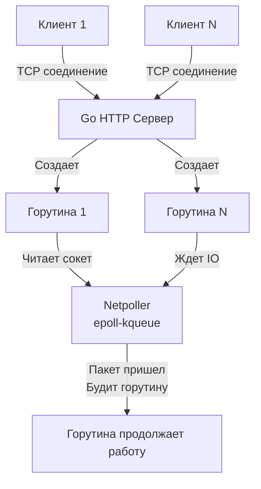

## Введение в сетевые интерфейсы: От монолита к распределенным контрактам

Когда в начале 1970-х годов в Bell Labs мы закладывали основы операционной системы Unix, одним из наших фундаментальных озарений было осознание силы простых интерфейсов: программы должны легко соединяться друг с другом, подобно стандартизированным деталям детского конструктора. Текстовые пайпы (`|`) стали первым универсальным протоколом обмена данными, связавшим изолированные утилиты в стройные конвейеры обработки информации.

В современных распределенных архитектурах этой связующей тканью стали сетевые API (Application Programming Interface). Написать алгоритмически безупречный, аллокационно-эффективный код, функционирующий в вакууме одного процесса — задача важная, но локальная. Настоящая архитектурная ответственность начинается в тот момент, когда ваш сервис выставляет наружу сетевой интерфейс и приглашает к диалогу внешний мир.

Проектирование API — это инженерная дисциплина, где цена допущенной ошибки экспоненциально возрастает со временем. Неудачную внутреннюю структуру пакетов или плохой алгоритм внутри микросервиса команда может переписать за один двухнедельный спринт. Но неудачный публичный API-контракт, на который завязались мобильные приложения, IoT-устройства или сотни внешних корпоративных партнеров, вы будете вынуждены бережно поддерживать годами, громоздя бесконечные костыли для сохранения обратной совместимости.

Этот раздел базы знаний посвящен искусству проектирования долговечных сетевых интерфейсов, осознанному выбору протоколов передачи данных и созданию нерушимых контрактов в экосистеме Go.

## Философия контракта: Postel's Law и неявные ожидания

В проектировании распределенных систем мы руководствуемся классическим принципом устойчивости, сформулированным Джоном Постелом в спецификации RFC 760 и известным как **закон Постела (Postel's Law)**:

> *«Будь строг в том, что отправляешь, и гибок в том, что принимаешь».*  
> *(Be conservative in what you do, be liberal in what you accept from others).*

В контексте сетевых API этот принцип материализуется в два фундаментальных требования:

1. **Строгость исходящих ответов (Conservative Sending)**: Если схема вашего сервиса декларирует возврат коллекции сущностей, обработчик обязан всегда возвращать валидный массив (в случае отсутствия данных — пустой срез `[]`), но ни в коем случае не `null`, не пустую строку и не сырой объект с ошибкой. Структура исходящего документа должна быть строго детерминированной и предсказуемой для клиентских парсеров.
2. **Гибкость приема входящих данных (Liberal Receiving)**: Если сторонний клиент прислал в полезной нагрузке JSON дополнительное неизвестное поле (например, добавленное новой версией клиента), бэкенд не должен аварийно падать с кодом `500 Internal Server Error` или отвергать запрос. Сервис обязан благополучно распарсить известные поля и проигнорировать избыточные данные (если это не противоречит жестким критериям безопасности и валидации).

В мире Go эта концепция органично перекликается с архитектурой интерфейсов самого языка. Если в Java или C# класс обязан *явно* декларировать список реализуемых контрактов (`implements Interface`), то в Go интерфейсы удовлетворяются *структурно и неявно* (Duck typing). Мы описываем лишь то минимальное поведение, которое нам необходимо. Точно так же и в распределенной сети: клиент ожидает строго оговоренного сетевого поведения, абстрагируясь от того, на каком языке написан бэкенд — на Go, C++, Rust или Python.

## Механика сетевого запроса в Go: Goroutine-per-Connection

Прежде чем приступать к архитектурным баталиям REST, gRPC или GraphQL, критически важно понять, как сетевые интерфейсы физически проецируются на рантайм Go. Почему именно Go стал де-факто стандартом создания API-шлюзов ([[25. API Gateway]]) и высокопроизводительных микросервисов?

Исторически индустрия прошла через несколько болезненных парадигм:
- **Процесс или тред на соединение (Apache/PHP, старый Java/Python)**: На каждый входящий TCP-сокет операционная система выделяла тяжеловесный поток ядра (Thread) с мегабайтами стека. Это породило классическую проблему C10K: сервер не мог одновременно удерживать 10 000 параллельных сессий из-за исчерпания памяти и колоссальных потерь CPU на переключениях контекста (Context Switch).
- **Одиночный цикл событий (Event Loop в Node.js, Twisted/asyncio в Python)**: Разработчики избавились от блокировки потоков, но поплатились читаемостью кода. Программы превратились в лапшу из коллбэков, а появление синтаксиса `async/await` разделило функции на «два цвета» (блокирующие и неблокирующие), где любая случайная блокировка в User Space замораживала обслуживание всего сервера.

Go предложил революционный по простоте и эффективности подход: **Goroutine-per-Connection**.

```go
package main

import (
	"log"
	"net/http"
)

// handler обрабатывает входящий сетевой HTTP-запрос
// Этот код выполняется в персональной легковесной горутине для каждого клиента
func handler(w http.ResponseWriter, r *http.Request) {
	// Для программиста вызов выглядит как синхронная линейная операция,
	// но рантайм Go выполняет под капотом асинхронную магию
	w.Write([]byte("Hello, API world!"))
}

func main() {
	http.HandleFunc("/", handler)
	// ListenAndServe начинает слушать порт и порождать горутины на каждое соединение
	log.Fatal(http.ListenAndServe(":8080", nil))
}
```

> [!info] Под капотом: Netpoller
> Когда вы вызываете `w.Write()` или читаете тело запроса, вам кажется, что текущая горутина выполняет блокирующий системный вызов ядра. Однако сетевой стек Go полностью переведен на **неблокирующий ввод-вывод (non-blocking I/O)**.
> 
> Когда горутине требуются данные из сокета, а сетевой буфер пуст, рантайм Go не блокирует поток ОС. Он регистрирует файловый дескриптор в системном мультиплексоре ядра: `epoll` в Linux, `kqueue` в FreeBSD/macOS или `IOCP` в Windows.
> 
> Горутина немедленно снимается с потока операционной системы (`M`), переводясь в статус `waiting`. Освободившийся поток ядра `M` моментально забирает из очереди логического процессора (`P`) следующую готовую задачу. Как только сетевая карта принимает кадры и ядро сообщает о готовности сокета через `epoll`, сетевой поллер (Netpoller) рантайма Go «будит» нашу горутину, переводит ее в состояние `runnable` и возвращает на исполнение. В результате мы пишем чистый, простой синхронный код, получая производительность и масштабируемость асинхронного Event Loop без его архитектурных кошмаров.



> [!warning] Ловушка / Gotcha: Утечка горутин на сетевом слое
> Модель goroutine-per-connection таит в себе смертельную опасность при небрежном проектировании. Если удаленный клиент открыл TCP-сокет и «завис» (не передает данные, но и не разрывает соединение управляющими пакетами FIN/RST), выделенная горутина останется принудительно заблокированной в памяти. Миллион таких полумертвых соединений приведет к исчерпанию оперативной памяти и неизбежному OOM (Out Of Memory).
> **Железное правило:** При разработке сетевых интерфейсов в Go ВСЕГДА задавайте жесткие таймауты (`ReadTimeout`, `WriteTimeout`, `IdleTimeout` в структуре `http.Server`) и сквозным образом прокидывайте `context.Context`, чтобы мгновенно прерывать обработку на бэкенде при обрыве соединения клиентом.

## Палитра проектировщика: Что мы будем изучать

Проектирование API — это не фанатичная приверженность одной технологии, а зрелое умение подбирать оптимальный протокол под конкретный ландшафт задачи:

1. **REST и Resource-Oriented Design**: Безусловный мировой стандарт публичных интерфейсов. Он идеально кэшируется промежуточными прокси, понятен человеку, документируется спецификациями OpenAPI и легко инспектируется в консоли браузера ([[3. REST. Основные принципы]]).
2. **gRPC и Protocol Buffers**: Абсолютный выбор номер один для межсервисного взаимодействия (Service-to-Service) внутри закрытого кластера. Компактный бинарный формат, мультиплексирование потоков поверх HTTP/2 и строгая валидация схем на этапе компиляции обеспечивают колоссальный выигрыш в скорости и безопасности ([[16. gRPC. Основы]], [[7. Форматы данных JSON vs Protobuf]]).
3. **GraphQL**: Гибкий декларативный протокол, незаменимый для сложных пользовательских интерфейсов веб- и мобильных приложений. Позволяет фронтенду запрашивать ровно те поля и связи, которые необходимы для отрисовки экрана, радикально решая проблемы избыточной выборки (Over-fetching) и недостатка данных (Under-fetching).
4. **Real-time протоколы**: Когда классическая парадигма «Запрос-Ответ» (Request-Response) неприменима, и бэкенд обязан инициировать отправку данных клиенту в режиме реального времени. Мы детально сравним двунаправленный [[22. WebSocket]], однонаправленный [[23. Server Sent Events]] и классический [[24. Long polling]].

> [!tip] Собеседование
> **Вопрос**: В чем концептуальная разница между классическим REST и популярным термином HTTP API?
> **Ответ**: REST (Representational State Transfer) — это строгий архитектурный стиль распределенных гипермедиа-систем, сформулированный Роем Филдингом в докторской диссертации 2000 года. Он базируется на строгих ограничениях: Client-Server, Stateless, Cacheable, Layered System и Uniform Interface. Термин «HTTP API» обозначает любой веб-сервис, передающий данные (обычно JSON) поверх сетевого транспорта HTTP. Подавляющее большинство коммерческих «REST API» на самом деле являются прагматичными HTTP API (или JSON API), так как осознанно игнорируют фундаментальное требование REST — HATEOAS (Hypermedia as the Engine of Application State), согласно которому клиент должен динамически перемещаться по ресурсам исключительно через гиперссылки, возвращаемые сервером.

## Жизненный цикл API-контракта

Проектирование сетевого интерфейса не заканчивается нажатием кнопки развертывания первой версии сервиса в production. Настоящая инженерная зрелость проверяется в момент, когда вам необходимо внести неизбежные изменения в контракт, который уже активно используют клиенты.

В рамках этого раздела мы досконально разберем следующие критические аспекты:
* **Стратегии версионирования (Versioning)**: Сравнение версионирования через префиксы URL, пользовательские заголовки и согласование контента Content-Type ([[8. Versioning API]]).
* **Обратная совместимость (Backward Compatibility)**: Как безопасно расширять схемы данных, переименовывать поля и депрекейтить устаревшие эндпоинты без сбоев на стороне старых клиентов ([[27. Backward compatibility]]).
* **Ограничение нагрузки и устойчивость (Resilience)**: Как защитить сетевой периметр от паразитного трафика, агрессивных ботов и каскадных аварий с помощью квот и адаптивных алгоритмов Rate Limiting ([[11. Rate limiting в API]]).

Чтобы строить первоклассные интерфейсы, мы обязаны с самого начала говорить на одном языке и глубоко осознавать природу распределенного контракта. Этому посвящен следующий шаг: [[2. Что такое API и контракт]].
