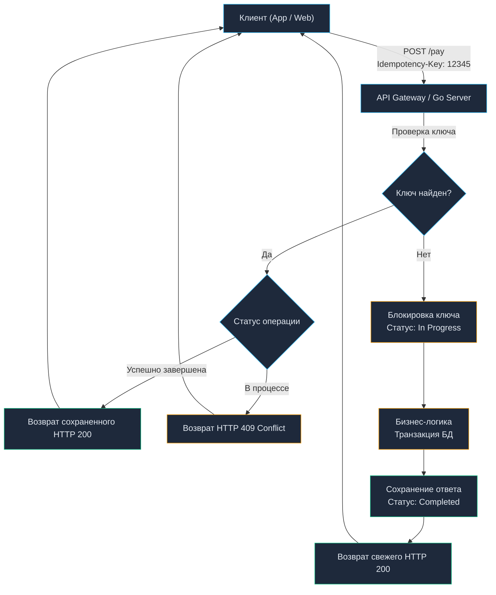

# 13. Ключи идемпотентности (Idempotency Keys): Защита от дублирования

> *«В распределенных системах нельзя считать сообщение полученным лишь потому, что вы его отправили. Но что куда опаснее: нельзя считать его необработанным только потому, что в ответ пришла ошибка».*    
> — Принцип неопределенности распределенных сетей

## Проблема слепых зон: Когда сеть подводит

В статье [[5. HTTP методы и идемпотентность.md]] мы сформулировали базовое правило сетевых протоколов: безопасные и идемпотентные методы (`GET`, `PUT`, `DELETE`) можно безопасно повторять при сбоях. Если соединение разорвалось посреди передачи, балансировщик нагрузки или HTTP-клиент в Go могут автоматически отправить повторный запрос (Retry).

Но что делать с методами, которые **мутируют состояние и фундаментально неидемпотентны**? Классический пример — финансовые транзакции (`POST /transactions`) или создание заказа в интернет-магазине (`POST /orders`).

Представьте сценарий классической сетевой «слепой зоны»:
1. Мобильное приложение отправляет запрос: `POST /transactions` со списанием 100$.
2. Ваш Go-бэкенд получает сетевой пакет, открывает транзакцию в PostgreSQL, успешно списывает деньги со счета и фиксирует изменения (`COMMIT`).
3. Бэкенд формирует успешный ответ `200 OK` и отправляет его в TCP-сокет.
4. **В этот момент на физическом уровне происходит сбой (Network Partition / Packet Loss):** базовая станция сотовой связи теряет сигнал, Wi-Fi переключается, или промежуточный роутер сбрасывает TCP-сессию.
5. Ответ сервера испаряется в эфире. Мобильный клиент ожидает ответа, пока не срабатывает контекстный таймаут: `context.DeadlineExceeded`.
6. С точки зрения клиента операция не состоялась. Приложение показывает пользователю красный баннер: *«Ошибка сети. Повторить попытку?»*.
7. Пользователь нажимает кнопку, приложение добросовестно повторяет запрос — и ваш сервер списывает **еще 100$**!

Для любого бизнеса, связанного с деньгами, заказами или бронированием, подобный сценарий недопустим. Чтобы превратить опасный неидемпотентный метод `POST` в безопасную операцию, применяется паттерн **Idempotency Key (Ключ идемпотентности)**.

---

## Механика Idempotency Key: Контракт надежности

Идея ключей идемпотентности зародилась в платежном шлюзе Stripe и сегодня оформлена в виде проекта стандарта IETF (*The Idempotency-Key HTTP Header Field*).

Алгоритм взаимодействия предельно строг:
1. Перед отправкой критического `POST`-запроса клиент генерирует уникальный случайный идентификатор — UUIDv4 (например, `123e4567-e89b-12d3-a456-426614174000`).
2. Клиент передает этот идентификатор в стандартном HTTP-заголовке:
   ```http
   Idempotency-Key: 123e4567-e89b-12d3-a456-426614174000
   ```
3. Сервер перед выполнением операции атомарно проверяет: встречался ли этот ключ ранее.
4. Если ключ новый — сервер регистрирует его, выполняет бизнес-логику и сохраняет финальный HTTP-ответ (статус, заголовки, тело) в постоянное хранилище.
5. Если клиент повторяет запрос с **тем же самым ключом**, сервер полностью пропускает бизнес-логику (не трогает балансы в базе данных!), мгновенно извлекает сохраненный ответ первой попытки и отдает его клиенту со статусом [[6. Статусы HTTP.md]].



---

## Где хранить состояние: Redis vs PostgreSQL

В промышленном кластере Kubernetes работают десятки реплик вашего Go-сервиса. Хранить ключи в локальной оперативной памяти процесса (в структуре `sync.Map`) невозможно: повторный запрос с вероятностью 90% прилетит на соседний под. Требуется централизованное хранилище.

### Подход 1: Redis (Высокая производительность)
Ключи фиксируются в Redis атомарной командой `SETNX` (Set if Not eXists) или через Lua-скрипты.
* **Плюсы:** Сверхнизкие задержки (< 1 мс). Идеально сочетается с Rate Limiting ([[11. Rate limiting в API.md]]), не создает нагрузку на диск реляционной БД. Автоматический TTL избавляет от необходимости писать фоновые чистильщики.
* **Минусы:** Риск рассинхронизации двух разных систем. Если транзакция в PostgreSQL зафиксировалась, но сеть до Redis моргнула и ответ не записался — повторный запрос приведет к повторному списанию.

### Подход 2: Основная реляционная БД (PostgreSQL) — Идеально для транзакций
Таблица `idempotency_keys` размещается в той же базе данных, где живут счета пользователей и проводки.
* **Плюсы:** **Абсолютная ACID-надежность.** Обновление статуса ключа идемпотентности происходит в рамках **той же самой транзакции базы данных**, что и перевод денег. Либо все изменения фиксируются атомарно, либо откатываются вместе.
* **Минусы:** Дополнительные дисковые операции ввода-вывода (IOPS). Очистка старых записей требует партиционирования таблиц или периодических фоновых задач.

> [!info] Под капотом: Транзакционная идемпотентность в БД
> С точки зрения Mechanical Sympathy, поход в Redis перед походом в PostgreSQL — это два сетевых вызова. В Highload системах (например, в финтехе) мы стараемся объединить их в один.
> Мы создаем таблицу `idempotency_keys (key UUID PRIMARY KEY, response JSONB, status VARCHAR)`.
> В Go мы открываем `sql.Tx`. Первым запросом делаем:
> `INSERT INTO idempotency_keys (key, status) VALUES ($1, 'in_progress') ON CONFLICT DO NOTHING;`
> Если строк затронуто 0 (ключ уже есть) — мы откатываем транзакцию (Rollback) и возвращаем клиенту кэш. Если 1 — продолжаем бизнес-логику и в конце той же транзакции делаем `UPDATE idempotency_keys SET status = 'completed', response = $2 WHERE key = $1`.

---

## Race Conditions: Параллельные ретраи

Самая опасная уязвимость при реализации идемпотентности — конкурентные запросы.

Что произойдет, если пользователь в панике нажмет кнопку «Оплатить» пять раз подряд, или клиентская библиотека запустит параллельные попытки? Два запроса с абсолютно одинаковым ключом придут на бэкенд в одну и ту же миллисекунду.

Оба запроса будут приняты разными горутинами Go. Если проверка ключа построена по принципу *«сначала прочитай, потом запиши»* (`SELECT` $\to$ `INSERT`), обе горутины увидят, что ключа нет, и параллельно спишут средства! Это классическое состояние гонки (Race Condition / Lost Update).

Защита строится на жестких механизмах уникальности:
1. На колонку `key` накладывается первичный ключ (`PRIMARY KEY`) или ограничение `UNIQUE`.
2. Вставка записи в состоянии `'in_progress'` выполняется атомарно.
3. Вторая горутина мгновенно получает ошибку нарушения уникальности (Unique Constraint Violation).

**Что сервер обязан вернуть второму запросу?**  
Худшая ошибка — заблокировать вторую горутину через `time.Sleep` или `sync.Cond` в надежде дождаться, пока первый запрос завершится. Это связывает системные ресурсы и забивает пул горутин.  
**Идиоматичный подход:** Немедленно завершить обработку и вернуть клиенту статус **`409 Conflict`** (или `425 Too Early`), сигнализируя: *«Предыдущий запрос с этим ключом прямо сейчас находится в обработке. Не дублируйте вызовы, подождите завершения»*.

---

## Ловушки и корнер-кейсы (Gotchas)

> [!warning] Ловушка / Gotcha: Смена Payload-а (Payload Mismatch)
> Представьте опасный сценарий:
> 1. Клиент шлет: `Idempotency-Key: X`, Тело: `{"amount": 100, "currency": "USD"}`.
> 2. Запрос падает по таймауту на клиенте, но успешно выполняется на сервере.
> 3. Злоумышленник (или бажный клиент) меняет тело запроса, но оставляет тот же ключ!
> 4. Ре-трай: `Idempotency-Key: X`, Тело: `{"amount": 999999, "currency": "USD"}`.
>
> Если ваш сервер просто проверяет ключ `X` и отдает кэш первого ответа, клиент получит чек на 100$, а сервер проигнорирует попытку списать 999999$. Но контракт нарушен!
> **Решение:** При сохранении ключа идемпотентности вы обязаны вычислить хэш (например, SHA-256) от всего тела HTTP-запроса (Payload) и сохранить его рядом с ключом. При ретрае сервер должен сравнить хэш нового тела с хэшем старого. Если они отличаются — возвращать жесткую ошибку `400 Bad Request` (Idempotency Key Mismatch).

> [!tip] Собеседование
> **Вопрос:** Если во время выполнения бизнес-логики (после захвата ключа идемпотентности) база данных упала и транзакция откатилась, какой статус ключа должен остаться в системе?
> 
> **Ответ:** Ключ должен быть **удален** (или переведен в статус `failed`), чтобы разрешить клиенту сделать безопасный retry. Если вы оставите его в состоянии `in_progress` или закэшируете ошибку 500, клиент больше никогда не сможет завершить этот платеж (ключ будет "отравлен"). Кэшировать можно только терминальные бизнес-состояния (успех 2xx или бизнес-ошибки 4xx, например "Недостаточно средств"). Технические ошибки 5xx кэшировать нельзя!

---

## Жизненный цикл ключа в Go (Архитектура)

Реализация идемпотентности не должна размазываться по бизнес-логике. В идиоматичном Go-коде это выносится либо в **Middleware** (если используется Redis), либо в паттерн **Decorator** для сервисного слоя (если транзакции завязаны на БД).

Пример схемы таблицы в PostgreSQL:

```sql
CREATE TABLE idempotency_keys (
    idempotency_key UUID PRIMARY KEY,
    request_hash VARCHAR(64) NOT NULL,
    http_status INT,           -- Заполняется после успеха
    response_body JSONB,       -- Заполняется после успеха
    created_at TIMESTAMP WITH TIME ZONE DEFAULT NOW(),
    expires_at TIMESTAMP WITH TIME ZONE NOT NULL
);
```

TTL (Time To Live) — обязательное условие. Ключи идемпотентности не должны храниться вечно. Для большинства API срок жизни ключа составляет 24 часа. В PostgreSQL для этого можно использовать партиционирование таблиц по датам (с drop старых партиций) или фоновый процесс (Daemon) на Go, который раз в час выполняет `DELETE FROM idempotency_keys WHERE expires_at < NOW()`.

---

## Итог

1. Идемпотентные ключи спасают бизнес-критичные методы (`POST`, `PATCH`) от дублирования при нестабильной сети.
2. Имплементация требует **атомарной блокировки** (через Redis SETNX или Constraints в реляционных БД), чтобы избежать двойного исполнения при конкурентных ретраях.
3. Обязательно защищайтесь от **Payload Mismatch**, хэшируя тело запроса.
4. Никогда не кэшируйте технические ошибки (5xx) — это "отравит" ключ и заблокирует клиента.

Проектируя такие сложные и неявные контракты, мы должны как-то донести до потребителей нашего API (клиентов, партнеров), какие заголовки они обязаны передавать, какие статусы ожидать и как формировать тела запросов. Хранить это в Wiki — путь к рассинхрону. Индустрия решила эту проблему через строгие схемы описания. О том, как документировать контракты так, чтобы код генерировался сам, мы поговорим в следующей статье: [[14. OpenAPI и Swagger.md]].
