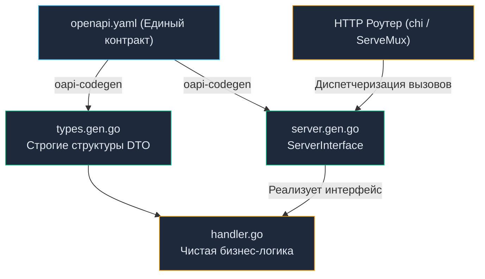

# 14. Спецификация OpenAPI и Swagger: От документации к кодогенерации

> *«Программы должны писаться в первую очередь для людей, которые будут их читать, и лишь во вторую — для машин, которые будут их исполнять».*    
> — Гарольд Абельсон

## Swagger и OpenAPI: От документации к строгому контракту

В статье [[2. Что такое API и контракт.md]] мы определили контракт как нерушимое соглашение между поставщиком и потребителем сервиса. Но как именно зафиксировать это соглашение в мире HTTP и REST, где передаются гибкие текстовые форматы вроде JSON, а компилятор языка не может напрямую проверить совместимость сетевого вызова, как это происходит в gRPC?

Долгие годы индустрия блуждала в потемках: документацию писали в корпоративных Wiki, Google Docs, Confluence или экспортировали коллекции Postman. Исход всегда был один и тот же: бэкенд вносил изменения, документацию обновить забывали, мобильные приложения у клиентов падали при релизе, а команды неделями выясняли в чатах, почему поле называется `userID`, а не `user_id`.

Спасением стала концепция формального машиночитаемого описания сетевого интерфейса. И на этом стыке технологий возникла терминологическая путаница, на которой часто ловят кандидатов на собеседованиях.

### Swagger vs OpenAPI: Конец путаницы

* **OpenAPI Specification (OAS):** Это открытый **стандарт (спецификация)**, описывающий семантику и синтаксис HTTP API: эндпоинты, методы, заголовки, схемы JSON-запросов и ответов, параметры аутентификации. Изначально проект создавался компанией Wordnik под именем Swagger. В 2015 году спецификация была передана независимому консорциуму под эгидой Linux Foundation и переименована в **OpenAPI**. В настоящее время стандартом де-факто являются версии 3.0 и 3.1 (полностью совместимая с JSON Schema).
* **Swagger:** Это **семейство программных инструментов (Tooling)**, созданных и поддерживаемых компанией SmartBear для работы со спецификацией OpenAPI:
  * *Swagger Editor* — интерактивный веб-редактор спецификаций.
  * *Swagger UI* — визуализатор, рендерящий спецификацию в интерактивный веб-интерфейс с кнопкой *«Try it out»*.
  * *Swagger Codegen* — генератор клиентского и серверного кода на разных языках.

> [!tip] Собеседование
> **Вопрос:** В чем разница между Swagger и OpenAPI?
> 
> **Ответ:** OpenAPI — это машиночитаемый формат данных (спецификация в формате YAML или JSON), описывающий контракт вашего API. Swagger — это набор прикладных инструментов (интерфейсов, редакторов, генераторов), которые работают с этим форматом. Мы пишем спецификацию на языке OpenAPI, а отображаем её с помощью Swagger UI.

---

## Битва подходов: Code-First против Design-First

В сообществе Go существуют две диаметрально противоположные философии проектирования API. Выбор между ними определяет культуру инженерной команды и долговечность архитектуры.

### 1. Code-First (Генерация из кода)

Разработчик пишет обычный Go-код, обвешивая хендлеры многострочными комментариями со специальными тегами. Затем внешняя утилита (например, `swaggo/swag`) анализирует код и комментарии, генерируя файл `swagger.json`.

```go
// @Summary Получить пользователя
// @Description Возвращает профиль по ID
// @Tags users
// @Accept json
// @Produce json
// @Param id path int true "ID Пользователя"
// @Success 200 {object} domain.UserDTO
// @Failure 404 {object} apperrors.ProblemDetails
// @Router /users/{id} [get]
func (h *Handler) GetUser(w http.ResponseWriter, r *http.Request) {
    // реализация...
}
```

**Плюсы:** Быстрый старт на ранней стадии прототипирования. Документация физически находится рядом с функцией.

**Минусы (Почему зрелые инженеры избегают Code-First):**
1. **Загрязнение кодовой базы:** Логика хендлера на 15 строк тонет в 40 строках аннотаций. Читаемость кода катастрофически падает.
2. **Запоздалая документация:** Документация появляется только ПОСЛЕ того, как написан бэкенд. Команды фронтенда и мобильных клиентов простаивают в ожидании готового сервера.
3. **Хрупкость AST-парсинга:** Утилита `swaggo` разбирает абстрактное синтаксическое дерево Go (`go/ast`). Сложные составные структуры, дженерики (Generics), внешние пакеты и кастомные типы регулярно приводят к сбоям парсера или генерации некорректных JSON-схем.

### 2. Design-First (Сначала проектирование)

Индустриальный стандарт современной микросервисной разработки.
Контракт проектируется **до написания первой строчки кода на Go**. Архитектор или ведущий разработчик фиксирует контракт в файле `openapi.yaml`. Этот файл утверждается всеми заинтересованными командами (бэкенд, фронтенд, аналитика) и фиксируется в Git как единый источник правды (Single Source of Truth).

```yaml
# openapi.yaml
openapi: 3.0.3
info:
  title: Users API
  version: 1.0.0
paths:
  /users/{id}:
    get:
      summary: Получить пользователя
      parameters:
        - name: id
          in: path
          required: true
          schema:
            type: integer
      responses:
        '200':
          description: OK
          content:
            application/json:
              schema:
                $ref: '#/components/schemas/User'
```

**Преимущества Design-First:**
* **Параллельная разработка:** Как только `openapi.yaml` согласован, фронтенд запускает легковесный Mock-сервер (например, Prism) и пишет UI на реальных мок-данных параллельно с разработкой бэкенда.
* **Строгий контракт (Contract-Driven):** Любые попытки изменить форму ответа пресекаются компилятором еще на этапе сборки.

---

## Code Generation: Магия oapi-codegen

В парадигме Design-First разработчики на Go больше не тратят время на ручное написание структур DTO и диспетчеризацию параметров из URL. Мы делегируем эту рутину кодогенерации.

В экосистеме Go стандартом является инструмент `deepmap/oapi-codegen` (актуальный модуль `github.com/oapi-codegen/oapi-codegen/v2`).

Утилита читает `openapi.yaml` и генерирует:
1. **Типы данных (Models):** Структуры Go с выверенными JSON-тегами, валидаторами и типами (`types.gen.go`).
2. **Серверный интерфейс (Server Interface):** Строгий Go-интерфейс, описывающий сигнатуры всех обработчиков (`server.gen.go`).
3. **Транспортную обвязку (Router Adapters):** Готовый код роутинга для стандартного `net/http` (Go 1.22+), `chi`, `echo` или `gin`.



> [!info] Под капотом: Защита на этапе компиляции
> Сгенерированный код содержит интерфейс следующего вида:
> ```go
> type ServerInterface interface {
>     GetUser(w http.ResponseWriter, r *http.Request, id int)
> }
> ```
> Если бизнес решает изменить тип идентификатора пользователя с `int` на `UUID`, вы вносите одну правку в `openapi.yaml` и запускаете генерацию. `oapi-codegen` обновит интерфейс:
> ```go
> type ServerInterface interface {
>     GetUser(w http.ResponseWriter, r *http.Request, id uuid.UUID)
> }
> ```
> В этот момент ваш старый Go-обработчик **перестает компилироваться**, потому что сигнатура метода больше не удовлетворяет `ServerInterface`! Компилятор Go выступает в роли неподкупного стража обратной совместимости, делая невозможным случайный выкат ломающих изменений контракта (см. [[8. Versioning API.md]]).

---

## Mechanical Sympathy: Обслуживание Swagger UI

Один из самых коварных антипаттернов в продакшен-разработке на Go — встраивание Swagger UI внутрь рабочего бинарника и отдача веб-страницы через `http.FileServer` или пакет `http-swagger`.

```go
// АНТИПАТТЕРН для Highload
import "github.com/swaggo/http-swagger"

func main() {
    r := chi.NewRouter()
    // Go-сервер тратит ресурсы на отдачу HTML, JS, CSS и 2MB JSON файла
    r.Get("/swagger/*", httpSwagger.WrapHandler) 
}
```

Почему это порочно с точки зрения системной эффективности и безопасности?
1. **Неэффективный расход ресурсов (CPU/RAM):** Задача Go-сервиса — быстро и без аллокаций крутить бизнес-логику и транзакции. Отдача тяжелых статических бандлов (CSS, JavaScript, шрифты Swagger UI) блокирует горутины, требует аллокаций памяти под `[]byte` и генерирует бесполезный сетевой IO.
2. **Раздувание бинарника:** Директива `go:embed` упаковывает статическую библиотеку Swagger UI прямо в ELF-бинарник, увеличивая его размер на десятки мегабайт.
3. **Дыра в безопасности (Security Risk):** Оставив открытый эндпоинт `/swagger/` на публичном шлюзе в production, вы вручаете потенциальному злоумышленнику полную карту атак и структуру внутренних вызовов сервиса.

**Идиоматичный подход (Infrastructure-First):**  
Go-приложение в продакшене обязано отдавать **исключительно полезный трафик (JSON/gRPC)**. Статика Swagger UI должна жить во внешней инфраструктуре:
* На внутреннем статическом сервере Nginx или S3-бакете, закрытом корпоративным VPN.
* В рамках централизованного портала разработчиков (Developer Portal, например Spotify Backstage).
* Файл `openapi.yaml` публикуется в репозиторий контрактов или Schema Registry через пайплайны CI/CD.

---

## Валидация контракта: Spectral и Strict Mode

Как гарантировать высокое качество OpenAPI-спецификаций в большой команде?

Для этого в пайплайны CI/CD внедряют **линтеры API**, лидером среди которых является инструмент **Spectral**. Он проверяет правила стиля и архитектуры:
* Наличие описаний (`description`) и примеров (`example`) у всех эндпоинтов.
* Наличие обязательных схем для ошибок `4xx` и `5xx` (в формате RFC 7807).
* Проверку на отсутствие ломающих изменений при слиянии веток.

Кроме того, при использовании `oapi-codegen` критически важно включать **Strict Mode**.  
В стандартном `net/http` вам приходится вручную писать бойлерплейт: `ageStr := r.URL.Query().Get("age")` и затем вызывать `strconv.Atoi(ageStr)`.

В строгом режиме `oapi-codegen` генерирует типизированные адаптеры, которые **автоматически парсят и валидируют** входящие параметры на основе схемы, передавая в обработчик готовую Go-структуру `GetUserParams{Age: 25}`. Если клиент передаст строку вместо числа, сгенерированный слой отсечет запрос со статусом `400 Bad Request`, даже не затрагивая вашу бизнес-логику! Это радикально экономит такты процессора на отсечении заведомо некорректного трафика.

---

## Итог

1. **OpenAPI** — это спецификация контракта, а **Swagger** — инструментарий визуализации и тестирования.
2. Откажитесь от комментариев в коде (Code-First) в пользу **Design-First**: сначала утверждается `openapi.yaml`, затем генерируется каркас и пишется код.
3. Применяйте **oapi-codegen** для автоматической генерации серверных интерфейсов и моделей. Доверьте компилятору контроль соответствия контракту.
4. Не обслуживайте Swagger UI силами самого Go-приложения в production — выносите статику на уровень инфраструктуры (Nginx/S3).

Наличие строгой спецификации OpenAPI открывает колоссальные возможности: мы можем автоматически генерировать не только серверный каркас, но и клиентские библиотеки на десятках языков программирования. Писать HTTP-запросы руками через `http.NewRequest` — это удел прошлого века. Как автоматизировать создание клиентского кода и серверных заглушек, мы подробно разберем в следующей статье: [[15. Генерация клиентов и серверов.md]].
