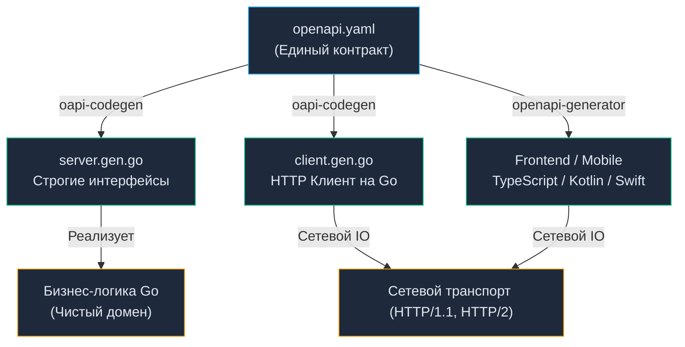

# 15. Генерация клиентов и серверов: Отказ от бойлерплейта и Strict Mode

> *"Don't write code that can be generated by a program."*  
> — Принцип автоматизации Unix

## Конец эпохи Boilerplate: Зачем генерировать код

В прошлой статье ([[14. OpenAPI и Swagger.md]]) мы пришли к фундаментальному выводу: надежный сетевой контракт обязан быть формализован в машинно-читаемом формате (`openapi.yaml`), а проектирование должно вестись строго по принципу **Design-First**. Однако сам по себе файл спецификации в YAML не умеет слушать входящие сетевые сокеты и не отправляет HTTP-пакеты по проводам.

Исторически разработка сетевых интеграций выглядела удручающе: инженер открывал документацию на одном экране, а на втором вручную строчил сотни строк однообразного шаблонного кода (**Boilerplate**):
- парсинг query-параметров из `r.URL.Query()`;
- многократные вызовы `strconv.Atoi`, `strconv.ParseBool` и обработку их ошибок;
- ручную валидацию обязательных полей JSON-структур;
- сборку URL-адресов с правильным экранированием слешей;
- маршалинг тел запросов и демаршалинг ответов в рукотворные DTO.

Ручной труд в сетевом транспорте — это главный рассадник фатальных инцидентов. Разработчик в спешке забудет сделать `defer resp.Body.Close()`, ошибется в одной букве заголовка `Authorization`, забудет пробросить `context.Context` с дедлайном, или случайно проигнорирует статус `404`.

**Генерация кода (Code Generation)** раз и навсегда устраняет человеческий фактор. Мы поручаем утилитам кодогенерации и компилятору Go всю механическую рутину, оставляя человеку его истинное призвание — реализацию чистой предметной бизнес-логики.

В современной экосистеме Go стандартом де-факто для генерации REST-контрактов является инструмент `deepmap/oapi-codegen` (и его развитие `github.com/oapi-codegen/oapi-codegen/v2`).

---

## Архитектура сгенерированного сервера

Утилита читает `openapi.yaml` и компилирует его в строго типизированные исходные файлы Go:



### Strict Mode: Защита на уровне рантайма

Наиболее элегантная и мощная возможность современного `oapi-codegen` — это режим строгой типизации (**Strict Mode**). 

В классическом режиме генератор создает обработчики со стандартной сигнатурой `func(w http.ResponseWriter, r *http.Request)`. Это заставляет разработчика по-прежнему работать с низкоуровневыми объектами сетевого ввода-вывода.

В **Strict Mode** генератор полностью изолирует вас от деталей протокола HTTP. Он генерирует интерфейс, работающий исключительно со строго типизированными объектами предметной области:

```go
// СГЕНЕРИРОВАННЫЙ КОД (Редактировать запрещено)
type StrictServerInterface interface {
    // Получить пользователя
    // (GET /users/{id})
    GetUser(ctx context.Context, request GetUserRequestObject) (GetUserResponseObject, error)
}
```

Обратите внимание: в сигнатуре метода нет ни `http.Request`, ни `http.ResponseWriter`!

> [!info] Под капотом: Как работает Strict Wrapper
> Сгенерированная серверная обертка (Wrapper) размещается между мультиплексором маршрутов (`net/http.ServeMux` или `chi`) и вашей бизнес-логикой:
> 1. Сетевой сокет получает TCP-пакет, Netpoller пробуждает горутину Go.
> 2. Wrapper извлекает параметр пути: `r.PathValue("id")`.
> 3. Wrapper сам вызывает `strconv.Atoi()`, проверяя, что ID — это число. Если нет, он **сам** возвращает `400 Bad Request`, не дергая вашу бизнес-логику!
> 4. Если валидация пройдена, Wrapper конструирует структуру `GetUserRequestObject` и передает ее в ваш метод `GetUser`.
> 5. Ваш метод возвращает типизированный объект ответа (например, `GetUser200JSONResponse`). Wrapper сам выполняет `json.Marshal`, проставляет правильный HTTP-статус (например, 200 или 404) и делает `w.Write`.
> 
> **Mechanical Sympathy:** Данный подход радикально снижает аллокации. Wrapper генерируется статически на этапе компиляции. Он не использует медленный пакет `reflect` для разбора параметров роутинга, а выполняет прямые вызовы типизированных конвертеров.

---

## Генерация клиента: Забытое искусство

Многие бэкенд-разработчики ошибочно фокусируются только на серверной стороне. Однако в современной сервисной архитектуре ваш Go-сервис непрерывно выступает в роли клиента, отправляя десятки сетевых запросов к смежным микросервисам.

Написание HTTP-клиента вручную — это тяжелая рутина: необходимо вручную форматировать URL, делать `json.Marshal`, создавать запрос `http.NewRequestWithContext`, пробрасывать заголовки, выполнять запрос, валидировать статус-код, парсить тело ответа через `json.Unmarshal` и гарантировать очистку дескрипторов сокета.

Сгенерированный типизированный клиент сводит всю эту рутину к лаконичному и безопасному вызову:

```go
// Инициализация (обычно при старте приложения)
client, err := usersclient.NewClientWithResponses("http://user-service:8080")
if err != nil {
    log.Fatalf("failed to create client: %v", err)
}

// Вызов в бизнес-логике
resp, err := client.GetUserWithResponse(ctx, 123)
if err != nil {
    return fmt.Errorf("network error: %w", err)
}

if resp.JSON200 != nil {
    log.Printf("Got user: %s", resp.JSON200.Name)
} else if resp.JSON404 != nil {
    log.Printf("User not found: %s", resp.JSON404.Message)
}
```

> [!warning] Ловушка / Gotcha: Утечка соединений (Connection Leak)
> В стандартном Go, если вы делаете `resp, err := http.DefaultClient.Do(req)`, вы **ОБЯЗАНЫ** сделать `defer resp.Body.Close()`. Если вы этого не сделаете, TCP-соединение не вернется в пул (Connection Pool), и ваш сервер быстро исчерпает лимит открытых файлов (упадет с ошибкой `too many open files`).
> 
> **Магия oapi-codegen:** Если вы используете методы с суффиксом `...WithResponse` (как в примере выше), сгенерированный клиент **автоматически читает всё тело ответа в память и закрывает `resp.Body` за вас**. Это спасает от утечек.
> **Обратная сторона:** Если другой микросервис возвращает файл размером 2 Гигабайта, `WithResponse` загрузит все 2 ГБ в оперативную память (Heap) вашей горутины, убив сервер по OOM. Для загрузки больших файлов всегда используйте "сырые" методы сгенерированного клиента (без суффикса `WithResponse`) и читайте тело потоково через `io.Copy`.

---

## Паттерн Interceptor: Расширение сгенерированных клиентов

В реальных сервисах каждый исходящий запрос обязан содержать сквозной контекст: токен авторизации (JWT), идентификатор распределенной трассировки (`X-Request-ID` / `traceparent`) для Observability ([[32. Tracing запросов.md]]), либо кастомные заголовки маршрутизации.

Прямо редактировать сгенерированный код категорически запрещено — он будет перезаписан при первой же сборке в CI/CD.

Для расширения клиентов в генераторах применяется функциональный паттерн `RequestEditorFn` (функция-редактор запроса, клиентский аналог Interceptor/Middleware):

```go
// Создаем функцию, которая модифицирует запрос до его отправки
func WithAuthToken(token string) usersclient.RequestEditorFn {
    return func(ctx context.Context, req *http.Request) error {
        req.Header.Set("Authorization", "Bearer "+token)
        // Прокидываем Trace ID из контекста
        if traceID, ok := ctx.Value("trace_id").(string); ok {
            req.Header.Set("X-Request-ID", traceID)
        }
        return nil
    }
}

// Применяем при создании клиента
client, _ := usersclient.NewClientWithResponses(
    "http://user-service:8080",
    usersclient.WithRequestEditorFn(WithAuthToken("secret-jwt-xyz")),
)
```

Каждый вызов `client.GetUser` автоматически подпишет запрос и внедрит трассировочные заголовки, сохраняя код прикладной логики абсолютно чистым.

> [!tip] Собеседование
> **Вопрос:** В чем фундаментальное архитектурное различие между кодогенерацией (Code Generation) и рефлексией (Reflection) при реализации HTTP-контрактов?
> 
> **Ответ:** 
> - **Рефлексия** (как в пакете `encoding/json` или классических веб-фреймворках) переносит вычислительную стоимость разбора структуры на **Runtime (время выполнения)**. При каждом входящем HTTP-запросе CPU тратит такты на интроспекцию типов в куче, порождая непредсказуемые аллокации и нагружая GC.
> - **Кодогенерация** переносит эту стоимость на **Compile-Time (этап компиляции)**. Генератор один раз анализирует контракт и строит прямолинейный, оптимизированный машинный код без динамических проверок. Это гарантирует строгую проверку типов компилятором и максимальную аппаратную эффективность.

---

## Полиглоты: Генерация для Frontend и Mobile

Настоящая мощь стандартизированного контракта OpenAPI раскрывается в многоязычной (полиглотной) корпоративной среде. Тот же самый `openapi.yaml`, из которого вы сгенерировали бэкенд на Go, передается фронтенд-командам (React, Vue, Angular) и мобильным инженерам (iOS на Swift, Android на Kotlin).

С помощью утилиты `openapi-generator-cli` клиенты на TypeScript, Swift или Dart генерируются за считанные секунды.

Если вы переименуете поле в `openapi.yaml` с `age` на `user_age`, генератор на стороне веб-приложения мгновенно обновит интерфейсы TypeScript. Сборка фронтенда упадет прямо в пайплайне CI/CD, точно указав разработчику место несоответствия.

**Интеграционные ошибки ликвидируются на корню. Сетевой контракт становится надежным типизированным мостом между всеми компонентами распределенной системы.**

---

## Итог

1. **Не пишите Boilerplate:** Ручное создание HTTP-роутеров, парсеров параметров и HTTP-клиентов — это пустая трата дорогого времени инженера и рассадник багов.
2. **Используйте Strict Mode:** Позвольте генератору абстрагировать вас от `http.Request`. Работайте с готовыми бизнес-структурами. Это безопасно и эффективно с точки зрения аллокаций памяти.
3. **Контролируйте память:** Помните, что удобные обертки клиентов (`...WithResponse`) читают весь ответ в RAM. Для потоковой передачи данных (Streaming) используйте сырые запросы.
4. **Единый источник истины:** Один YAML файл генерирует сервер на Go, клиент на Go (для других микросервисов) и клиент на TypeScript (для фронтенда).

Мы выжали из связки HTTP/1.1 + JSON + OpenAPI максимум. Мы научились генерировать код и обеспечивать безопасность контракта. Но под капотом мы все еще парсим текст, передаем избыточные заголовки и страдаем от отсутствия нативного мультиплексирования. 

Для межсервисного (Backend-to-Backend) взаимодействия в Highload системах текстовый HTTP/JSON давно уступил место технологии, которая была спроектирована под кодогенерацию и бинарную производительность с самого первого дня. Об этом абсолютном стандарте распределенных систем мы поговорим в следующей статье: [[16. gRPC. Основы.md]].
