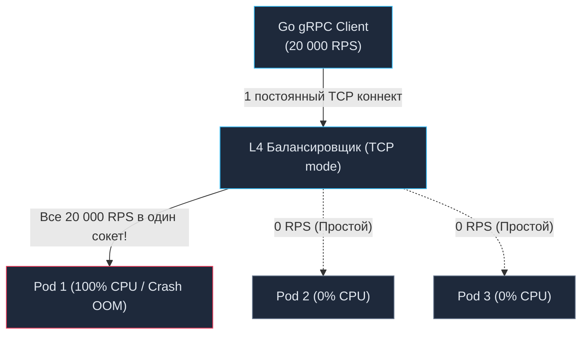

# 16. Основы gRPC: Архитектура, HTTP/2 и Высокопроизводительный RPC

> *"The best interface is the one that is as simple, fast, and transparent as a local function call."*  
> — Брайан Керниган

## Эволюция межсервисного общения: За пределы HTTP/1.1

В предыдущих главах мы досконально изучили архитектуру REST и формат JSON. Для взаимодействия с внешним миром (браузеры, мобильные устройства, сторонние API) этот стек остается абсолютным лидером благодаря нативной поддержке в движках JavaScript и легкости визуальной отладки.

Однако когда мы опускаемся на уровень внутренней инфраструктуры — в закрытый контур из сотен взаимодействующих микросервисов (**Server-to-Server / East-West Traffic**), текстовый протокол HTTP/1.1 с JSON становится узким бутылочным горлышком всей системы.

Фундаментальные проблемы HTTP/1.1 в высоконагруженных распределенных системах упираются в физику сетей и архитектуру ОС:
1. **Head-of-Line Blocking (Блокировка начала очереди на уровне приложения):** В рамках одного TCP-соединения HTTP/1.1 работает по принципу «один запрос — один ответ». Сервер не может отправить второй ответ, пока не завершит первый. Чтобы ваш Go-сервис мог параллельно делать 100 запросов к соседнему микросервису, рантайму приходится открывать и удерживать пул из 100 тяжелых физических TCP-соединений.
2. **Колоссальный оверхед заголовков:** Каждый HTTP/1.1 запрос повторно гоняет по сети килобайты избыточного текста (`User-Agent`, `Accept`, `Authorization`, `Content-Type`), попусту сжигая сетевую полосу.
3. **Отсутствие компилируемых контрактов:** Как мы выяснили в [[7. Форматы данных JSON vs Protobuf.md]], отсутствие схемы заставляет Go-рантайм динамически разбирать типы через тяжелую рефлексию (`reflect`), нагружая Garbage Collector миллионами временных объектов в куче.

В 2015 году инженеры Google открыли исходный код своей внутренней кросс-языковой RPC-системы Stubby, дав миру фреймворк **gRPC** (gRPC Remote Procedure Calls). Он был спроектирован с нуля для бескомпромиссной производительности в HighLoad-системах, объединив бинарную сериализацию **Protocol Buffers** и мультиплексируемый транспорт **HTTP/2**.

---

## Анатомия gRPC: Магия HTTP/2

Краеугольный камень производительности gRPC — это протокол HTTP/2. В отличие от текстового предшественника, HTTP/2 является полностью **бинарным** и **нативно мультиплексируемым**.

Между двумя микросервисами на Go устанавливается **ровно одно долгоживущее TCP-соединение**. Внутри этой единственной физической трубы HTTP/2 создает сотни независимых логических **потоков (Streams)**. Каждый RPC-вызов представляет собой отдельный Stream с уникальным числовым идентификатором (`Stream ID`).

Данные упаковываются в компактные бинарные фреймы (Frames): `HEADERS` (метаданные вызова) и `DATA` (бинарный пейлоад Protobuf). Фреймы от десятков разных запросов могут свободно перемешиваться в TCP-канале и безошибочно собираться на принимающей стороне.


> [!info] Под капотом: gRPC и рантайм Go (Mechanical Sympathy)
> Когда вы используете библиотеку `google.golang.org/grpc`, под капотом работает транспортная машина на базе `golang.org/x/net/http2`.
> 
> Вместо того чтобы блокировать горутину на системном вызове `read` для каждого отдельного запроса (как это происходит в HTTP/1.1), `grpc-go` запускает ровно одну специализированную горутину-читателя (**Reader Goroutine**) на каждое активное TCP-соединение. Эта горутина слушает сокет через сетевой поллер (`epoll` в Linux).
> 
> Когда из сети поступает пачка бинарных фреймов HTTP/2, Reader Goroutine вычитывает их за один системный вызов, парсит заголовок фрейма, считывает `Stream ID` и мгновенно перекладывает полезные байты через Go-каналы (`chan`) в соответствующие рабочие горутины (**Worker Goroutines**), выполняющие бизнес-логику.
> 
> **Результат:** Количество системных вызовов к ядру ОС сокращается на порядки. Переключения контекста минимизируются, а одно TCP-соединение способно прокачивать десятки тысяч RPS без малейшей деградации.

---

## Контракт в коде: Design-First "из коробки"

В парадигме gRPC подход **Design-First** является не пожеланием, а обязательным законом архитектуры. Вы не можете начать писать Go-код, не зафиксировав контракт в файле схемы `.proto`:

```protobuf
// user_service.proto
syntax = "proto3";

package mycompany.users.v1;
option go_package = "internal/api/pb";

// Описание интерфейса сервиса
service UserService {
  // Классический Unary запрос (Запрос-Ответ)
  rpc GetUser (GetUserRequest) returns (GetUserResponse);
}

// Описание структур данных
message GetUserRequest {
  int64 id = 1;
}

message GetUserResponse {
  int64 id = 1;
  string name = 2;
  string role = 3;
}
```

Компилятор `protoc` со специализированным плагином `protoc-gen-go-grpc` превращает эту схему в готовый Go-код.

На стороне сервера генерируется строгий интерфейс:
```go
type UserServiceServer interface {
	GetUser(context.Context, *GetUserRequest) (*GetUserResponse, error)
}
```

На стороне клиента генерируется полностью готовый типизированный SDK:
```go
client := pb.NewUserServiceClient(grpcConn)
resp, err := client.GetUser(ctx, &pb.GetUserRequest{Id: 123})
```

Никакого ручного парсинга JSON, никакой возни со `strconv`, никаких промахов в названиях полей. Любое несоответствие контракту пресекается компилятором Go еще до сборки контейнера.

---

## Запуск сервера: Никакого net/http

В архитектуре gRPC сервер не использует мультиплексор `net/http.ServeMux`. Он работает напрямую поверх сырого сетевого сокета `net.Listener`:

```go
import (
	"context"
	"log"
	"net"

	"google.golang.org/grpc"
	pb "myproject/internal/api/pb"
)

// Наша структура, реализующая сгенерированный интерфейс
type server struct {
	pb.UnimplementedUserServiceServer // Обязательный эмбеддинг для forward compatibility
}

// Реализация бизнес-логики
func (s *server) GetUser(ctx context.Context, req *pb.GetUserRequest) (*pb.GetUserResponse, error) {
	// req.Id уже имеет тип int64 — нулевой оверхед на конвертацию!
	return &pb.GetUserResponse{
		Id:   req.Id,
		Name: "Ivan",
		Role: "Admin",
	}, nil
}

func main() {
	// 1. Открываем "сырой" TCP сокет
	lis, err := net.Listen("tcp", ":50051")
	if err != nil {
		log.Fatalf("failed to listen: %v", err)
	}
	
	// 2. Создаем инстанс gRPC сервера
	s := grpc.NewServer()
	
	// 3. Регистрируем реализацию сервиса
	pb.RegisterUserServiceServer(s, &server{})
	
	// 4. Запускаем блокирующий цикл обработки
	log.Println("gRPC server listening on :50051")
	if err := s.Serve(lis); err != nil {
		log.Fatalf("failed to serve: %v", err)
	}
}
```

> [!warning] Ловушка / Gotcha: UnimplementedServiceServer
> Обратите внимание на встраивание (embedding) структуры `pb.UnimplementedUserServiceServer` внутрь `server`. Зачем это необходимо?
> 
> Если в будущем коллега добавит в `.proto` схему новый RPC-метод `CreateUser` и перегенерирует Go-код, интерфейс `UserServiceServer` расширится. Если бы в вашей структуре не было встроенного `Unimplemented...`, ваш сервис мгновенно перестал бы компилироваться (нереализованный метод).
> 
> Встроенная структура содержит базовую реализацию каждого метода сервиса, возвращающую статус `codes.Unimplemented`. Это обеспечивает **Forward Compatibility** (прямую совместимость) вашего кода при плавной эволюции API.

---

## Метаданные (Metadata) и Обработка ошибок

В протоколе gRPC нет объекта `http.Request` и привычных заголовков `http.Header`. Служебные данные (токены авторизации, JWT, Request ID, региональные флаги) передаются через абстракцию **Metadata** (пакет `google.golang.org/grpc/metadata`), упакованную прямо в `context.Context`:

```go
import "google.golang.org/grpc/metadata"

func (s *server) GetUser(ctx context.Context, req *pb.GetUserRequest) (*pb.GetUserResponse, error) {
    // Извлечение метаданных из входящего контекста
    md, ok := metadata.FromIncomingContext(ctx)
    if ok {
        traceIDs := md.Get("x-trace-id")
        if len(traceIDs) > 0 {
            log.Printf("Trace ID: %s", traceIDs[0])
        }
    }
    // ...
}
```

> [!tip] Собеседование
> **Вопрос:** Если gRPC-метод на сервере завершился ошибкой (например, сущность не найдена), какой HTTP-статус вернет сервер клиенту на транспортном уровне?
> 
> **Ответ:** Сервер вернет транспортный статус **`HTTP 200 OK`**!
> 
> В архитектуре gRPC статус HTTP отражает исключительно состояние *транспортного соединения* (пакет доставлен, фреймы HTTP/2 успешно декодированы).
> 
> Статусы выполнения самого RPC и бизнес-ошибки передаются в **Trailers** (трейлерах) — специальном блоке метаданных, который отправляется *в самом конце* потока HTTP/2, уже после того, как все фреймы данных переданы.
> 
> В Go-коде мы возвращаем ошибку через пакет `google.golang.org/grpc/status`:
> ```go
> return nil, status.Errorf(codes.NotFound, "user %d not found", req.Id)
> ```
> Клиентская библиотека автоматически распакует трейлеры и вернет ошибку в переменной `err`, однако в дампе трафика Wireshark это будет выглядеть как HTTP 200 с финальным трейлером `grpc-status: 5`.

---

## Главная архитектурная боль: Балансировка нагрузки (Load Balancing)

Непонимание сетевой физики gRPC — главная причина масштабных аварий при первой миграции микросервисов с REST на gRPC.

В классическом REST перед группой Go-сервисов обычно размещают балансировщик уровня **L4 (Transport Layer)** — например, AWS NLB или HAProxy в режиме TCP. Балансировщик распределяет TCP-сессии между подами. Поскольку в HTTP/1.1 соединения постоянно закрываются или возвращаются в пул, нагрузка равномерно размазывается по всем инстансам.

**Что происходит при переходе на gRPC за L4-балансировщиком?**
1. Клиент устанавливает **ровно одно постоянное TCP-соединение** по протоколу HTTP/2.
2. L4-балансировщик принимает это TCP-соединение и направляет его на `Pod-1`.
3. Затем клиент начинает генерировать 20 000 RPS. Поскольку все запросы мультиплексируются в виде потоков внутри **одного и того же TCP-канала**, **все 20 000 запросов прилетают на единственный узел `Pod-1`**!
4. Соседние 9 подов в кластере простаивают с 0% CPU, в то время как `Pod-1` погибает от перегрузки памяти и процессора.



### Как решить проблему балансировки gRPC:

1. **L7 Load Balancing (Application Layer):**  
   Использовать интеллектуальные прокси (Envoy, Traefik, Nginx с директивой `grpc_pass`), которые умеют разбирать кадры HTTP/2 и балансировать каждый отдельный *Stream*, а не TCP-соединение целиком.
2. **Client-Side Load Balancing (Балансировка на клиенте):**  
   В архитектуре Kubernetes Go-клиент может опрашивать Headless Service через DNS, получая IP-адреса всех запущенных подов. Клиент открывает постоянное TCP-соединение к **каждому** поду и распределяет RPC-вызовы собственным планировщиком (Round-Robin).

---

## Итог

1. **gRPC** — это стандарт де-факто для высокопроизводительного межсервисного общения, устраняющий блокировки HTTP/1.1 благодаря мультиплексированию потоков поверх единого TCP-соединения на базе HTTP/2.
2. Подход **Design-First** со строгими бинарными контрактами Protobuf минимизирует аллокации в куче Go и переносит проверку совместимости на этап компиляции.
3. Метаданные передаются через `context.Context`, а статусы ошибок транслируются в терминальных HTTP/2 **Trailers** с сохранением транспортного кода HTTP 200.
4. **Критическое предостережение:** Никогда не используйте классическую L4-балансировку для gRPC. Применяйте L7-шлюзы (Envoy) или балансировку на стороне Go-клиента.

gRPC неразрывно связан со своим форматом сериализации. Чтобы писать предельно эффективный и надежный код, мы обязаны понимать, как байты упаковываются на кремниевом уровне, почему порядок тегов критичен для кэшей процессора и как удалять устаревшие поля без аварий. Подробному анатомическому разбору формата посвящен наш следующий шаг: [[17. Protocol Buffers.md]].
