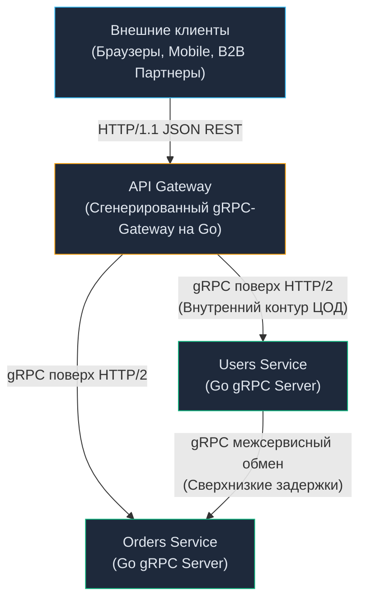

# 19. gRPC против REST: Инженерное сравнение, Производительность и Архитектура

> *«Управление сложностью — вот сама суть программирования».*    
> — Брайан Керниган

## Архитектурный холивар: Выбор без серебряной пули

Мы детально разобрали оба фундаментальных подхода современного сетевого взаимодействия: классический, проверенный десятилетиями [[3. REST. Основные принципы.md]] и высокопроизводительный бинарный [[16. gRPC. Основы.md]]. На технических собеседованиях и заседаниях архитектурных комитетов вопрос *«Что нам выбрать: REST или gRPC?»* нередко перерастает в ожесточенный религиозный спор.

Опытный инженер уровня Senior понимает, что в компьютерных науках не существует универсального «лучшего» инструмента (No Silver Bullet). Любая технология — это осознанный баланс инженерных компромиссов (**Trade-offs**). 

Выбор сетевого протокола определяет не только формат полезной нагрузки в байтах. Он напрямую диктует топологию инфраструктуры, сетевую маршрутизацию, паттерны балансировки нагрузки и то, каким именно образом рантайм Go будет расходовать физические ресурсы сервера: такты процессора, кэши инструкций и пропускную способность памяти.

В этой статье мы сведем обоих титанов в финальном инженерном поединке, разберем их системную физику и рассмотрим практические гибридные архитектуры.

---

## Матрица компромиссов

| Критерий | REST (JSON + HTTP/1.1) | gRPC (Protobuf + HTTP/2) |
| :--- | :--- | :--- |
| **Транспортный уровень** | HTTP/1.1 (преимущественно), HTTP/2 | Строго HTTP/2 (и экспериментальный HTTP/3) |
| **Формат представления данных** | Текстовый (JSON, XML) | Компактный бинарный (Protocol Buffers) |
| **Схема контракта** | Опциональная (OpenAPI, JSON Schema) | Строгая, обязательная, компилируемая (`.proto`) |
| **Удобство отладки (DX & Debug)** | Идеальное: открывается в браузере, `curl`, DevTools | Требует специальных CLI-утилит (`grpcurl`, Postman) |
| **Инфраструктурное кэширование** | Нативное на уровне протокола (заголовки CDN, Nginx) | Отсутствует на уровне L7; требует кастомного кэша в коде |
| **Поддержка веб-браузерами** | 100% нативная (`fetch`, `XMLHttpRequest`) | Ограниченная; требует прокси-шлюза (gRPC-Web) |
| **Модель коммуникации** | Строго Request-Response | Request-Response, Client/Server Streaming, Bi-di |

---

## Mechanical Sympathy: Битва за ресурсы (CPU & RAM)

Сопоставим, какую нагрузку на кремний и рантайм Go оказывает обработка 10 000 параллельных запросов в секунду (RPS) в обоих сценариях:

### REST-сервер в Go
1. **Сетевой IO:** Если клиенты не используют постоянные соединения (Keep-Alive), рантайм Go непрерывно открывает и закрывает TCP-сокеты, дергая системные вызовы ядра ОС (`socket`, `bind`, `listen`, `accept`).
2. **Парсинг HTTP:** Мультиплексор `net/http` на каждый входящий запрос аллоцирует мапы заголовков (`http.Header`) и буферы для разбора текстового протокола в динамической памяти (Heap).
3. **Десериализация JSON:** Стандартный пакет `encoding/json` запускает тяжелый механизм рефлексии (Reflection). Процессор тратит такты на линейный поиск полей, парсинг ASCII-строк через `strconv` и материализацию тысяч промежуточных структур.
4. **Сборка мусора (GC):** Все эти промежуточные объекты (строки ключей, интерфейсы `any`, токены) выталкиваются в кучу. Фаза разметки сборщика мусора (**Mark Phase**) растягивается, вызывая скачки задержек на 99-м перцентиле (**Tail Latency, p99**).

### gRPC-сервер в Go
1. **Сетевой IO:** Все 10 000 входящих потоков (Streams) мультиплексируются внутри **одного-единственного физического TCP-соединения**. Ядро операционной системы практически не тратит такты на переключение дескрипторов сокетов.
2. **Парсинг HTTP/2:** Горутина-чтец в `grpc-go` просто нарезает входящий бинарный поток на бинарные фреймы. Служебные метаданные (Headers) сжимаются эффективным алгоритмом **HPACK**, экономя сетевой канал и память.
3. **Десериализация Protobuf:** Рефлексия отсутствует. Сгенерированный компилятором `protoc` Go-код использует плоский `switch-case` по целочисленным тегам полей и побитовые сдвиги процессора для распаковки целых чисел (Varint / LEB128).
4. **Сборка мусора:** Структуры Protobuf оптимизированы для переиспользования памяти. Количество аллокаций в куче снижается в 5–10 раз. Процессор занимается полезными бизнес-вычислениями, а не утилизацией мусора.

> [!info] Под капотом: Полиглотные микросервисы
> В крупных технологических компаниях бэкенд редко пишется на одном языке: сервисы на Go соседствуют с Python (Data Science, ML), Java/Kotlin (Enterprise) или Node.js (Frontend BFF).
> 
> В мире текстового REST несовпадение неявных контрактов (например, Python ожидает `null`, а Go шлет пустую строку `""`) порождает коварные ошибки десериализации прямо в production.
> 
> gRPC устраняет эту угрозу системно: все команды компилируют строгие типы данных из **единого `.proto`-файла**. Несовместимость типов отлавливается компиляторами языков на этапе сборки, что кардинально повышает надежность системы при размере инженерной команды от 50 человек.

---

## Главная слабость gRPC: Проблема "Последней мили"

Если gRPC настолько превосходит REST в вычислительной эффективности, почему веб-индустрия до сих пор не перевела все веб-сайты и мобильные приложения на gRPC?

Ответ кроется в проблеме «последней мили» — стыковке сервиса с клиентскими устройствами:

### 1. Браузерная несовместимость
Браузерные спецификации JavaScript (XHR, стандартный `fetch`) исторически не предоставляют веб-коду прямого низкоуровневого доступа к бинарным кадрам протокола HTTP/2. Фронтенд-разработчик не может управлять потоками и фреймами так, как это делает нативный сокет.
*Решение:* Использование технологии **gRPC-Web** (прокси-обертки, транслирующей запросы), однако это накладывает дополнительный оверхед на инфраструктуру и ограничивает возможности двунаправленного стриминга.

### 2. Кэширование (Убийца производительности на чтение)
Вспомним фундаментальные принципы из статьи [[12. Caching HTTP.md]]. В архитектуре REST мы можем выставить заголовок `Cache-Control: max-age=3600` на ресурсе `GET /products`, и глобальная сеть CDN (Cloudflare, Akamai) примет на себя 99% входящих обращений. Go-бэкенд вообще не узнает о миллионах пользователей, читающих каталог.

В gRPC все сетевые вызовы на транспортном уровне HTTP/2 представляют собой мутирующие запросы методом `POST`. Пограничные CDN-узлы и прокси-серверы не имеют встроенных механизмов для прозрачного кэширования таких вызовов. Каждый запрос на чтение гарантированно долетит до вашего сервера, нагружая процессор и базу данных.

> [!warning] Ловушка / Gotcha: Инфраструктурная сложность
> Нативное мультиплексирование gRPC ломает традиционные L4-балансировщики (TCP), направляя весь массив входящих запросов в одно TCP-соединение на единственный рабочий под. Для безопасного внедрения gRPC требуются развитый Service Mesh (Istio, Linkerd) или интеллектуальные L7-прокси (Envoy), способные балансировать отдельные HTTP/2 Streams. Если команда не обладает сильной DevOps-экспертизой, внедрение gRPC может привести к снижению доступности сервиса.

---

## Архитектурный паттерн: gRPC-Gateway (Лучшее из двух миров)

Инженеры пришли к исключительно прагматичному паттерну: **«Описываем контракт один раз в Protobuf, а наружу отдаем оба протокола параллельно — и быстрый gRPC, и классический REST»**.

Этот подход реализуется с помощью популярного фреймворка **gRPC-Gateway** (экосистема grpc-ecosystem).

Архитектура решения:
1. Вы декларируете сервисы и модели в файле `.proto`.
2. С помощью официальных аннотаций Google API вы привязываете RPC-методы к классическим путям REST:
   ```protobuf
   import "google/api/annotations.proto";

   service UserService {
     rpc GetUser (GetUserRequest) returns (GetUserResponse) {
       // Маппинг gRPC на REST
       option (google.api.http) = {
         get: "/v1/users/{id}"
       };
     }
   }
   ```
3. Компилятор автоматически генерирует легковесный Reverse Proxy на Go.
4. Внешние клиенты (браузеры, утилиты `curl`, сторонние B2B-партнеры) обращаются к привычному HTTP/1.1 JSON REST API.
5. Прокси gRPC-Gateway на лету принимает JSON, конвертирует его в бинарный Protobuf и отправляет сверхбыстрый локальный gRPC-вызов в ядро системы.



> [!tip] Собеседование
> **Вопрос:** Мы проектируем мобильный бэкенд для e-commerce платформы с высокой динамикой данных. Что вы предпочтете: чистый REST или gRPC?
> 
> **Ответ:** Архитектурный выбор зависит от характера трафика:
> - Для каталогов товаров, статей и статических экранов идеален **REST**, так как он позволяет переложить чтение на глобальные CDN-кэши.
> - Для интерактивных чатов поддержки, трекинга курьеров в реальном времени и экономии заряда батареи смартфона безупречен **gRPC**.
> 
> В современной промышленной практике стандартом является паттерн **BFF (Backend-For-Frontend)** (детальнее в [[26. BFF pattern.md]]): мобильное приложение взаимодействует со своим выделенным BFF-сервисом по REST или GraphQL, а BFF общается с ядром микросервисов компании исключительно по сверхбыстрому бинарному gRPC.

---

## Итог: Правила выбора

1. **Используйте REST (JSON + OpenAPI), если:**
   * Вы создаете открытый публичный API для неограниченного круга внешних интеграторов и браузеров.
   * Критическим требованием системы является агрессивное кэширование на уровне CDN (каталоги, медиа-контент).
   * Инфраструктура проекта ограничена базовыми L4-балансировщиками без поддержки маршрутизации HTTP/2.

2. **Используйте gRPC, если:**
   * Вы проектируете внутренний межсервисный контур микросервисов (East-West Traffic).
   * В проекте задействован полиглотный стек (Go, Python, Java, Rust) и требуется строгий общий источник типов данных.
   * Сервис работает под высокими нагрузками (HighLoad), где критична экономия тактов процессора и минимизация работы Garbage Collector.
   * Архитектуре необходим полнодуплексный двунаправленный стриминг или мгновенный Server Push.

Мы провели фундаментальное сравнение двух главных протокольных парадигм. Однако и REST, и gRPC сталкиваются с серьезным вызовом при работе со сложными пользовательскими интерфейсами: клиент либо получает огромный объем избыточных данных (**Over-fetching**), либо вынужден выполнять десятки последовательных сетевых запросов для рендеринга одного экрана (**Under-fetching**).

Для элегантного преодоления этой дилеммы инженеры Facebook создали принципиально иной подход к взаимодействию — декларативный язык запросов **GraphQL**. Нашему погружению в его возможности посвящена следующая статья: [[20. GraphQL. Основы.md]].
