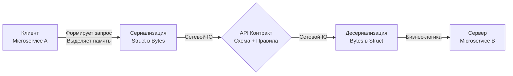

## Анатомия взаимодействия: За пределами HTTP

В компьютерной индустрии фундаментальные термины со временем обрастают прикладным контекстом и нередко теряют изначальную строгость. Для начинающего программиста аббревиатура API (Application Programming Interface) почти всегда ассоциируется с веб-разработкой: вызовами HTTP GET, передачей текстовых строк JSON и архитектурой REST.

Однако для инженера школы Bell Labs концепция API — это прежде всего **строгая граница абстракции**. Это водораздел, где заканчивается суверенное внутреннее пространство одного компонента и начинается ответственность другого. API скрывает детали реализации (инкапсуляция) и предоставляет миру лишь декларированное поведение.

В вычислительных системах API пронизывает все уровни абстракции:
* **Аппаратный уровень (Hardware ISA):** Система команд процессора (x86-64, ARM64, RISC-V) — это строгий API между физическим кремнием и операционной системой.
* **Уровень ядра ОС (Kernel API):** Системные вызовы (syscalls: `read`, `write`, `epoll_create`) — это API между ядром Linux и рантаймом Go.
* **Уровень исходного кода (In-Process API):** Экспортируемые структуры, функции пакетов и интерфейсы языка Go (`io.Reader`, `http.Handler`) — это API между модулями внутри единого бинарного файла.
* **Сетевой уровень (Distributed API):** Формализованные протоколы обмена сериализованными байтами по сетевым сокетам (TCP, UDP, QUIC) между независимыми процессами.

Когда в бэкенд-разработке мы произносим «API», мы практически всегда имеем в виду **сетевой контракт**. Это способ заставить два изолированных процесса, запущенных в разных дата-центрах и, возможно, написанных на абсолютно разных языках программирования (Go, Java, C++, Python), слаженно работать как единое монолитное целое.

## Контракт: Обещание, высеченное в камне

Если API — это сама архитектурная точка взаимодействия, то **Контракт (Contract)** — это нерушимый свод законов, регламентирующий это взаимодействие. Сетевой контракт состоит из четырех непреложных элементов:

1. **Предусловия (Inputs / Preconditions):** Требования к данным, передаваемым клиентом. Обязательность полей, допустимые типы данных, ограничения диапазонов, форматы дат и заголовки авторизации.
2. **Постусловия (Outputs / Postconditions):** Гарантированная структура и семантика ответа сервера при успешном сценарии.
3. **Протокол ошибок (Error Model):** Детерминированная схема информирования о нештатных ситуациях (машиночитаемые коды ошибок, контекстные сообщения, HTTP-статусы).
4. **Инварианты и побочные эффекты (Side-effects & Invariants):** Поведенческие гарантии (например, свойство идемпотентности — гарантия того, что повторный сетевой запрос на оплату не приведет к двойному списанию средств).

В исходном коде на Go контракты описываются через интерфейсы. Интерфейс `io.Reader` — это хрестоматийный контракт: *«Передай мне байтовый срез, и я гарантирую заполнить его данными, вернув количество прочитанных байт или ошибку»*. Сетевой контракт — это та же самая ментальная модель, но вынесенная за пределы адресного пространства локального процесса через сетевую среду.

> [!info] Под капотом: Физика сетевого вызова (Mechanical Sympathy)
> Внутри одной Go-программы вызов функции стоит единицы наносекунд. Передача структуры сводится к копированию 8-байтового указателя через регистр процессора (ABIInternal), а данные мгновенно считываются из сверхбыстрого L1/L2 кэша CPU.
> 
> Сетевой API-вызов в корне разрушает эту идиллию. Процессор физически не способен передать указатель на память удаленному узлу. Сложную структуру данных (с ее паддингами выравнивания, указателями и слайсами) необходимо принудительно трансформировать в линейный массив байт:
> 1. Рантайм Go производит аллокации в куче: анализ побега (Escape Analysis) гарантированно выталкивает буферы сериализации в heap.
> 2. Процессор сжигает миллионы тактов на обход полей через механизм рефлексии `reflect` (в стандартном пакете `encoding/json`).
> 3. Инициируется системный вызов ядра `write` для перекачки байт в сетевой сокет.
> 4. Пакеты преодолевают километры оптоволокна, претерпевая маршрутизацию и задержки коммутаторов.
> 5. На принимающей стороне процесс разворачивается зеркально: чтение из сокета, аллокации, парсинг.
> 
> Итог: сетевой вызов медленнее локального в сотни тысяч и миллионы раз (микросекунды и миллисекунды против наносекунд). Грамотный архитектор избегает «болтливых интерфейсов» (Chatty API) и маниакально оптимизирует размер полезной нагрузки (payload).

## Неявные vs Явные контракты (JSON vs Protobuf)

В современных распределенных системах подходы к спецификации контрактов разделились на два полярных лагеря:

### 1. Неявные контракты (REST + JSON)
В классическом REST/JSON API контракт зачастую существует лишь в головах разработчиков, в устаревшей корпоративной Wiki или, в лучшем случае, в виде схемы OpenAPI/Swagger ([[14. OpenAPI и Swagger.md]]). 

Компилятор Go ничего не знает об этих соглашениях. Когда на сервер поступает JSON-документ, стандартный пакет `encoding/json` использует рефлексию (`reflect`), чтобы на лету во время выполнения программы (runtime) исследовать структуру в памяти и сопоставить строковые ключи JSON с тегами полей структуры.

**Недостатки подхода:** 
- Низкая скорость сериализации из-за рефлексивного обхода структур.
- Полное отсутствие строгой проверки типов на этапе компиляции.
- Колоссальный риск сломать интеграцию при опечатке или переименовании поля: компилятор Go молча соберет проект, а клиент упадет с ошибкой парсинга в production.

### 2. Явные контракты (gRPC + Protocol Buffers)
В парадигме явных контрактов схема взаимодействия является первичной (Schema-First). Структуры данных и сигнатуры удаленных процедур строго фиксируются в файле `.proto`.

Этот файл становится единым неоспоримым источником правды (Single Source of Truth). Специализированный компилятор `protoc` читает схему и генерирует готовый, строго типизированный код на языке Go с обеих сторон (клиентские стабы и серверные интерфейсы).

> [!info] Под капотом: Почему Protobuf быстрее
> Сгенерированный код Protobuf принципиально не использует пакет `reflect` для разбора входящих сообщений. Компилятор заранее зашил в машинный код точные битовые смещения полей и их типы. Десериализация сводится к быстрому последовательному чтению бинарного потока (varint, tag-length-value) и прямой записи значений в заранее аллоцированную область памяти. Это в разы снижает нагрузку на CPU и избавляет Garbage Collector от лишней работы. Детальный разбор бинарного формата ждет нас в статьях [[7. Форматы данных JSON vs Protobuf.md]] и [[16. gRPC. Основы.md]].

## Ловушки обратной совместимости (Backward Compatibility)

Контракт чрезвычайно легко выпустить, но невероятно мучительно и сложно изменять.
Внутри монолитной Go-программы любая правка сигнатуры интерфейса мгновенно подсвечивается компилятором на этапе сборки. В распределенной сети компилятора не существует. Сервер и клиенты обновляются в разные моменты времени независимо друг от друга.

> [!warning] Ловушка / Gotcha: Breaking Changes
> Самая частая причина аварий при обновлении микросервисов — нарушение обратной совместимости контракта ([[27. Backward compatibility.md]]).
> 
> **Классический антипаттерн:** Сервер `A` ожидает от микросервиса `B` поле `status` в виде целочисленного кода `int` (0, 1, 2). В процессе рефакторинга разработчик решает сделать API «нагляднее» и меняет тип поля на строковый `string` ("pending", "active"). Сервер `A` обновляется в кластере. В ту же секунду старая версия сервиса `B`, продолжающая отправлять `int`, получает ошибки десериализации (HTTP 400 Bad Request), либо сервер молча парсит некорректные данные, записывая дефолтные пустые строки в базу.
> 
> **Золотое правило сетевых контрактов:** Никогда не удаляйте существующие поля и никогда не меняйте их тип! Только добавляйте новые поля. Если поле устарело, пометьте его метатегом `deprecated`, но продолжайте гарантировать его корректную обработку до тех пор, пока в сети активен хотя бы один клиент старой версии.

> [!tip] Собеседование
> **Вопрос:** Какими инженерными практиками вы гарантируете, что изменения в коде бэкенда не сломают API-контракт для внешних клиентов?
> **Ответ:** Настоящая гарантия обеспечивается комбинацией подходов:
> 1. **Consumer-Driven Contract Testing (CDCT):** Использование специализированных тестовых фреймворков (таких как Pact). Потребители нашего API фиксируют свои сценарии использования в виде исполняемых контрактов, которые прогоняются в CI/CD пайплайне нашего сервиса. Если Pull Request нарушает ожидания клиентов, сборка немедленно блокируется до деплоя.
> 2. **Схемные линтеры в CI:** Внедрение утилит статического анализа (например, `buf` для Protobuf или `spectral` для спецификаций OpenAPI). Линтер автоматически сравнивает текущую схему с предыдущим коммитом в Git и запрещает слияние кода при обнаружении ломающих изменений (Breaking Changes: удаление полей, смена числовых тегов). Детально методология тестирования контрактов рассмотрена в статье [[34. Contract testing.md]].

## Итог

1. **API** — это строгая граница абстракции и архитектурный рубеж между компонентами. В сетевом мире это формализованный диалог независимых процессов через поток байт.
2. **Контракт** — это гарантия детерминизма. Без строгого контракта распределенная система погружается в хаос неявных предположений и хрупких интеграций.
3. **Физика сетевого вызова:** Сетевое взаимодействие в тысячи раз медленнее передачи указателя в памяти. Архитектура контракта (JSON против бинарного Protobuf) напрямую диктует накладные расходы на CPU и поведение сборщика мусора в Go.
4. **Защита контракта:** Никогда не допускайте несовместимых правок в схемах — опирайтесь на автоматические линтеры (`buf`, `spectral`) и Contract Testing.

Осознав природу распределенного контракта, мы переходим к фундаментальным архитектурным стилям его воплощения. Главным и наиболее популярным стандартом веб-интерфейсов остается REST. В следующей лекции мы разберем его ключевые принципы и избавимся от накопившихся мифов: [[3. REST. Основные принципы.md]].
