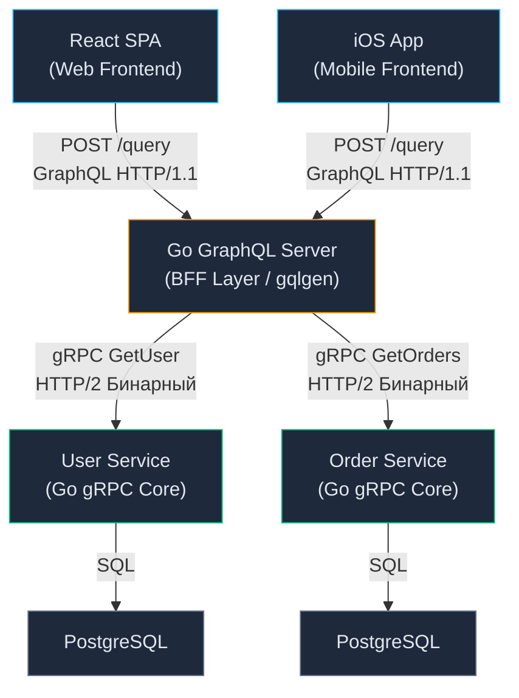
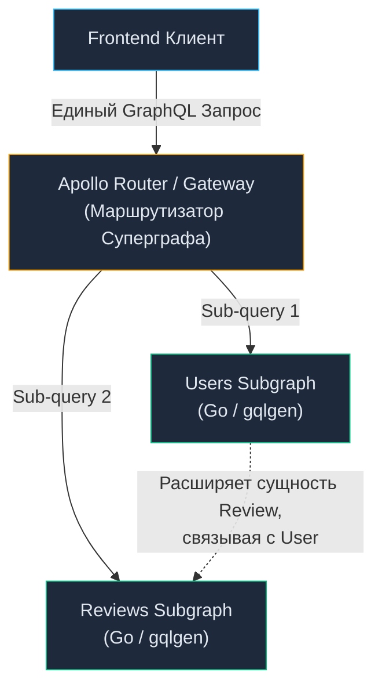

# 21. Когда использовать GraphQL: Архитектурные паттерны, BFF и Антипаттерны

> *"Beware of the Turing tar-pit in which everything is possible but nothing of interest is easy."*  
> — Алан Перлис

## Архитектурный прагматизм: GraphQL — это скальпель, а не швейцарский нож

В статье [[20. GraphQL. Основы.md]] мы увидели, как GraphQL элегантно решает две главные боли клиентской разработки — **Over-fetching** (перегрузку лишними полями) и **Under-fetching** (множественные раундтрипы), передавая клиенту полный контроль над формой ответа.

Воодушевленные этой гибкостью, разработчики часто совершают фатальную архитектурную ошибку: объявляют REST и gRPC «устаревшими» и пытаются переписать все свои внутренние микросервисы на GraphQL. Результатом такого энтузиазма становятся неподъемные объемы кода, падение пропускной способности системы и паралич базы данных.

Инженер уровня Senior обязан трезво понимать границы применимости технологий. GraphQL не отменяет классический REST ([[3. REST. Основные принципы.md]]) и тем более не конкурирует со сверхбыстрым gRPC ([[16. gRPC. Основы.md]]). Это узкоспециализированный инструмент, созданный исключительно для **слоя представления (Presentation Layer)** в точках соприкосновения с комплексными клиентскими интерфейсами.

В этой статье мы разберем строгие архитектурные критерии выбора и определим, где GraphQL раскрывается в полную силу, а где он превращается в убийцу производительности вашего Go-бэкенда.

---

## Идеальный сценарий: Паттерн BFF (Backend-For-Frontend)

Единственное место в современной распределенной архитектуре, где GraphQL раскрывает свой потенциал на 100% — это пограничный слой **BFF (Backend-For-Frontend)**. Мы детально разберем этот паттерн в [[26. BFF pattern.md]], однако в связке с GraphQL его механика безупречна.

Представьте зрелую микросервисную топологию:
- Внутри защищенного периметра дата-центра живут десятки узкоспециализированных микросервисов (пользователи, биллинг, каталог, заказы, доставка). Они общаются между собой по сверхбыстрому бинарному протоколу **gRPC** с околонулевыми задержками.
- На границе сети (Edge) для веб-приложений (React/Vue SPA) и мобильных платформ (iOS/Android) разворачивается единый агрегирующий шлюз — **BFF-сервис на Go**, построенный на библиотеке `gqlgen`.

В этой схеме GraphQL-сервер вообще **не обращается к базам данных напрямую**. В теле его резолверов (Resolvers) вызываются легковесные сгенерированные gRPC-клиенты соответствующих сервисов:



**Почему эта топология признана эталонной в BigTech?**
1. **Оркестрация на бэкенде:** Смартфону в нестабильной мобильной 3G-сети не нужно делать 5 последовательных запросов к разным бэкендам. Он отправляет ровно **один компактный HTTP-запрос** к BFF. Go-сервер BFF по внутренней 10-гигабитной сети дата-центра параллельно опрашивает gRPC-сервисы за считанные миллисекунды, собирает единый граф и отдает клиенту.
2. **Независимость клиентских команд:** Команде мобильного приложения требуется экран со списком аватарок — они запрашивают `{ id, avatar_url }`. Веб-версии для десктопа требуется полный профиль со статистикой — они запрашивают полный граф. Бэкенд-инженерам больше не нужно создавать десятки специализированных REST-ручек под каждый чих фронтенда.

---

## Mechanical Sympathy: Цена гибкости GraphQL

За любую архитектурную гибкость приходится расплачиваться физическими ресурсами кремния. С точки зрения рантайма Go, обработка GraphQL-запроса — это одна из наиболее вычислительно дорогих операций среди всех сетевых протоколов.

Сопоставим путь одного запроса в gRPC и в GraphQL на уровне процессора:

1. **gRPC:** Из сокета считывается бинарный фрейм. Процессор выполняет элементарный побитовый сдвиг тега и мгновенно записывает распакованный Varint напрямую в целевую Go-структуру по заранее известному смещению в памяти. Количество аллокаций в куче стремится к нулю.
2. **GraphQL:** Из сетевого сокета поступает длинная текстовая ASCII-строка:
   * **Лексический анализ:** Сканер посимвольно обходит строку, разбивая текст на токены.
   * **Построение AST:** Движок парсера материализует в памяти Абстрактное Синтаксическое Дерево (AST). Каждая вершина этого дерева — это отдельный Go-указатель (`pointer`). Сложный запрос порождает сотни связанных объектов.
   * **Escape Analysis:** Компилятор Go не может разместить динамическое дерево на стеке — все вершины AST гарантированно **убегают в кучу (Heap)**.
   * **Execution:** Движок рекурсивно обходит дерево, создавая структуры `map[string]interface{}` для упаковки итогового ответа.
   * **GC Pressure:** После отправки ответа клиенту сборщик мусора (Garbage Collector) вынужден размечать и очищать тысячи мелких короткоживущих объектов. На нагрузках в 15 000+ RPS фаза Mark у GC начинает съедать львиную долю тактов процессора, увеличивая хвостовые задержки (Tail Latency).

> [!warning] Ловушка / Gotcha: Server-to-Server GraphQL
> **Никогда не используйте GraphQL для общения между двумя внутренними микросервисами на бэкенде!**
> 
> Когда `Order Service` обращается к `User Service`, он точно знает, какие именно поля ему необходимы — это фиксированный системный контракт, а не динамический пользовательский интерфейс. Использование GraphQL на этом уровне добавит колоссальный оверхед на парсинг AST, валидацию текстовых строк и нагрузку на GC там, где бинарный gRPC справится за микросекунды с околонулевым потреблением памяти.

---

## Когда GraphQL не нужен (Антипаттерны)

### 1. Простые CRUD приложения
Если ваш сервис представляет собой административную панель или типичное CRUD-приложение (Create, Read, Update, Delete над таблицами базы данных), внедрение GraphQL — это классический архитектурный **оверинжиниринг**.

Вы потратите недели на написание Dataloader-ов (для спасения от проблемы N+1), настройку анализаторов сложности запросов и мутаций, в то время как стандартный ресурсный REST ([[4. Resource oriented design.md]]) со стандартной курсорной пагинацией решил бы задачу за пару дней, обеспечив лучшую производительность.

### 2. Приложения, критичные к кэшированию на уровне сети
Как мы выяснили в [[12. Caching HTTP.md]], инфраструктурное HTTP-кэширование (Edge CDN Cloudflare, Varnish, Nginx) опирается на уникальные URI и безопасный метод `GET`.

В GraphQL **все запросы без исключения отправляются методом `POST /query`**. Пограничный Nginx или CDN видит миллионы обращений на абсолютно одинаковый URL с телом запроса внутри payload. Сетевые прокси не могут кэшировать такой трафик «из коробки».

Если вы проектируете контентный сервис (новостной портал, медиа-платформа, каталог интернет-магазина), классический REST с директивами `Cache-Control: public, max-age=3600` снимет до 98% нагрузки с серверов, в то время как GraphQL заставит каждый запрос долетать до Go-рантайма.

*Примечание: Технология APQ (Automatic Persisted Queries) позволяет проксировать хэшированные запросы через GET, но ценой усложнения клиентского и серверного пайплайнов.*

### 3. Бинарные данные и потоковая загрузка
GraphQL органически непригоден для работы с бинарными потоками и передачей тяжелых файлов (Multipart/File Upload). Существующие спецификации загрузки файлов в GraphQL представляют собой громоздкие надстройки. Стриминг видео, передача аудио и выгрузка отчетов на гигабайты данных — это исключительная территория чистого HTTP-стриминга или gRPC Streaming.

---

## Эволюция API: REST vs GraphQL

> [!tip] Собеседование
> **Вопрос:** В чем принципиальное отличие эволюции контрактов в REST и GraphQL?
> 
> **Ответ:** 
> - В **REST** при нарушении обратной совместимости мы вынуждены повышать мажорную версию в пути URL (переходя с `/v1/` на `/v2/`), поддерживая параллельные контроллеры и DTO в коде (см. [[8. Versioning API.md]]). При этом бэкенд вслепую отдает клиенту полный JSON, не зная, какие поля клиент реально использует.
> - В **GraphQL** концепция глобальных версий отсутствует в принципе. Эволюция графа строится на уровне **депрекации отдельных полей (Field Deprecation)**:
>   ```graphql
>   type User {
>     birth_date: String!
>     age: Int @deprecated(reason: "Use birth_date instead")
>   }
>   ```
>   Мы не ломаем старое поле, а помечаем его директивой `@deprecated`. Благодаря тому, что каждый запрос GraphQL фиксирует точный перечень требуемых полей, система телеметрии бэкенда (**Field Usage Analytics**) точно фиксирует: обращается ли еще хоть один клиент к полю `age`. Когда счетчик обращений за 30 дней обнуляется, мы удаляем устаревшее поле из схемы со 100% гарантией того, что ни один клиент в мире не сломается.

---

## Apollo Federation: Граф для больших компаний

Когда количество микросервисов в компании переваливает за 50, единый монолитный BFF на Go, который знает обо всех типах системы, превращается в организационное «бутылочное горлышко» (Bottleneck). Разные команды непрерывно конфликтуют за право правок в едином репозитории.

Для решения этой проблемы была разработана архитектура **Apollo Federation**:
1. Каждый микросервис (на Go, Java, Node.js) публикует свой локальный фрагмент схемы — **Subgraph**.
2. Пограничный маршрутизатор (**Apollo Gateway / Apollo Router**) считывает схемы сервисов и компилирует их в единый **Суперграф (Supergraph)**.
3. Когда фронтенд присылает сложный запрос, Gateway строит глобальный план запроса, параллельно опрашивает нужные подграфы и объединяет сущности.



*Mechanical Sympathy в Федерации:* Важно осознавать инженерную цену такого решения. В федерации между Gateway и микросервисами циркулирует текстовый GraphQL (а не бинарный gRPC). На **каждом** узле инфраструктуры рантайм вынужден повторно выполнять парсинг AST и валидацию схем. Это осознанная плата за организационную автономию команд (по закону Конвея), но тяжелый удар по утилизации CPU.

---

## Итог

1. **GraphQL — инструмент клиентского слоя.** Его законное место — на уровне **BFF (Backend-For-Frontend)**, где он агрегирует данные из десятков внутренних микросервисов для мобильных и веб-клиентов.
2. Категорически избегайте GraphQL для **внутреннего межсервисного общения (East-West)**. Бинарный gRPC работает в разы быстрее и производит на порядок меньше аллокаций.
3. Не используйте GraphQL для простых CRUD-сервисов и публичных контентных платформ — вы потеряете мощь глобального инфраструктурного кэширования (CDN/Nginx).
4. GraphQL требует зрелой инженерной культуры: обязательного использования Dataloader, лимитов глубины запросов (MaxDepth) и анализа сложности (Query Complexity).

Мы изучили синхронные парадигмы обмена данными: от ресурсного REST и бинарного gRPC до графового GraphQL. Однако все эти протоколы требуют инициативы от клиента: сервер молчит, пока к нему не обратятся. А как быть, если сервер обязан *сам* мгновенно протолкнуть событие клиенту в непредсказуемый момент времени (Push-уведомления, чаты, котировки бирж, онлайн-игры)? Мы переходим к исследованию семейства протоколов реального времени (Real-Time). В следующей лекции мы детально разберем флагманскую технологию двунаправленной полнодуплексной связи: [[22. WebSocket.md]].
