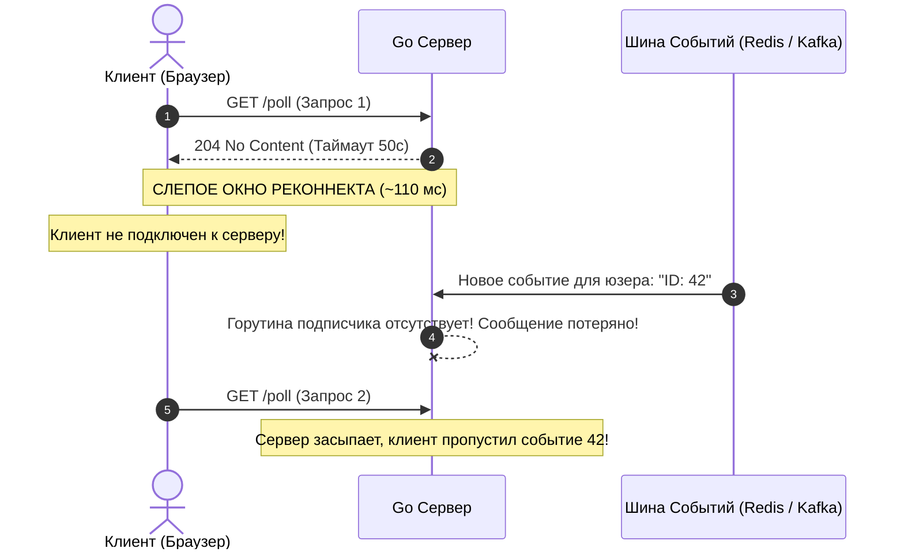

# Long Polling в Go: Архитектура длинного опроса и выносливость рантайма

## Исторический хак, ставший индустриальным стандартом

> *«Управление сложностью — вот сама суть программирования».*    
> — Брайан Керниган

В проектировании распределенных систем существует жесткий закон реальности: самое изящное теоретическое решение не стоит ничего, если оно разбивается о суровую физику корпоративной инфраструктуры. В предыдущих статьях мы восхищались полнодуплексной мощью [[22. WebSocket.md]] и потоковой простотой [[23. Server Sent Events.md]]. Однако обе эти технологии требуют непрерывной поддержки постоянных долгоживущих соединений от всех промежуточных узлов сети.

В реальном мире Enterprise-бэкенда вы неизбежно столкнетесь с инфраструктурным адом: жесткими корпоративными прокси-серверами (Squid), древними аппаратными файрволами, агрессивными сотовыми операторами и системами глубокой инспекции пакетов (DPI). Они безжалостно обрывают любые подозрительные TCP-соединения, если по ним не прокачиваются байты в течение 10–30 секунд, или блокируют протоколы, отличные от классического HTTP `GET`/`POST`. В таких условиях WebSocket и SSE просто отказываются работать.

Чтобы обеспечить надежную доставку событий в реальном времени даже в самой враждебной сетевой среде, инженеры придумали **Long Polling (Длинный опрос)**. Это не отдельный протокол, а остроумный архитектурный паттерн поверх стандартного, короткоживущего HTTP/1.1 (и HTTP/2). До появления стандартизированных сокетов на нем держался весь интерактивный интернет (ранние чаты Facebook, ВКонтакте), а сегодня Long Polling является признанным индустриальным стандартом для надежных межсерверных шлюзов и бот-платформ (самый яркий пример — Telegram Bot API).

---

## 1. Short Polling vs Long Polling

Чтобы оценить инженерную красоту Long Polling, полезно взглянуть на его наивного предшественника — **Short Polling (Короткий опрос)**.

Представьте человека, ожидающего важную телеграмму на почте. В парадигме Short Polling клиент каждые две секунды стучит в окошко оператора:  
*«Письмо пришло? Нет. А сейчас? Нет. А сейчас? Нет. А сейчас? Да, вот оно!»*

С точки зрения кремния процессора, сетевого стека и рантайма Go наивный Short Polling — это ресурсоемкая катастрофа:
1. **Трата CPU и аллокации памяти:** Сервер непрерывно парсит заголовки HTTP-пакетов, создает тысячи экземпляров структуры `http.Request`, выполняет маршрутизацию и выделяет память в куче (`Heap`).
2. **Перегрузка хранилища (Database Churn):** База данных бомбардируется сотнями тысяч пустых `SELECT`-запросов в секунду, которые лишь подтверждают отсутствие новостей.
3. **Сетевой мусор:** Сеть забивается миллионами TCP-сегментов и TLS-хэндшейков ради передачи 99.9% пустых ответов `[]` или `null`.

```mermaid
flowchart TD
    subgraph SP ["Short Polling (Бессмысленная бомбардировка)"]
        direction TB
        C1["Клиент"] -->|"GET /updates (каждые 2 сек)"| S1["Go Сервер"]
        S1 -->|"HTTP 200 OK: [] (Пусто)"| C1
        C1 -->|"GET /updates"| S1
        S1 -->|"HTTP 200 OK: [] (Пусто)"| C1
    end

    subgraph LP ["Long Polling (Элегантное зависание)"]
        direction TB
        C2["Клиент"] -->|"GET /poll (Ожидание до 50s)"| S2["Go Сервер"]
        S2 -.->|"Данных нет: Горутина засыпает"| W["Ожидание в runtime.gopark"]
        Ev["Событие: Новое сообщение"] ==>|"Пробуждение через канал"| W
        W -->|"HTTP 200 OK: {data}"| C2
        C2 -->|"Мгновенный новый GET /poll"| S2
    end

    style SP fill:#1e293b,stroke:#f43f5e,stroke-width:1px
    style LP fill:#1e293b,stroke:#10b981,stroke-width:2px
```



### Принцип работы Long Polling

В Long Polling клиент отправляет стандартный HTTP `GET`-запрос. Если у сервера прямо сейчас нет новых данных для клиента, сервер **не спешит возвращать пустой ответ**. Он «подвешивает» HTTP-запрос (удерживая TCP-сокет открытым) и переводит обработчик в состояние ожидания.

Как только в системе генерируется событие (пришло сообщение, изменился статус заказа), сервер мгновенно записывает ответ в сокет и корректно завершает HTTP-запрос статусом `200 OK`. Клиент принимает данные, мгновенно запускает их обработку в UI и **тут же инициирует следующий Long Polling запрос**. Если же за отведенный таймаут (например, 50 секунд) ничего не произошло, сервер возвращает статус `204 No Content` (или пустой `200 OK`), и клиент немедленно переподключается.

---

## 2. Mechanical Sympathy: Цена спящей горутины

Что происходит внутри операционной системы и рантайма Go, когда 50 000 HTTP-соединений одновременно переходят в режим ожидания?

В асинхронных платформах вроде Node.js такой паттерн реализуется почти бесплатно за счет единого цикла событий (Event Loop): дескрипторы сокетов регистрируются в системном селекторе ядра (`epoll` в Linux), и процесс не расходует память на стек, пока не сработает коллбэк.

В Go принята иная парадигма — **Goroutine-per-Connection**. Для каждого входящего TCP-соединения `net/http` запускает отдельную изолированную горутину. Если 50 000 клиентов висят в ожидании Long Polling, рантайм Go держит в памяти 50 000 параллельных горутин.

### Насколько это тяжело для сервера?

1. **Минимальный стек горутины:** В Go начальный размер стека горутины составляет всего **2 КБ** (в отличие от потоков ОС в Java/C++, где тред требует от 1 до 8 МБ).
2. **Парковка горутины (`runtime.gopark`):** Когда горутина блокируется на операции чтения из канала или ожидании `select`, рантайм Go переводит её в статус `_Gwaiting` и вызывает функцию `gopark`. Планировщик Go (**Scheduler**) мгновенно снимает её с потока ядра ОС (**M**). Спящая горутина **потребляет ровно 0% процессорного времени (CPU)**. Поток ядра M свободен и выполняет полезную работу для других задач.
3. **Накладные расходы на структуры соединения:** Сама горутина занимает 2 КБ, но структуры `http.Server`, буферы чтения/записи `bufio` и контекст запроса суммарно аллоцируют от 10 до 20 КБ на каждое открытое клиентское соединение.
4. **Реальный расчет памяти:**  
   $$50\,000 	imes 20	ext{ КБ} pprox 1	ext{ ГБ RAM}$$  
   Для современного сервера 1 ГБ оперативной памяти под 50 000 одновременных пользователей реального времени — это пренебрежимо малая величина. Рантайм Go справляется с такой нагрузкой играючи.

---

## 3. Идиоматичный Go: Реализация Long Polling

Ключевое инженерное требование к Long Polling: **HTTP-запрос никогда не должен висеть вечно**.

Если ваш Go-код зависнет в ожидании события навсегда, внешняя инфраструктура разорвет соединение за вас. Обратный прокси (Nginx) или балансировщик нагрузки (AWS ALB, Cloudflare) имеют жесткие таймауты ожидания ответа от бэкенда (`proxy_read_timeout`, обычно 60 секунд). Если бэкенд промолчит 60 секунд, балансировщик сочтет его мертвым, аварийно оборвет TCP-канал и вернет клиенту ошибку `504 Gateway Timeout`. Фронтенд воспримет это как критический сбой сети.

Идиоматичный Go-обработчик обязан **превентивно завершить ожидание ДО срабатывания таймаута инфраструктуры** (например, через 50 секунд при лимите Nginx в 60 секунд), вернуть аккуратный статус `204 No Content` и мягко предложить клиенту открыть новый цикл опроса.

### Реализация безопасного Long-Polling хэндлера:

```go
package main

import (
	"encoding/json"
	"log"
	"math/rand/v2"
	"net/http"
	"time"
)

// Event представляет сообщение для клиента
type Event struct {
	ID        int64  `json:"id"`
	Payload   string `json:"payload"`
	CreatedAt int64  `json:"created_at"`
}

// PubSubBroker эмулирует интерфейс шины сообщений
type PubSubBroker interface {
	Subscribe(userID string) <-chan Event
	Unsubscribe(userID string, ch <-chan Event)
	GetEventsAfter(userID string, lastID int64) []Event
}

func LongPollHandler(pubsub PubSubBroker) http.HandlerFunc {
	return func(w http.ResponseWriter, r *http.Request) {
		userID := r.PathValue("user_id")
		if userID == "" {
			http.Error(w, "missing user_id", http.StatusBadRequest)
			return
		}

		// 1. Проверяем наличие пропущенных сообщений (курсор last_event_id)
		// Если клиент отстал, мы отдаем данные немедленно без засыпания!
		var lastEventID int64
		if val := r.URL.Query().Get("last_event_id"); val != "" {
			// В реальном коде: strconv.ParseInt
			lastEventID = 100 
		}

		missedEvents := pubsub.GetEventsAfter(userID, lastEventID)
		if len(missedEvents) > 0 {
			w.Header().Set("Content-Type", "application/json")
			w.WriteHeader(http.StatusOK)
			json.NewEncoder(w).Encode(missedEvents)
			return
		}

		// 2. Подписываемся на новые события пользователя в шине Pub/Sub
		eventChan := pubsub.Subscribe(userID)
		defer pubsub.Unsubscribe(userID, eventChan)

		// 3. Устанавливаем таймер ДО таймаута Nginx (базовые 50s)
		// КРИТИЧЕСКИ ВАЖНО: Добавляем Jitter (рандомизацию), чтобы избежать Thundering Herd!
		jitterMs := rand.IntN(5000) // от 0 до 4999 мс
		timeoutDuration := 50*time.Second + time.Duration(jitterMs)*time.Millisecond

		timeout := time.NewTimer(timeoutDuration)
		defer timeout.Stop()

		// 4. Блокирующий select на каналах
		select {
		case event := <-eventChan:
			// Сценарий А: Появились новые данные
			w.Header().Set("Content-Type", "application/json")
			w.WriteHeader(http.StatusOK)
			json.NewEncoder(w).Encode([]Event{event})
			return

		case <-timeout.C:
			// Сценарий Б: Таймаут ожидания. Мягко просим переподключиться
			w.WriteHeader(http.StatusNoContent) // 204 No Content
			return

		case <-r.Context().Done():
			// Сценарий В: Клиент оборвал связь (закрыл вкладку, сбой Wi-Fi)
			// Netpoller Go перехватывает TCP FIN/RST и отменяет контекст запроса
			log.Printf("Клиент %s отключился: %v", userID, r.Context().Err())
			return
		}
	}
}
```

---

## 4. Ловушки и корнер-кейсы (Gotchas)

### Проблема «Стада бизонов» (Thundering Herd) и спасительный Jitter

Обратите внимание на вычисление интервала таймера с добавлением `jitterMs`:

```go
timeoutDuration := 50*time.Second + time.Duration(rand.IntN(5000))*time.Millisecond
```

> [!warning] Ловушка / Gotcha: Проблема Thundering Herd (Стадо бизонов)
> Представьте, что в вашем сервисе произошел кратковременный сетевой сбой, и ровно в 12:00:00 все 20 000 активных клиентов одновременно переподключились к бэкенду.  
> Если в вашем коде таймаут жестко зафиксирован на 50 секундах без рандомизации, то ровно в **12:00:50** у всех 20 000 клиентов синхронно сработает таймер. Сервер разом отдаст 20 000 ответов `204 No Content`, и в ту же миллисекунду все 20 000 клиентов синхронно отправят новые HTTP `GET`-запросы.  
> Этот гигантский резонансный импульс (Spike) нагрузки по CPU, аллокациям памяти и сетевым сокетам способен мгновенно перегрузить базу данных и уронить сервер.  
> **Jitter (Джиттер)** размазывает момент завершения запросов в интервале от 50 до 55 секунд, превращая разрушительную ударную волну в плавный, равномерный фоновый трафик.

---

## 5. Окно потери данных (The Reconnect Window)

Самый коварный архитектурный дефект наивной реализации Long Polling кроется в сетевом зазоре между последовательными HTTP-запросами.

Посмотрим на хронологию жизненного цикла соединения:
1. Сервер возвращает клиенту ответ (событие или таймаут 204).
2. HTTP-пакет летит по сети клиенту ($pprox 50$ мс).
3. Браузер парсит ответ и формирует новый HTTP-запрос ($pprox 10$ мс).
4. Новый запрос летит по сети к серверу ($pprox 50$ мс).

Суммарно возникает **«слепое окно» (The Reconnect Window)** длительностью около 110 мс. В этот интервал клиент **физически не подключен к серверу**. Если в эту десятую долю секунды бизнес-система попытается отправить клиенту срочное уведомление, а подписка в бэкенде была эфемерной (`fire-and-forget`), сообщение растворится в воздухе.



> [!tip] Собеседование: Гарантия доставки At-Least-Once в Long Polling
> **Вопрос:** Как исключить потерю сообщений в окне реконнекта при использовании Long Polling?
> 
> **Ответ:**  
> Эфемерные очереди каналов недопустимы. Доставка должна строиться на базе **персистентного лога событий** (Outbox-таблица в PostgreSQL, Redis Streams, Apache Kafka):
> 1. Каждому событию присваивается монотонно возрастающий идентификатор (`ID` или смещение).
> 2. Клиент передает в запросе параметр `last_event_id` (курсор последнего обработанного события).
> 3. Сервер, получив запрос, первым делом опрашивает хранилище: *«Есть ли события с ID > last_event_id?»*.
> 4. Если события уже есть в хранилище — сервер мгновенно возвращает их без засыпания.
> 5. Только если событий нет, сервер регистрирует горутину в шине Pub/Sub и засыпает в `select`.
> 
> По этой схеме работает Telegram Bot API: вы вызываете `getUpdates?offset=12345&timeout=30`. Telegram возвращает события с ID $\ge 12345$, гарантируя доставку без единого потерянного пакета.

---

## 6. Long Polling в распределенной системе

В многонодовом кластере (Kubernetes) клиентские Long Polling запросы распределяются балансировщиком между множеством реплик приложения (подов).

Если HTTP-запрос от пользователя $A$ «завис» на **Pod-1**, а транзакция оплаты пользователя завершилась в воркере на **Pod-2**, возникает классическая задача межсервисной маршрутизации. Pod-2 ничего не знает о TCP-сокете на Pod-1.

Для координации используется распределенная шина сообщений:
* **Redis Pub/Sub** или **NATS Core** для мгновенной доставки событий между подами.
* Pod-2 после сохранения изменений в БД публикует команду: `PUBLISH user_123_events "payment_success"`.
* Pod-1, подписанный на канал пользователя, принимает событие из Redis/NATS, отправляет его в локальный Go-канал `eventChan`, горутина мгновенно просыпается и отдает клиенту `HTTP 200 OK`.

```mermaid
flowchart LR
    Client["Клиент"] -->|"GET /poll (Ожидание)"| Pod1["Go Pod-1 (Держит сокет)"]
    Worker["Фоновый воркер (Pod-2)"] -->|"1. PUBLISH user_events"| Bus[("Redis Pub/Sub / NATS")]
    Bus -->|"2. Доставка события"| Pod1
    Pod1 -->|"3. HTTP 200 OK"| Client

    style Pod1 fill:#1e293b,stroke:#38bdf8,stroke-width:1px
    style Bus fill:#1e293b,stroke:#f59e0b,stroke-width:2px
```



---

## 7. Итог

1. **Long Polling** — самый надежный и инфраструктурно неприхотливый способ эмуляции Real-Time. Он гарантированно проходит сквозь любые прокси, VPN, сотовые вышки и строгие Enterprise-файрволы, поскольку выглядит как обычный короткий HTTP `GET`.
2. **Механика Go:** Тысячи ожидающих запросов — это тысячи спящих горутин, выведенных планировщиком из очередей CPU (`runtime.gopark`). Они расходуют лишь небольшое количество оперативной памяти (Heap), не нагружая процессор.
3. **Управление таймаутами и Jitter:** Бэкенд обязан прерывать опрос самостоятельно (статус 204), опережая таймаут Nginx/ALB. Использование случайного разброса (Jitter) предотвращает катастрофический резонанс нагрузки (Thundering Herd).
4. **Слепое окно и курсоры:** Для предотвращения потери данных в зазоре реконнекта архитектура обязана опираться на монотонные курсоры (`last_event_id`) и персистентное хранилище событий.

Мы завершили детальный разбор всех ключевых сетевых интерфейсов и протоколов (REST, gRPC, GraphQL, WebSocket, SSE, Long Polling). Теперь мы понимаем, как сервисы взаимодействуют с внешним миром. Но прежде чем этот многоликий поток внешнего трафика достигнет бизнес-логики сервисов, он обязан пройти через единый защитный барьер инфраструктуры. О том, как вынести сквозную авторизацию, лимиты трафика, SSL-терминацию и умный роутинг на периметр кластера, мы поговорим в следующей статье: [[25. API Gateway.md]].
