# Паттерн BFF (Backend for Frontend) в Go: Специализированная агрегация

> *«Не кладите все яйца в одну корзину, но и не покупайте отдельную корзину для каждого яйца. Разделение ответственности хорошо ровно настолько, насколько грамотно вы провели границы».*

В проектировании распределенных систем существует неразрешимое противоречие между потребностями клиентов и чистотой внутренних сервисов. В предыдущей статье [[25. API Gateway.md]] мы рассмотрели концепцию единой точки входа (API Gateway), защищающей внутренний периметр. Однако по мере роста продукта единый универсальный шлюз неизбежно превращается в бутылочное горлышко разработки.

Представьте реальный ландшафт современного коммерческого сервиса:
* **Web-приложение (Desktop):** Работает по быстрому оптоволоконному интернету на широкоформатных мониторах. Ему нужны глубокие аналитические таблицы с 20 колонками, тяжелые графики и подробные структуры связанных сущностей.
* **Mobile-приложение (iOS/Android):** Функционирует через нестабильную мобильную сеть с переменным пингом, на небольшом экране с ограниченной батареей и процессором. Ему нужны всего 3 ключевые колонки, легкие сжатые миниатюры картинок и минимальный размер сетевого ответа.
* **Smart TV и IoT-устройства:** Имеют крайне медленные встроенные чипы, специфические требования к форматам сериализации и жесткие таймауты сетевых запросов.

Если мы попытаемся адаптировать ответы под все эти диаметрально противоположные платформы внутри одного общего API Gateway, шлюз быстро выродится в чудовищный антипаттерн «Божественный объект» (God Object). Малейшая правка верстки мобильного экрана потребует изменения общего кода, рискуя сломать десктопную версию для сотен тысяч корпоративных пользователей.

Элегантным решением этой архитектурной дилеммы стал паттерн **BFF (Backend for Frontend)**.

---

## 1. Backend for Frontend: Изоляция интересов клиентов

Метафора BFF напоминает работу персональных гидов-переводчиков для разных иностранных делегаций на крупном производственном предприятии.

Если на завод одновременно прибывают финансовые аудиторы из банка (Desktop Web), репортеры новостного телеканала (Mobile App) и инспекторы экологической безопасности (IoT), главному инженеру предприятия (внутренним микросервисам) некогда лично общаться с каждым гостем. Репортеру не нужны бухгалтерские гроссбухи завода, а аудиторам не интересны фотографии фасадных клумб.

Вместо этого к каждой делегации прикрепляется персональный гид-референт (**BFF**):
- Гид мобильных репортеров быстро обежит цеха, отберет три главные цифры и перескажет их за 30 секунд.
- Гид финансовых аналитиков не спеша соберет детальные ведомости со всех отделов, пересчитает валютные курсы и предоставит сводную таблицу.

Внутренние цеха завода работают в привычном строгом режиме, не подстраиваясь под капризы каждого отдельного посетителя.

```mermaid
flowchart TD
    subgraph Clients ["Разнородные клиенты (Heterogeneous Clients)"]
        Web["Web App<br>(React / Desktop)"]
        Mob["Mobile App<br>(iOS / Android)"]
        IoT["Smart TV / IoT"]
    end

    subgraph Edge ["Периметр инфраструктуры"]
        GW["Edge API Gateway<br>(SSL Termination • WAF • Global Rate Limit)"]
    end

    subgraph BFF_Layer ["Слой BFF (Backend for Frontend на Go)"]
        BFF_Web["BFF Web Service<br>(Session Cookies, 20-col Tables, Rich JSON)"]
        BFF_Mob["BFF Mobile Service<br>(JWT, Mobile DTO, Compact JSON / Protobuf)"]
        BFF_IoT["BFF IoT Service<br>(Device Auth, Raw Binary / Minimal)"]
    end

    subgraph Mesh ["Внутренний контур (Internal gRPC Mesh)"]
        Users["Users Service"]
        Orders["Orders Service"]
        Catalog["Catalog Service"]
        Push["Push Notification Svc"]
    end

    Web -->|"HTTPS / Cookie"| GW
    Mob -->|"HTTPS / Bearer"| GW
    IoT -->|"HTTPS / DeviceKey"| GW

    GW -->|"Маршрутизация"| BFF_Web
    GW -->|"Маршрутизация"| BFF_Mob
    GW -->|"Маршрутизация"| BFF_IoT

    BFF_Web -->|"gRPC"| Users
    BFF_Web -->|"gRPC"| Orders
    BFF_Web -->|"gRPC"| Catalog

    BFF_Mob -->|"gRPC"| Users
    BFF_Mob -->|"gRPC"| Orders
    BFF_Mob -->|"gRPC"| Push

    style Edge fill:#1e293b,stroke:#38bdf8,stroke-width:1px
    style BFF_Layer fill:#1e293b,stroke:#10b981,stroke-width:2px
    style Mesh fill:#0f172a,stroke:#6366f1,stroke-width:1px
```



---

## 2. Суть паттерна: Под каждую платформу свой бэкенд

Вместо одного монолитного шлюза мы разворачиваем **несколько легковесных, узкоспециализированных прослоек**, каждая из которых создается под конкретный пользовательский интерфейс и поддерживается в тесном контакте с клиентскими разработчиками.

BFF — это не просто тупой прокси-маршрутизатор. Это умный слой оркестрации и агрегации данных, выполняющий четыре ключевые задачи:

1. **Трансформация и форматирование типов:** Внутренний микросервис может отдавать идентификаторы в типе `int64` (например, Snowflake ID: `158392019384920193`). В языке JavaScript числа типа `Number` ограничены 53 битами (`Number.MAX_SAFE_INTEGER = 9007199254740991`). Передача 64-битного целого числа напрямую в JS-клиент приведет к потере точности младших разрядов! BFF на лету преобразует `int64` из внутреннего бэкенда в безопасную строку `string` для JS.
2. **Параллельная агрегация сетевых вызовов (Fan-Out / Fan-In):** Чтобы отрисовать главный экран мобильного приложения, клиенту нужны профиль пользователя, список последних 3 заказов, баланс бонусов и персональные скидки. Без BFF мобильный телефон вынужден отправить 4–5 последовательных HTTP-запросов по нестабильной сети. BFF принимает **один-единственный запрос от клиента**, параллельно опрашивает внутренние сервисы по сверхбыстрому gRPC с околонулевым пингом и возвращает готовый композитный ответ.
3. **Оптимизация сетевой полезной нагрузки (Payload Trimming):** Внутренний микросервис `Users` возвращает тяжелую DTO со 100 полями (включая технические флаги, аудитные метки и историю изменений). Мобильному экрану нужно только имя и ссылка на аватар. BFF срезает 95% лишних байт (своеобразный GraphQL на минималках, но жестко зашитый в типизированный код без накладных расходов на рантайм-парсинг AST).
4. **Платформенное управление сессиями:** Веб-клиенты безопаснее авторизовывать через браузерные `HttpOnly, Secure` сессионные Cookie с защитой от XSS. Мобильные приложения работают с заголовками `Authorization: Bearer <Token>`. Каждый BFF инкапсулирует свою модель авторизации.

---

## 3. Mechanical Sympathy: Почему Go идеален для BFF

По своей системной природе слой BFF является классической **I/O-bound системой**. Он не занимается сложным математическим моделированием или криптографическим майнингом. 98% времени своей жизни обработчик BFF просто ожидает: ответа от сервиса пользователей, ответа от сервиса каталога, ответа от сервиса платежей.

В классических платформах со схемой «один тред ОС на соединение» (традиционная Java/Spring, Ruby, PHP) создание BFF-прослойки обходится непомерно дорого. Тысячи системных потоков операционной системы блокируются в ожидании сетевых сокетов, пожирая гигабайты оперативной памяти на стеки и забивая ядро переключениями контекста. В однопоточных платформах (Node.js) тяжелая сериализация массивных JSON-объектов способна заблокировать Event Loop для всех параллельных запросов.

В Go сочетание **Goroutine-per-Request** и встроенного сетевого поллера ядра (**Netpoller** на базе `epoll`/`kqueue`) делает язык идеальным инструментом для построения BFF:
- Горутина в ожидании сетевого ответа переводится планировщиком в статус ожидания (`_Gwaiting`), потребляя около 2 КБ RAM и 0% CPU.
- Десятки тысяч параллельных клиентских сессий удерживаются сервером при минимальном потреблении оперативной памяти.

---

## 4. Параллельная агрегация через errgroup

Идиоматичный паттерн реализации асинхронного сбора данных в Go — использование пакета `golang.org/x/sync/errgroup`. 

Пакет `errgroup` позволяет запустить несколько дочерних горутин параллельно, привязать их к единому контексту `context.Context` и синхронизировать их завершение:

```go
package main

import (
	"context"
	"fmt"
	"net/http"
	"time"

	"golang.org/x/sync/errgroup"
)

// DTO контракты
type DashboardRequest struct {
	UserID string
}

type DashboardResponse struct {
	UserName    string      `json:"user_name"`
	RecentOrder interface{} `json:"recent_order,omitempty"`
}

// Заглушки protobuf-структур для компиляции
type pbUser struct {
	FullName string
}

type pbOrder struct {
	ID string
}

type pbListOrdersResponse struct {
	Orders []*pbOrder
}

type UserClient interface {
	GetProfile(ctx context.Context, id string) (*pbUser, error)
}

type OrderClient interface {
	ListOrders(ctx context.Context, userID string) (*pbListOrdersResponse, error)
}

type BffServer struct {
	userClient  UserClient
	orderClient OrderClient
}

func mapToMobileFormat(orders []*pbOrder) interface{} {
	if len(orders) == 0 {
		return nil
	}
	return map[string]string{"last_order_id": orders[0].ID}
}

func (s *BffServer) GetDashboard(ctx context.Context, req *DashboardRequest) (*DashboardResponse, error) {
	// 1. Создаем errgroup, связанную с общим жизненным циклом запроса
	g, ctx := errgroup.WithContext(ctx)

	var (
		user   *pbUser
		orders []*pbOrder
	)

	// 2. Ветвь 1: Параллельный запрос к микросервису пользователей
	g.Go(func() error {
		var err error
		user, err = s.userClient.GetProfile(ctx, req.UserID)
		if err != nil {
			return fmt.Errorf("user service failed: %w", err)
		}
		return nil
	})

	// 3. Ветвь 2: Параллельный запрос к микросервису заказов
	g.Go(func() error {
		resp, err := s.orderClient.ListOrders(ctx, req.UserID)
		if err != nil {
			// Паттерн частичной деградации: если заказы не загрузились,
			// мы не роняем весь экран, а отдаем nil в истории заказов
			return nil 
		}
		if resp != nil {
			orders = resp.Orders
		}
		return nil
	})

	// 4. Ожидаем завершения всех параллельных вызовов или первой критической ошибки
	if err := g.Wait(); err != nil {
		return nil, fmt.Errorf("failed to aggregate data: %w", err)
	}

	// 5. Формируем легковесную DTO специально для мобильного клиента
	return &DashboardResponse{
		UserName:    user.FullName,
		RecentOrder: mapToMobileFormat(orders),
	}, nil
}
```

```mermaid
sequenceDiagram
    autonumber
    actor Client as Мобильное приложение
    participant BFF as BFF Mobile (Go)
    participant Users as Users Service (gRPC)
    participant Orders as Orders Service (gRPC)

    Client->>BFF: GET /api/v1/mobile/dashboard
    
    rect rgb(30, 41, 59)
        note over BFF: errgroup.WithContext(ctx)<br>Параллельный Fan-Out вызовов
        par Запрос профиля
            BFF->>Users: gRPC GetProfile(ctx, userID)
        and Запрос заказов
            BFF->>Orders: gRPC ListOrders(ctx, userID)
        end
        Users-->>BFF: 200 OK: pb.User {FullName, ...}
        Orders-->>BFF: 200 OK: pb.Orders [...]
    end

    note over BFF: Трансформация в мобильный DTO<br>(срез полей, сжатие)
    BFF-->>Client: 200 OK (JSON с 2 полями вместо 100)
```



> [!info] Под капотом: Контексты и мгновенная отмена вызовов
> Обратите внимание: метод `errgroup.WithContext(ctx)` возвращает производный контекст, который автоматически отменяется при возникновении первой ошибки в любой из запущенных горутин.  
> Если запрос к `userClient` завершился с ошибкой (например, пользователь заблокирован), контекст немедленно закрывается (`ctx.Done()`). Клиентская библиотека gRPC мгновенно отправляет сигнал отмены `RST_STREAM` по HTTP/2 сокету в сторону `orderClient`. Сервер заказов прерывает выполнение тяжелого SQL-запроса, экономя такты процессора и память базы данных!

---

## 5. Кто должен владеть BFF? (Закон Конвея)

В архитектуре распределенных систем паттерн BFF вскрывает фундаментальный организационный вопрос, сформулированный в Законе Конвея:  
> *«Организации проектируют системы, которые копируют структуру их внутренних коммуникаций».*

Существуют два диаметрально противоположных подхода к владению кодовой базой BFF:

* **Вариант А: BFF разрабатывает бэкенд-команда.**  
  Бэкенд-инженеры воспринимают BFF как досадную обузу. Возникает вечный пинг-понг в таск-трекере: фронтендер просит добавить одно поле или переименовать статус, бэкендер ставит задачу в бэклог следующего спринта, релиз фичи задерживается на недели.
* **Вариант Б: BFF разрабатывает и сопровождает фронтенд-команда (Рекомендуемый стандарт).**  
  Команда мобильной разработки сама владеет репозиторием `mobile-bff`, а команда веб-интерфейса — репозиторием `web-bff`. Фронтендеры сами решают, какие поля им нужны в API, в каком формате отдавать даты и как агрегировать данные для оптимизации UI.

Благодаря простоте синтаксиса языка Go, его строгой статической типизации и дружелюбному тулингу разработчики со знанием TypeScript или Swift осваивают базовую разработку BFF на Go за считанные дни. Бэкенд-команда при этом полностью концентрируется на надежности и масштабировании ядерных доменных сервисов.

---

## 6. Ловушки паттерна (Gotchas)

### 1. Дублирование кода (Code Duplication)
Если логику аутентификации, генерации метрик Prometheus или проверки CORS копипастить в `BFF-Web` и `BFF-Mobile` (или между репозиториями разных команд), кодовая база быстро обрастет техническим долгом и расхождениями в безопасности.

**Решение:**
1. Разделяемая инфраструктурная библиотека (Internal SDK / Go Module), содержащая общекорпоративные middleware.
2. Внешний пограничный API Gateway, стоящий ПЕРЕД слоем BFF, который централизованно проверяет токены, терминирует TLS и отсекает невалидный трафик до попадания в BFF.

### 2. Задержка (Latency) и накладные расходы лишнего прыжка (Hop)
Внедрение BFF добавляет еще один сетевой транзитный узел:  
$$	ext{Клиент} \longrightarrow 	ext{BFF} \longrightarrow 	ext{Микросервисы}$$

**Правило Mechanical Sympathy:** Чтобы минимизировать задержку, взаимодействие между BFF и микросервисами обязано происходить через высокоэффективный **gRPC** ([[16. gRPC. Основы.md]]) по долгоживущим мультиплексированным HTTP/2 соединениям. Использование медленного REST/JSON с парсингом строк внутри локальной сети кластера между BFF и сервисами уничтожает производительность и многократно увеличивает нагрузку на Garbage Collector.

### 3. "Тонкий" vs "Толстый" BFF (Fat BFF Antipattern)
Главный соблазн фронтенд-команды — начать писать в BFF бизнес-логику («по-быстрому посчитаем скидку здесь», «запишем в базу напрямую»).  
Это грубейшее архитектурное нарушение. Как только в BFF появляется бизнес-логика, нарушается инвариант единственного источника правды: правила расчета скидок для веб-версии разойдутся с мобильной версией.  
**Инженерное правило:** BFF обязан оставаться предельно **«тонким»**. Его зона ответственности строго ограничена тремя вещами: **Транспорт, Оркестрация и Форматирование**.

---

## 7. Сравнительный анализ: API Gateway vs BFF vs GraphQL

| Критерий | Централизованный API Gateway | Паттерн BFF (на Go) | Клиентский GraphQL |
|---|---|---|---|
| **Зона ответственности** | Общекорпоративный периметр (Security, Quotas) | Адаптация под конкретный UI клиента | Произвольная выборка данных клиентом |
| **Команда-владелец** | Инфраструктурная / Platform Team | Фронтенд-команда конкретной платформы | Общая схема / Бэкенд-команда |
| **Контракт данных** | Универсальный REST / gRPC | Кастомизированная DTO под экран | Клиентский запрос (GraphQL AST) |
| **Утилизация сети** | Часто перегружена (Over-fetching) | **Минимальная (идеальный DTO payload)** | Минимальная (выбираются точные поля) |
| **Накладные расходы CPU**| Минимальные (потоковый `io.Copy`) | **Минимальные (нативный компилируемый Go)** | Высокие (runtime парсинг запросов и резолверы) |
| **Кэширование** | Простое по URL (HTTP 200) | Простое по эндпоинтам | Затруднено (все запросы идут через `POST /graphql`)|

> [!tip] Собеседование: Архитектурное сопоставление API Gateway и BFF
> **Вопрос:** В чем принципиальная разница между API Gateway и BFF? Могут ли они сосуществовать в одной архитектуре?
> 
> **Ответ:**  
> Они не только могут, но и идеально дополняют друг друга:
> * **API Gateway** — это глобальная пограничная инфраструктура (Edge), общая для всей компании. Он решает сквозные задачи безопасности (DDoS, WAF, SSL-терминация, глобальный Rate Limiting, единый DNS-вход).
> * **BFF** — это прикладной презентационный слой (Presentation Layer), созданный под конкретный пользовательский интерфейс (Web, Mobile, Smart TV). Он занимается параллельной агрегацией микросервисов и адаптацией структур данных под нужды фронтенда.
> 
> В зрелой архитектуре трафик идет по цепочке:  
> `Клиент` $	o$ `API Gateway (Периметр)` $	o$ `Специализированный BFF` $	o$ `Внутренние gRPC микросервисы`.

---

## 8. Итог

1. **Паттерн BFF (Backend for Frontend)** защищает внутреннюю архитектуру от подстраивания под капризы отдельных клиентов, выделяя специализированные презентационные прослойки под каждую платформу (Web, iOS, Android).
2. Go является образцовым языком для написания BFF благодаря легковесной конкурентности (`Goroutine-per-Request`) и инструментам параллельной оркестрации (`golang.org/x/sync/errgroup`).
3. Контекстная синхронизация (`errgroup.WithContext`) гарантирует немедленную отмену всех незавершенных RPC-вызовов при отказе любого критического сервиса.
4. Внутренняя связь между BFF и сервисами домена должна строиться исключительно на базе бинарного **gRPC** с пулами постоянных соединений.
5. BFF должен оставаться «тонким»: любая бизнес-логика обязана жить в доменных микросервисах, а не в презентационном слое.

Мы научились проектировать надежные публичные интерфейсы, защищать периметр кластера через API Gateway и адаптировать контракты через BFF. Но в реальной жизни сервисы не статичны — они непрерывно развиваются. Как добавить новое поле в контракт, переименовать статус или удалить устаревшую структуру, не сломав миллионы уже установленных у пользователей мобильных приложений? Этому критическому инженерному навыку посвящена следующая статья: [[27. Backward compatibility.md]].
