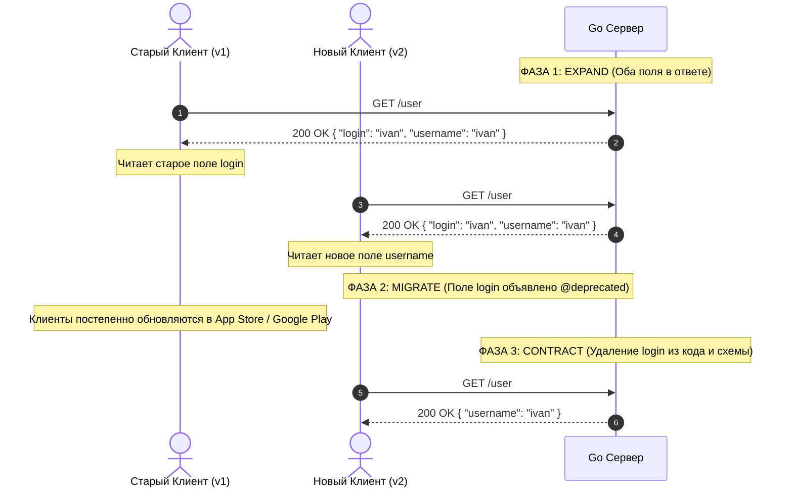

# Обратная совместимость в Go: Как развивать API и не ломать клиентов

> *"Compatibility means that you can make changes without having to coordinate with the rest of the world."*  
> — Принцип проектирования систем Bell Labs

В монолитном приложении изменение сигнатуры функции или структуры данных — процедура тривиальная: компилятор Go мгновенно подсветит все несовместимые вызовы, а глобальный рефакторинг в IDE исправит кодовую базу за один коммит. В распределенной микросервисной архитектуре, как мы выяснили в статье [[2. Что такое API и контракт.md]], контракт API — это публичное, юридически строгое обязательство перед внешним миром.

**Обратная совместимость (Backward Compatibility)** — это способность обновленного сервера корректно обслуживать старые версии клиентов, которые ничего не знают об изменениях бэкенда.

В реальной жизни вы не можете принудительно обновить миллионы смартфонов пользователей: мобильные приложения на iOS и Android могут не обновляться годами, сторонние B2B-интеграторы могут десятилетиями слать запросы старого формата, а микросервисы в соседних кластерах могут развертываться независимыми командами в разные дни. Для Senior-инженера обратная совместимость — это не просто абстрактное правило «не удалять поля», а глубокое понимание механики сериализации (JSON, Protobuf) на уровне байтов и умение проектировать эволюцию данных без простоев.

---

## 1. Искусство не ломать: Обратная совместимость в распределенных системах

Представьте стандартизированную бытовую электрическую розетку на 220 В. Энергетическая компания может модернизировать электростанцию, заменить генераторы на атомные реакторы или солнечные батареи, проложить новые кабели под землей. Но если компания внезапно изменит форму отверстий в розетке или подаст напряжение 380 В без предупреждения — во всем городе сгорят чайники, холодильники и компьютеры.

Серверные API подчиняются тем же законам физики:
* **Клиент** — это бытовой прибор с неизменной вилкой.
* **Сервер** — электростанция, обязанная соблюдать физический контракт напряжения и формы разъема.

```mermaid
flowchart LR
    subgraph S_V2 ["Новый Go Сервер (v2.4.0)"]
        direction TB
        Code["Бизнес-логика + Новые поля"]
    end

    subgraph C_Old ["Старый Клиент (v1.0.0, 2 года назад)"]
        direction TB
        AppOld["Мобильное приложение (iOS)<br>Ожидает старый контракт"]
    end

    subgraph C_New ["Новый Клиент (v2.4.0)"]
        direction TB
        AppNew["Web SPA / Новый релиз<br>Использует новые поля"]
    end

    C_Old ==>|"GET /api/v1/profile (Бесшовная работа)"| S_V2
    C_New ==>|"GET /api/v1/profile (Новый payload)"| S_V2

    style S_V2 fill:#1e293b,stroke:#10b981,stroke-width:2px
    style C_Old fill:#1e293b,stroke:#f59e0b,stroke-width:1px
    style C_New fill:#1e293b,stroke:#38bdf8,stroke-width:1px
```



---

## 2. Золотые правила изменений

Любая модификация сетевого контракта строго классифицируется на две категории: **Non-breaking** (безопасное, совместимое изменение) и **Breaking** (разрушающее контракт).

### Что НЕ ломает контракт (Safe):
1. **Добавление нового эндпоинта:** Старые клиенты о нем не знают и не вызывают его; для них топология сети осталась неизменной.
2. **Добавление нового (опционального) поля в ответ:** Согласно **Закону Постела** (*«Будь консервативен в том, что отправляешь, и либерален в том, что принимаешь»*), корректно спроектированный клиент парсит только известные ему поля, а неизвестные просто игнорирует.
3. **Добавление нового опционального Query-параметра:** Если параметр не передан клиентом, бэкенд использует безопасное значение по умолчанию (Default Value).
4. **Изменение порядка полей в JSON:** Спецификация RFC 8259 определяет JSON Object как неупорядоченную коллекцию пар «ключ-значение».
5. **Добавление нового значения в Enum (при соблюдении правил):** Если клиент готов к неизвестным значениям перечисления.

### Что ГАРАНТИРОВАННО ломает контракт (Breaking):
1. **Переименование или удаление поля:** Старый клиент попытается прочитать удаленное поле, получит `null` / `Zero Value` или упадет с ошибкой парсинга (`NullPointerException`, `KeyError`).
2. **Изменение типа поля:** Было число `int` (`"age": 25`), а стала строка `string` (`"age": "25"`). Строго типизированные клиенты (Go, Swift, Java, C#) немедленно аварийно завершат десериализацию.
3. **Добавление обязательного (required) поля в запрос:** Старые клиенты формируют тело запроса без этого поля. Сервер отклонит их запрос ошибкой `400 Bad Request`.
4. **Изменение семантики (Смысловая мутация):** Поле `status` осталось типом `int`, но раньше значение `1` означало «Active», а теперь — «Deleted». Это самая коварная и опасная ошибка в разработке, поскольку линтеры и компиляторы бессильны перед искажением бизнес-логики.
5. **Закон Хайрума (Hyrum's Law):** При достаточном количестве пользователей API не имеет значения, что вы обещали в документации: любое наблюдаемое поведение системы (время ответа, формат текста ошибки, сортировка записей по умолчанию) кем-то будет использовано как неявная зависимость.

---

## 3. Mechanical Sympathy: Совместимость на уровне байтов

Механизм устойчивости к изменениям закладывается на уровне двоичного кодирования и архитектуры парсеров. Разные форматы данных ведут себя принципиально по-разному.

### JSON (Неявная совместимость)

В стандартной библиотеке Go пакет `encoding/json` при разборе байтового потока использует рефлексию (`reflect`).
- Если в JSON присутствуют лишние поля, которых нет в целевой Go-структуре, парсер просто пропускает их, не вызывая ошибки.
- Если поле отсутствует в JSON, соответствующее поле в структуре Go сохраняет свое **Zero Value** (`0` для чисел, `""` для строк, `false` для булевых значений, `nil` для указателей и срезов).

> [!warning] Ловушка: Различение Zero Value и отсутствия данных в JSON
> Если вы добавили в контракт новое поле `is_active: bool`, а старый клиент прислал запрос без этого поля, в структуре Go поле примет значение по умолчанию `false`. Ваш бэкенд не сможет отличить:  
> *«Клиент явно передал false (хочет деактивировать пользователя)?»*  
> или  
> *«Это старый клиент, который ничего не знает про активность?»*  
> **Решение:** Для опциональных полей в Go структурах всегда используйте указатели (например, `*bool`, `*int`), как мы рассматривали в [[4. Resource oriented design.md]]. Если поле не пришло, указатель равен `nil`.

### Protobuf (Явная бинарная совместимость)

Как мы детально разбирали в [[17. Protocol Buffers.md]], бинарный протокол Protobuf не передает имена полей по сети. В поток байт упаковываются **номера тегов (Field Tags)** и типы проводов (Wire Types):
$$	ext{Header} = (	ext{field\_number} \ll 3) \mid 	ext{wire\_type}$$

* **Смена имени поля:** Если в файле `.proto` вы переименуете поле с `login` на `username`, но сохраните тег `int32 id = 1`, **бинарная совместимость сохранится на 100%**. В проводе летят байты тега `1`, а не строковые символы!
* **Неизвестные поля (`unknownFields`):** Если новый сервер отправляет тег `4`, а старый клиент скомпилирован со схемой, где есть только теги `1, 2, 3`, клиент не упадет. Он сохранит байты тега `4` в специальном скрытом срезе `unknownFields`. Если клиент выступает в роли транзитного прокси, при сериализации он запишет эти байты обратно, не потеряв информацию!

```mermaid
flowchart LR
    subgraph Wire ["Провод (TCP Stream)"]
        B["[Tag: 1 (Wire 2)] [Len: 4] ['i','v','a','n']"]
    end

    subgraph ProtoOld ["Старый клиент (.proto v1)"]
        F1["string login = 1;"]
    end

    subgraph ProtoNew ["Новый клиент (.proto v2)"]
        F2["string username = 1;"]
    end

    Wire -->|"Тег 1 совпадает!"| ProtoOld
    Wire -->|"Тег 1 совпадает!"| ProtoNew

    style Wire fill:#0f172a,stroke:#38bdf8,stroke-width:2px
    style ProtoOld fill:#1e293b,stroke:#10b981,stroke-width:1px
    style ProtoNew fill:#1e293b,stroke:#10b981,stroke-width:1px
```



> [!warning] Ловушка / Gotcha: Смена типов в Protobuf
> В Protobuf некоторые типы упаковываются в один и тот же wire type (например, `int32`, `int64`, `uint32` и `bool` упаковываются как `varint`, Wire Type 0).  
> Технически парсер сможет прочитать `varint` другого размера без падения, но при переполнении битовой сетки старшие биты будут безвозвратно обрезаны или число превратится в отрицательное. Никогда не меняйте типы существующих тегов: смена типа — это 100% breaking change!

---

## 4. Стратегия "Expand and Contract" (Расширение и Сужение)

Как безопасно переименовать или удалить поле, если у вас миллионы активных пользователей и десятки микросервисов? В Highload-системах стандартом де-факто является трехфазный паттерн **Expand and Contract** (также известный как Parallel Run).

### Сценарий: Нужно переименовать поле `login` в `username`.



### Детальный регламент фаз:

1. **Фаза 1: Расширение (Expand)**
   - В структуру ответа бэкенда добавляется новое поле `username`, при этом старое поле `login` **сохраняется**.
   - Бэкенд заполняет оба поля идентичными данными:
     ```go
     type UserProfileResponse struct {
         Login    string `json:"login"`              // Устарело, но сохраняется для v1
         Username string `json:"username"`           // Новое поле для v2+
     }
     ```
   - Релизится бэкенд. Старые клиенты читают `login`, новые клиенты могут использовать `username`. Никто не сломан.

2. **Фаза 2: Миграция (Migrate)**
   - Поле `login` помечается как устаревшее (`@deprecated` в OpenAPI или `[deprecated = true]` в Protobuf).
   - Команды фронтенда, мобильных приложений и партнеры переводят свой код на чтение `username`.
   - Инженеры бэкенда настраивают мониторинг в логах или метриках Prometheus: сколько запросов за сутки все еще обращаются к старому полю. Фаза миграции для мобильных приложений длится от 3 до 12 месяцев.

3. **Фаза 3: Сужение (Contract)**
   - Когда доля трафика старых версий опускается ниже допустимого порога (или приближается к нулю), поле `login` окончательно удаляется из Go-структур и документации.
   - Кодовая база очищается от технического долга.

---

## 5. Совместимость Enum-ов: Проблема "Default"

Классическая ловушка на собеседованиях Senior Go-разработчиков касается эволюции перечислений (`enum`).

Представьте схему Protobuf:
```protobuf
enum Role {
  ROLE_UNKNOWN = 0;
  ROLE_USER = 1;
  ROLE_ADMIN = 2;
}
```

Через год команда решает добавить привилегированную роль: `ROLE_SUPERADMIN = 3;`.  
Сервер обновлен и отправляет клиенту статус `ROLE_SUPERADMIN` (число `3`). Старый мобильный клиент был скомпилирован год назад: в его сгенерированном коде максимальное известное значение — `2`.

В рантайме Go сгенерированный Protobuf-код запишет в типизированную переменную `Role` число `3` (так как в Go под капотом enum — это `type Role int32`). 

```go
// ОПАСНЫЙ КОД: Что произойдет при получении роли SUPERADMIN?
switch user.Role {
case pb.Role_ROLE_USER:
    renderUserDashboard()
case pb.Role_ROLE_ADMIN:
    renderAdminDashboard()
    // Ветки default нет!
}
```

Если в блоке `switch` отсутствует ветка `default`, выполнение молча провалится мимо всех проверок. В худшем сценарии это приводит к критическим дырам безопасности (например, если код по умолчанию предоставлял гостевой доступ, или наоборот, случайно считал неизвестную роль безопасной).

**Золотое правило Enum:** В любом коде, обрабатывающем перечисления из сетевого контракта, **всегда обязан присутствовать блок `default`**, обрабатывающий неожиданные будущие значения.

---

## 6. Тестирование на разрыв: Contract Testing и автоматизация CI

Полагаться на внимательность разработчиков при code review в проекте из сотен микросервисов недопустимо. Проверка обратной совместимости должна быть автоматизирована в CI/CD пайплайне.

1. **Линтеры бинарных схем (`buf breaking`):**  
   Для Protobuf стандарт де-факто — утилита `buf`. В пайплайне Gitlab CI / GitHub Actions выполняется проверка:
   ```bash
   buf breaking --against '.git#branch=main'
   ```
   Если разработчик удалил поле, изменил тег или сменил тип — `buf` завалит билд с подробным указанием нарушенного правила совместимости.
2. **Линтеры REST/OpenAPI (`oasdiff` / `spectral`):**  
   Утилита `oasdiff` сравнивает текущий файл спецификации `openapi.yaml` с версией из ветки `main` и генерирует отчет о несовместимых изменениях в путях, параметрах и телах ответов.
3. **Contract Tests (Pact):**  
   Потребители контракта (Consumer, например, фронтенд) пишут тест-контракт: какие эндпоинты и какие точные поля JSON им жизненно необходимы. Этот контракт в виде JSON-файла загружается в Pact Broker. При сборке бэкенда (Provider) рантайм Go прогоняет тесты против всех зарегистрированных контрактов. Бэкенд физически невозможно слить в `main`, если он сломал хотя бы одного активного потребителя.

> [!tip] Собеседование: Когда Breaking Change неизбежен
> **Вопрос:** Что делать, если бизнес требует кардинально изменить структуру сущности, и стратегия "Expand and Contract" делает код чересчур запутанным?
> 
> **Ответ:**  
> Когда плавное расширение невозможно, применяется **явное версионирование API** (см. [[8. Versioning API.md]]).  
> Мы создаем изолированный новый эндпоинт `/api/v2/orders`, в котором реализуем принципиально новый контракт, оставляя `/api/v1/orders` нетронутым для старых клиентов. Старый эндпоинт помечается как `Deprecated` с указанием даты вывода из эксплуатации (Sunset Header по RFC 8594). Это повышает стоимость сопровождения инфраструктуры, но сохраняет бизнес от катастрофических сбоев.

---

## 7. Итог

1. **Обратная совместимость** — ключевое качество зрелого распределенного инженера. Сохранение работоспособности существующих клиентов важнее локальной эстетики кода.
2. Согласно **Закону Постела**, проектируйте клиентов так, чтобы они игнорировали неизвестные поля, а сервер — так, чтобы он не требовал обязательного наличия новых атрибутов от старых систем.
3. Помните о **Законе Хайрума**: даже недокументированные особенности поведения вашего API становятся частью контракта для пользователей.
4. Используйте паттерн **Expand and Contract (Parallel Run)** для плавного переименования и удаления полей без единой секунды простоя.
5. Для перечислений (Enum) всегда предусматривайте обработку непредвиденных значений в блоке `default`.
6. Автоматизируйте контроль совместимости в CI через `buf breaking` и контракты потребителей (Pact).

Контракты и их долгосрочная стабильность — это надежный фундамент распределенной системы. Теперь мы готовы перейти к критически важному аспекту эксплуатации любого публичного и внутреннего API: сетевой безопасности и контролю доступа. Как защитить сервисы от подделки запросов, кражи данных и несанкционированного доступа с помощью JWT, OAuth2 и API-ключей? Об этом пойдет речь в следующей статье: [[28. Security API. Auth, OAuth2.md]].
