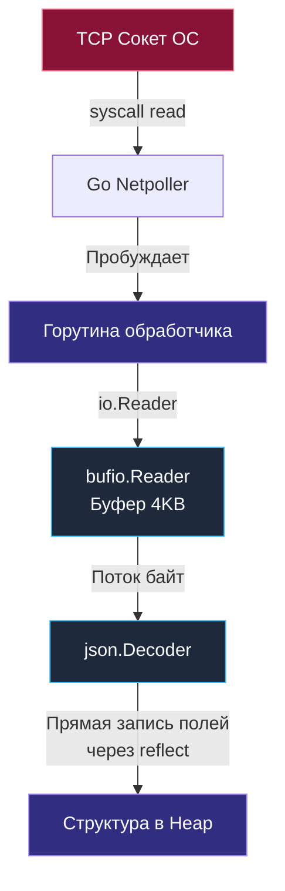

## REST: Развенчание мифов и архитектурные ограничения

В индустрии программного обеспечения редкое понятие подвергалось столь глубокому искажению и опошлению, как REST. Спросите среднестатистического разработчика, что представляет собой REST, и вы почти наверняка услышите: *«Это когда мы получаем сущности методом GET, создаем через POST, а данные пересылаем в формате JSON»*.

Для инженера, привыкшего докапываться до физической сути вещей, подобное определение звучит так же наивно, как сведение всей теории мореплавания к умению завязывать морской узел. 

REST (Representational State Transfer — «передача репрезентативного состояния») — это не протокол, не стандарт RFC и тем более не формат JSON. Это **архитектурный стиль построения распределенных гипермедиа-систем**, сформулированный Роем Филдингом (одним из соавторов протокола HTTP и сервера Apache) в его фундаментальной докторской диссертации 2000 года.

Понимание истинных ограничений REST имеет колоссальное практическое значение: эти архитектурные правила напрямую определяют, как наш Go-бэкенд распределяет память, насколько легко он масштабируется горизонтально, сколько тактов CPU сжигает на сетевых вызовах и как часто рантайм Go вынужден останавливать мир (Stop-The-World) ради сборщика мусора (GC).

Архитектура может считаться истинно RESTful только тогда, когда она неукоснительно соблюдает шесть строгих системных ограничений.

## 6 Ограничений REST

### 1. Client-Server (Разделение клиента и сервера)
Принцип радикального разделения зон ответственности: клиент целиком берет на себя отображение интерфейса, управление состоянием экрана и пользовательский опыт; сервер концентрируется исключительно на валидации бизнес-правил, оркестрации транзакций и хранении данных. Компоненты развиваются и деплоятся абсолютно независимо. Нашему Go-серверу глубоко безразлично, кто именно обращается к сетевому сокету: нативное мобильное приложение на Swift, SPA-клиент на React, IoT-датчик или микросервис на C++. Единственной точкой соприкосновения выступает согласованный сетевой контракт.

### 2. Stateless (Отсутствие состояния)
**Краеугольный камень для построения высоконагруженных и отказоустойчивых распределенных систем.**
Сервер не имеет права сохранять контекст состояния сессии клиента между последовательными сетевыми запросами. Каждый входящий HTTP-запрос обязан содержать абсолютно всю исчерпывающую информацию, необходимую для его авторизации, валидации и выполнения (включая криптографические токены и контекст клиента).

> [!info] Под капотом: Stateless и рантайм Go
> В традиционных веб-фреймворках прошлого (PHP, Ruby on Rails, классические сервлеты Java) нормой считалось хранение сессий на стороне сервера: клиент логинился, сервер создавал в оперативной памяти или локальном файле сессионный объект и возвращал клиенту заголовок Cookie с идентификатором `SessionID`.
> 
> Если бэкенд-инженер попытается повторить этот подход в высоконагруженном сервисе на Go (например, создав глобальную карту вида `map[string]*UserSession`), система неминуемо потерпит крах под нагрузкой:
> 1. **Контеншн и блокировки (Lock Contention):** Так как стандартная карта `map` в Go не является потокобезопасной для конкурентной записи, доступ к ней придется защищать мьютексом `sync.RWMutex`. При нагрузке в десятки тысяч RPS этот мьютекс станет катастрофической точкой синхронизации: тысячи параллельных горутин будут тратить процессорное время на ожидание освобождения блокировки.
> 2. **Деградация Garbage Collector и Tail Latency:** Непрерывно растущая в куче (Heap) глобальная карта сессий удерживает миллионы указателей. Фаза разметки (Mark Phase) сборщика мусора Go обязана регулярно обходить граф всех живых объектов в куче. Чем больше сессий висит в памяти, тем дольше работает GC, вызывая просадки хвостовой задержки (p99 latency) для всех без исключения запросов.
> 3. **Разрушение горизонтального масштабирования:** Серверы теряют взаимозаменяемость. Балансировщику трафика придется реализовывать хрупкий механизм «липких сессий» (Sticky Sessions), привязывающий конкретного пользователя к конкретному физическому серверу. Если этот инстанс упадет — пользовательская сессия сгорит.
> 
> Истинный принцип Stateless решает эти беды: состояние инкапсулируется в криптографически подписанном токене (например, JWT), который клиент прикрепляет к каждому запросу. Go-сервер на лету валидирует сигнатуру, извлекает метаданные пользователя, выполняет бизнес-логику и мгновенно освобождает память. Никаких разделяемых мьютексов и нулевое влияние на фоновый сборщик мусора.

### 3. Cacheability (Кэшируемость)
Протокол требует, чтобы каждый ответ сервера содержал явную декларацию: разрешено ли кэшировать данные, кому именно (клиентскому браузеру или публичным промежуточным прокси-серверам) и на какой именно срок. В протоколе HTTP это достигается заголовками `Cache-Control`, `ETag`, `Last-Modified`. Подробно физику кэширования мы разберем в статье [[12. Caching HTTP.md]]. Если аналитический отчет требует 3 секунд вычислений в СУБД, но его данные актуальны в течение 10 минут, архитектура REST обязывает выставить кэширующие заголовки, снимая львиную долю нагрузки с CPU наших Go-сервисов.

### 4. Uniform Interface (Единообразный интерфейс)
Фундаментальное свойство, обеспечивающее простоту интеграции. Единый интерфейс REST базируется на четырех канонических правилах:
* **Идентификация ресурсов (Identification of resources):** Любая доменная сущность однозначно адресуется через устойчивый глобальный идентификатор URI (например, `/users/123`).
* **Манипуляция ресурсами через представления (Manipulation through representations):** Клиент взаимодействует не с сырыми таблицами базы данных, а с отчуждаемым представлением ресурса (обычно сериализованным в JSON или XML).
* **Самоописываемые сообщения (Self-descriptive messages):** Каждое сообщение содержит метаинформацию о способе своей интерпретации. Заголовок `Content-Type: application/json` прямо инструктирует сетевой стек о том, какой десериализатор должен быть применен к телу запроса.
* **HATEOAS (Hypermedia as the Engine of Application State):** Ответ сервера содержит ссылки на допустимые последующие действия над ресурсом, позволяя клиенту динамически исследовать API без жестко зашитых URL в коде.

### 5. Layered System (Многоуровневая система)
Архитектура строится в виде иерархических слоев. Клиент не имеет права знать (и не должен заботиться о том), общается ли он с целевым процессом Go напрямую, либо запрос преодолевает цепочку посредников: защитный экран WAF, балансировщик нагрузки (HAProxy), кэширующий Nginx или специализированный шлюз [[25. API Gateway.md]]. Каждый промежуточный слой выполняет свою задачу (терминация TLS, rate limiting, кэширование), оставаясь абсолютно прозрачным для прикладного контракта.

### 6. Code on Demand (Код по требованию — опционально)
Сервер может временно расширять функциональность клиента, передавая ему исполняемый машинный код или скрипты (например, JavaScript-код для браузера или скомпилированные модули WebAssembly). В микросервисной архитектуре бэкенда это ограничение практически всегда игнорируется.

## REST и Go: Симфония IO и Аллокаций

В парадигме REST сервер непрерывно принимает клиентские представления и генерирует исходящие ответы. В среде Go стандартный пакет `net/http` спроектирован вокруг высокоэффективного потокового ввода-вывода (Streaming I/O).

Инженерная зрелость бэкендера проявляется в том, как именно он организует чтение входящих тел запросов:

```go
package main

import (
    "encoding/json"
    "net/http"
)

type UserCreateDTO struct {
    Email string `json:"email"`
    Name  string `json:"name"`
}

func createUserHandler(w http.ResponseWriter, r *http.Request) {
    var user UserCreateDTO
    
    // АНТИПАТТЕРН: Предварительное вычитывание всего тела в монолитный слайс памяти
    // body, err := io.ReadAll(r.Body) 
    // json.Unmarshal(body, &user)
    
    // ИДИОМАТИЧНЫЙ ПОДХОД: Потоковая десериализация "на лету"
    decoder := json.NewDecoder(r.Body)
    if err := decoder.Decode(&user); err != nil {
        http.Error(w, err.Error(), http.StatusBadRequest)
        return
    }
    
    // ... исполнение бизнес-логики ...
    w.WriteHeader(http.StatusCreated)
}
```

> [!warning] Ловушка / Gotcha: Аллокации при чтении Body
> В REST API мы ежесекундно обрабатываем потоки входящих JSON-документов.
> Если разработчик по привычке вызывает `io.ReadAll(r.Body)` перед вызовом `json.Unmarshal`, рантайм Go вынужден выделить в куче (Heap) непрерывный байтовый массив (`[]byte`), точно равный полному размеру входящего тела запроса. Если злоумышленник или сбойный клиент отправит полезную нагрузку размером 50 МБ, прикладная горутина немедленно аллоцирует 50 МБ в куче.
> 
> Идиоматичный вызов `json.NewDecoder(r.Body).Decode(&obj)` функционирует принципиально иначе: поле `r.Body` удовлетворяет интерфейсу `io.Reader`. Декодер считывает байты из сокета небольшими порциями (через системные буферы ОС и промежуточный буфер `bufio.Reader` размером 4 КБ), заполняя поля структуры прямо по мере поступления данных. Это драматически снижает пиковый объем выделяемой памяти и оптимизирует работу Escape Analysis.



## Уровни зрелости REST (Richardson Maturity Model)

Для классификации реальных веб-сервисов по степени их соответствия принципам REST архитектор Леонард Ричардсон предложил четырехступенчатую шкалу зрелости:

> [!tip] Собеседование
> **Вопрос:** Чем просто HTTP API отличается от настоящего RESTful API? На каком уровне зрелости находится большинство реальных микросервисов?
> **Ответ:** Архитектурную зрелость сервиса оценивают по модели Ричардсона (Richardson Maturity Model):
> * **Level 0 (Swamp of POX):** Единственная точка входа (например, `/api`), протокол сводится к слепой отправке POST-запросов с XML или JSON-конвертами. Имя вызываемой операции и параметры зашиты внутрь тела (по этой схеме строились SOAP и ранние RPC-системы).
> * **Level 1 (Resources):** Появление дискретных URI для отдельных сущностей (`/users/1`, `/orders/42`), однако взаимодействие по-прежнему строится на произвольных глаголах или однотипных методах POST/GET.
> * **Level 2 (HTTP Verbs & Statuses):** Полноценное задействование семантики протокола HTTP. Использование канонических глаголов (GET для безопасного чтения, POST для создания, PUT/PATCH для обновления, DELETE для удаления) и точных статус-кодов (200 OK, 201 Created, 404 Not Found, 409 Conflict).
> * **Level 3 (HATEOAS):** Ответы сервера содержат гипермедиа-ссылки на смежные доступные действия, превращая API в самодокументируемый автомат состояний.
> 
> Подавляющее большинство (более 95%) так называемых «REST API» в реальной индустрии останавливаются на **Level 2**. Практика показала, что внедрение HATEOAS (Level 3) в мобильных и микросервисных архитектурах неоправданно усложняет парсинг и резко увеличивает объем передаваемого JSON-трафика.

## Итог

1. **REST** — это строгий архитектурный стиль, нацеленный на масштабируемость и долговечность распределенных веб-систем, а не синоним передачи JSON по HTTP.
2. Принцип **Stateless** — главный союзник бэкенд-инженера: он исключает разделяемые мьютексы синхронизации сессий (`sync.RWMutex`), минимизирует задержки Garbage Collector и обеспечивает мгновенное горизонтальное масштабирование сервисов на Go.
3. В обработчиках Go отдавайте предпочтение потоковому разбору через `json.NewDecoder(r.Body)` вместо прожорливого `io.ReadAll(r.Body)`, берегущего оперативную память при обработке крупных полезных нагрузок.
4. Осознавайте компромиссы: большинство коммерческих сервисов соответствуют уровню зрелости Level 2 модели Ричардсона, что является взвешенным инженерным стандартом.

Краеугольным понятием REST выступает «Ресурс». О том, как декомпозировать предметную область на ресурсы, правильно формировать иерархию URL и избегать типичных архитектурных ошибок, мы поговорим в следующей статье: [[4. Resource oriented design.md]].
