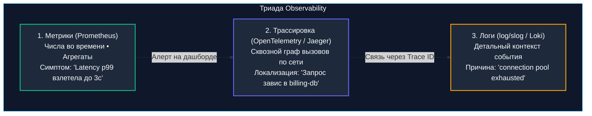
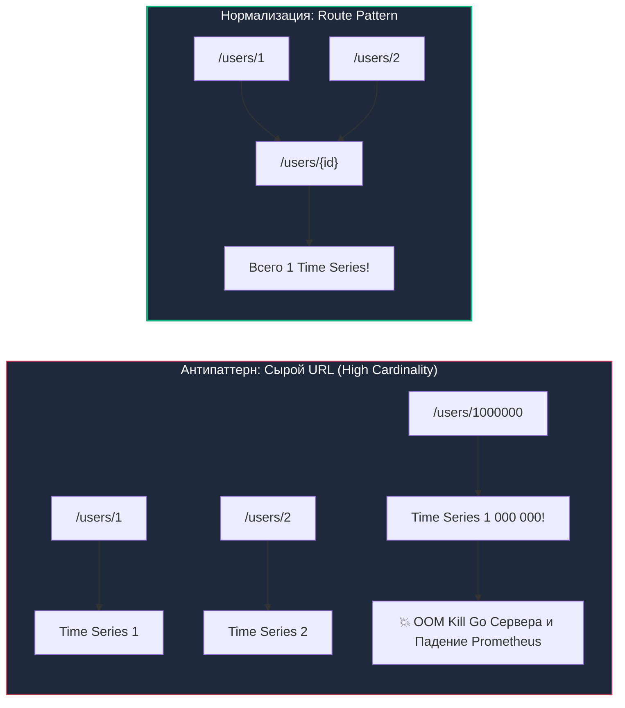
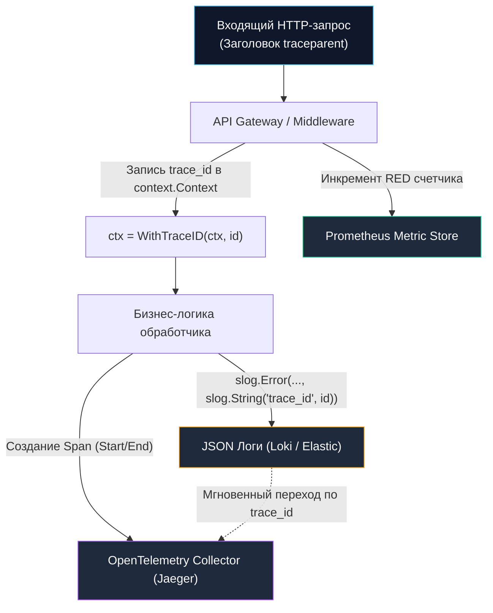

# Observability в сетевом API на Go: Логи, метрики RED и стандарт OpenTelemetry

> *«Отладка кода вдвое сложнее его написания. Поэтому, если вы пишете код максимально заумно, вы по определению недостаточно умны, чтобы его отладить».*    
> — Брайан Керниган

Когда вы разрабатываете монолитную утилиту на локальной машине, арсенал отладки предельно прост: достаточно вызвать `fmt.Println()` или запустить `log.Printf()`. Если алгоритм сбоит, вы открываете терминал (STDOUT) и беглым взглядом находите строчку ошибки.

Однако в распределенной микросервисной среде с балансировщиками нагрузки, пограничными [[25. API Gateway.md|API-шлюзами]], брокерами сообщений и динамическими подами (Pods) в Kubernetes этот подход терпит крах. Когда клиент из другой страны жалуется в поддержку: *«Нажатие кнопки оплаты выдает ошибку»*, а 50 реплик ваших сервисов синхронно выплевывают 10 гигабайт неструктурированного текста в минуту, попытка локализовать причину сбоя через консольный `grep` превращается в безнадежный поиск иголки в пылающем стоге сена.

**Observability (Наблюдаемость)** — это фундаментальное свойство системы, определяющее, насколько точно вы можете восстановить внутреннее скрытое состояние сервисов, анализируя исключительно их внешние выходные артефакты. Это не просто установка панели в Grafana, а инженерная культура проектирования кода.

---

## 1. Управление вслепую: Почему логов недостаточно

Представьте монитор жизненных показателей в отделении интенсивной терапии. Врачу недостаточно раз в смену читать текстовую запись в журнале: *«Пациент пожаловался на боль»*. 

В реанимации используется триада приборов:
1. **Метрики (Metrics) — *«Что-то сломалось?»*:** Кардиомонитор непрерывно фиксирует пульс, артериальное давление и сатурацию кислорода. Если пульс падает ниже 40 — сирена тревоги звенит мгновенно, до того как пациент потеряет сознание.
2. **Трассировка (Tracing) — *«Где именно сломалось?»*:** Введение контрастного вещества в кровеносную систему показывает точный путь крови через клапаны сердца, мозг и почки, мгновенно подсвечивая место закупорки сосуда.
3. **Логи (Logs) — *«Почему это произошло?»*:** Запись хирурга с точным описанием конкретного надреза и параметров ткани в операционной палате.



---

## 2. Логирование: Переход к структурированным данным (Structured Logs)

Исторически программы на Go писали лог как сырую неструктурированную строку:
```text
2023-10-25 15:00:00 ERROR: user 123 failed to pay order 456 because of timeout
```

Парсить миллионы таких строк регулярными выражениями в ElasticSearch или Loki — архитектурная катастрофа. Стоит разработчику в следующем коммите заменить слово `timeout` на `deadline exceeded`, как все настроенные алерты и аналитические дашборды компании рухнут.

Идиоматичный подход Senior-инженера — **Структурированное логирование (Structured Logging)**. Лог обязан быть машиночитаемым JSON-документом, в котором служебные бизнес-атрибуты строго отделены от текста сообщения.

### Go 1.21+ и пакет `log/slog`

Долгое время стандартом высокой производительности в Go оставались сторонние библиотеки `uber-go/zap` и `rs/zerolog`. Начиная с **Go 1.21**, экосистема получила нативное решение промышленного уровня прямо в стандартной библиотеке — пакет `log/slog`.

```go
package main

import (
	"log/slog"
	"os"
)

func main() {
	// Настраиваем структурированный вывод в формате JSON в STDOUT
	logger := slog.New(slog.NewJSONHandler(os.Stdout, &slog.HandlerOptions{
		Level: slog.LevelInfo,
	}))
	slog.SetDefault(logger)

	// Идиоматичная запись ошибки в slog
	slog.Error("payment processing failed",
		slog.String("user_id", "user-123"),
		slog.Int("order_id", 456),
		slog.String("reason", "timeout"),
	)
}
```

В потоке вывода это формирует безупречный компактный JSON:
```json
{"time":"2026-09-14T07:45:00Z","level":"ERROR","msg":"payment processing failed","user_id":"user-123","order_id":456,"reason":"timeout"}
```

> [!info] Под капотом: Аллокации в slog (Mechanical Sympathy)
> Почему типизированные конструкторы `slog.String("key", "value")` и `slog.Int("order_id", 456)` кардинально превосходят наивную передачу мапы `map[string]interface{}`?  
> Пакет `slog` спроектирован с учетом механического сочувствия к рантайму Go. Структура `slog.Attr` представляет собой tagged union без динамического выделения памяти. Она хранит базовые скалярные значения напрямую внутри себя, полностью избегая упаковки (boxing) в интерфейс `interface{}`.  
> Это предотвращает утечку переменных в кучу (**Escape Analysis**) и спасает Garbage Collector от лишней работы. В критических путях обработки (10 000 RPS) логирование с нулевыми аллокациями гарантирует стабильный p99 отклик без микропауз GC.

> [!warning] Ловушка / Gotcha: Утечка PII и токенов в логи
> Самая грубая уязвимость при логировании — неконтролируемая запись персональных данных (**PII — Personally Identifiable Information**) и учетных секретов.  
> Если разработчик в порыве отладки напишет `slog.Any("request", req.Header)`, в централизованное хранилище логов неизбежно улетит заголовок `Authorization: Bearer <JWT>`. Любой стажер или сторонний сотрудник с доступом к Kibana/Loki сможет скопировать этот токен и выполнить действия от лица пользователя.  
> **Правило:** Всегда маскируйте (obfuscate) пароли, токены авторизации, CVV-коды и номера кредитных карт до момента передачи в логгер.

---

## 3. Метрики: Метод RED и Prometheus

Хранение логов стоит дорого. Сохранять лог-запись на каждый из каждого успешного `200 OK` запроса (или 100 000 RPS) невозможно — терабайты дисков переполнятся за считанные часы.

Для непрерывной оценки здоровья и пропускной способности системы используются **Метрики (Metrics)**.  
Индустриальным стандартом в Kubernetes и облачных средах является **Prometheus**. Он работает по **Pull-модели**: Go-сервис хранит в оперативной памяти легковесные атомарные счетчики, а агент Prometheus раз в 15 секунд опрашивает HTTP-эндпоинт `/metrics`, мгновенно скрапя текущие значения.

Для сетевых HTTP/gRPC API сбор метрик обязан следовать классической методологии **RED** (разработанной Томом Уилки):
1. **Rate (Частота):** Количество запросов в секунду (RPS).
2. **Errors (Ошибки):** Количество запросов, завершившихся неудачей (HTTP-статусы 5xx, см. [[6. Статусы HTTP.md]]).
3. **Duration (Длительность):** Время обработки запросов (гистограмма задержек, расчет перцентилей p50, p95, p99).

---

## 4. Идиоматичный Prometheus Middleware

Для сбора RED-метрик мы оборачиваем стандартный роутер Go в прозрачный Middleware с использованием официального пакета `client_golang`:

```go
package observability

import (
	"net/http"
	"strconv"
	"time"

	"github.com/prometheus/client_golang/prometheus"
	"github.com/prometheus/client_golang/prometheus/promauto"
)

var (
	httpRequestsTotal = promauto.NewCounterVec(
		prometheus.CounterOpts{
			Name: "http_requests_total",
			Help: "Общее количество входящих HTTP-запросов",
		},
		[]string{"method", "path", "status"}, // Labels (Ярлыки)
	)

	httpRequestDuration = promauto.NewHistogramVec(
		prometheus.HistogramOpts{
			Name:    "http_request_duration_seconds",
			Help:    "Гистограмма времени выполнения запросов в секундах",
			Buckets: prometheus.DefBuckets, // Дефолтные корзины задержек
		},
		[]string{"method", "path"},
	)
)

// statusResponseWriter перехватывает HTTP-статус ответа
type statusResponseWriter struct {
	http.ResponseWriter
	statusCode int
}

func (rw *statusResponseWriter) WriteHeader(code int) {
	rw.statusCode = code
	rw.ResponseWriter.WriteHeader(code)
}

// MetricsMiddleware собирает RED метрики на каждом HTTP вызове
func MetricsMiddleware(next http.Handler) http.Handler {
	return http.HandlerFunc(func(w http.ResponseWriter, r *http.Request) {
		start := time.Now()

		rw := &statusResponseWriter{ResponseWriter: w, statusCode: http.StatusOK}
		next.ServeHTTP(rw, r)

		duration := time.Since(start).Seconds()
		statusStr := strconv.Itoa(rw.statusCode)

		// Идиоматичный Go 1.22: r.Pattern возвращает нормализованный роут (/users/{id})!
		routePattern := r.Pattern
		if routePattern == "" {
			routePattern = "unmatched"
		}

		// Атомарный инкремент счетчиков Prometheus (наносекундная операция)
		httpRequestsTotal.WithLabelValues(r.Method, routePattern, statusStr).Inc()
		httpRequestDuration.WithLabelValues(r.Method, routePattern).Observe(duration)
	})
}
```

---

## 5. Ловушка кардинальности: High Cardinality Catastrophe

Взгляните на аргумент `path` в вызове `WithLabelValues`. Что произойдет, если передать туда сырой `r.URL.Path` из запроса в стиле [[4. Resource oriented design.md]], например `/users/123`, `/users/456`?



> [!warning] Ловушка / Gotcha: Взрыв кардинальности (High Cardinality)
> Prometheus создает отдельный изолированный временной ряд (**Time Series**) для **каждой уникальной комбинации значений ярлыков (Labels)**.  
> Если в базе 1 миллион пользователей, и каждый делает запрос к своему профилю, библиотека `client_golang` создаст в оперативной памяти Go-сервиса **1 000 000 независимых структур счетчиков**.  
> **Катастрофа:** Память процесса мгновенно утечет в OOM (Out Of Memory), а сервер Prometheus захлебнется при попытке распарсить гигабайтный вывод эндпоинта `/metrics`.  
> **Решение:** В метрики категорически запрещено передавать динамические параметры (User ID, Order ID, UUID, сырые URL). Передавать разрешено строго **шаблон маршрута (Route Pattern)**! Начиная с Go 1.22, стандартный `http.ServeMux` предоставляет шаблон роута через поле `r.Pattern` (например, `/users/{id}`).

---

## 6. Observability как единое целое (OpenTelemetry)

Метрики показывают, что эндпоинт `/orders` стал отвечать за 5 секунд вместо 100 миллисекунд (Duration выросла). Логи показывают ошибку `timeout in DB`.  
Но как связать конкретную строчку в логах с конкретной аномальной точкой на графике задержек?

Эту проблему решает сквозной идентификатор **Trace ID**.

В современной индустрии разрозненные логи, метрики и трейсы объединяются под зонтичным стандартом **OpenTelemetry (OTel)** (спецификация W3C Trace Context).  
Когда внешний запрос поступает на пограничный шлюз ([[25. API Gateway.md]]), шлюз генерирует глобально уникальный `Trace ID` (например, `5b8aa5a2d2c872e8321cf373fac1e818`) и передает его во внутреннюю сеть через стандартизированный заголовок `traceparent`:
```http
traceparent: 00-5b8aa5a2d2c872e8321cf373fac1e818-00f067aa0ba902b7-01
```

Ваш Go-бэкенд извлекает `Trace ID`, помещает его в контекст запроса и **обязан обогатить им каждую запись структурированного лога**:



> [!tip] Собеседование: Проброс логгера через Context vs DI
> **Вопрос:** Как идиоматично передавать `slog.Logger` в глубокие слои архитектуры (Use Cases, Repositories): через поля структуры (Dependency Injection) или через `context.Context`?
> 
> **Ответ:**  
> В сообществе Go существует два устоявшихся подхода:
> 1. **Строгий подход (Explicit DI):** Логгер инжектится как зависимость структуры при инициализации сервиса. Внутри методов `Trace ID` динамически извлекается из `ctx` перед логированием: `logger.InfoContext(ctx, "processing order", slog.String("trace_id", traceID))`. Это сохраняет чистоту слоев: контекст используется строго для дедлайнов и отмен, а не как универсальная помойка для сервисных объектов.
> 2. **Контекстный подход (Logger in Context):** Middleware создает дочерний логгер с уже «вшитыми» полями `trace_id`, `user_id` и помещает экземпляр `*slog.Logger` в `r.Context()`. Использование выглядит как `log := GetLogger(ctx); log.Info(...)`. Это снижает бойлерплейт, но размывает граф зависимостей.
> 
> На позиции Senior предпочтителен **первый вариант с использованием метода `InfoContext / ErrorContext`**: он обеспечивает полную типобезопасность и чистоту архитектуры (Idiomatic Go).

---

## 7. Итог

1. **Observability** — фундаментальное свойство системы, позволяющее восстановить внутреннее состояние по ее внешним артефактам без деплоя отладочных принтов.
2. Используйте **структурированное логирование (JSON)** через стандартный пакет **`log/slog`** (Go 1.21+). Типизированные атрибуты `slog.Attr` сводят к нулю аллокации в куче, защищая Garbage Collector.
3. Никогда не логируйте чувствительные данные (пароли, JWT, PII).
4. Собирайте **RED-метрики** (Rate, Errors, Duration) через Prometheus и категорически защищайтесь от **катастрофы High Cardinality**, подставляя в лейблы нормализованные Route Patterns (`r.Pattern`), а не сырые URL с динамическими ID.
5. Связывайте метрики, логи и распределенные спаны сквозным идентификатором **Trace ID** по стандарту W3C Trace Context.

Упомянув `Trace ID`, мы лишь слегка прикоснулись к сложнейшей механике распределенной диагностики. Как наглядно увидеть, сколько времени один клиентский вызов провел в очереди Kafka, сколько в PostgreSQL, а сколько на вычислениях в Go? Как сквозные спаны передаются сквозь границы десятков микросервисов? Эту захватывающую тему мы детально разберем в следующей статье: [[32. Tracing запросов.md]].
