# Распределенная трассировка в Go: Анатомия задержек и OpenTelemetry

> *«Самым эффективным средством отладки остаётся ясный разум вкупе с точечными операторами печати — или, в современных распределенных системах, выверенными трассировочными спанами».*    
> — Переосмысление закона отладки Брайана Кернигана

В предыдущей статье [[31. API observability.md]] мы познакомились с триадой наблюдаемости и объединили системные логи и метрики сквозным идентификатором `Trace ID`. Теперь, когда клиент сталкивается с ошибкой, мы можем мгновенно найти строчку сбоя в хранилище логов.

Но что делать, если **ошибки в логах нет вовсе**?  
Логи девственно чисты, метрики возвращают благополучный статус `200 OK`, но пользователь ждет загрузки экрана не положенные 100 миллисекунд, а мучительные 5 секунд!  
Где именно запрос провел эти 5000 миллисекунд?
* Завис в очереди ожидания свободного коннекта в пуле соединений PostgreSQL?
* Ждал сетевого ответа от стороннего шлюза платежей (например, Stripe)?
* Медленно десериализовал гигантский массив JSON из Redis?
* Или попал на паузу Stop-the-World сборщика мусора в соседнем микросервисе?

В классическом монолите на одном сервере программист запускает встроенный профилировщик (`pprof`) и исследует флеймграф работы процессора. В распределенной микросервисной среде отдельный клиентский запрос за доли секунды совершает десятки сетевых прыжков сквозь балансировщики, gRPC-микросервисы, очереди сообщений и базы данных.

Для точной визуализации этого пути и локализации задержек используется **Распределенная трассировка (Distributed Tracing)**.

---

## 1. Анатомия задержек: Поиск узких мест в распределенной системе

Метафора распределенной трассировки напоминает международный трек-номер почтовой посылки со штрихкодом.

Если посылка из Сиэтла в Токио задерживается на две недели, покупателю бесполезно звонить на центральную почту. Но вбив трек-номер (**Trace ID**) на сайте логистической компании, он видит исчерпывающее дерево этапов:
- Приемка на складе (Спан 1: 1 час).
- Таможенное оформление (Спан 2: 72 часа — **вот оно, узкое место!**).
- Авиарейс через океан (Спан 3: 11 часов).
- Курьерская доставка до двери (Спан 4: 2 часа).

Трассировка разбивает скрытую временную шкалу распределенного запроса на осязаемые кванты работы.

---

## 2. Анатомия трассы: Дерево времени

Трассировка оперирует тремя фундаментальными сущностями, стандартизированными спецификацией **OpenTelemetry (OTel)**:

1. **Trace (Трасса):** Полный жизненный цикл сквозной транзакции от первичного клика в браузере или мобильном приложении до финального коммита в базе данных. Трасса идентифицируется глобально уникальным 128-битным шестнадцатеричным числом — `Trace ID`.
2. **Span (Спан / Отрезок работы):** Базовая атомарная единица полезного действия внутри трассы. Например: *«Обработка HTTP-запроса на шлюзе»*, *«SQL-запрос к таблице users»* или *«gRPC-вызов сервиса списания средств»*. Спан содержит имя операции, точное время начала и завершения, статус выполнения и метаданные (атрибуты: `http.status_code`, `db.statement`).
3. **Span Context:** Криптографический паспорт спана, обеспечивающий иерархию. Каждый дочерний Спан хранит идентификатор своего родителя (`Parent Span ID`). Благодаря этому агрегаторы трейсов (Jaeger, Grafana Tempo) выстраивают из разрозненных сетевых отрезков стройное каскадное дерево задержек (Водопад вызовов / Waterfall).

```mermaid
gantt
    title Визуализация Трассы в Jaeger (Trace ID: 5b8aa5a2...)
    dateFormat  s
    axisFormat  %S.%L
    
    section API Gateway
    POST /checkout (Root Span)       :a1, 0, 1.0s
    
    section Go Order Service
    HTTP Handler                     :a2, 0.1, 0.9s
    gRPC Call to Billing             :a3, 0.2, 0.4s
    Publish to Kafka                 :a4, 0.7, 0.2s
    
    section Go Billing Service
    gRPC Handler                     :a5, 0.25, 0.3s
    UPDATE pg_accounts (Slow Query!) :crit, a6, 0.3, 0.2s
```

---

## 3. Идиоматичный Go: Контекст как кровеносная система

В языке Go реализация распределенной трассировки невозможна без жесткой архитектурной дисциплины: **каждая функция ввода-вывода обязана первым аргументом принимать `ctx context.Context`**. Именно через цепочку контекстов библиотека OpenTelemetry невидимо передает активный Спан сквозь слои приложения.

> [!info] Под капотом: Mechanical Sympathy и цена Спана
> В отличие от легковесного логирования, порождение Спана — ресурсоемкая операция:
> 1. При вызове `tracer.Start()` (`tracer.Start(ctx, ...)`) рантайм Go обращается к быстрому механизму ядра Linux **vDSO** для снятия монотонного системного времени `time.Now()`.
> 2. В куче (`Heap`) аллоцируется структура `Span` с динамическими срезами атрибутов.
> 3. При вызове `span.End()` замеряется финальное время, вычисляется длительность, и спан помещается в кольцевой буфер в памяти.
> 4. Фоновая горутина сериализует пачку спанов в компактный бинарный Protobuf и отправляет по gRPC-каналу локальному агенту OTel Collector.
> 
> **Инженерный вывод:** Никогда не создавайте спаны внутри горячих вычислительных циклов по 10 000 итераций! Это сожжет драгоценные такты CPU и завалит Garbage Collector мусором. Спанами оборачиваются исключительно границы I/O-операций (сеть, диск, базы данных) или тяжелые криптографические и расчетные блоки.

### Пример интеграции OpenTelemetry в бизнес-логику:

```go
package payment

import (
	"context"
	"fmt"

	"go.opentelemetry.io/otel"
	"go.opentelemetry.io/otel/attribute"
	"go.opentelemetry.io/otel/codes"
	"go.opentelemetry.io/otel/trace"
)

// Инициализация именованного трейсера пакета
var tracer = otel.Tracer("order-service/billing")

// ProcessPayment выполняет транзакцию с трассировкой
func ProcessPayment(ctx context.Context, orderID string, amount float64) error {
	// 1. Создаем дочерний Спан от переданного контекста
	ctx, span := tracer.Start(ctx, "ProcessPayment", trace.WithAttributes(
		attribute.String("order.id", orderID),
		attribute.Float64("order.amount", amount),
	))
	// 2. Гарантируем обязательную фиксацию span.End() при выходе из функции
	defer span.End()

	// 3. Вызываем репозиторий, ОБЯЗАТЕЛЬНО прокидывая обогащенный ctx дальше
	err := dbCharge(ctx, orderID, amount)
	if err != nil {
		// 4. Логируем ошибку и меняем статус Спана для подсветки красным в Jaeger
		span.RecordError(err)
		span.SetStatus(codes.Error, "failed to charge database")
		return fmt.Errorf("billing error: %w", err)
	}

	span.SetStatus(codes.Ok, "payment processed successfully")
	return nil
}

func dbCharge(ctx context.Context, orderID string, amount float64) error {
	// В реальном коде здесь SQL запрос, где pgx автоматически создаст дочерний спан
	return nil
}
```

---

## 4. Границы сети: W3C Trace Context

Как Спан сервиса `Billing Service` понимает, что он является дочерним элементом Спана из `Order Service`, если они физически исполняются на разных физических серверах в разных стойках дата-центра?

Передача метаданных контекста сквозь сетевые протоколы называется **Context Propagation**. Исторически в индустрии существовал зоопарк несовместимых проприетарных заголовков (`B3 Headers` от Zipkin, `Jaeger Headers`). Сегодня абсолютным стандартом стал открытый протокол **W3C Trace Context**.

Когда исходящий сетевой клиент (HTTP или gRPC) отправляет запрос, библиотека OpenTelemetry внедряет в сетевые заголовки стандартизированную строку `traceparent`:

```http
traceparent: 00-4bf92f3577b34da6a3ce929d0e0e4736-00f067aa0ba902b7-01
```



```mermaid
flowchart LR
    subgraph S1 ["Сервис А (Order Service)"]
        direction TB
        SpanA["Span A (Parent)<br>Span ID: 00f067aa0ba902b7"]
    end

    subgraph Wire ["Сетевой вызов HTTP / gRPC"]
        TP["Заголовок traceparent:<br>00-4bf92f35...-00f067aa...-01"]
    end

    subgraph S2 ["Сервис Б (Billing Service)"]
        direction TB
        SpanB["Span B (Child)<br>Parent Span ID: 00f067aa0ba902b7<br>New Span ID: 99a1b2c3d4e5f600"]
    end

    SpanA -->|"Inject"| TP
    TP -->|"Extract"| SpanB

    style S1 fill:#1e293b,stroke:#38bdf8,stroke-width:1px
    style S2 fill:#1e293b,stroke:#10b981,stroke-width:1px
    style Wire fill:#0f172a,stroke:#f59e0b,stroke-width:2px
```

### Анатомия заголовка `traceparent`:
* `00` — Версия спецификации W3C.
* `4bf92f3577b34da6a3ce929d0e0e4736` — **Trace ID** (16 байт, неизменен на всем пути запроса).
* `00f067aa0ba902b7` — **Span ID** (8 байт, идентификатор конкретного вызывающего узла).
* `01` — **Trace Flags** (младший бит указывает флаг сэмплирования: сохранять ли эту трассу).

Принимающий Go-сервер через Middleware извлекает заголовок, создает из него базовый `SpanContext` и связывает свои локальные спаны с распределенным деревом.

> [!warning] Ловушка / Gotcha: Разрыв трассировки при запуске фоновых горутин
> Распространенная ошибка разработчиков на Go — запуск асинхронной горутины с передачей сырого `r.Context()`:
> ```go
> go func(ctx context.Context) {
>     db.Save(ctx, data) // ОШИБКА: Контекст будет отменен при завершении HTTP-запроса!
> }(r.Context())
> ```
> Как только HTTP-обработчик завершает ответ, рантайм Go немедленно отменяет `r.Context()`, и фоновый запрос к БД завершается ошибкой `context canceled`.  
> Если же разработчик наивно заменит его на `context.Background()`, он **безвозвратно потеряет Trace ID и разорвет цепь трассировки**.  
> 
> **Идиоматичное решение в Go 1.21+:**  
> Использовать стандартную функцию `context.WithoutCancel(r.Context())`, либо вручную переносить спан-контекст:
> ```go
> // Сохраняет Trace ID и Span Context, но отвязывает таймауты и отмену родителя
> asyncCtx := trace.ContextWithSpanContext(context.Background(), trace.SpanContextFromContext(r.Context()))
> go func(ctx context.Context) {
>     db.Save(ctx, data)
> }(asyncCtx)
> ```

---

## 5. Проблема масштаба: Сэмплирование (Sampling)

Если ваш кластер обслуживает 5000 RPS (или 100 000 RPS), сохранение 100% спанов приведет к системной катастрофе:
1. Сеть дата-центра забьется терабайтами служебного телеметрического трафика.
2. Сервер трассировки (Jaeger, Zipkin) упадет от переполнения дисковой подсистемы.
3. Стоимость облачного хранения (Datadog) превысит бюджет всей разработки.

Выход один — **Сэмплирование (Sampling)**, то есть сохранение лишь репрезентативной выборки трасс.

> [!tip] Собеседование: Head-based vs Tail-based Sampling
> **Вопрос:** В чем фундаментальная разница между стратегиями Head-based и Tail-based сэмплирования? Каковы их плюсы и минусы?
> 
> **Ответ:**  
> * **Head-based sampling (Сэмплирование в начале пути):** Решение о сохранении трассы принимается в момент поступления запроса на самый первый входной узел (API Gateway или Ingress). Например, генератор случайных чисел решает сохранять ровно 1% запросов. Флаг сэмплирования (`01` или `00`) зашивается в заголовок `traceparent`, и все нижестоящие микросервисы послушно сохраняют или отбрасывают спаны.  
>   * *Плюс:* Минимальная нагрузка на сеть и процессор.  
>   * *Минус:* Если редкий сбой или аномальная задержка в 10 секунд происходит у 0.01% клиентов, Head-based с вероятностью 99% выбросит этот запрос, и вы никогда не увидите причину бага!
> * **Tail-based sampling (Сэмплирование в конце пути):** Все микросервисы кластера транслируют 100% спанов на локальный OTel Collector. Коллектор удерживает спаны во временном скользящем буфере оперативной памяти до завершения всей цепочки вызовов. Если в трассе обнаружена ошибка (HTTP 500) или суммарная длительность превысила порог (Duration > 2s) — коллектор персистирует трассу в БД. Если запрос отработал штатно за 10 мс — он просто удаляется из памяти.  
>   * *Плюс:* 100% гарантия фиксации всех инцидентов, ошибок и аномалий.  
>   * *Минус:* Требует серьезных объемов оперативной памяти (RAM) и процессорных мощностей для промежуточных коллекторов.

---

## 6. Архитектура: OTel Collector

В промышленной архитектуре Go-приложения **никогда не отправляют спаны напрямую в центральное хранилище** (Jaeger, Tempo, Datadog). 

На каждой ноде кластера Kubernetes в виде **DaemonSet** развертывается легковесный локальный агент — **OpenTelemetry Collector**:

```mermaid
flowchart TD
    subgraph Node ["Kubernetes Node (Physical Host)"]
        direction TB
        App1["Go Pod 1"] -->|"Local gRPC (loopback:4317)<br>Занимает <0.1 мс"| Agent["OTel Collector (DaemonSet)"]
        App2["Go Pod 2"] -->|"Local gRPC"| Agent
        
        Agent -->|"Буферизация, Tail Sampling,<br>Маскирование PII, Сжатие"| MemoryBuffer[("Memory Buffer")]
    end

    MemoryBuffer ==>|"Асинхронные батчи по сети"| Storage["Центральное хранилище<br>(Jaeger / Tempo / ClickHouse)"]

    style Node fill:#1e293b,stroke:#38bdf8,stroke-width:1px
    style Agent fill:#1e293b,stroke:#10b981,stroke-width:2px
    style Storage fill:#0f172a,stroke:#a855f7,stroke-width:2px
```



### Преимущества выноса в OTel Collector:
1. **Изоляция сбоев:** Если хранилище Jaeger временно недоступно, Go-сервисы не страдают и не копят спаны в своем Heap, избегая OOM.
2. **Фильтрация PII:** Коллектор на лету вырезает пароли и номера кредитных карт из спанов до их отправки во внешнее облако.
3. **Пакетная передача:** Спаны сжимаются и отправляются крупными оптимизированными пакетами, разгружая сетевой стек ядра Linux.

---

## 7. Итог

1. **Распределенная трассировка** визуализирует дерево времени (Waterfall) сетевого запроса, делая скрытые задержки (Slow Queries, очереди, десериализацию) очевидными.
2. В языке Go передача спанов опирается на сквозную передачу **`context.Context`**. Без передачи контекста в каждый I/O вызов трассировка разваливается.
3. Межсервисная передача трассировочных метаданных стандартизирована протоколом **W3C Trace Context** через заголовок **`traceparent`**.
4. При запуске асинхронных фоновых задач используйте `trace.ContextWithSpanContext` (или `context.WithoutCancel`), чтобы сохранить `Trace ID` и не допустить аварийного прерывания по отмененному контексту запроса.
5. Для снижения нагрузки под 5000+ RPS используйте стратегии сэмплирования (**Head-based** для экономии, **Tail-based** для гарантированного отлова ошибок) и отправляйте спаны через локальный **OpenTelemetry Collector**.

Теперь наш сетевой API защищен, наблюдаем и прозрачен для отладки. Но как быть уверенными, что при следующем релизе мы случайно не нарушим контракт между микросервисами, сломав интеграцию фронтенда или мобильного приложения? О том, как автоматизировать тестирование контрактов без поднятия тяжелых тестовых стендов (Contract Testing и инструмент Pact), мы поговорим в следующей статье: [[33. API testing.md]].
