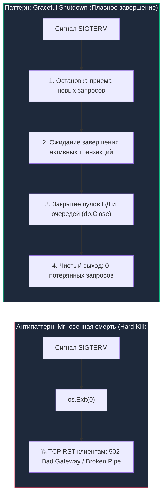
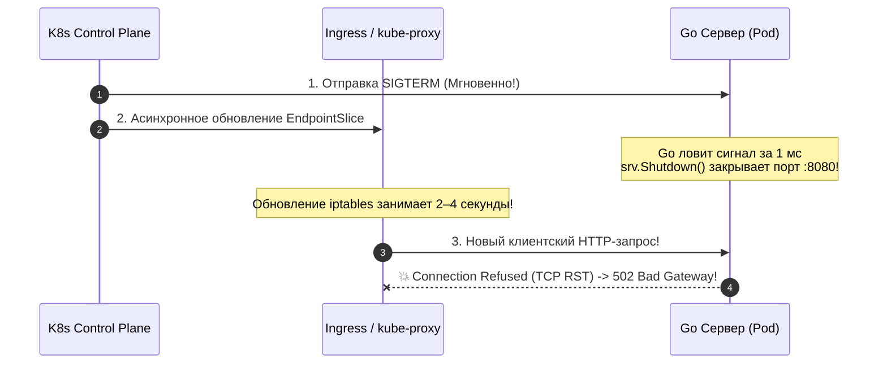

# Graceful Shutdown и устойчивость API в Go: Искусство уходить красиво

> *«Сбои неизбежны — такова единственная константа компьютерного мира. Умение плавно и предсказуемо деградировать — визитная карточка зрелой инженерной системы».*    
> — Принцип надежности Bell Labs

Мы прошли колоссальный путь проектирования надежной распределенной системы: наш Go-сервис обладает чистой модульной архитектурой, покрыт комплексными RED-метриками ([[31. API observability.md]]), защищен двусторонним криптографическим протоколом [[29. mTLS в сервисах.md]] и гарантирован от регрессий строгими контрактными тестами ([[34. Contract testing.md]]).

Вы нажимаете заветную кнопку «Deploy», оркестратор Kubernetes запускает процедуру непрерывного обновления (Rolling Update)... и в ту же секунду мониторинг фиксирует неприятный всплеск: у 1% активных пользователей вылетает ошибка `502 Bad Gateway`, а в базе данных зависают незавершенные финансовые транзакции.

Почему идеально написанный и всесторонне протестированный код внезапно теряет клиентские запросы при обычном штатном релизе?

Ответ кроется в фундаментальном пробеле: **мы не научили наше приложение правильно умирать**.

---

## 1. Искусство уходить красиво: Зачем приложению уметь умирать

В современных облачных средах (Kubernetes, AWS ECS, Nomad) контейнеры и поды рождаются и уничтожаются сотни раз в сутки:
* Плановые релизы новых версий (Rolling Update).
* Автоматическое горизонтальное масштабирование (Autoscaling при снижении нагрузки).
* Перемещение нагрузки при обслуживании нод кластера (Node Drain / Eviction).
* Перезапуск из-за превышения лимитов памяти или падения соседних процессов.

Если ваш Go-сервер при получении команды на завершение просто «роняет» процесс (`os.Exit(0)`), он мгновенно сбрасывает сетевые TCP-сокеты пакетом `RST`. Клиенты получают внезапный обрыв соединения прямо посреди загрузки файла, оформления заказа или обработки платежа.



Паттерн **Graceful Shutdown (Плавное завершение)** — это способность приложения:
1. Корректно перехватить системный сигнал завершения от ядра ОС.
2. Прекратить регистрацию новых входящих TCP-соединений.
3. Дать уже исполняющимся HTTP/gRPC запросам разумное время на штатное завершение.
4. Дождаться завершения фоновых воркеров (Background Workers).
5. Атомарно сбросить кэши, закрыть дескрипторы базы данных (`db.Close()`) и лишь затем передать управление операционной системе.

---

## 2. Анатомия убийства: Pod Lifecycle в Kubernetes

Чтобы написать отказоустойчивый код на Go, необходимо проявить **Mechanical Sympathy** к жизненному циклу контейнера в операционной системе Linux.

Как именно Kubernetes выводит ваш сервис из эксплуатации?

1. **Фаза 1: Предупреждение (SIGTERM).** Демон Kubelet отправляет вашему процессу (PID 1) стандартный POSIX-сигнал `SIGTERM` (сигнал 15). Это вежливая просьба ядра: *«Пожалуйста, заверши текущие дела, сохрани состояние и освободи ресурсы»*.
2. **Фаза 2: Окно благодати (Grace Period).** По умолчанию Kubernetes выделяет процессу ровно **30 секунд** (параметр спецификации пода `terminationGracePeriodSeconds`). В течение этого окна процесс остается живым.
3. **Фаза 3: Принудительная ликвидация (SIGKILL).** Если по истечении 30 секунд процесс все еще висит в таблице процессов (например, горутина застряла в бесконечном цикле или заблокировалась на зависшем сокете), ядро Linux отправляет безжалостный сигнал `SIGKILL` (сигнал 9). Сигнал `SIGKILL` **невозможно перехватить, заблокировать или проигнорировать** — операционная система принудительно вычищает память процесса из страниц MMU.

```mermaid
gantt
    title Жизненный цикл завершения Pod'а в Kubernetes
    dateFormat s
    axisFormat %S
    
    section Сигналы ОС
    Отправка SIGTERM                  :milestone, m1, 0, 0s
    Grace Period (30s)                :active, a1, 0, 30s
    Отправка SIGKILL                  :milestone, m2, 30, 0s
    
    section Go Приложение
    Перехват сигнала (NotifyContext)  :crit, c1, 0, 1s
    Остановка Listener (Новых нет)    :active, c2, 1, 2s
    Доработка текущих запросов        :c3, 2, 10s
    Закрытие БД и выход (Exit 0)      :milestone, m3, 10, 0s
```



---

## 3. Идиоматичный Go: Реализация Graceful Shutdown

Исторически перехват сигналов операционной системы в Go требовал ручного создания буферизованного канала `chan os.Signal` и вызова `signal.Notify()`.  
Начиная с **Go 1.16**, стандартная библиотека предлагает гораздо более чистый и безопасный механизм, интегрированный с контекстами — **`signal.NotifyContext`**.

> [!info] Под капотом: Как устроен метод `http.Server.Shutdown(ctx)`
> Когда вы вызываете `srv.Shutdown(ctx)` у стандартного HTTP-сервера Go:
> 1. Сервер **немедленно закрывает все активные слушающие сокеты (Listeners)**. Попытка новых клиентов установить TCP-соединение будет отклонена на уровне ОС.
> 2. Закрывает все простаивающие keep-alive соединения, которые в данный момент не обрабатывают запросы.
> 3. Блокирует вызывающую горутину и терпеливо ожидает, пока все **уже активные горутины-обработчики** завершат выполнение своих HTTP-методов и вернут ответ клиенту.
> 4. Если время ожидания превышает дедлайн переданного `ctx` (например, 20 секунд), метод принудительно разрывает оставшиеся сокеты и возвращает ошибку `context.DeadlineExceeded`.

### Эталонный шаблон `main.go` для промышленного продакшена:

```go
package main

import (
	"context"
	"errors"
	"log/slog"
	"net/http"
	"os"
	"os/signal"
	"syscall"
	"time"
)

func main() {
	// 1. Создаем контекст, перехватывающий сигналы SIGINT (Ctrl+C) и SIGTERM (K8s/Docker)
	ctx, stop := signal.NotifyContext(context.Background(), os.Interrupt, syscall.SIGTERM)
	defer stop() // Восстанавливаем стандартную обработку сигналов при выходе

	srv := &http.Server{
		Addr:         ":8080",
		Handler:      businessLogicHandler(),
		ReadTimeout:  5 * time.Second,
		WriteTimeout: 30 * time.Second, // Запас на длительные операции
	}

	// 2. Запуск HTTP-сервера в фоновой горутине, чтобы не блокировать поток main
	go func() {
		slog.Info("Server is starting", "port", 8080)
		// ErrServerClosed — это ШТАТНОЕ поведение при вызове Shutdown, не паникуем!
		if err := srv.ListenAndServe(); err != nil && !errors.Is(err, http.ErrServerClosed) {
			slog.Error("Server failed to start", "error", err)
			os.Exit(1)
		}
	}()

	// 3. Блокируемся до получения системного сигнала от ОС
	<-ctx.Done()
	slog.Info("Shutdown signal received, initiating graceful shutdown...")

	// 4. Выделяем окну завершения максимум 20 секунд (строго меньше 30 секунд K8s!)
	shutdownCtx, cancel := context.WithTimeout(context.Background(), 20*time.Second)
	defer cancel()

	// 5. Вызываем Shutdown: прекращаем прием новых соединений и ждем текущие запросы
	if err := srv.Shutdown(shutdownCtx); err != nil {
		slog.Error("Graceful shutdown failed (timeout or error)", "error", err)
	} else {
		slog.Info("Server stopped gracefully")
	}

	// 6. Очистка зависимостей (Закрытие пулов БД, flush логов, отключение от Kafka)
	// db.Close()
	// kafkaProducer.Close()
	slog.Info("Resources cleaned up, exiting.")
}
```

---

## 4. Ужас асинхронности: Почему Kubernetes всё равно теряет запросы?

Вы аккуратно внедрили код выше. Он безупречен. Но при первом же Rolling Update в продакшене вы с изумлением видите в логах клиентов ошибки `502 Bad Gateway` и `Connection Refused`.

Почему это происходит?

Это самая коварная архитектурная ловушка распределенных контейнерных сред.  
Kubernetes — **асинхронная распределенная система**. Когда Control Plane принимает решение об удалении пода, он выполняет **два независимых действия параллельно**:

1. Отправляет сигнал `SIGTERM` вашему Go-контейнеру.
2. Отправляет директиву демонам `kube-proxy` и Ingress-контроллерам на всех нодах кластера: *«Удалите IP-адрес этого пода из таблиц маршрутизации (iptables/IPVS/eBPF)»*.



**Суть ловушки:**  
Сигнал `SIGTERM` ваш Go-процесс ловит за доли миллисекунды и тут же закрывает сетевой сокет.  
А распространение информации об удалении пода по распределенному кластеру (обновление `iptables` на десятках нод) занимает **от 2 до 5 секунд**.

В эти 3–4 секунды внешний балансировщик (Ingress) искренне считает ваш под живым и продолжает перенаправлять в него трафик реальных пользователей! Но порт `:8080` уже закрыт вашим сервером. Результат — мгновенный `Connection Refused`.

> [!warning] Ловушка / Gotcha: Лекарство от асинхронности (The Sleep Hack)
> Чтобы полностью исключить эту рассинхронизацию, вы **обязаны искусственно задержать остановку Listener'а**:
> 
> **Способ А (В коде Go):**  
> При получении `SIGTERM` не вызывайте `srv.Shutdown()` мгновенно. Сделайте паузу `time.Sleep(5 * time.Second)`. В эти 5 секунд сервер продолжает штатно принимать входящие запросы. За это время `kube-proxy` гарантированно вычеркнет IP пода из всех таблиц, трафик иссякнет, и только после этого Go вызывает `Shutdown()`.
> 
> **Способ Б (Идиоматичный K8s манифест, The Sleep Hack):**  
> Настроить хук жизненного цикла `preStop` в манифесте Deployment:
> ```yaml
> lifecycle:
>   preStop:
>     exec:
>       command: ["/bin/sh", "-c", "sleep 5"]
> ```
> Kubelet сначала исполнит `sleep 5`, дождется перестроения маршрутов `iptables`, и только затем отправит `SIGTERM` вашему Go-приложению.

---

## 5. Фоновые задачи: Защита горутин (Workers)

Метод `http.Server.Shutdown()` контролирует только входящие веб-запросы. Но в любом реальном бэкенде есть асинхронные фоновые воркеры (Background Workers): раз в минуту горутина вычитывает очередь Kafka, пересчитывает кэши или отправляет email-уведомления.

Если процесс выполнит `os.Exit(0)` сразу после завершения HTTP-запросов, все работающие фоновые горутины будут грубо оборваны на полуслове (Hard Kill), оставляя испорченные файлы и битые записи в БД.

Для координации фоновых задач используется паттерн **Tracker на базе `sync.WaitGroup`**:

```go
package worker

import (
	"context"
	"sync"
)

type BackgroundWorker struct {
	wg sync.WaitGroup
}

// RunTask безопасно регистрирует и запускает фоновую задачу
func (w *BackgroundWorker) RunTask(task func()) {
	w.wg.Add(1)
	go func() {
		defer w.wg.Done()
		task() // Выполнение бизнес-логики
	}()
}

// Wait ожидает завершения всех запущенных горутин или истечения дедлайна контекста
func (w *BackgroundWorker) Wait(ctx context.Context) error {
	done := make(chan struct{})
	go func() {
		w.wg.Wait()
		close(done)
	}()

	select {
	case <-done:
		return nil // Все фоновые воркеры завершились штатно
	case <-ctx.Done():
		return ctx.Err() // Таймаут Graceful Shutdown: принудительный выход
	}
}
```

Вызов `worker.Wait(shutdownCtx)` встраивается в фазу завершения перед закрытием дескрипторов баз данных.

---

## 6. Нюансы gRPC: `GracefulStop()` vs `Stop()`

> [!tip] Собеседование: Graceful Shutdown в gRPC
> **Вопрос:** Мы используем gRPC вместо REST. Как реализовать Graceful Shutdown для gRPC-сервера? Есть ли подводные камни?
> 
> **Ответ:**  
> У структуры `grpc.Server` есть метод `grpcServer.GracefulStop()`. Он перестает принимать новые RPC и ждет завершения активных вызовов.  
> **Опасная ловушка:** Метод `GracefulStop()` **не принимает контекст с таймаутом**!  
> Если клиент держит открытый двунаправленный стрим ([[18. gRPC streaming.md]]) и не закрывает его, вызов `GracefulStop()` **заблокирует процесс навсегда**. Через 30 секунд Kubernetes отправит `SIGKILL`.  
> 
> **Правильный паттерн для gRPC:**  
> Метод `GracefulStop()` запускается в отдельной горутине, а основная горутина ждет по таймеру. Если за 15 секунд соединения не закрылись — вызывается принудительный `grpcServer.Stop()`:
> ```go
> stopped := make(chan struct{})
> go func() {
>     grpcServer.GracefulStop()
>     close(stopped)
> }()
> 
> select {
> case <-stopped:
>     slog.Info("gRPC server stopped cleanly")
> case <-time.After(15 * time.Second):
>     slog.Warn("gRPC graceful stop timed out, forcing stop")
>     grpcServer.Stop() // Жесткий разрыв оставшихся зависших сокетов
> }
> ```

---

## 7. Итог и завершение цикла

1. **Graceful Shutdown** — это знак уважения к пользователям и данным. При штатных обновлениях не должно теряться ни одно клиентское соединение и ни одна транзакция.
2. Используйте **`signal.NotifyContext`** для идиоматичного перехвата сигналов `SIGTERM` и `SIGINT` (Go 1.16+).
3. Всегда устанавливайте жесткий таймаут для `srv.Shutdown(ctx)` (например, 20 секунд), чтобы защититься от бесконечного зависания. Этот таймаут должен быть строго меньше `terminationGracePeriodSeconds` в K8s (по умолчанию 30с).
4. Нейтрализуйте асинхронную рассинхронизацию K8s (`iptables`) с помощью **The Sleep Hack** (задержка в 3–5 секунд перед закрытием Listener'а).
5. Защищайте асинхронные горутины через `sync.WaitGroup`, а для gRPC используйте связку `GracefulStop()` с принудительным `Stop()` по таймауту.
6. В финале всегда закрывайте пулы соединений базы данных (`db.Close()`) и сбрасывайте буферы очередей.

Умение мягко завершать работу — фундамент надежности. Но как проектировать API так, чтобы другие инженеры получали удовольствие от интеграции с вашим сервисом? Каковы золотые стандарты создания технической документации, SDK и песочниц (Developer Experience)? Об этом пойдет речь в следующей статье: [[36. Документация API best practices.md]].
