# Документация API и Developer Experience (DX): Золотые стандарты индустрии

> *«Хорошая документация — отличительный знак вежливого инженера. Это надежный мост между человеческим замыслом и машинным исполнением».*    
> — Брайан Керниган

Мы прошли колоссальный инженерный путь: спроектировали распределенную архитектуру, оптимизировали бинарный транспорт gRPC, внедрили сквозной mTLS, обуздали задержки спанами OpenTelemetry и гарантировали стабильность контрактов. Наш бэкенд на Go — это подлинный триумф алгоритмической мысли, способный выдерживать 100 000 RPS при субмиллисекундном p99 отклике.

Но в реальном коммерческом мире действует жесткий, безжалостный закон:  
**Если вашего API нет в ясной, актуальной и доступной документации — вашего API попросту не существует.**

Для инженера уровня Senior документация — это не «досадная рутина для технического писателя». Это **Developer Experience (DX) — Пользовательский интерфейс (UX) для программистов**. Если интеграция с вашим сервисом превращается в квест с угадыванием форматов дат и дебагом ошибок `400 Bad Request` вслепую, сторонние клиенты немедленно уйдут к конкурентам, а соседние команды внутри вашей компании будут яростно саботировать переход на ваш сервис.

В этой статье мы разберем стандарты создания технической документации, которая не устаревает, не врет и вызывает искреннее восхищение у разработчиков.

---

## 1. Ваш код мертв, если им не умеют пользоваться

Представьте покупку прецизионного хронометра. Покупателю бесполезно выдавать заводские чертежи шестеренок на миллиметровке (аналог сырого исходного кода бэкенда на GitHub). Пользователю необходимо четкое, структурированное руководство: где находится заводная головка (**Quickstart**), как выставить дату (**Tutorial**), что означает индикатор запаса хода (**Reference**) и как безопасно заводить механизм при смене часового пояса (**Best Practices**).

Без ясной инструкции самый шедевральный швейцарский механизм будет заброшен в дальний ящик стола.

```mermaid
flowchart TD
    subgraph Layers ["Четыре уровня идеального Developer Experience (DX)"]
        direction TB
        L1["1. Reference (Словарь)<br>OpenAPI, Protobuf, GraphQL • Схемы, типы, параметры"]
        L2["2. Guides & Concepts (Учебник)<br>Архитектурные концепции • Жизненный цикл • Аутентификация"]
        L3["3. Recipes & Quickstarts (Поваренная книга)<br>Copy-Paste сниппеты • Типовые бизнес-сценарии"]
        L4["4. SDKs & Tooling (Инструменты)<br>Клиентские библиотеки Go, TypeScript, Python • Postman коллекции"]
    end

    L4 --> L3
    L3 --> L2
    L2 --> L1

    style Layers fill:#0f172a,stroke:#38bdf8,stroke-width:1px
    style L1 fill:#1e293b,stroke:#38bdf8,stroke-width:2px
    style L2 fill:#1e293b,stroke:#10b981,stroke-width:2px
    style L3 fill:#1e293b,stroke:#f59e0b,stroke-width:2px
    style L4 fill:#1e293b,stroke:#a855f7,stroke-width:2px
```

---

## 2. Три кита Developer Experience (DX)

Распространенная ошибка начинающего разработчика — автоматически сгенерировать сырой Swagger UI из комментариев в коде и счесть работу завершенной. Swagger UI — это лишь сухой справочник.

Зрелая документация промышленного API строится на трех фундаментальных слоях:

### 1. Reference (Справочник API)
Это строгий анатомический атлас. Жестко типизированное описание эндпоинтов, HTTP-методов, заголовков, query-параметров и JSON-схем.
* **Форматы:** OpenAPI (Swagger), GraphQL Schema, Protobuf Definitions.
* **Назначение:** Дать мгновенный и математически точный ответ на вопрос: *«Какой тип данных у поля `createdAt` — Unix Timestamp или строка ISO 8601?»*.

### 2. Guides & Concepts (Руководства и Концепции)
Это смысловой путеводитель. Справочник никогда не объяснит, *почему* эндпоинты вызываются в определенной последовательности.
* **Примеры:** *«Руководство по обработке постраничной навигации (Cursor Pagination)»*, *«Жизненный цикл оформления заказа и транзакций возврата»*, *«Как получить и ротировать OAuth2 токен через PKCE»*.
* **Формат:** Полнотекстовые Markdown-лонгриды с наглядными архитектурными диаграммами.

### 3. Recipes & SDKs (Рецепты и Клиенты)
Программисты ценят свое время. Никто не хочет вручную собирать многострочные заголовки через утилиту `curl`.
* Предоставьте готовые экспортируемые коллекции для **Postman** и **Insomnia**.
* Выпустите автоматически сгенерированные и типизированные **SDK для Go, TypeScript и Python** (см. [[15. Генерация клиентов и серверов.md]]).
* Снабдите каждый эндпоинт готовыми копируемыми сниппетами кода (Code Snippets): *«Скопируй этот блок на Go, вставь в `main.go`, подставь свой токен — и платеж совершен»*.

---

## 3. Главная метрика API: TTFC (Time to First Call)

В продуктовой инженерии существует фундаментальная метрика успеха сетевого интерфейса — **Time to First Call (TTFC — Время до первого успешного вызова)**.

Это хронометраж от момента, когда сторонний инженер впервые открыл страницу вашей документации, до секунды, когда в его терминале загорелся победный статус `200 OK`.

```mermaid
flowchart LR
    Open["1. Открытие портала документации"] --> Reg["2. Моментальная регистрация (без писем в саппорт)"]
    Reg --> Key["3. API_KEY в 1 клик (Тестовая песочница Sandbox)"]
    Key --> Copy["4. Копирование готового curl с автоподстановкой ключа"]
    Copy --> Call["5. Вызов в терминале -> 200 OK!"]

    style Open fill:#1e293b,stroke:#38bdf8,stroke-width:1px
    style Key fill:#1e293b,stroke:#f59e0b,stroke-width:1px
    style Call fill:#1e293b,stroke:#10b981,stroke-width:2px
```

В эталонных мировых API (Stripe, Twilio) метрика TTFC составляет **менее 5 минут**.  
Как добиться таких показателей?

1. **Песочница (Sandbox):** Изолированный тестовый контур с фиктивными деньгами и эмуляцией очередей, где разработчик может экспериментировать без риска нанести ущерб бизнесу.
2. **Токены в один клик:** Разработчик не должен ждать одобрения службы безопасности по email. Тестовый `API_KEY` генерируется в личном кабинете за 2 секунды.
3. **Интерактивная автоподстановка:** Портал документации (например, ReadMe.com) автоматически внедряет токен авторизованного пользователя прямо в примеры кода `curl` и SDK. Инженеру достаточно нажать одну кнопку *«Run in Console»* прямо в браузере.

---

## 4. Анатомия идеального OpenAPI Справочника

При следовании методологии Design-First ([[14. OpenAPI и Swagger.md]]) ваш контрактный файл `openapi.yaml` обязан проектироваться с ювелирной точностью.

> [!warning] Ловушка / Gotcha: Спецификация без живых примеров
> Распространеннейший грех бэкендеров — формально описать типы полей (`type: string`, `type: integer`), не указав ни единого примера.  
> Клиентский разработчик видит поле `amount: integer`. Что означает число 100? Сто рублей? Сто долларов? Или сто копеек / центов?  
> **Инженерный закон:** Спецификация OpenAPI поддерживает поле `example`. Вы **обязаны** заполнять `example` для каждого скалярного поля и структуры. Сгенерированные на базе примеров мок-серверы (Prism) позволят фронтендерам разрабатывать интерфейс за недели до того, как бэкенд на Go напишет первую строчку реализации!

### Отличия Senior-спецификации от Junior-наброска:

1. **Глубокие описания (`description`):** Используйте форматирование Markdown. Никогда не пишите банальное *"ID пользователя"* для поля `userId`. Пишите развернуто:  
   *«Уникальный неизменяемый идентификатор пользователя в формате UUIDv4. Генерируется на этапе регистрации. Обязателен для всех мутирующих операций в заголовке X-User-ID»*.
2. **Исчерпывающая документация ошибок (RFC 7807):** Описать структуру `200 OK` — лишь треть дела. Вы обязаны задокументировать все коды ошибок `400 Bad Request`, `401 Unauthorized`, `403 Forbidden`, `429 Too Many Requests`. Укажите строгие перечисления машиночитаемых кодов бизнес-ошибок (`error_code: INSUFFICIENT_FUNDS`, `error_code: USER_BLOCKED`), чтобы разработчики могли реализовать надежные ветки `switch/case` в своих клиентах.
3. **Схемы безопасности (Security Schemes):** Четко укажите, какие эндпоинты требуют `Bearer` JWT-токена, какие защищены API-ключами, а какие доступны публично.

---

## 5. Инфраструктура: Где живут документы

Классический интерфейс Swagger UI (зелено-синий список аккордеонов) морально устарел: он монументален, перегружает браузер на спецификациях от 2000 строк и не поддерживает интерактивные текстовые руководства.

### Для внешних публичных API (B2B/B2C)
* **Redocly / Stoplight / ReadMe:** Промышленные генераторы документации. Они компилируют `openapi.yaml` в сверхбыстрые трехпанельные порталы (Левая колонка: навигация $	o$ Центральная колонка: описание и параметры $	o$ Правая колонка: живой интерактивный код и примеры payload).
* Поддерживают темные темы, версионирование спецификаций и поиск в реальном времени.

### Корпоративный реестр микросервисов (Enterprise)
В компании со 100+ микросервисами поиск документации превращается в ад.
* **Spotify Backstage:** Индустриальный золотой стандарт внутреннего портала разработчиков (Internal Developer Portal). В корень репозитория каждого Go-сервиса помещается манифест `catalog-info.yaml`. Backstage автоматически парсит репозиторий, связывает микросервис с командой владельцев, подтягивает метрики Grafana, логи и рендерит актуальную интерактивную OpenAPI-документацию прямо в корпоративном веб-интерфейсе.

---

## 6. Ловушка: Как не дать документации "протухнуть"

Документация, которая расходится с реальным поведением кода (рассинхрон) — во сто крат опаснее ее полного отсутствия. Она провоцирует скрытые баги, часы бесполезной отладки и разрушает репутацию инженерной команды.

### Автоматизированная защита от устаревания:

1. **Линтеры спецификаций в CI/CD (Spectral):** Утилита `Spectral` в процессе Pull Request проверяет, что разработчик не забыл заполнить `description`, добавил `example` к новым полям и строго соблюдает корпоративный стайлгайд.
2. **Контрактные тесты (Pact / Schema Validator):** Как мы разбирали в [[34. Contract testing.md]], если Go-бэкенд возвращает число `int`, а в спецификации зафиксирована строка `string` — билд в CI аварийно завершится.
3. **Строгий отказ от ручной синхронизации:**  
   * При подходе **Design-First** генерируйте интерфейсы Go, DTO-модели и валидаторы напрямую из `openapi.yaml` через инструмент `oapi-codegen`.
   * При подходе **Code-First** генерируйте схему из проверенных Go-структур через `swaggo`.  
   **Никогда не пишите роутеры и структуры вручную параллельно с отдельным YAML-файлом!** Рассинхрон в таком случае неизбежен.

> [!tip] Собеседование: Эволюция версий в документации
> **Вопрос:** Мы выпускаем мажорную версию API (v2). Как правильно отобразить это в документации, не нарушив работу легитимных клиентов v1?
> 
> **Ответ:**  
> 1. Портал документации обязан поддерживать переключатель версий (Version Dropdown). Документация v1 не удаляется!
> 2. Страницы v1 помечаются ярким предупреждением: статус `Deprecated` с четко обозначенной датой полного отключения (Sunset Date по RFC 8594).
> 3. В документации v2 обязателен раздел **Migration Guide (Руководство по миграции)**: таблица сопоставления старых и новых полей («Было в v1 $	o$ Стало в v2»), перечень удаленных методов и пошаговые примеры адаптации клиентского кода на Go и TypeScript.

---

## 7. Документирование асинхронных API (AsyncAPI)

Для REST-интерфейсов стандартом является OpenAPI. Но как документировать протоколы реального времени: WebSockets ([[22. WebSocket.md]]), Server-Sent Events ([[23. Server Sent Events.md]]) или шины сообщений Kafka / RabbitMQ?

Для событийно-ориентированных архитектур (Event-Driven Architecture) индустриальным стандартом стал протокол **AsyncAPI Specification** (версия 3.0):
* Вместо путей (`paths`) манифест AsyncAPI описывает каналы (**Channels**) и топики (**Topics**).
* Вместо HTTP-методов `GET/POST` используются операции **`Publish`** (события, отправляемые клиентом) и **`Subscribe`** (события, рассылаемые сервером).
* Формат сообщений типизируется схемами JSON Schema или Protocol Buffers.

Спецификация AsyncAPI позволяет генерировать клиентские библиотеки и порталы документации для WebSocket и Kafka с той же легкостью, что и для REST API.

---

## 8. Итог

1. **Документация — это полноценный инженерный продукт.** Она формирует Developer Experience (DX) и напрямую определяет коммерческую ценность вашего API.
2. Измеряйте и сокращайте метрику **Time to First Call (TTFC)** до <5 минут за счет готовых песочниц (Sandbox), моментальной выдачи тестовых ключей и сниппетов кода с автоподстановкой.
3. Идеальный OpenAPI справочник содержит глубокие текстовые описания, обязательные примеры (`example`) для каждого поля и исчерпывающий список возможных ошибок (`4xx`, `5xx`, RFC 7807).
4. Используйте современные трехпанельные порталы (**Redocly, Stoplight**) и корпоративные хабы (**Spotify Backstage**).
5. Защищайте документацию от устаревания с помощью кодогенерации (`oapi-codegen`, `swaggo`), линтеров в CI (Spectral) и контрактных тестов.
6. Для очередей сообщений и сокетов реального времени применяйте стандарт **AsyncAPI Specification**.

Мы научились документировать сервисы так, чтобы разработчики влюблялись в них с первого запроса. Но как быть, если старый API v1 неизбежно устаревает и его нужно вывести из эксплуатации, не спровоцировав скандала и судебных исков от разгневанных B2B-клиентов? О дипломатии, технических метриках и архитектуре безопасного вывода API из эксплуатации (Deprecation Strategies) мы поговорим в следующей статье: [[37. Version deprecation стратегии.md]].
