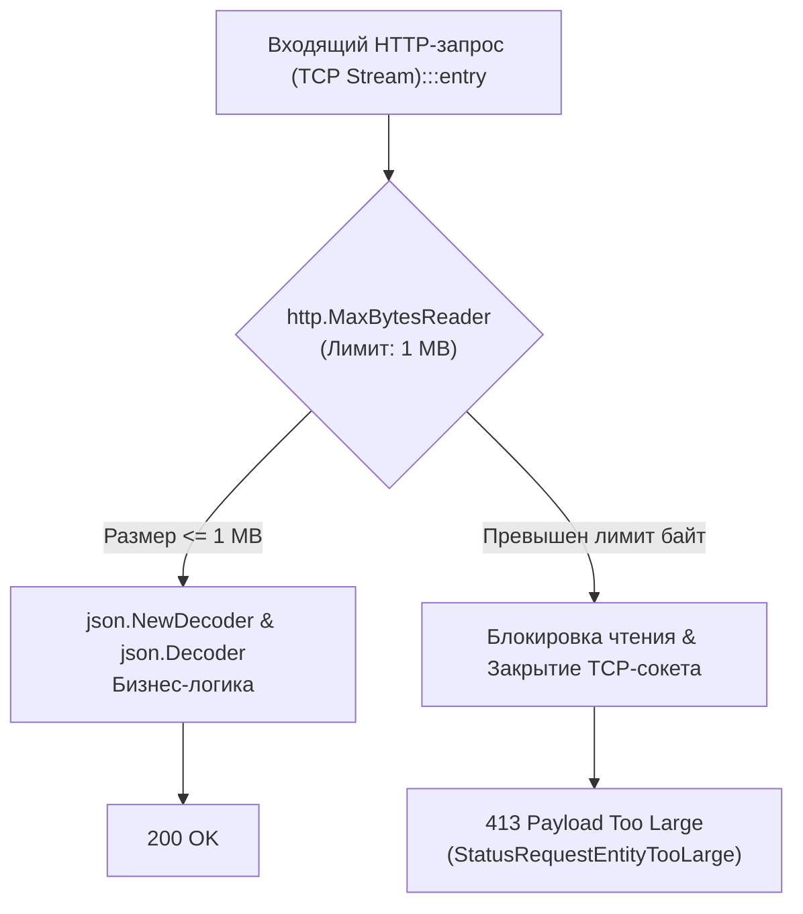
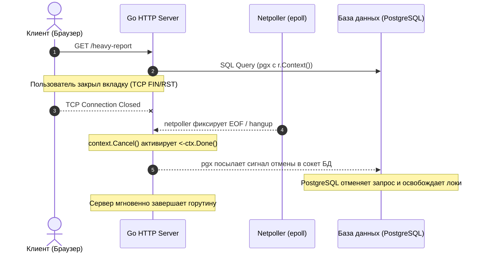
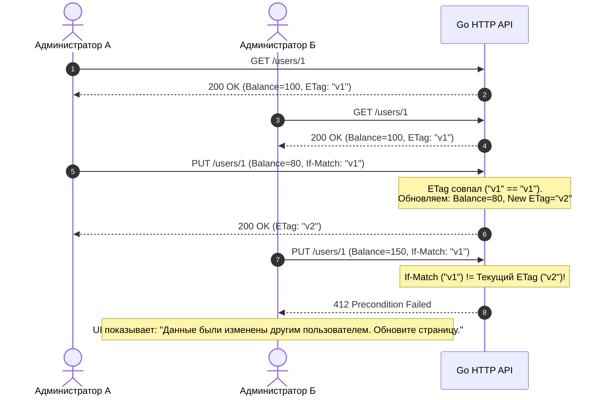

# Пограничные случаи сетевых API: Защита от коварных сбоев и атак

> *«Программы должны писаться прежде всего для людей, которые будут их читать, и лишь во вторую очередь — для машин, которые будут их исполнять. Но когда машины исполняют их во враждебном мире, простота становится вашей единственной настоящей защитой».*    
> — Свободная интерпретация принципа Bell Labs

## Архитектура на грани фола: Когда "Happy Path" ведет в пропасть

На протяжении нашего погружения в проектирование API мы выстраивали правильную, элегантную и надежную архитектуру. Но в реальном production-мире пользователи, нестабильные мобильные сети и злоумышленники вовсе не спешат следовать спецификации OpenAPI.

Junior-разработчик пишет код, который работает, когда всё хорошо (Happy Path). Senior-разработчик проектирует системы, предполагая, что всё вокруг сломано: клиенты шлют мусор, сокеты обрываются в самую непредсказуемую миллисекунду, а сеть полна враждебных ботов.

**Edge Cases (Граничные случаи)** — это те самые 1% сценариев, которые вызывают 99% ночных инцидентов, аварийного срабатывания OOM Killer и деградации распределенных кластеров. В этой статье мы разберем классические сетевые уязвимости, скрытые ловушки сериализации и раскроем механизмы рантайма Go, позволяющие элегантно защитить продакшен.

---

## 1. Смерть от мегабайтов: Бесконечный Payload

Что произойдет с вашим сервисом, если недобросовестный клиент или атакующий бот отправит HTTP-запрос `POST /upload`, добросовестно укажет заголовок `Content-Type: application/json`, но в качестве тела запроса начнет непрерывно гнать файл размером 10 Гигабайт?

### Антипаттерн (Junior Way)

```go
body, err := io.ReadAll(r.Body) 
// Или
err := json.NewDecoder(r.Body).Decode(&req)
```

В первом случае функция `io.ReadAll` попытается вычитать весь поток в оперативную память. Ваша горутина запросит у Garbage Collector 10 Гигабайт кучи (Heap). Сборщик мусора войдет в крутое пике, процесс мгновенно упадет с ошибкой OOM (Out of Memory), и Kubernetes его убьет. 

Второй вариант ничуть не лучше: потоковый `json.Decoder` сделает то же самое при попытке распарсить колоссальную структуру, непрерывно аллоцируя узлы в куче.

### Идиоматичный подход (Senior Way)

Главное правило безопасного бэкенда: **ограничивать размер тела запроса ЕЩЕ ДО того, как начнете его читать**. В Go для этого есть встроенный `http.MaxBytesReader`.



```go
package handler

import (
	"encoding/json"
	"errors"
	"net/http"
)

type MyRequest struct {
	Query string `json:"query"`
}

func SafeHandler(w http.ResponseWriter, r *http.Request) {
	// Ограничиваем размер тела до 1 Мегабайта (1 << 20)
	r.Body = http.MaxBytesReader(w, r.Body, 1<<20)

	var req MyRequest
	err := json.NewDecoder(r.Body).Decode(&req)
	if err != nil {
		// Уникальная ошибка, если лимит превышен
		var maxBytesError *http.MaxBytesError
		if errors.As(err, &maxBytesError) {
			http.Error(w, "Payload too large", http.StatusRequestEntityTooLarge) // 413
			return
		}
		http.Error(w, "Bad Request", http.StatusBadRequest)
		return
	}

	w.WriteHeader(http.StatusOK)
}
```

> [!info] Mechanical Sympathy: Механика MaxBytesReader
> Функция `http.MaxBytesReader` не просто возвращает ошибку. Если клиент продолжает слать байты после достижения лимита, она жестко разрывает TCP-соединение, защищая сетевые буферы ядра Linux и ОС от переполнения.

---

## 2. Атака Медленного Лори (Slowloris)

Представьте, что клиент открывает TCP-соединение с вашим Go-сервером и начинает отправлять тело JSON со скоростью **1 байт в секунду**.

В модели **Goroutine-per-Connection** ваш сервер выделит отдельную горутину под этот запрос. Горутина заблокируется на чтении (`read`). Если хакер откроет 100 000 таких соединений, у вас зависнет 100 000 горутин, исчерпав файловые дескрипторы ОС (`RLIMIT_NOFILE`). Сервер ляжет, хотя процессор и сеть будут почти свободны.

Чтобы защититься от «медленных» клиентов, стандартный `http.Server` требует жесткой настройки таймаутов на чтение, которые по умолчанию равны бесконечности!

```go
// Идиоматичная настройка production сервера
srv := &http.Server{
	Addr:    ":8080",
	Handler: myRouter,
	// Максимальное время на чтение заголовков (защита от Slowloris на этапе Handshake)
	ReadHeaderTimeout: 5 * time.Second,
	// Максимальное время на чтение всего тела запроса
	ReadTimeout:       15 * time.Second,
	// Максимальное время ответа (включая бизнес-логику)
	WriteTimeout:      30 * time.Second,
	// Время удержания простаивающего TCP-соединения
	IdleTimeout:       120 * time.Second,
}
```

---

## 3. Отмененные запросы (The Ghost Request)

Пользователь заходит на сложную страницу отчета, ваш бэкенд начинает собирать данные из PostgreSQL (это занимает 5 секунд). На 2-й секунде пользователю надоедает ждать, и он закрывает вкладку браузера (или мобильное приложение обрывает запрос).

TCP-соединение разорвано. Клиента больше нет. Но знает ли об этом ваш код в Go?
Если вы не используете `context.Context` корректно, ваша горутина будет честно «пыхтеть» оставшиеся 3 секунды, грузить процессор, парсить данные из базы данных, а затем попытается сделать `w.Write()` в мертвый сокет и просто выбросит результат в мусорку.



> [!info] Под капотом: Netpoller и Context
> Рантайм Go постоянно мониторит сокеты. Если клиент разрывает соединение, сетевой поллер (Netpoller) замечает `EOF` и мгновенно отменяет контекст запроса `r.Context()`. 

**Правило:** Вы обязаны передавать `r.Context()` во ВСЕ тяжелые функции, вызовы базы данных и сторонние HTTP-запросы. Драйверы (например, `pgx` для PostgreSQL или сгенерированные клиенты `oapi-codegen`) умеют слушать канал `<-ctx.Done()` и прерывать выполнение на своей стороне, сохраняя ресурсы всей системы.

---

## 4. Гонка Данных: The Lost Update Problem

В статье [[13. Idempotency ключи.md]] мы обсуждали защиту от сетевых ретраев. Но есть другой класс проблем — конкурентное изменение (Race Condition) данных двумя *разными* пользователями.

1. Администратор А запрашивает профиль пользователя (баланс = 100).
2. Администратор Б запрашивает этот же профиль (баланс = 100).
3. Админ А списывает 20 и отправляет `PUT` с балансом 80.
4. Админ Б (не зная о действиях А) начисляет 50 и отправляет `PUT` с балансом 150.

Баланс стал 150, хотя математически должен был стать 130 (`100 - 20 + 50`). Это классическая «Потерянная проблема обновления» (**Lost Update**).

### Как решать это в HTTP API?

Оптимистичная блокировка через заголовки `ETag` / `If-Match` (см. [[12. Caching HTTP.md]]).



* Сервер отдает профиль с заголовком: `ETag: "v1"`.
* Админ А шлет запрос: `PUT /users/1`, Заголовок: `If-Match: "v1"`. Сервер обновляет баланс до 80 и меняет ETag на `"v2"`.
* Админ Б шлет запрос: `PUT /users/1`, Заголовок: `If-Match: "v1"`. Сервер видит, что версии не совпадают, и возвращает статус **`412 Precondition Failed`**. UI Админа Б показывает ошибку: *«Данные были изменены другим пользователем. Обновите страницу»*.

---

## 5. Тьма кодировок: Скрытые убийцы баз данных

Многие разработчики считают, что если JSON валиден (прошел `json.Unmarshal`), то данные безопасны. Это опасное заблуждение.

> [!warning] Ловушка / Gotcha: Инъекция Null-байта (\x00)
> В языке Go (как и в C/C++) строка — это просто массив байт `[]byte` (обычно в кодировке UTF-8). Язык Go прекрасно поддерживает наличие нулевого байта (`\u0000` / `0x00`) в середине строки.
> 
> Если клиент пришлет JSON: `{"username": "admin\u0000hacker"}`, Go без проблем распарсит это в структуру `req.Username`.
> 
> Но если вы попытаетесь сохранить эту строку в **PostgreSQL** (тип `VARCHAR` или `TEXT`), база данных запаникует с ошибкой `unsupported Unicode escape sequence`, так как PostgreSQL строго запрещает символ `0x00` в строковых типах! Ваша транзакция откатится, а сервер вернет 500 ошибку.
> 
> **Решение:** Всегда проводите санитизацию (очистку) входящих строковых полей, удаляя null-байты (`strings.ReplaceAll(s, "\x00", "")`) или возвращая `400 Bad Request` на этапе валидации DTO.

---

## 6. Zalgo Text и лимиты длины (Emoji Attack)

Если в базе данных у вас стоит ограничение `VARCHAR(50)`, вы проверяете длину строки в Go:

```go
if len(req.Name) > 50 { return Error }
```

Но функция `len(str)` в Go возвращает **количество байт**, а не количество символов (рун)!
* Обычная английская буква `'A'` весит 1 байт.
* Русская буква `'Я'` весит 2 байта.
* Эмодзи «👨‍👩‍👧‍👦» (Семья) — это композитный символ (ZWJ sequence), который может весить до **25 байт**!

Пользователь присылает имя из 3 семейных эмодзи. Для пользователя это 3 символа. Для Go это 75 байт. База данных отвергает строку (или обрезает её посередине составного символа, превращая в нечитаемый мусор).

> [!tip] Собеседование: Подсчет длины строки в Go
> **Вопрос:** Как правильно посчитать длину строки в Go для валидации перед отправкой в базу данных?
> 
> **Ответ:** Зависит от бизнес-логики и базы. Если база ограничивает символы (Unicode Code Points), используйте `utf8.RuneCountInString(str)`. Если база ограничивает байты — используйте `len(str)`. Но для защиты от композитных символов (когда длина в рунах и визуальная длина на экране отличаются) часто используют внешние библиотеки работы с графемами (Grapheme clusters), такие как `rivo/uniseg`.

---

## 7. Итог

1. **Доверяй, но ограничивай:** Никогда не читайте входящий поток без обертки `http.MaxBytesReader`, иначе вас убьют огромными Payload-ами.
2. **Таймауты:** Голый `&http.Server{}` без прописанных таймаутов на чтение/запись — это зияющая дыра безопасности, уязвимая к Slowloris-атакам.
3. **Отмена контекста:** Приучите себя слушать `r.Context()`. Если клиент ушел — немедленно прекращайте сжигать CPU и ресурсы базы данных.
4. **Оптимистичная блокировка:** Используйте `ETag` и `If-Match`, чтобы предотвратить гонку данных при конкурентных обновлениях ресурсов (Lost Update).
5. **Санитизация:** Помните о разнице между байтами, рунами и графемами в Go. Опасайтесь Null-байтов (`\x00`), которые могут сломать ваш PostgreSQL.

В следующей лекции мы перейдем к финальному техническому рубежу — оптимизации производительности, минимизации аллокаций памяти и профилированию высоконагруженных сетевых API на Go: [[39. API performance.md]].
