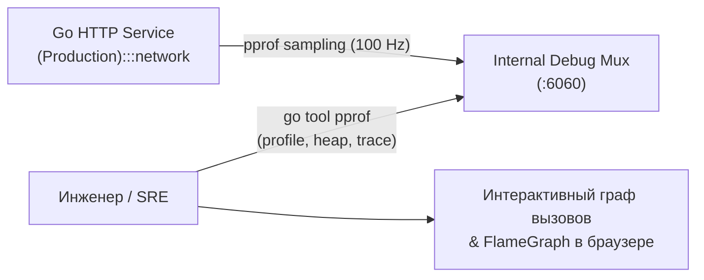
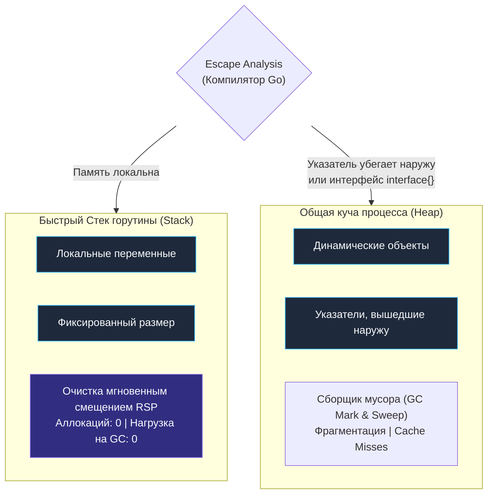
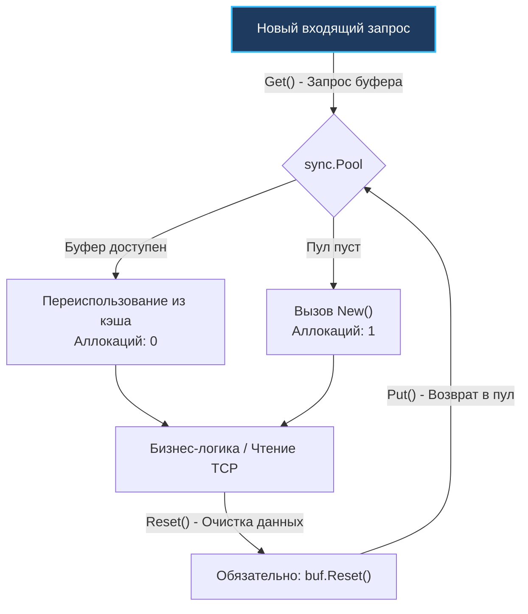
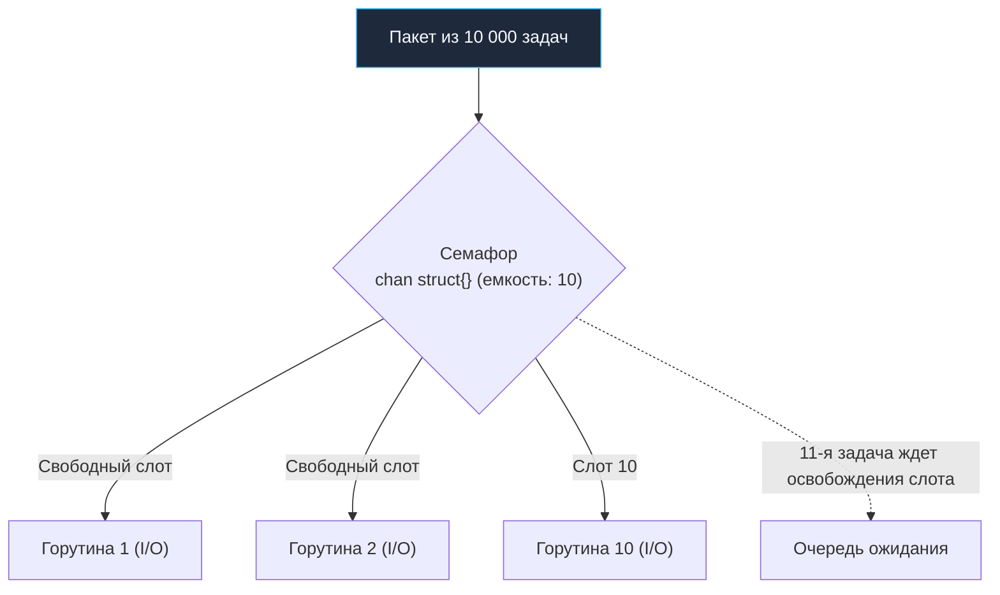
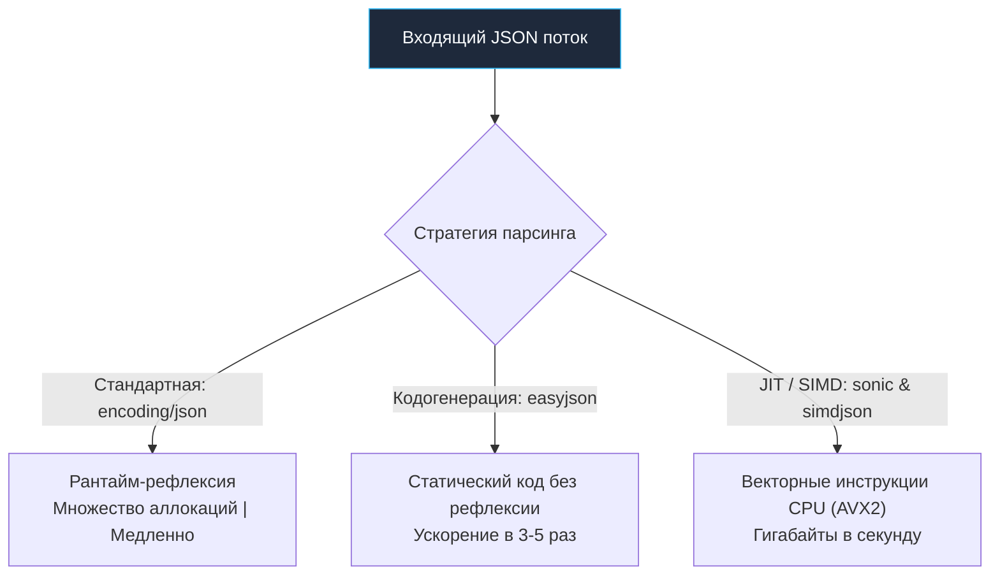

# Производительность API: Память, аллокации и Mechanical Sympathy

> *«Узкие места возникают в самых неожиданных местах; не пытайтесь гадать на кофейной гуще и внедрять хаки для ускорения, пока не доказали с профилировщиком в руках, куда именно уходит время».*    
> — Роб Пайк & Брайан Керниган

## Выжимаем максимум: Производительность и Mechanical Sympathy

Мы спроектировали зрелую распределенную систему: разграничили контексты, защитили эндпоинты от атак, внедрили rate limiting, распределенный трейсинг и graceful shutdown. Код безупречно прошел ревью и развернут в продакшен. Но вот наступает Черная Пятница или внезапная промо-кампания. Входящий трафик взлетает в 10 раз. Загрузка процессоров подскакивает до 100%, задержки (Latency) деградируют с 50 миллисекунд до катастрофических 5 секунд, а Horizontal Pod Autoscaler (HPA) в Kubernetes начинает судорожно плодить новые поды, сжигая месячный бюджет компании на облачную инфраструктуру.

Младший разработчик в такой ситуации бросается переписывать бизнес-алгоритмы или беспорядочно прикручивать кэширование (подробно разобранное в [[12. Caching HTTP.md]]).

Опытный бэкенд-инженер действует иначе. Он понимает фундаментальный закон веб-сервисов: в I/O-bound приложениях (к которым относится 99% сетевых API) алгоритмическая сложность $O(N)$ редко становится узким местом. Настоящие заторы возникают на границе взаимодействия рантайма Go с физическим «железом» — регистрами CPU, иерархией кэшей L1/L2/L3, шиной памяти и сетевыми буферами ядра Linux. 

Способность понимать внутреннее устройство машины и писать код, гармонично согласующийся с физикой полупроводников, называется **Mechanical Sympathy (Механическое сочувствие к машине)**. В этой главе мы научимся находить скрытые заторы и разгонять Go API до пределов возможностей кремния.

---

## 1. Телеметрия: Не гадай, а измеряй (pprof)

Первая заповедь производительности: **никогда не оптимизируйте код вслепую на основе интуиции**. То, что программисту кажется «медленным», процессор выполняет за считанные наносекунды благодаря предсказанию ветвлений (Branch Predictor) и суперскалярности. И напротив, безобидная на первый взгляд конкатенация строк в горячем цикле способна завалить сборщик мусора миллионами короткоживущих аллокаций.

В рантайм Go встроен мощный низкоуровневый профайлер — **pprof**. Он позволяет исследовать профили CPU, кучи (Heap), блокировок мьютексов (Mutex Contention) и выполнение системных вызовов с минимальными накладными расходами.



> [!warning] Ловушка / Gotcha: pprof в публичном интернете
> Если вы наивно импортируете стандартный пакет `_ "net/http/pprof"` и используете глобальный мультиплексор `http.DefaultServeMux`, отладочные эндпоинты `/debug/pprof/` автоматически окажутся доступны всему внешнему миру.  
> Злоумышленник сможет беспрепятственно выгрузить дамп оперативной памяти со всеми секретами и ключами шифрования, либо парализовать сервис, запросив тяжелый 30-секундный CPU-профиль.  
> **Решение:** Маршруты pprof обязаны регистрироваться на отдельном внутреннем HTTP-сервере, слушающем `localhost` или изолированную подсеть мониторинга.

### Безопасное подключение pprof

```go
package main

import (
	"log"
	"net/http"
	"net/http/pprof"
)

func startDebugServer() {
	mux := http.NewServeMux()
	
	// Явно регистрируем эндпоинты pprof на изолированном внутреннем роутере
	mux.HandleFunc("/debug/pprof/", pprof.Index)
	mux.HandleFunc("/debug/pprof/cmdline", pprof.Cmdline)
	mux.HandleFunc("/debug/pprof/profile", pprof.Profile) // Сбор CPU profile
	mux.HandleFunc("/debug/pprof/symbol", pprof.Symbol)
	mux.HandleFunc("/debug/pprof/trace", pprof.Trace)

	// Слушаем только локальный интерфейс: внешний трафик сюда не попадет
	log.Println("Debug server listening on :6060")
	if err := http.ListenAndServe("127.0.0.1:6060", mux); err != nil {
		log.Printf("Debug server error: %v", err)
	}
}
```

Снять 30-секундный профиль работы CPU с живого production-сервера без его перезапуска выполняется одной стандартной командой:

```bash
go tool pprof http://localhost:6060/debug/pprof/profile?seconds=30
```

---

## 2. Смерть от тысячи порезов: Garbage Collector и Аллокации

Go — компилируемый язык с автоматическим управлением памятью. Когда горутины создают структуры в куче (Heap), сборщик мусора (**Garbage Collector, GC**) периодически просыпается, обходит граф живых объектов (фаза Concurrent Mark) и возвращает неиспользуемую память аллокатору (фаза Sweep).

Чем больше промежуточных объектов выделяется на каждый HTTP-запрос, тем выше нагрузка на GC. Процессор начинает тратить драгоценные такты не на обработку бизнес-логики, а на фоновое сканирование памяти (GC Pacer).



### Escape Analysis (Анализ побега)

Компилятор Go выполняет анализ побега (**Escape Analysis**), чтобы определить, где разместить переменную — на быстром стеке горутины или в общей куче. 

Стек чрезвычайно эффективен: память выделяется и освобождается простым сдвигом регистра указателя стека (`RSP`), данные сохраняют идеальную пространственную локальность в кэше процессора L1d, а GC даже не знает о существовании этих переменных. Но если компилятор обнаруживает, что указатель на переменную возвращается из функции или сохраняется в глобальное состояние, переменная «убегает» в кучу.

**Классическая ловушка: Пустой интерфейс `interface{}` / `any`.**  
Вспомним структурированное логирование:
```go
// ОПАСНО в Highload: значение гарантированно убегает в кучу
slog.Any("key", value)
```
Функция `slog.Any` принимает аргумент типа `any` (`interface{}`). Передача любого примитивного типа (числа, структуры) в пустой интерфейс требует упаковки (boxing) в рантайм-представление интерфейса `eface`, что **гарантированно вызывает аллокацию в куче**.  
В высоконагруженных API всегда используйте строгие безаллокационные типы: `slog.String`, `slog.Int`, `slog.Duration`.

### Предварительная аллокация срезов (Slices)

Самая элементарная, но наиболее действенная оптимизация при обработке массивов данных:

```go
// АНТИПАТТЕРН: Множественные реаллокации и копирования памяти
func getUserIDs(users []User) []int64 {
    var ids []int64
    for _, u := range users {
        ids = append(ids, u.ID)
    }
    return ids
}

// ИДИОМАТИЧНЫЙ HIGHLOAD: Ровно одна аллокация
func getUserIDsFast(users []User) []int64 {
    // Емкость capacity задана заранее: ноль промежуточных копирований
    ids := make([]int64, 0, len(users))
    for _, u := range users {
        ids = append(ids, u.ID)
    }
    return ids
}
```

Когда емкость среза (`capacity`) исчерпывается, функция `append` вынуждена запросить у аллокатора новый массив в куче, скопировать туда старые элементы, а предыдущий кусок памяти оставить сборщику мусора. Задание `make([]int64, 0, len(users))` полностью устраняет промежуточные аллокации.

---

## 3. Оружие Судного Дня: sync.Pool

Если сетевой сервис непрерывно парсит входящие JSON-запросы, распаковывает multipart-файлы или формирует тяжелые ответы, он каждую секунду запрашивает у рантайма временные срезы байтов (`[]byte` или `bytes.Buffer`). На нагрузке 20 000 RPS это гарантированно перегрузит GC.

**`sync.Pool`** — это потокобезопасный пул переиспользуемых объектов. Вместо непрерывного создания и уничтожения временных буферов вы берете готовый объект из пула, выполняете работу, **очищаете его состояние** и возвращаете обратно для использования следующими запросами.



### Пример эффективного использования sync.Pool

```go
package bufferpool

import (
	"io"
	"net/http"
	"sync"
)

var bufferPool = sync.Pool{
	New: func() interface{} {
		// Выделяем буфер размером 32 КБ ровно один раз
		b := make([]byte, 32*1024)
		return &b
	},
}

func HeavyJSONHandler(w http.ResponseWriter, r *http.Request) {
	// Извлекаем буфер из локального кэша процессора
	bufPtr := bufferPool.Get().(*[]byte)
	buf := *bufPtr
	
	// ВАЖНО: Обязательно возвращаем указатель в пул в конце обработки
	defer bufferPool.Put(bufPtr)

	// Читаем полезную нагрузку напрямую в переиспользуемый буфер
	n, err := r.Body.Read(buf)
	if err != nil && err != io.EOF {
		http.Error(w, "Read error", http.StatusInternalServerError)
		return
	}

	// Обрабатываем вычитанные байты buf[:n] ...
	w.WriteHeader(http.StatusOK)
}
```

> [!warning] Ловушка / Gotcha: Утечка грязных данных
> Никогда не возвращайте в пул объект с остаточными данными!  
> Если вы используете `bytes.Buffer`, перед вызовом `bufferPool.Put(buf)` вы **ОБЯЗАНЫ** вызвать `buf.Reset()`. Иначе следующий входящий HTTP-запрос другого пользователя прочитает чужие конфиденциальные данные, оставшиеся в буфере.

---

## 4. Иллюзия бесконечности: Ограничение Concurrency

Легковесность горутин (начальный стек всего 2–4 КБ) порождает у разработчиков опасную иллюзию: кажется, что можно запускать горутину на любое мелкое действие:
*«Надо отправить 1000 писем? Запустим `go sendEmail()` тысячу раз!»*

Это опасный антипаттерн, приводящий к исчерпанию ресурсов (Resource Exhaustion) и каскадным авариям (Cascading Failures). Если на сервер одновременно придет 500 запросов, сервис мгновенно породит 500 000 горутин. Они парализуют пул соединений к базе данных, забьют планировщик Go и исчерпают сокеты операционной системы.

### Паттерн Bounded Concurrency: Семафор на буферизованном канале

Для строгого контроля параллелизма используется семафор на основе буферизованного канала `chan struct{}`:



```go
package worker

import (
	"sync"
)

// Ограничиваем количество параллельных горутин числом 10
var emailSemaphore = make(chan struct{}, 10)

func SendEmailsBulk(emails []string) {
	var wg sync.WaitGroup
	
	for _, email := range emails {
		wg.Add(1)
		
		// Захватываем слот в семафоре (блокируемся, если 10 горутин уже заняты)
		emailSemaphore <- struct{}{}
		
		go func(e string) {
			defer wg.Done()
			// Гарантированно освобождаем слот в семафоре при завершении
			defer func() { <-emailSemaphore }()
			
			sendEmail(e) // Тяжелая I/O операция
		}(email)
	}
	
	wg.Wait()
}

func sendEmail(addr string) {
	// Имитация сетевой отправки письма
}
```

---

## 5. JSON: Главный враг производительности REST

При разработке REST API (рассмотренных в [[3. REST. Основные принципы.md]]) до 70–80% процессорного времени тратится вовсе не на бизнес-логику, а на взаимную конвертацию JSON-строк в структуры Go.

Стандартный пакет `encoding/json` полагается на механизм **Рефлексии (Reflection)**. При каждом вызове `json.Unmarshal` рантайм вынужден анализировать типы полей, парсить строковые теги `` `json:"id"` `` и производить многочисленные проверки типов. На больших объемах данных это создает колоссальную нагрузку.



> [!tip] Собеседование: Оптимизация JSON в Highload Go
> **Вопрос:** Стандартный пакет `encoding/json` стал узким местом в высоконагруженном сервисе. Переход на бинарный gRPC/Protobuf запрещен требованиями клиентов. Как ускорить обработку?
> 
> **Ответ:** Выделяют три проверенных инженерных подхода:
> 1. **Статическая кодогенерация (`mailru/easyjson`):**  
>    Утилита генерирует методы `MarshalEasyJSON` и `UnmarshalEasyJSON` на этапе сборки. Парсинг происходит напрямую побайтовым разбором без малейшей рефлексии. Дает ускорение в 3–5 раз и резкое снижение аллокаций памяти.
> 2. **JIT-компиляция и ассемблер (`bytedance/sonic`, `goccy/go-json` или `json-iterator/go`):**  
>    Библиотеки служат прямой заменой (Drop-in replacement) для `encoding/json`. Пакет `sonic` от ByteDance использует динамическую JIT-компиляцию инструкций под архитектуру процессора и ассемблерные вставки, обеспечивая выдающуюся скорость на платформах x86-64 и ARM64.
> 3. **Векторизация SIMD (`minio/simdjson-go`):**  
>    Для парсинга гигантских JSON-документов (>1 МБ) используется пакет `minio/simdjson-go`, задействующий векторные инструкции современных процессоров (**AVX2/AVX-512**). Документ сканируется параллельными 256-битными регистрами со скоростью в несколько гигабайт в секунду.

---

## 6. Современный Go: GOMEMLIMIT и GC Pacer

Начиная с Go 1.19 в рантайме появился революционный механизм управления памятью — мягкий лимит памяти **`GOMEMLIMIT`**. 

В облачной среде Kubernetes поды часто уничтожались OOM Killer'ом из-за того, что стандартный GC Pacer Go ориентируется на относительный рост кучи (`GOGC=100`, запуск сборки при удвоении памяти). Если под имеет лимит памяти 2 ГБ, а приложение занимает 1.2 ГБ, стандартный GC ждал бы достижения 2.4 ГБ — и под немедленно убивался ядром Linux.

Установка переменной окружения:
```bash
GOMEMLIMIT=1800MiB
```
заставляет рантайм Go динамически корректировать частоту сборки мусора по мере приближения к лимиту контейнера, предотвращая сбои OOM без необходимости занижать `GOGC` в спокойные периоды.

---

## 7. Итог

1. **Не угадывайте, а профилируйте:** Используйте `pprof` на изолированном порту, чтобы находить реальные точки замедления CPU, кучи и мьютексов.
2. **Берегите Garbage Collector:** Предварительно аллоцируйте срезы (`make([]T, 0, len)`). Избегайте передачи типов через пустой `interface{}` / `any`, чтобы предотвратить непреднамеренный побег памяти в кучу.
3. **Переиспользуйте память:** На горячих путях применяйте **`sync.Pool`**, но строго следите за вызовом `buf.Reset()` перед возвратом объекта в пул.
4. **Ограничивайте параллелизм:** Защищайте систему от каскадных отказов с помощью паттерна **Bounded Concurrency** на базе буферизованных каналов-семафоров.
5. **Оптимизируйте сериализацию:** При пиковых нагрузках используйте кодогенерацию (`mailru/easyjson`), JIT-библиотеки (`bytedance/sonic`) или SIMD-парсинг вместо медленной рефлексии стандартного `encoding/json`.
6. **Задавайте GOMEMLIMIT:** Всегда настраивайте мягкий лимит памяти рантайма под cgroups-лимиты контейнера в Kubernetes.

Мы изучили искусство выжимания максимальной скорости из рантайма Go. Впереди нас ждет грандиозный финал модуля: мы сведем воедино все разобранные сетевые протоколы, архитектурные шаблоны, защитные барьеры и составим бескомпромиссный чек-лист первоклассного сетевого API глазами Senior Go разработчика: [[40. Итоги раздела. Хороший API глазами Go разработчика.md]].
