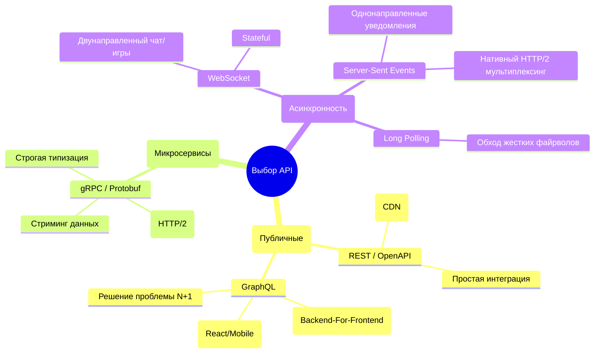
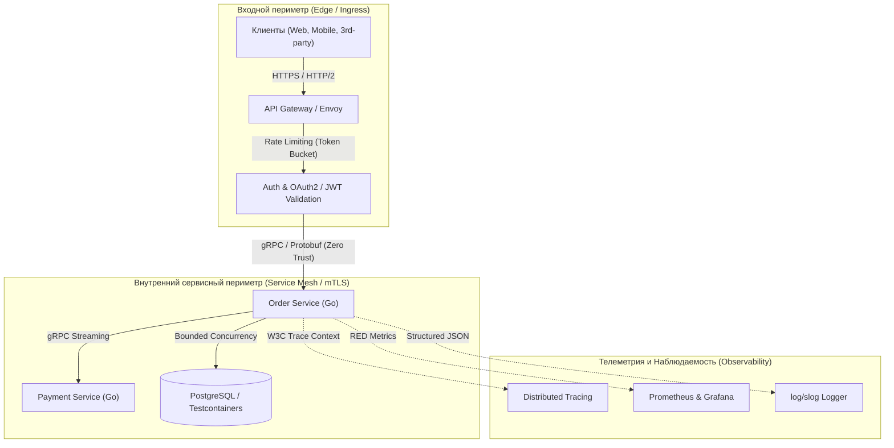

# Итоги раздела: Проектирование сетевых API глазами Go-разработчика

> *"Simplicity is prerequisite for reliability."*  
> — Эдсгер Дейкстра

## Гранд-финал: Анатомия идеального бэкенда

Мы завершили масштабное путешествие длиной в 40 глав по проектированию сетевых API и распределенных протоколов на языке Go. Наш путь начался с фундаментальных принципов сетевого стека и проектирования RESTful контрактов, прошел через бинарную физику Protobuf и потоки gRPC, охватил двунаправленные интерактивные протоколы WebSocket и SSE, укрепил сетевой периметр с помощью API Gateway, OAuth2 и взаимного шифрования mTLS, и увенчался низкоуровневой оптимизацией работы с оперативной памятью под надзором сборщика мусора.

Разница между начинающим программистом и опытным Senior-архитектором лежит вовсе не в знании синтаксических конструкций языка. Она заключается в развитой инженерной интуиции, способности предвидеть нештатные сбои, глубоком понимании концепции **Mechanical Sympathy** (как код взаимодействует с регистрами процессора, сокетами ОС и шиной памяти) и, главное, в умении проектировать контракты, с которыми другим инженерам приятно и комфортно работать.

В этой завершающей главе мы систематизируем весь пройденный опыт в единую архитектурную карту знаний и сформулируем бескомпромиссный чек-лист идеального сетевого сервиса.

---

## Матрица протоколов: Что и когда использовать

В распределенных системах не существует универсальной «серебряной пули». Любое архитектурное решение представляет собой осознанный компромисс между задержкой (Latency), простотой интеграции, нагрузкой на сеть и сложностью поддержки:

---

## Чек-лист Senior Go-разработчика

Перед тем как нажать заветную кнопку «Merge» и выпустить новый сервис в рабочий кластер Kubernetes, прогоните ваше решение по следующим контрольным точкам. Если хотя бы на один пункт вы отвечаете «Нет», система содержит мину замедленного действия.

### 1. Проектирование контракта (Design-First)
- [ ] **Контракт первичен.** Написан ли спецификационный файл `openapi.yaml` или `.proto` ДО написания бизнес-логики в Go?
- [ ] **Идемпотентность.** Если мутирующий метод `POST` или `PATCH` будет отправлен повторно из-за обрыва соединения, защищен ли сервис через `Idempotency-Key`?
- [ ] **Пагинация.** Защищены ли списочные эндпоинты (`GET /items`) жесткими лимитами (`limit=100`), чтобы исключить выгрузку миллиона строк в память?
- [ ] **Версионирование.** Заложена ли стратегия версионирования (в URL для REST или в `package` схемах для gRPC), чтобы обеспечить эволюцию контрактов?

### 2. Безопасность и Периметр
- [ ] **Аутентификация.** Валидируется ли JWT токен на уровне Middleware (или API Gateway), и проверяется ли алгоритм подписи (защита от Key Confusion)?
- [ ] **Ограничение Payload.** Обернут ли входящий `r.Body` в `http.MaxBytesReader` для предотвращения загрузки терабайтных потоков в оперативную память?
- [ ] **Rate Limiting.** Защищен ли эндпоинт от перегрузок и DDoS с помощью алгоритма Token Bucket (в Redis или локальной памяти)?
- [ ] **mTLS.** Если это закрытый межсервисный обмен, защищен ли трафик взаимным шифрованием сертификатов в парадигме Zero Trust?

### 3. Эксплуатация и Observability
- [ ] **Graceful Shutdown.** Перехватывает ли `main.go` системный сигнал `SIGTERM` и ожидает ли завершения активных соединений (с учетом паузы The Sleep Hack для Kubernetes)?
- [ ] **Таймауты сервера.** Сконфигурированы ли явные тайм-ауты `ReadTimeout`, `ReadHeaderTimeout` и `WriteTimeout` в структуре `http.Server` для нейтрализации Slowloris-атак?
- [ ] **Context Propagation.** Передается ли родительский `r.Context()` во все вызовы к БД, кэшам и HTTP-клиентам для прерывания работы при разрыве сокета?
- [ ] **Трассировка.** Пробрасывается ли идентификатор `Trace ID` (стандарт W3C Trace Context) через все межсервисные вызовы и фиксируется ли он в логах `log/slog`?
- [ ] **Метрики RED.** Экспортирует ли сервис в Prometheus метрики Rate, Errors, Duration? Очищены ли URL-метки от пользовательских ID для исключения взрыва кардинальности?

### 4. Тестирование
- [ ] **Быстрые интеграции.** Применяется ли пакет `httptest` для молниеносного тестирования HTTP-обработчиков без биндинга реальных TCP-портов?
- [ ] **Изоляция БД.** Используется ли библиотека `Testcontainers` (подъем честного PostgreSQL в Docker) вместо синтетического SQLite, со сбросом транзакций (Rollback) после каждого теста?
- [ ] **Contract Testing.** Верифицируются ли контракты взаимодействия между микросервисами (с помощью инструментов Contract Testing, таких как Pact или валидаторов схем OpenAPI)?

---

## Квинтэссенция Mechanical Sympathy в Go

Первоклассный сетевой сервис на Go — это сервис, который помогает рантайму языка работать с максимальной эффективностью:

1. **Меньше мусора (GC Pressure):**  
   Избегайте передачи переменных через нетипизированный `interface{}` / `any`. Предварительно аллоцируйте срезы фиксированной длины `make([]T, 0, len)`. В горячих точках ввода-вывода используйте переиспользуемые буферы `bytes.Buffer`, извлекаемые из пула `sync.Pool`.
2. **Горутины — не бесплатны:**  
   Порождение сотен тысяч горутин способно мгновенно исчерпать пул подключений к базе данных и забить планировщик Go. Контролируйте конкурентность фоновых задач с помощью семафоров на буферизованных каналах (**Bounded Concurrency**).
3. **Блокировки без простоя:**  
   Применяйте асинхронные пакетные сбросы (**Async Flush**) для обновления квот, счетчиков и метрик. Вместо блокировки входящих HTTP-обработчиков тяжелыми мьютексами используйте атомарные примитивы пакета `sync/atomic` для счетчиков в оперативной памяти.

---

> [!tip] Главное правило создания API
> **Эмпатия к потребителю.**  
> Ваш код может исполняться за микросекунды, а архитектура — выглядеть безупречно на диаграммах. Но если ваша документация фрагментарна или устарела, ошибки возвращают неинформативный статус `500 Internal Server Error` без объяснения причин, а при очередном обновлении сервиса у клиентов рвутся TCP-соединения — интеграторы возненавидят ваш сервис. Проектируйте сетевые API так, чтобы интеграция с ними приносила другим разработчикам радость и уверенность.

---

## Финал

Архитектура высоконагруженного бэкенда — это бесконечный процесс нахождения выверенных компромиссов между скоростью разработки, аппаратными ресурсами, отказоустойчивостью и простотой сопровождения. В рамках этого модуля мы изучили весь арсенал инструментов современного Go-инженера, опираясь на физику сетей и механику компилятора.

Создавайте отказоустойчивые системы, пишите чистый код, сочувствуйте железу и никогда не теряйте контекст!

Впереди нас ждет переход на следующий концептуальный уровень — проектирование крупномасштабных распределенных систем, микросервисных паттернов, репликации и надежного хранения данных в следующем модуле: **[[../11. Архитектура и System Design/README.md|11. Архитектура и System Design]]**.
