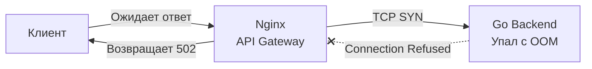

## Статусы HTTP: Контракт возврата в распределенной системе

В классическом языке C функции традиционно возвращали целочисленный статус завершения: `0` при триумфальном успехе или отрицательный код ошибки из заголовочного файла `errno.h` (например, `-ENOENT` при отсутствии файла или `-EACCES` при отказе в доступе). Этот лаконичный числовой минимализм стал фундаментом Unix. 

В языке Go мы привыкли работать с выразительными парами `nil, err` и детально анализировать природу сбоев через типизированные цепочки `errors.Is` и `errors.As`.

Однако как только вызов преодолевает границу процесса и уходит в распределенную сеть, этот локальный процедурный комфорт мгновенно исчезает. Клиент на Swift или TypeScript не имеет доступа к вашим Go-структурам ошибок. Более того, на пути сетевого пакета стоят промежуточные маршрутизаторы, CDN-узлы, балансировщики нагрузки (Nginx, Envoy) и защитные экраны.

В распределенных системах универсальным языком результата выступают **коды состояния HTTP (Status Codes)**. Если сетевой HTTP-метод ([[5. HTTP методы и идемпотентность]]) задает сигнатуру операции, то статус-код — это ее строгий `return type`. Использование корректных статус-кодов жизненно необходимо: вся сетевая инфраструктура мира принимает решения о кэшировании, маршрутизации и повторах (retries), опираясь исключительно на эти трехзначные числа.

## Классификация: Пять семейств

Спецификация HTTP разделяет пространство кодов на 5 дискретных сотен, где старший разряд определяет фундаментальный класс ответа:

* **1xx (Информационные / Informational):** Промежуточные протокольные подтверждения. В прикладном REST практически не задействованы (ключевое исключение — статус `101 Switching Protocols`, используемый при согласовании перехода на протокол [[22. WebSocket]]).
* **2xx (Успех / Successful):** Запрос клиента успешно принят, валидирован и обработан сервером.
* **3xx (Перенаправление / Redirection):** Для завершения операции клиенту необходимо предпринять дополнительное сетевое действие (перейти по новому адресу).
* **4xx (Ошибка клиента / Client Error):** Нарушение контракта со стороны вызывающего клиента. Запрос синтаксически некорректен, лишен прав авторизации или ссылается на фантомный ресурс. Повторять запрос *в неизменном виде* бессмысленно — он гарантированно упадет с той же ошибкой.
* **5xx (Ошибка сервера / Server Error):** Клиент сформировал безупречный запрос, однако сервер потерпел внутреннее крушение (паника в рантайме, отказ СУБД, аппаратный таймаут). Запрос *допустимо* повторить позже с экспоненциальным backoff (если вызываемый метод идемпотентен).

---

## 2xx Успех: Больше, чем просто 200

Распространенная ошибка начинающих разработчиков — возвращать универсальный `200 OK` на абсолютно любые успешные операции в системе. Подобный подход лишает вызывающего клиента и кэширующие прокси критически важного семантического контекста.

* **200 OK:** Стандартный канонический ответ для методов безопасного чтения `GET`, а также для синхронных мутаций `PUT` и `PATCH`. Если эндпоинт модифицирует ресурс, в теле ответа клиенту возвращается свежее актуальное представление измененного объекта.
* **201 Created:** Обязательный статус для успешного метода `POST`, создавшего новую доменную сущность в системе.
  * *Специфика контракта:* Согласно стандарту REST, вместе с кодом 201 сервер обязан отправить HTTP-заголовок `Location`, содержащий абсолютный или относительный URI созданного ресурса (например: `Location: /users/123`).
* **202 Accepted:** Фундаментальный статус для проектирования асинхронных бэкендов. Он сообщает клиенту: *«Твое задание принято, прошло первичную валидацию и поставлено в фоновую очередь (например, в RabbitMQ или Kafka), однако его обработка еще не завершена»*. Клиент не должен держать открытым сетевой сокет, блокируя ресурсы.
* **204 No Content:** Идеальный код для идемпотентного метода `DELETE` или мутаций, не возвращающих данных. Он декларирует: *«Операция завершена с абсолютным успехом, но серверу не требуется передавать полезную нагрузку в теле ответа»*. Это экономит миллионы сетевых байт и разгружает десериализаторы на клиенте.

---

## 4xx Ошибки клиента: Зона ответственности Frontend / API Consumer

Ошибки класса 4xx сигнализируют о том, что контракт нарушен вызывающей стороной.

### 400 Bad Request vs 422 Unprocessable Entity
Классический камень преткновения на архитектурных ревью: как провести границу между этими двумя кодами? В идиоматичном Go-сообществе выработался строгий водораздел:

* **400 Bad Request:** Ошибка *синтаксиса и декодирования*. Клиент прислал невалидный JSON, оборванный поток байт либо нарушил типы данных на этапе парсинга.
  * Если вызов `json.NewDecoder(r.Body).Decode(&dto)` завершается ошибкой (например, клиент передал строку `"foo"` в целочисленное поле типа `int`) — это безусловный статус 400. Рантайм Go физически не смог разобрать байтовый поток в структуру.
* **422 Unprocessable Entity:** Ошибка *семантики и бизнес-правил*.
  * Входящий JSON синтаксически идеален, Go без проблем смапил его в структуру. Однако последующая валидация бизнес-ограничений (например, через библиотеку валидатора `validator.Struct(dto)`) показала, что поле `age` содержит значение `-5`, а строка `email` не содержит обязательного символа `@`. Формат верен, но смысл данных неприемлем. Это канонический статус 422.

### 401 Unauthorized vs 403 Forbidden
Оба статуса касаются безопасности, однако их семантика диаметрально противоположна (подробно архитектуру безопасности мы разберем в статье [[28. Security API. Auth, OAuth2]]):
* **401 Unauthorized:** Ошибка Аутентификации (Authentication). Сервер заявляет: *«Я не могу подтвердить твою личность»*. Клиент не прикрепил токен JWT, либо переданный токен просрочен или поврежден.
* **403 Forbidden:** Ошибка Авторизации (Authorization). Сервер заявляет: *«Я прекрасно знаю, кто ты, но у твоей роли нет прав на данный ресурс»*. Токен валиден, личность установлена, но обычный пользователь пытается удалить системную запись администратора.

### 404 Not Found vs 405 Method Not Allowed
* **404 Not Found:** Целевой ресурс физически отсутствует по указанному адресу: например, `GET /users/999` (пользователя с ID 999 нет в таблице БД).
* **405 Method Not Allowed:** Ресурс существует, URL абсолютно корректен, однако запрошенный HTTP-метод запрещен политикой ресурса. Например, клиент отправляет `POST /users/123`, тогда как для конкретного документа пользователя разрешены только операции чтения `GET` и удаления `DELETE`.

> [!info] Под капотом: Роутер Go 1.22+
> Начиная с версии Go 1.22, встроенный стандартный маршрутизатор `http.ServeMux` аппаратно поддерживает корректную отдачу статуса 405. Если вы зарегистрировали маршрут `mux.HandleFunc("GET /users/{id}", handler)`, а внешний клиент отправляет `POST /users/123`, стандартный роутер Go самостоятельно отсечет запрос со статусом `405 Method Not Allowed` и автоматически сгенерирует заголовок `Allow: GET`, строго соблюдая требования спецификации RFC.

### 409 Conflict
Используется при нарушении инвариантов бизнес-состояния или конкурентных коллизиях. Хрестоматийный пример: попытка зарегистрировать пользователя с адресом `email`, который уже занят в базе данных (нарушение Unique Constraint). Также статус 409 незаменим в алгоритмах оптимистической блокировки (Optimistic Locking), когда два клиента пытаются одновременно обновить одну версию документа.

### 429 Too Many Requests
Сигнализирует о срабатывании защитных лимитов API (Rate Limiting). Обязан сопровождаться служебным заголовком `Retry-After`, информирующим клиента о количестве секунд, через которое допустимо возобновить отправку запросов. Подробную физику алгоритмов троттлинга мы изучим в статье [[11. Rate limiting в API]].

---

## 5xx Ошибки сервера: Зона ответственности Backend Engineer

Всплеск ответов 5xx в графиках Prometheus — повод для немедленного срабатывания алертов дежурной смены инженеров:

* **500 Internal Server Error:** Неперехваченная паника (`panic`), внезапный разрыв сокета СУБД посреди транзакции или любая непредвиденная ошибка, которую код не смог классифицировать.
* **502 Bad Gateway:** Внешний шлюз (Nginx, Envoy, Ingress) не смог установить сетевое TCP-соединение с Go-сервисом (процесс упал, завершился по `panic`, либо контейнер был уничтожен ядром из-за OOM Killer).
* **503 Service Unavailable:** Сервер находится в рабочем состоянии, но временно не может принять новый трафик. Выставляется в фазе Graceful Shutdown (когда сервер дорабатывает старые соединения, но отвергает новые), либо при срабатывании защитных механизмов Shedding под критической перегрузкой.
* **504 Gateway Timeout:** Шлюз Nginx успешно подключился к Go-сервису, передал запрос, однако бэкенд завис на тяжелом SQL-запросе и не уложился в отведенный сетевой таймаут проксирования.



---

## Mechanical Sympathy: Как net/http работает со статусами

В среде Go запись сетевого ответа возложена на системный интерфейс `http.ResponseWriter`. Механика взаимодействия с ним подчиняется жесткому алгоритмическому порядку, нарушение которого ведет к скрытым дефектам в production.

### Анатомия ResponseWriter

```go
package main

import (
    "net/http"
)

func myHandler(w http.ResponseWriter, r *http.Request) {
    // 1. Установка заголовков - СТРОГО ДО фиксации статуса и записи тела
    w.Header().Set("Content-Type", "application/json")
    
    // 2. Явная фиксация числового HTTP-статуса
    w.WriteHeader(http.StatusCreated) // 201 Created
    
    // 3. Отправка полезной нагрузки в сетевой сокет
    w.Write([]byte(`{"status":"success"}`)) 
}
```

> [!warning] Ловушка / Gotcha: Неявный 200 OK
> Что произойдет, если разработчик забудет вызвать `w.WriteHeader(...)` и сразу начнет писать полезную нагрузку через `w.Write([]byte("data"))`?
> 
> Рантайм Go не выбросит ошибку компиляции. В исходном коде пакета `net/http` (файл `server.go`) зашита неявная логика: при первом же обращении к методу `Write` рантайм автоматически инициирует отправку заголовков с дефолтным кодом **`w.WriteHeader(http.StatusOK)`**!
> 
> Если после этого в коде последует запоздалый вызов `w.WriteHeader(http.StatusBadRequest)`, Go проигнорирует новый статус и выведет в системный лог предупреждение:
> `http: multiple response.WriteHeader calls`
> Изменить статус невозможно: заголовок первого TCP-пакета с числом 200 уже улетел в сетевую карту!

### Sniffing контента
Если обработчик не установил заголовок `Content-Type` явно, стандартный пакет `net/http` при первом вызове `w.Write` берет первые 512 байт полезной нагрузки и запускает алгоритм эвристического анализа содержимого (MIME sniffing через `http.DetectContentType`). Это тратит лишние такты CPU на каждом запросе. В высоконагруженных системах (Highload) всегда явно проставляйте `w.Header().Set("Content-Type", ...)`.

> [!tip] Собеседование
> **Вопрос:** В чем заключается скрытая опасность вызова `fmt.Fprint(w, err)` по сравнению со стандартным хелпером `http.Error(w, err.Error(), code)`?
> **Ответ:** Вызов `fmt.Fprint(w, err)` или прямой метод `w.Write` просто запишет текст ошибки в сокет, спровоцировав неявную отправку статуса `200 OK`! Внешний клиент или фронтенд решит, что операция прошла успешно, попытается распарсить тело как JSON и упадет с паникой.
> 
> Функция `http.Error` под капотом выполняет три атомарных действия в строгой канонической последовательности:
> 1. Устанавливает безопасный заголовок `Content-Type: text/plain; charset=utf-8` (отключая дорогой sniffing).
> 2. Устанавливает служебный заголовок `X-Content-Type-Options: nosniff`.
> 3. Вызывает `w.WriteHeader(code)` с правильным кодом ошибки (4xx или 5xx).
> 4. Записывает текст ошибки в тело через `w.Write`.

---

## Итог

1. Коды состояний HTTP — это строгий `return type` сетевого контракта, понятный промежуточным прокси и клиентам на любых платформах.
2. Семейство 2xx сообщает о деталях успеха: используйте `201 Created` с заголовком `Location` для создания сущностей, `202 Accepted` для очередей и `204 No Content` для удаления.
3. Семейство 4xx четко локализует вину клиента: разделяйте синтаксический мусор (400) и бизнес-ошибки валидации (422), аутентификацию (401) и авторизацию (403).
4. Семейство 5xx сигнализирует о сбоях инфраструктуры и служит триггером для SRE-мониторинга и алертов.
5. Соблюдайте физиологию `http.ResponseWriter` в Go: заголовки и вызов `w.WriteHeader` обязаны предшествовать записи тела через `w.Write`, исключая ловушку «неявного 200 OK».

Мы полностью разобрали, как задавать действие ресурса через методы и как возвращать результат через числовые статусы. Остается ключевой вопрос физического представления: в каком именно формате данные летят по сети? Вечную битву текстового JSON и бинарного Protocol Buffers мы детально препарируем в следующей статье: [[7. Форматы данных JSON vs Protobuf]].
