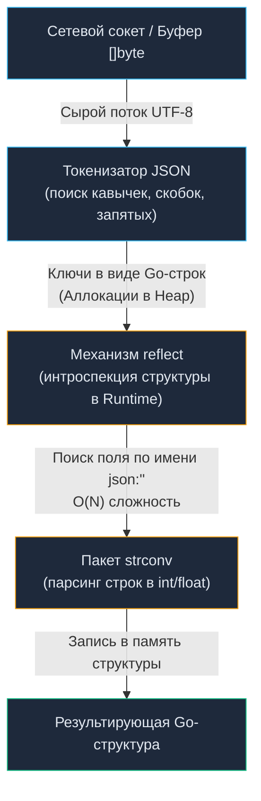
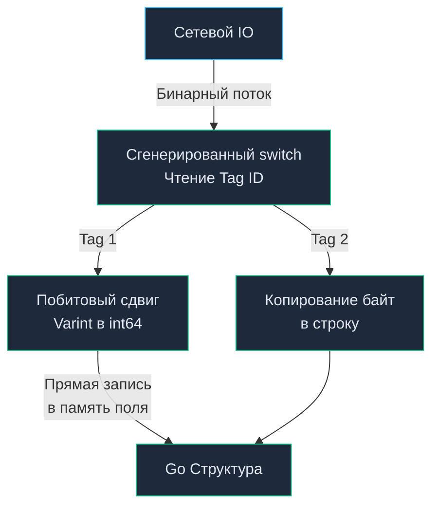

# 7. Форматы данных: JSON против Protobuf

Любая компьютерная программа оперирует абстракциями: структурами, срезами, деревьями и указателями. Однако операционная система и физический сетевой кабель не имеют ни малейшего представления о типах вашего языка программирования. Сетевая карта (NIC), коммутатор и ядро Linux понимают только одно: непрерывный линейный поток сырых байтов.

Чтобы отправить объект по сети, его необходимо **«сплющить» (сериализовать, marshal)** в одномерный массив байтов, а на принимающей стороне — **«надуть» обратно (десериализовать, unmarshal)** во внутреннее представление языка. 

В современной сетевой архитектуре схлестнулись два фундаментальных подхода:
- **Текстовый самоописываемый формат:** вездесущий **JSON** (JavaScript Object Notation).
- **Бинарный контрактный формат:** **Protocol Buffers** (Protobuf), созданный в Google.

Выбор между ними — это не вопрос эстетики или привычки. Это глубокий инженерный компромисс между удобством чтения для человека (Human Readability) и «механическим сочувствием» к процессору, оперативной памяти и сетевой полосе (Mechanical Sympathy).

---

## Битва форматов: Текст против Бинарников

Представьте, что вам нужно отправить по почте комплект мебели:
- **Подход JSON:** Вы упаковываете шкаф в собранном виде и на каждый ящик наклеиваете подробную записку на естественном языке: *«Это дубовый выдвижной ящик номер 3, внутри лежит 15 синих носков»*. Получатель тратит время на чтение текста, разбор почерка и распаковку огромной полупустой коробки.
- **Подход Protobuf:** Вы отправляете плоскую компактную упаковку деталей (Flat Pack), где нет ни единого лишнего слова. К посылке прилагается чертеж с номерами деталей (`.proto`). Роботизированная сборочная линия (`protoc`) мгновенно считывает номер штампа `3` и защелкивает деталь на нужное место.

Ниже приведено прямое сопоставление фундаментальных характеристик обоих миров:

| Характеристика | JSON | Protocol Buffers (Protobuf) |
| :--- | :--- | :--- |
| **Природа представления** | Текстовый формат (ASCII / UTF-8) | Бинарный формат (байтовые поля и флаги) |
| **Самоописываемость** | **Да** (имена ключей передаются в каждом сообщении) | **Нет** (требуется независимая внешняя схема `.proto`) |
| **Схема данных** | Необязательна (JSON Schema опциональна) | **Обязательна** (строгий компилируемый контракт) |
| **Оверхед накладных расходов** | Высокий (повторяющиеся текстовые ключи, пробелы) | Минимальный (числовые теги, сжатие чисел Varint) |
| **Парсинг в Go рантайме** | Медленный: рефлексия `reflect`, поиск полей, `strconv` | Сверхбыстрый: сгенерированный ассемблер/Go-код, сдвиги бит |
| **Нагрузка на память и GC** | Массовые аллокации в Heap (`interface{}`, строки) | Минимальные аллокации (прямая запись по смещениям) |
| **Читаемость человеком** | Идеальная (DevTools, `curl`, лог-файлы) | Нулевая (требует утилиты декодирования и `.proto` схему) |
| **Основная ниша** | Public Web API, Mobile Apps, Server-to-Frontend | Внутренние микросервисы (RPC), HighLoad, gRPC |

---

## JSON: Удобство, за которое мы платим производительностью

JSON завоевал мир благодаря веб-браузерам: любой движок JavaScript парсит его «из коробки», а разработчик может открыть консоль `curl` или Chrome DevTools и мгновенно прочитать сетевой ответ без компиляторов и сторонних утилит. Сообщение самоописываемо: глядя на `{"id": 42, "status": "active"}`, мы сразу понимаем структуру данных.

Однако для статически типизированных компилируемых языков — и особенно для Go — обработка текстового JSON на высоких RPS превращается в тяжелейшее испытание для процессора и сборщика мусора.

### Как работает `encoding/json` под капотом

Стандартный пакет `encoding/json` универсален: он умеет парсить произвольный JSON в произвольную Go-структуру. Но цена этой универсальности — динамический механизм **Reflection** (пакет `reflect`). Поскольку Go — статически типизированный язык, а JSON — динамический формат, рантайму нужно во время выполнения программы (runtime) сопоставить строки из JSON-байтов с полями вашей структуры.



Процесс десериализации (`json.Unmarshal`) выглядит так:
1. **Токенизация и лексический анализ:** Сканер побайтово обходит входной срез `[]byte`, отыскивая фигурные скобки, кавычки и запятые, чтобы разбить текст на токены. Процессор тратит такты на разбор пробелов, переносов строк и экранированных символов (`\n`, `\"`).
2. **Аллокация строк для ключей:** Ключи из JSON превращаются в Go-строки, создавая аллокации в куче (Heap).
3. **Рефлексия (Reflection Overhead):** Для каждого ключа `encoding/json` вызывает `reflect.ValueOf(&struct).Elem().FieldByName("key")` (или линейно перебирает поля), чтобы найти нужное поле в структуре, проверяя его теги `json:"key"`. Линейный перебор полей и кэширование метаданных в `reflect` создают массу косвенных переходов по указателям, сбивая кэш инструкций L1i и конвейер CPU.
4. **Приведение типов (Type Coercion):** Строковое представление числа `"123"` парсится в `int` через вызовы пакета `strconv` (например, `strconv.Atoi` или `strconv.ParseInt`), выполняя циклы умножений на 10 и вычитания символа `'0'`.

> [!info] Под капотом: Escape Analysis и GC Pressure
> Главная проблема JSON в Go — это чудовищное давление на Garbage Collector (GC).
> 
> Во-первых, функция `json.Unmarshal(data []byte, v interface{})` принимает `interface{}`. Как только вы передаете указатель на вашу структуру в интерфейс, **Escape Analysis** компилятора гарантированно отправляет эту структуру в кучу (Heap), даже если она живет только в рамках одной функции-обработчика.
> 
> Во-вторых, процесс парсинга создает множество промежуточных объектов: токены, строки ключей, интерфейсы для вложенных объектов. Все это аллоцируется в куче, заставляя GC просыпаться чаще, тратить такты CPU на фазу Mark и увеличивать Tail Latency (задержки на 99-м перцентиле) вашего API.

> [!warning] Ловушка / Gotcha: Потеря точности int64
> В JSON нет типа `int64`, есть только абстрактный `Number`. Если вы десериализуете JSON с большим числом в `map[string]interface{}` (или `map[string]any`), стандартный `encoding/json` по умолчанию распарсит его как `float64` (число с плавающей точкой двойной точности по стандарту IEEE 754).
> 
> `float64` не может без потерь хранить целые числа больше $2^{53} - 1 = 9\,007\,199\,254\,740\,991$. Если это был ID из базы (например, Snowflake ID, ULID или `int64` первичный ключ), он будет искажен: число `9007199254740993` превратится в `9007199254740992`.
> 
> **Решение:** Использовать `json.NewDecoder(r).UseNumber()`. Это заставит парсер сохранять числа как тип `json.Number` (под капотом это строка), которую потом можно безопасно перевести в `int64`:
> ```go
> dec := json.NewDecoder(r)
> dec.UseNumber() // сохраняет числа как json.Number
> 
> var data map[string]interface{}
> if err := dec.Decode(&data); err != nil {
>     return err
> }
> 
> num := data["id"].(json.Number)
> id, err := num.Int64()
> ```

---

## Protocol Buffers (Protobuf): Максимальная Mechanical Sympathy

Protobuf — это бинарный формат сериализации от Google. В отличие от JSON, он не является самоописываемым. Он требует **схемы** — `.proto` файла, который описывает структуру контракта.

```protobuf
// пример контракта
syntax = "proto3";

package billing.v1;

message User {
  int64 id = 1;
  string name = 2;
  bool is_active = 3;
}
```

Ключевая особенность: вместо имен полей (`"id"`, `"name"`) Protobuf использует числовые теги (`1`, `2`, `3`). В полет по сети отправляются только эти числа-теги и сами значения в бинарном виде.

### Под капотом: Кодогенерация вместо Рефлексии

Главная магия Protobuf в Go заключается в **кодогенерации**. Утилита `protoc` вместе с плагином `protoc-gen-go` читает вашу схему и генерирует готовый `.pb.go` файл со структурами и, что самое важное, готовыми методами сериализации и десериализации.

Генерированный код точно знает расположение полей в памяти. Ему не нужен `reflect`. Когда приходит поток байт, парсер Protobuf читает тег поля (например, `1`), и через `switch tag { case 1: ... }` напрямую пишет значение в смещение памяти, соответствующее полю `Id` в структуре.



> [!info] Под капотом: Varint и битовые операции
> Protobuf не отправляет `int64` как сырые 8 байт (если вы явно не укажете `fixed64`). Он использует кодирование **Varint** (алгоритм LEB128). Небольшие числа (например, 1 или 50) будут занимать в сети всего 1 байт, а не 8.
> 
> Парсинг Varint — это быстрые побитовые операции сдвига (`>>`, `<<`) на уровне CPU. Это работает на порядки быстрее, чем парсинг строки `"12345"` в число через деление и сложение в цикле, как это делает `strconv.Atoi`.
> 
> Для знаковых чисел используется кодирование ZigZag (типы `sint32` / `sint64`), проецирующее отрицательные числа на положительную шкалу, чтобы избежать превращения малых отрицательных величин в 10 байт Varint.

### Формат провода (Wire Format)

Каждое поле в потоке байтов Protobuf кодируется парой `Key-Value`. Ключ (Key) объединяет номер поля и тип данных проволочного формата (**Wire Type**):

$$\text{Key} = (\text{field\_number} \ll 3) \mid \text{wire\_type}$$

| Wire Type | Название | Что кодирует |
| :---: | :--- | :--- |
| `0` | **Varint** | `int32`, `int64`, `uint32`, `uint64`, `sint32`, `sint64`, `bool`, `enum` |
| `1` | **64-bit** | `fixed64`, `sfixed64`, `double` (фиксированные 8 байт) |
| `2` | **Length-delimited** | `string`, `bytes`, вложенные сообщения `message`, упакованные срезы `repeated` |
| `5` | **32-bit** | `fixed32`, `sfixed32`, `float` (фиксированные 4 байта) |

### Преимущества Protobuf перед JSON

1. **Производительность CPU:** Десериализация Protobuf в Go работает в 3-10 раз быстрее `encoding/json` из-за отсутствия рефлексии и парсинга строк.
2. **Память и Аллокации:** Protobuf генерирует в разы меньше аллокаций. Структура известна заранее, размер слайсов часто передается вместе с ними. GC "отдыхает".
3. **Размер Payload:** Бинарный формат с Varint обычно в 2-4 раза меньше текстового JSON. Вы экономите пропускную способность сети.
4. **Строгий контракт:** Контракт задекларирован в `.proto` файле. Клиент на Python и сервер на Go гарантированно понимают типы друг друга. Невозможно прислать `string` вместо `int`.

> [!tip] Собеседование
> **Вопрос:** Если Protobuf настолько хорош, почему мы не используем его везде вместо JSON?
> 
> **Ответ:** 
> 1. **Отсутствие Human Readability:** Бинарный трафик нельзя просто прочитать глазами во вкладке Network браузера (без специальных плагинов) или через `curl`. Для инспекции пакетов требуется исходный `.proto` файл.
> 2. **Экосистема Frontend:** JavaScript в браузере работает с JSON нативно (на уровне движков V8 / SpiderMonkey, написанных на C++ через `JSON.parse`). Парсинг Protobuf в браузере часто реализуется на чистом JS/WASM, что сводит часть выгоды на нет, а браузерный транспорт требует шлюзов вроде gRPC-Web.
> 
> **Вывод:** Protobuf стал стандартом для Server-to-Server общения (через gRPC), а JSON — для общения Server-to-Frontend и публичных API.

---

## Оптимизация JSON: Путь джедая

Что делать, если архитектура требует HTTP/JSON (например, для публичного API или фронтенда), но производительность стандартного `encoding/json` уперлась в потолок?

В мире Go применяют паттерн **JSON Code Generation**. Библиотеки вроде `mailru/easyjson` или `ffjson` работают по принципу Protobuf. Вы пишете обычные Go-структуры, а утилита генерирует для них методы `MarshalJSON` и `UnmarshalJSON`.

Внутри этих методов нет рефлексии! Там находится сгенерированный хардкорный код конечного автомата (State Machine), который побайтово читает входной слайс и собирает структуру. Это дает буст скорости парсинга JSON в 2-4 раза и снижает количество аллокаций почти до нуля, приближая производительность текстового JSON к бинарным протоколам.

В последних версиях Go также популярна библиотека `goccy/go-json` или `json-iterator/go`, которые используют JIT-компиляцию или кэширование рефлексии, позволяя получить ускорение без необходимости запускать кодогенерацию перед каждой сборкой. Кроме того, в высоконагруженных проектах применяется библиотека `bytedance/sonic`, использующая SIMD-инструкции процессора (AVX2/AVX-512). В будущем ожидается появление `encoding/json/v2`, нацеленного на ускорение и сокращение аллокаций в стандартной библиотеке.

---

## Итог

1. **JSON** — идеален для публичных API и интеграции с фронтендом. Его легко дебажить, но он чудовищно прожорлив до CPU и памяти из-за рефлексии в Go и текстовой природы.
2. **Protobuf** — выбор для высоконагруженных внутренних микросервисов. Кодогенерация, прямая работа с памятью и бинарное сжатие (Varint) обеспечивают максимальную Mechanical Sympathy, разгружая сборщик мусора.
3. Проектируя высоконагруженные JSON API, всегда используйте оптимизированные библиотеки (`easyjson` / `goccy/go-json` / `json-iterator/go`) и будьте предельно осторожны с десериализацией чисел в `interface{}` (`map[string]interface{}`): не забывайте про `json.NewDecoder(r).UseNumber()`.

Определившись с тем, как данные передаются через сеть и в каком формате, мы переходим к одной из самых сложных проблем эксплуатации — эволюции этих контрактов. Как изменять структуру данных, не ломая старых клиентов? Об этом мы поговорим в следующей статье: [[8. Versioning API]].
