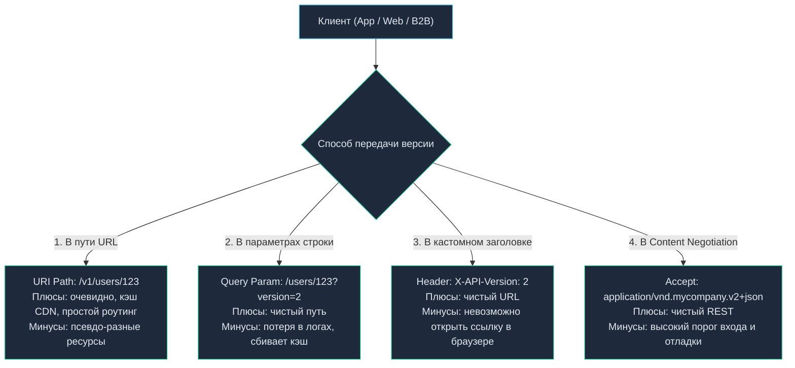
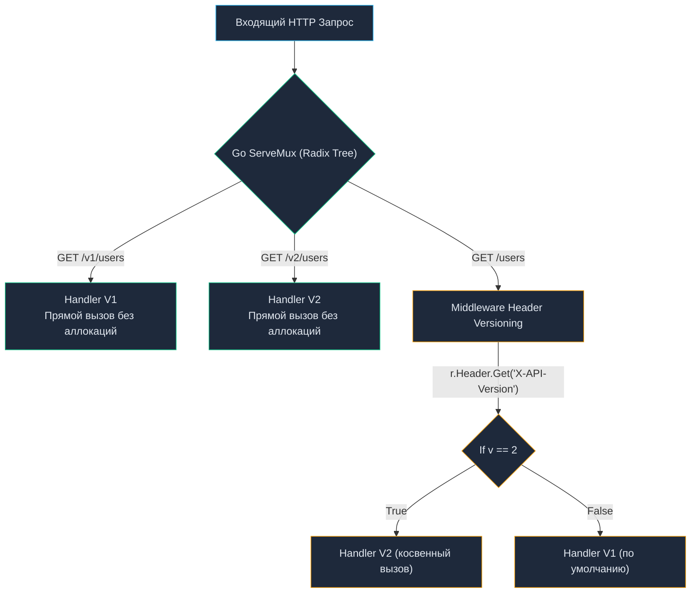

# 8. Версионирование API: Стратегии, Совместимость и Архитектура

> *«Программа не может считаться завершенной, пока жив ее последний пользователь».*    
> — Сидней Маркман

## Неизбежность изменений: Зачем API нужны версии

Мы спроектировали элегантный, ресурсный и строго типизированный контракт. Сервис развернут в production, к нему подключились тысячи клиентов: мобильные приложения для iOS и Android, Single Page Applications (SPA), внешние B2B-партнеры и смежные микросервисы. Проходит полгода, и бизнес приносит новую задачу: *«Структуру профиля пользователя нужно изменить: вместо одного поля `name` теперь требуются `first_name` и `last_name`, а идентификаторы заказов переводятся с 32-битных чисел на UUID»*.

В монолитном приложении внутри одной кодовой базы подобный рефакторинг тривиален: компилятор Go подсветит несовпадающие вызовы, и за пару коммитов вы обновите сигнатуры. Но в распределенной сетевой архитектуре вы **не контролируете клиентов**. Мобильное приложение на смартфоне пользователя может не обновляться годами. Если вы внезапно измените контракт на сервере, миллионы клиентов начнут падать с ошибками десериализации (`500 Internal Server Error` или аварийное завершение UI).

**Версионирование API** — это инженерный механизм эволюции контрактов, позволяющий сервису развиваться и внедрять новые бизнес-требования, гарантируя абсолютную работоспособность старых клиентов. Это осознанная страховка от сетевого хаоса, за которую мы платим дублированием транспортных DTO и усложнением маршрутизации.

---

## Когда нужна новая версия? (Breaking Changes)

Среди разработчиков часто возникает соблазн штамповать новые версии (`v2`, `v3`, `v4`) по малейшему поводу. Это порочный путь.

> **Золотое правило версионирования:**  
> Новая мажорная версия API выпускается **ИСКЛЮЧИТЕЛЬНО** при возникновении **ломающих изменений (Backward Incompatible / Breaking Changes)**.

Любые изменения контракта строго делятся на два класса:

### 1. Обратно совместимые изменения (Non-Breaking Changes) — Версия НЕ меняется
- Добавление нового поля в JSON-ответ сервера (согласно **закону Постела** / принципу робастности: клиенты обязаны игнорировать неизвестные поля).
- Добавление нового независимого эндпоинта (например, `POST /v1/users/{id}/avatar`).
- Добавление нового необязательного (optional) query-параметра или заголовка.
- Расслабление валидации входящих данных (поле ранее требовало ровно 10 символов, теперь разрешено от 5 до 20).

### 2. Ломающие изменения (Breaking Changes) — Требуется версия `v2`
- Удаление поля из структуры ответа или переименование ключа (например, `name` $\to$ `full_name`).
- Изменение типа данных поля (например, числовой идентификатор `id: 10452` заменяется на строковый UUID `id: "e4d2...""`).
- Добавление нового **обязательного (required)** поля в тело входящего запроса (старые клиенты не знают о нем и получат `400 Bad Request`).
- Изменение семантики или формата существующего поля (поле `amount` передавалось в долларах, а теперь передается в центах; дата передавалась как Unix Timestamp, а теперь как строка ISO 8601).
- Изменение кодов ответов успешного сценария (например, вместо `200 OK` с телом сервер возвращает `204 No Content`).

Глубокую теорию сохранения совместимости, закон Хайрума и семантическое версионирование мы подробно разберем в статье [[27. Backward compatibility.md]].

---

## 4 Стратегии версионирования в HTTP

Существует четыре классических способа передачи версии от клиента к серверу. У каждого подхода есть своя инженерная и архитектурная цена.



### 1. URI Versioning (Версионирование в пути URL)
Самый популярный подход в мировой индустрии (де-факто стандарт для Stripe, Google, Twilio, AWS, Telegram).
- **Пример запросов:** `GET /v1/users/123` и `GET /v2/users/123`
- **Преимущества:**
  - Абсолютная наглядность: версию видно невооруженным глазом в логах, в строке браузера, в документации.
  - Идеальная интеграция с сетевой инфраструктурой: балансировщики нагрузки (Nginx, HAProxy, Envoy, AWS ALB) маршрутизируют префиксы `/v1/` и `/v2/` на разные группы серверов без парсинга тел и заголовков.
  - Кэширование на CDN работает «из коробки»: разные пути формируют разные кэш-ключи (Cache Keys).
- **Недостатки:**
  - Нарушает академический пуризм REST ([[3. REST. Основные принципы.md]]), так как URI концептуально должен адресовать ресурс (пользователя с ID 123), а не формат его сериализации.

### 2. Query Parameter Versioning (В строке запроса)
- **Пример запроса:** `GET /users/123?version=2`
- **Преимущества:** Базовый URI ресурса `/users/123` остается неизменным. Легко реализовать значение по умолчанию (если параметр опущен — отдаем последнюю стабильную версию).
- **Недостатки:**
  - Параметр легко случайно потерять при клиентских редиректах или формировании ссылок.
  - Роутеры большинства языков и фреймворков строят дерево маршрутизации по пути URL, из-за чего маршрутизация по query-параметрам требует ручной диспетчеризации внутри middleware.

### 3. Custom Header Versioning (В HTTP-заголовках)
- **Пример запроса:** `GET /users/123` с заголовком `X-API-Version: 2` (или стандартизированным `API-Version: 2026-09-01`).
- **Преимущества:** URL ресурса абсолютно чист и неизменен.
- **Недостатки:**
  - Невозможно протестировать эндпоинт обычным переходом в браузере или поделиться ссылкой в мессенджере.
  - Невозможно использовать в стандартных HTML-тегах вроде ``, так как браузер не умеет передавать произвольные заголовки при запросе статических ресурсов через ``.
  - Требует настройки заголовка `Vary: X-API-Version` для корректной работы промежуточных прокси-кэшей.

### 4. Media Type / Accept Header (Content Negotiation)
Самый «каноничный» подход с точки зрения классической теории REST Филдинга (активно используется в GitHub API).
- **Пример запроса:** `GET /users/123` с заголовком `Accept: application/vnd.mycompany.v2+json`.
- **Преимущества:** Идеальная семантика: клиент запрашивает конкретное представление (Representation) единого ресурса.
- **Недостатки:** Высокая сложность конфигурирования. Отладка через утилиты командной строки (`curl`) требует громоздких флагов `-H "Accept: ..."`.

> [!tip] Собеседование
> **Вопрос:** Какой подход версионирования вы выберете для высоконагруженного публичного B2B API и почему?
> 
> **Ответ:** **URI Versioning (`/v1/`)**.
> 
> Несмотря на критику со стороны теоретиков REST, в реальной инженерной практике надежность и простота превосходят академическую красоту. Инфраструктурные компоненты (API Gateways, L7 Ingress-контроллеры, WAF, Envoy) мгновенно и без аллокаций анализируют путь URL. Это позволяет на уровне Nginx направить трафик устаревшей версии `/v1/` на старый кластер сервисов, а `/v2/` — на новую кодовую базу в Kubernetes, разделяя зоны отказов и снижая риск глобального сбоя.

---

## Mechanical Sympathy: Роутинг версий в Go

Выбор стратегии версионирования напрямую влияет на производительность рантайма Go и расход тактов CPU.

Начиная с Go 1.22, встроенный мультиплексор `http.ServeMux` поддерживает сопоставление путей и методов с использованием префиксного дерева маршрутов (**Radix Tree**). Поиск обработчика для паттерна `GET /v1/users/{id}` выполняется за время $O(K)$ (где $K$ — длина URL) и не требует аллокаций памяти в куче.

Если же вы выбираете версионирование через заголовки (`X-API-Version`), рантайм вынужден действовать обходным путем:



При использовании заголовков роутер сначала находит общий хендлер для пути `/users`, а затем в дело вступает middleware:
1. Вызов `r.Header.Get("X-API-Version")` ищет ключ в срезе заголовков через канонический перебор строк.
2. Программа совершает ветвления (`switch/if`), которые сбивают предсказатель переходов (Branch Predictor) процессора.
3. Логика сетевой маршрутизации просачивается в обработчики бизнес-логики.

Прямая маршрутизация по префиксу URL в `http.ServeMux` работает быстрее, чище и не производит паразитных аллокаций.

---

## Архитектура кода Go: Как не превратить проект в спагетти

Самая опасная архитектурная ловушка при внедрении новой версии — размещение условий `if/else` прямо в существующих обработчиках.

```go
// ПЛОХОЙ ПОДХОД (Антипаттерн «Спагетти-хендлер»)
func GetUserHandler(w http.ResponseWriter, r *http.Request) {
    user := db.GetUser()
    
    // Спагетти-логика версионирования прямо в хендлере
    if r.Header.Get("X-API-Version") == "2" {
        json.NewEncoder(w).Encode(UserV2Response{...})
        return
    }
    
    json.NewEncoder(w).Encode(UserV1Response{...})
}
```

Такой код мгновенно нарушает принцип единственной ответственности (SRP). При появлении `v3` и `v4` функция разрастается до сотен строк запутанных ветвлений, превращаясь в источник трудноуловимых регрессий.

### Idiomatic Go подход: Изоляция на уровне пакетов (Ports & Adapters)

Идиоматичный подход в Go опирается на чистую архитектуру: транспортный уровень изолируется по версиям, а ядро бизнес-логики (Domain / Use Cases) остается единым и **ничего не знает о версиях HTTP**.

**Рекомендуемая структура директорий проекта:**
```text
internal/
├── domain/               // Бизнес-логика, не знает про HTTP и версии
│   └── user.go           // Базовая структура User
├── api/
│   ├── v1/
│   │   ├── models.go     // DTO для v1 (например, Age int)
│   │   └── handlers.go   // Преобразует domain.User в v1.UserDTO
│   └── v2/
│       ├── models.go     // DTO для v2 (например, DateOfBirth string)
│       └── handlers.go   // Преобразует domain.User в v2.UserDTO
```

Пример реализации обработчика в изолированном пакете `v2`:

```go
// ПРАВИЛЬНЫЙ ПОДХОД: Изолированные обработчики
// Пакет internal/api/v2

type UserResponse struct {
    ID          string `json:"id"`
    DateOfBirth string `json:"date_of_birth"` // Новое поле в v2
}

type Handler struct {
    usecase UserUseCase
}

func (h *Handler) GetUser(w http.ResponseWriter, r *http.Request) {
    id := r.PathValue("id")
    
    // 1. Получаем единую доменную модель (не версионируется)
    domainUser, err := h.usecase.GetUser(r.Context(), id)
    if err != nil {
        http.Error(w, err.Error(), http.StatusNotFound)
        return
    }
    
    // 2. Мапим доменную модель в DTO конкретной версии (v2)
    response := UserResponse{
        ID:          domainUser.ID,
        DateOfBirth: domainUser.BirthDate.Format(time.RFC3339),
    }
    
    w.Header().Set("Content-Type", "application/json")
    json.NewEncoder(w).Encode(response)
}
```

Регистрация в главном маршрутизаторе:
```go
mux := http.NewServeMux()

// Версия v1
mux.HandleFunc("GET /v1/users/{id}", v1Handler.GetUser)

// Версия v2
mux.HandleFunc("GET /v2/users/{id}", v2Handler.GetUser)
```

> [!warning] Ловушка / Gotcha: Дублирование DTO
> Да, при таком подходе вам придется дублировать структуры запросов и ответов (DTO) для `v1` и `v2`, даже если они отличаются на 10%. В Go **явное дублирование DTO лучше, чем неявная связанность**. Если вы попытаетесь переиспользовать одну структуру между версиями, обвешав ее сложными тегами `json:"-"` и костылями, изменение в `v2` неизбежно сломает `v1`. Копирование (Copy-Paste) на уровне транспортных моделей API — это осознанный компромисс ради безопасности контракта.

---

## gRPC и Protocol Buffers: Версионирование из коробки

В отличие от REST, где версионирование остается на совести разработчика, в gRPC версионирование заложено в саму спецификацию (детальнее в [[16. gRPC. Основы.md]]).

В файле `.proto` версия указывается как часть пакета:
```protobuf
syntax = "proto3";

package mycompany.users.v1; // Версия жестко зашита в схему

message GetUserResponse { ... }
```

Когда вы генерируете Go-код, `protoc` создаст пакет `v1`, который будет жить независимо от `v2`. Вызов gRPC под капотом использует пути в стиле `/mycompany.users.v1.UserService/GetUser`, то есть gRPC на транспортном уровне HTTP/2 использует **URI Versioning**.

---

## Итог

1. **Меняйте мажорную версию только при ломающих изменениях** (удаление полей, смена типов, изменение логики валидации). Добавление новых полей безопасно.
2. **URI Versioning (`/v1/`)** — самый практичный, инфраструктурно-прозрачный и производительный способ в Go.
3. **Изолируйте версии в коде.** Создавайте отдельные пакеты `v1/` и `v2/` со своими независимыми структурами DTO. Бизнес-логика при этом должна оставаться единой и не знать о транспортных версиях.

Когда клиент делает запрос по правильному контракту нужной версии, мы надеемся на успех. Но в реальности сети нестабильны, базы данных падают, а пользователи присылают невалидные JSON. То, как вы отдаете ошибки наружу, формирует "лицо" вашего API. Правильному конструированию и маппингу ошибок в Go посвящена следующая статья: [[9. Error handling в API.md]].
