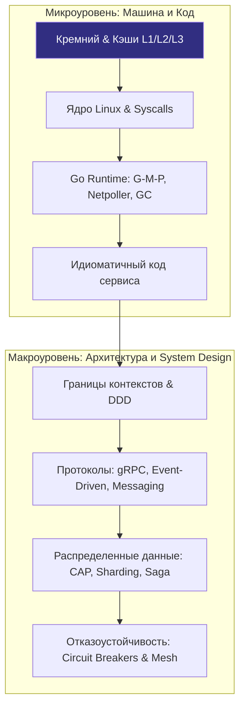
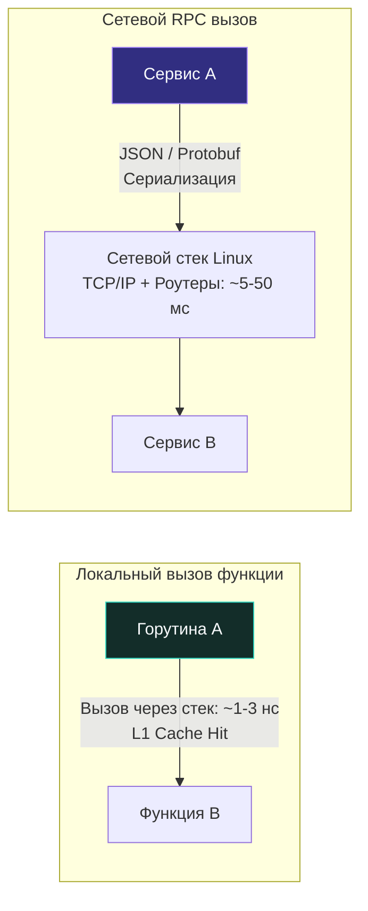

# Архитектура и System Design: От кода к распределенным системам

> *«Базовые принципы проектирования программного обеспечения — это простота, ясность и общность. В масштабах архитектуры простота означает проведение четких границ и безжалостный контроль зависимостей».*    
> — Брайан Керниган

Предыдущие десять разделов нашей инженерной энциклопедии заложили железобетонный фундамент: мы изучили физику кремниевых транзисторов процессора, иерархию кэшей и оперативной памяти, системные вызовы ядра ОС Linux, сетевой стек TCP/IP, а затем глубоко погрузились в язык Go — от базового синтаксиса до внутреннего устройства рантайма, планировщика G-M-P, аллокатора памяти и сборщика мусора. Вы умеете писать идиоматичный, выразительный код, находить утечки памяти и блокировки с помощью `pprof`, защищать сетевые хендлеры и избегать коварных ловушек конкурентности.

Теперь наступает переломный момент: нам необходимо подняться на следующий уровень абстракции. 

Код отдельной функции, структуры данных или изолированного сервиса — это лишь мельчайший кирпичик в огромном здании. Инженер уровня Senior/Lead Go Engineer обязан видеть систему целиком как единый живой организм: как десятки и сотни сервисов взаимодействуют друг с другом, как терабайты данных текут через распределенные конвейеры, как гарантировать надежность в условиях неизбежных сбоев серверов и как масштабировать инфраструктуру под натиском миллионов пользователей.

Этот раздел посвящен **архитектуре и системному дизайну (System Design)** — дисциплине, которая превращает разрозненный набор программ в отказоустойчивую, предсказуемую и масштабируемую инженерную экосистему.

---

### Почему архитектура — это не просто «крупный код»

Среди разработчиков распространено опасное заблуждение: будто архитектура — это просто когда кодовая база разрастается и ее нужно аккуратно разложить по каталогам. 

В действительности архитектура начинается задолго до того, как будет написана первая строка кода, и продолжается годами после развертывания в продакшен. Архитектура — это искусство принятия **труднообратимых решений**: выбор границ разделения доменов, моделей согласованности данных, протоколов сетевого взаимодействия и топологии отказоустойчивости.

> [!info] Mechanical Sympathy на уровне системы
> Если на уровне кода мы заботимся о кэш-линиях CPU, аллокациях в куче и переключениях контекста горутин, то на уровне архитектуры мы заботимся о задержках сети, пропускной способности каналов связи, времени ответа баз данных и ограничениях физического железа кластеров.  
> Архитектор с **Mechanical Sympathy** понимает: добавление еще одного синхронного сетевого вызова между сервисами — это не просто потеря читаемости, а **+N миллисекунд к латенси** из-за маршалинга, сетевых прыжков TCP (Network Hops) и десериализации. Это та же инженерная забота о физике вычислений, но спроецированная на масштаб распределенного кластера.

---

### Что вы найдете в этом разделе

Раздел выстроен методично: от фундаментальных требований и моделей компромиссов к продвинутым распределенным паттернам, с постоянной проекцией на идиомы языка Go.

#### Блок 1: Фундамент системного мышления
Мы начнем с определения того, что такое архитектура и какие уровни абстракции существуют ([[2. Что такое архитектура. Уровни абстракции и границы системы]]). Затем разберем разницу между функциональными и нефункциональными требованиями ([[3. Функциональные и нефункциональные требования]]), потому что именно нефункциональные требования (latency, throughput, availability) диктуют архитектурные решения. Мы погрузимся в SLA, SLO, SLI ([[4. SLA, SLO, SLI и как они влияют на дизайн]]) и фундаментальные компромиссы между задержкой, пропускной способностью и доступностью ([[5. Latency, Throughput, Availability и Trade-offs]]). Затем исследуем модели масштабирования ([[6. Вертикальное и горизонтальное масштабирование]]) и разницу между [[7. Stateless vs Stateful сервисы]].

#### Блок 2: Архитектурные стили и их эволюция
История развития бэкенд-архитектур: от монолита ([[8. Монолит. Когда он хорош и когда становится проблемой]]) через SOA ([[11. Service Oriented Architecture и эволюция архитектур]]) к микросервисам ([[9. Микросервисы. Преимущества, недостатки и мифы]]) и модульному монолиту ([[10. Модульный монолит как компромисс]]). Мы рассмотрим, почему микросервисы — это не серебряная пуля, а компромисс, и как Go с его легковесными горутинами и статической линковкой влияет на выбор между монолитом и микросервисами.

#### Блок 3: Проектирование модулей и доменов
Переход от «кода в папках» к управлению сложностью через границы. Мы изучим Domain-Driven Design и его ключевые концепты — Bounded Context и Aggregate ([[12. Domain Driven Design. Bounded Context и Aggregate]]), а затем применим их на практике через Hexagonal Architecture ([[13. Hexagonal Architecture. Ports and Adapters]]) и Clean Architecture ([[14. Clean Architecture и Dependency Rule]]). Вы увидите, как интерфейсы Go становятся идеальным инструментом для реализации Ports и инверсии зависимостей ([[17. Dependency Injection в Go на уровне архитектуры]]), и разберете структуру проектов ([[15. Layered Architecture. Классическая трехслойка]], [[16. Standard Go Project Layout и его ограничения]], [[18. Конфигурация приложения и 12 Factor App]]).

#### Блок 4: Взаимодействие сервисов
Синхронное vs асинхронное взаимодействие ([[19. Синхронное vs асинхронное взаимодействие сервисов]]), выбор между RPC, REST и Messaging ([[20. RPC vs REST vs Messaging]]). Мы детально разберем Event-Driven Architecture ([[21. Event Driven Architecture]]), паттерны Pub/Sub, Queue, Stream ([[22. Pub Sub, Queue, Stream модели]]) и продвинутые подходы CQRS ([[23. CQRS. Разделение чтения и записи]]) и Event Sourcing ([[24. Event Sourcing. Хранение событий вместо состояния]]).

#### Блок 5: Данные в распределенных системах
Распределенные транзакции и почему 2PC — это проблема в масштабируемых системах ([[25. Distributed Transactions. 2PC и проблемы]]), паттерн Saga с оркестрацией и хореографией ([[26. Saga Pattern. Оркестрация и хореография]]), идемпотентность и семантика exactly-once ([[27. Idempotency и exactly once семантика]]). Мы рассмотрим стратегии кэширования ([[28. Кэширование. Cache Aside, Write Through, Write Back]]), модели консистентности ([[29. Consistency модели. Strong, Eventual, Causal]]), теорему CAP и реальные компромиссы ([[30. CAP теорема и реальные компромиссы]]), а также партиционирование и репликацию данных ([[31. Partitioning и Sharding]], [[32. Репликация. Leader Follower и Multi Leader]]).

#### Блок 6: Надежность и отказоустойчивость
Здесь мы применим инженерный подход к неизбежным отказам: Circuit Breaker, Retry, Timeout и Backoff ([[36. Circuit Breaker, Retry, Timeout и Backoff]]), Bulkhead для изоляции отказов ([[37. Bulkhead и изоляция отказов]]), Rate Limiting ([[38. Rate Limiting и защита системы]]). Отдельно остановимся на Chaos Engineering ([[49. Chaos Engineering]]) как методологии проверки устойчивости системы.

#### Блок 7: Инфраструктурные паттерны и Observability
Service Discovery, API Gateway, Load Balancing — все то, что превращает набор контейнеров в работающий кластер ([[33. Load Balancing на уровне архитектуры]], [[34. Service Discovery. Client side и Server side]], [[35. API Gateway и BFF]]). И, конечно, Observability как первоклассный архитектурный concern: метрики, логи, трейсы ([[39. Observability в архитектуре. Metrics, Logs, Traces]]) и распределенная трассировка ([[40. Distributed Tracing и корреляция запросов]]).

#### Блок 8: Практика и мышление архитектора
Мы завершим раздел разбором подходов к System Design интервью ([[51. System Design интервью. Как подходить к задаче]]), типичных задач ([[52. Разбор типичных System Design задач]]), антипаттернов ([[53. Антипаттерны архитектуры]]) и сформулируем итоговое «мышление архитектора» для Go-разработчика ([[54. Итоги раздела. Мышление архитектора для Go разработчика]]).

---

### Связь с Go: почему язык влияет на архитектуру

Выбор языка программирования никогда не бывает нейтрален по отношению к архитектуре. Go накладывает глубокий отпечаток на системные решения:

1. **Горутины и легковесная конкурентность**: В Go создание сотен тысяч конкурентных задач — это норма, а не исключение. Это позволяет строить высококонкурентные сервисы без сложных пулов потоков, но требует понимания планировщика G-M-P и того, как блокирующие syscall'ы влияют на производительность. Архитектор должен понимать, когда горутина заблокируется на сетевом вызове и как это повлияет на общую пропускную способность.
2. **Каналы как примитив коммуникации**: Каналы в Go — это не просто очередь, а встроенный в язык механизм синхронизации. Они естественным образом подталкивают к архитектуре, основанной на передаче сообщений (CSP), что идеально ложится на Event-Driven подходы.
3. **Интерфейсы и слабая связность**: Интерфейсы Go удовлетворяются неявно (duck typing). Это делает инверсию зависимостей и внедрение зависимостей ([[17. Dependency Injection в Go на уровне архитектуры]]) чрезвычайно простыми и естественными. Hexagonal Architecture в Go реализуется элегантно, без тяжеловесных DI-фреймворков.
4. **Статическая компиляция и деплой**: Один бинарный файл без внешних зависимостей упрощает развертывание микросервисов в контейнерах, но одновременно накладывает ограничения на динамическую подгрузку модулей (плагины Go все еще не mainstream). Это влияет на стратегии обновления и версионирования сервисов ([[46. Версионирование сервисов и API]]).
5. **Работа с памятью и GC**: Понимание того, как работает GC и escape analysis, напрямую влияет на latency-sensitive системы. Архитектор должен учитывать, что сервис на Go может давать предсказуемую, но не всегда минимальную задержку из-за пауз GC. Настройка GOGC и GOMEMLIMIT становится частью архитектурного решения, а не просто тюнинга.

---

### От кода к архитектуре: смена парадигмы

Когда вы пишете отдельную функцию или пакет, ваша зона ответственности — корректность, производительность и читаемость этого конкретного фрагмента кода. Когда вы проектируете систему, зона ответственности расширяется до четырех фундаментальных измерений:

- **Границы (Boundaries):** Где заканчивается зона ответственности одного сервиса и начинается контракт другого?
- **Потоки данных (Data Flows):** Как данные перемещаются от пользователя через API Gateway, сеть микросервисов, кэши, базы данных и обратно? Где узкие места?
- **Отказы (Fault Tolerance):** Что произойдет, если упадет один из 50 сервисов или разорвется связь между датацентрами? Как система плавно деградирует?
- **Эволюция (System Evolution):** Как мы будем менять схему данных без простоя? Как выпустить обновление, сохранив обратную совместимость для старых клиентов?

Этот раздел призван вооружить вас ментальными моделями и конкретными паттернами для ответа на эти вопросы. Мы будем постоянно возвращаться к Go-специфике, демонстрируя, как абстрактные архитектурные концепции воплощаются в конкретных строчках кода, конфигурациях `net/http` сервера, настройках `context.Context` и обработке ошибок.

> [!tip] Собеседование
> На собеседованиях уровня Senior+ ожидается, что вы не просто перечислите паттерны, а сможете аргументированно объяснить, **почему** вы выбрали именно этот паттерн в контексте Go. Например: «Я выбрал модульный монолит с Hexagonal Architecture, потому что горутины позволяют эффективно обрабатывать высокую конкурентность внутри одного процесса, а явная dependency injection через интерфейсы упрощает тестирование и будущее разделение на микросервисы, если потребуется».

---

### Как работать с разделом

Статьи в этом разделе связаны между собой полносвязным графом перекрестных ссылок. Рекомендуется изучать их последовательно, но вы можете свободно переходить к конкретным интересующим темам.

Обратите внимание на навигационные выноски:
- **Под капотом** — связь с рантаймом Go, операционной системой или физическим оборудованием.
- **Ловушка / Gotcha** — типичные архитектурные грабли и ошибки при реализации паттернов в Go.
- **Собеседование** — реальные каверзные вопросы с System Design интервью и эталонные ответы.

Мы начинаем этот путь с базовой, но критически важной темы: [[2. Что такое архитектура. Уровни абстракции и границы системы]]. Без четкого понимания того, что мы называем архитектурой и где проходят границы системы, все последующие паттерны останутся лишь набором разрозненных схем.
